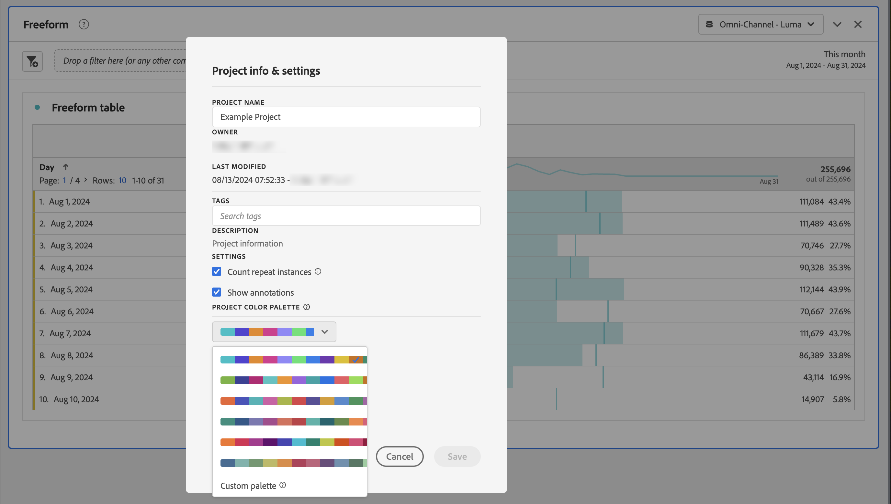

# Visualisierungsfarbpaletten {#visualization-color-palettes}

<!-- markdownlint-disable MD034 -->

>[!CONTEXTUALHELP]
>id="workspace_project_colorpalette"
>title="Projektfarbpalette"
>abstract="Ändern Sie die in diesem Projekt verwendete Farbpalette."

<!-- markdownlint-enable MD034 -->

Sie können die in Workspace verwendete Farbpalette für die Visualisierung ändern. Sie können eine vordefinierte Farbpalette auswählen oder eine eigene Palette festlegen, die den Markenfarben Ihres Unternehmens entspricht. Diese Funktion wirkt sich auf die meisten Visualisierungen in Workspace aus. Die Zusammenfassungsänderung, die bedingte Formatierung in Freiformtabellen und die Zuordnungsvisualisierung sind davon jedoch **nicht** betroffen.

>[!NOTE]
>
>Die Farbpalettenunterstützung ist für Internet Explorer 11 nicht aktiviert.

Beachten Sie:

* Es stehen sechs voreingestellte Farbpaletten zur Auswahl. Die Standardpalette und die zweite aufgeführte Palette wurden für Kontrast optimiert und sind bei Farbenblindheit besser geeignet.
* Die anderen Paletten wurden für die Farbharmonie optimiert.

## So ändern Sie Ihre Farbpalette:

1. Navigieren Sie zu **[!UICONTROL Arbeitsbereich]** > **[!UICONTROL Projekt]** > **[!UICONTROL Projektinformationen und -einstellungen]**.
1. Aus dem Dropdown **[!UICONTROL Menü]** Projektfarbpalette“ können Sie eines der vordefinierten Farbschemata auswählen.
1. Um Ihre eigene Palette festzulegen, wählen Sie **[!UICONTROL Benutzerdefinierte Palette]** unter den voreingestellten Optionen aus.
1. Geben Sie bis zu 16 kommagetrennte Hexadezimalwerte ein (z. B. `#00a4e4`), um Ihre eigene Farbpalette zu erstellen. Wenn Sie beispielsweise nur vier Werte angeben, werden Farben in Visualisierungen mit mehr Farben automatisch wiederholt.
