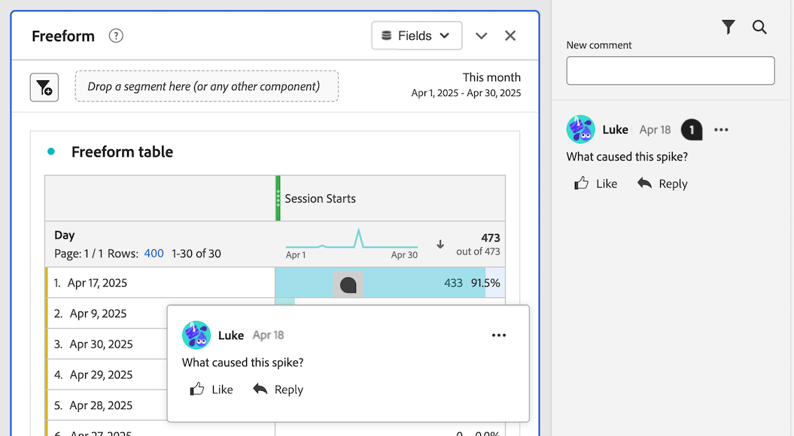

# Hinzufügen und Verwalten von Kommentaren in Projekten {#comment-on-projects}

{{release-limited-testing}}

Mithilfe von Kommentaren in Analysis Workspace können Sie im Rahmen eines Analysis Workspace-Projekts Erkenntnisse austauschen und Fragen stellen. Dadurch können Diskussionen über die Daten gestrafft werden, sodass Gespräche im Kontext der Daten geführt werden, die besprochen werden.

>[!NOTE]
>
>Die Möglichkeit, Kommentare zu einem Projekt hinzuzufügen und zu verwalten, kann entweder auf Projektebene oder auf Organisationsebene deaktiviert werden. Wenn Sie keine Kommentare wie in diesem Abschnitt beschrieben hinzufügen und verwalten können, hat der Customer Journey Analytics-Administrator oder Projektbesitzer diese Funktion deaktiviert.
>
>* **Projekt** Der Projektbesitzer kann diese Funktion für das Projekt deaktivieren, wie in [Erstellen von Projekten](/help/analysis-workspace/build-workspace-project/create-projects.md) beschrieben.
>* **Organisation:** Der Customer Journey Analytics-Administrator kann diese Funktion für das Unternehmen deaktivieren, wie unter [ beschrieben](/help/analysis-workspace/user-preferences.md).

## Kommentare anzeigen

Sie können Kommentare im Kommentarbereich in der rechten Leiste oder über das Kommentar-Badge anzeigen, falls vorhanden.

>[!NOTE]
>
>Ein Projekt muss gespeichert werden, bevor der Kommentarbereich in der rechten Leiste sichtbar wird. Wenn das Projekt noch nicht gespeichert wurde, müssen Sie [das Projekt speichern](/help/analysis-workspace/build-workspace-project/save-projects.md) bevor Sie Kommentare hinzufügen.

### Anzeigen von Kommentaren im Kommentarbereich

Alle in einem Analysis Workspace-Projekt abgegebenen Kommentare werden im Kommentarbereich in der rechten Leiste angezeigt.

1. Standardmäßig wird der Kommentarbereich für jedes Projekt in Analysis Workspace beim ersten Öffnen eines Projekts erweitert.

   Wählen Sie das Symbol für den Kommentarbereich in der rechten Leiste eines Projekts aus, um den Kommentarbereich zu öffnen oder zu schließen.

   

   Jeder Kommentar zeigt einen Zeitstempel des Tages an, an dem der Kommentar gepostet wurde. Wenn der Kommentar am aktuellen Tag gepostet wurde, wird die Tageszeit angezeigt. Bewegen Sie den Mauszeiger über den Tag oder die Uhrzeit, um das vollständige Datum und die Uhrzeit der Veröffentlichung des Kommentars anzuzeigen.

1. (Optional) Um den Kommentarbereich zu durchsuchen, klicken Sie auf das Suchsymbol  und geben Sie dann ein Wort oder eine Wortgruppe ein. Der Kommentarbereich wird so gefiltert, dass er nur die Kommentare mit diesem Wort oder dieser Phrase enthält.

### Anzeigen von Kommentar-Badges in einem Projekt

Kommentare, die ([ einem bestimmten Bereich des Projekts) ](#comment-on-a-specific-area-of-the-project), haben ein **Kommentar-Badge**  das über dem Bereich des Projekts angezeigt wird, auf den sich der Kommentar bezieht. Wählen Sie ein Abzeichen aus, um den Kommentar anzuzeigen. Nach Auswahl des Badge können Sie den Kommentar selbst auswählen, um den Kommentar im Kommentarbereich in der rechten Leiste hervorzuheben.

Die Zahlen werden auf jedem Abzeichen in einem Projekt angezeigt und in der Reihenfolge sortiert, in der sie erstellt wurden. Wenn mehrere Kommentare in demselben Bereich eines Projekts platziert werden, zeigt das Badge drei Punkte an . Wählen Sie das 3-Punkt-Badge aus, um alle Kommentare in diesem Bereich anzuzeigen.

<!-- Insert screeshot-->

So blenden Sie alle Kommentar-Badges in einem Projekt aus:

1. Wenn das Projekt in Analysis Workspace geöffnet ist, wählen Sie das Symbol für den Kommentarbereich  in der rechten Leiste von Analysis Workspace.

1. Aktivieren Sie am unteren Rand des Kommentarbereichs die Option **[!UICONTROL Platzierte Abzeichen ausblenden]**.

## Kommentare hinzufügen

Sie können einen Kommentar hinzufügen, der auf einen bestimmten Bereich des Projekts verweist, oder einen allgemeinen Kommentar hinzufügen.

### Kommentar zu einem bestimmten Bereich des Projekts

So kommentieren Sie einen bestimmten Bereich des Projekts (z. B. einen Metrikwert in einer Freiformtabelle):

1. Wenn das Projekt in Analysis Workspace geöffnet ist, klicken Sie mit der rechten Maustaste auf den Bereich des Projekts, in den Sie den Kommentar einfügen möchten.

   Alle Visualisierungen unterstützen Kommentar-Badges in der Visualisierungskopfzeile, aber nur die folgenden Visualisierungen unterstützen Kommentar-Badges zu bestimmten Datenpunkten innerhalb der Visualisierung:

   * Freiformtabelle
   * Kohortentabelle
   * Linie

   <!--add screenshot-->

1. Wählen Sie **[!UICONTROL Kommentar hinzufügen]** aus.

1. Geben Sie im Feld **[!UICONTROL Neuer Kommentar]** Ihren Kommentar ein.

   Kommentare können bis zu 15.000 Zeichen lang sein und einfaches Markup, Hyperlinks, Listen mit Aufzählungszeichen und Nummerierungen sowie Emojis enthalten.

1. (Optional) Benachrichtigen Sie eine andere Person über Ihren Kommentar, indem Sie das @-Symbol gefolgt von ihrem Namen eingeben. Weitere Informationen zur Verwendung des @-Symbols, um andere zu benachrichtigen, finden Sie unter [Andere in einen Kommentar einbeziehen](#include-others-in-a-comment).

1. Klicken Sie auf **[!UICONTROL Übermitteln]**.

   Ein **Kommentar** Badge wird im Bereich des Workspace-Projekts platziert, in dem Sie den Kommentar hinzugefügt haben, wie [Anzeigen von Kommentar-Badges in einem Projekt](#view-comment-badges-in-a-project) beschrieben. Der Kommentar wird auch oben im Kommentarbereich in der rechten Leiste angezeigt.

### Hinzufügen eines allgemeinen Kommentars zum Projekt

So fügen Sie einem Projekt in Analysis Workspace Kommentare hinzu:

1. Wenn das Projekt in Analysis Workspace geöffnet ist, wählen Sie das Symbol für den Kommentarbereich  in der rechten Leiste von Analysis Workspace. <!-- add screen shot -->

1. Geben Sie im Feld **[!UICONTROL Neuer Kommentar]** Ihren Kommentar ein.

   Kommentare können bis zu 15.000 Zeichen lang sein und einfaches Markup, Hyperlinks, Listen mit Aufzählungszeichen und Nummerierungen sowie Emojis enthalten.

1. (Optional) Benachrichtigen Sie eine andere Person über Ihren Kommentar, indem Sie das @-Symbol gefolgt von ihrem Namen eingeben. Weitere Informationen zur Verwendung des @-Symbols, um andere zu benachrichtigen, finden Sie unter [Andere in einen Kommentar einbeziehen](#include-others-in-a-comment).

1. Klicken Sie auf **[!UICONTROL Übermitteln]**.

   Der Kommentar wird oben im Kommentarbereich angezeigt, wie unter [Anzeigen von Kommentaren im Kommentarbereich](#view-comments-in-the-comments-area) beschrieben.

## Andere in einen Kommentar einbeziehen

Die Kommentarfunktion in Analysis Workspace erleichtert die Zusammenarbeit mit anderen Benutzern.

Beachten Sie Folgendes, wenn Sie das @-Symbol verwenden, um Personen in einen Kommentar einzuschließen:

* Personen, die Sie einbeziehen, erhalten Benachrichtigungen entsprechend ihren Adobe Experience Cloud-Benachrichtigungseinstellungen.

  Weitere Informationen finden Sie unter [Empfangen von Benachrichtigungen über Kommentare](#receive-notifications-about-comments).

* Sie können jeder Person, die sich in Ihrem Unternehmen befindet und Zugriff auf Customer Journey Analytics hat, automatisch Zugriff zur Bearbeitung des Projekts gewähren.

So fügen Sie eine andere Person in Ihren Kommentar ein:

1. Geben Sie das @-Symbol ein und beginnen Sie dann mit der Eingabe des Vornamens, Nachnamens oder der E-Mail-Adresse der Person, die Sie einbeziehen möchten.

   

1. Wählen Sie den Namen der Person aus, wenn er im Dropdown-Menü angezeigt wird.

## Auf einen Kommentar antworten

1. Wenn das Projekt in Analysis Workspace geöffnet ist, wählen Sie das Symbol für den Kommentarbereich  in der rechten Leiste von Analysis Workspace.

1. Klicken Sie **[!UICONTROL Antworten]** neben dem Kommentar, auf den Sie antworten möchten.

   Oder

   Um den Text des Kommentars, auf den Sie antworten, einzubeziehen, wobei der ursprüngliche Text in ein Zitat-Tag eingeschlossen ist, wählen Sie das 3-Punkt-Symbol neben dem spezifischen Kommentar oder der Antwort, auf den bzw. die Sie antworten möchten, und klicken Sie dann auf **[!UICONTROL Zitat-Antwort]**. Eine Antwort auf ein Zitat ist eine gute Möglichkeit, anzugeben, auf welchen Kommentar oder welche Antwort sich Ihr Kommentar bezieht.

1. Geben Sie im Feld **[!UICONTROL Neuer Kommentar]** Ihren Kommentar ein.

   Kommentare können bis zu 15.000 Zeichen lang sein und einfaches Markup, Hyperlinks, Listen mit Aufzählungszeichen und Nummerierungen sowie Emojis enthalten.

1. (Optional) Benachrichtigen Sie eine andere Person über Ihren Kommentar, indem Sie das @-Symbol gefolgt von ihrem Namen eingeben. Weitere Informationen zur Verwendung des @-Symbols, um andere zu benachrichtigen, finden Sie unter [Andere in einen Kommentar einbeziehen](#include-others-in-a-comment).

1. Klicken Sie auf **[!UICONTROL Übermitteln]**.

## Benachrichtigungen über Kommentare erhalten

Projektbesitzer und [bestimmte Personen, die Sie ](#include-others-in-a-comment), erhalten Benachrichtigungen basierend auf ihren Adobe Experience Cloud-Benachrichtigungseinstellungen. Standardmäßig erhalten sie eine In-App-Benachrichtigung, die über das Symbol [Experience Cloud-Benachrichtigung](https://experienceleague.adobe.com/de/docs/core-services/interface/features/account-preferences#view-notifications)  in Customer Journey Analytics sichtbar ist.

Darüber hinaus können Benutzer ihre Experience Cloud-Benachrichtigungseinstellungen so konfigurieren, dass sie E-Mail-Benachrichtigungen und Slack-Benachrichtigungen erhalten, [ sie E-Mail-Benachrichtigungen ](https://experienceleague.adobe.com/de/docs/core-services/interface/features/account-preferences#subscribe-to-in-app-and-email-notifications) und [Slack-Benachrichtigungen abonnieren](https://experienceleague.adobe.com/de/docs/core-services/interface/features/account-preferences#slack).

## Platzieren eines Abzeichens für einen vorhandenen Kommentar

Wenn ein Kommentar im Kommentarbereich in der rechten Leiste verfügbar ist, aber noch kein Abzeichen im Projekt hat, können Sie das Abzeichen hinzufügen.

1. Wenn das Projekt in Analysis Workspace geöffnet ist, wählen Sie das Symbol für den Kommentarbereich  in der rechten Leiste von Analysis Workspace.

1. Klicken Sie auf das Symbol Mehr  neben dem Kommentar, für den Sie ein Abzeichen platzieren möchten, und wählen Sie dann **[!UICONTROL Abzeichen platzieren]**.

1. Wählen Sie den Bereich des Projekts aus, in dem Sie das Abzeichen für den vorhandenen Kommentar platzieren möchten.

   Ein **Kommentar** Badge wird im Bereich des von Ihnen ausgewählten Workspace-Projekts platziert. Der Kommentar wird auch oben im Kommentarbereich in der rechten Leiste angezeigt.

   Weitere [ finden Sie unter ](#view-comment-badges-in-a-project) in einem Projekt anzeigen .

So entfernen Sie ein Abzeichen:

1. Wählen Sie das Abzeichen aus, das Sie entfernen möchten, und wählen Sie dann **[!UICONTROL Abzeichen entfernen]** aus.

   Das Badge wird entfernt, der Kommentar ist jedoch weiterhin im Kommentarbereich in der rechten Leiste verfügbar.

## Verschieben eines Abzeichens für einen vorhandenen Kommentar

Sie können ein Kommentarzeichen verschieben, das bereits für einen vorhandenen Kommentar platziert ist.

1. Wenn das Projekt in Analysis Workspace geöffnet ist, suchen Sie das Abzeichen für den Kommentar, den Sie verschieben möchten.

1. Klicken Sie mit der rechten Maustaste auf das Abzeichen und wählen Sie **[!UICONTROL Platzierung verschieben]**.

1. Wählen Sie den Bereich des Projekts aus, in dem Sie das Abzeichen platzieren möchten.

<!-- add section about adding images to comments. will be available at GA. Include that "you can have a maximum of 5 images per comment, and each image can be up to 2 MB." -->

## Link zu einem Kommentar kopieren

Sie können den Link zu einem Kommentar kopieren und ihn für andere freigeben. Nur Personen, die bereits Zugriff auf das Projekt haben, können über den Link darauf zugreifen.

So kopieren Sie den Link zu einem Kommentar:

1. Wenn das Projekt in Analysis Workspace geöffnet ist, wählen Sie das Symbol für den Kommentarbereich  in der rechten Leiste von Analysis Workspace.

1. Klicken Sie auf das Symbol Mehr  neben dem Kommentar, dessen Link Sie kopieren möchten, und klicken Sie dann auf **[!UICONTROL Link kopieren]**.

   Der Link wird in die Zwischenablage kopiert. Sie können den Link in eine E-Mail oder einen anderen Nachrichtentyp einfügen.

## Kopieren des Textes eines Kommentars

Sie können den Textkörper eines Kommentars kopieren und für andere freigeben.

So kopieren Sie den Textkörper eines Kommentars:

1. Wenn das Projekt in Analysis Workspace geöffnet ist, wählen Sie das Symbol für den Kommentarbereich  in der rechten Leiste von Analysis Workspace.

1. Klicken Sie auf das Symbol Mehr  neben dem Kommentar, der den Text enthält, den Sie kopieren möchten, und klicken Sie dann auf **[!UICONTROL Text kopieren]**.

   Der Textkörper des Kommentars wird in die Zwischenablage kopiert.

## Kommentar gefällt mir

1. Wenn das Projekt in Analysis Workspace geöffnet ist, wählen Sie das Symbol für den Kommentarbereich  in der rechten Leiste von Analysis Workspace.

1. Wählen Sie **[!UICONTROL Gefällt mir]** unter dem Kommentar aus, den Sie empfehlen möchten.

## Kommentar löschen

Wenn Sie einen Kommentar löschen, werden der ursprüngliche Kommentar und alle Antworten oder Anhänge ebenfalls gelöscht.

Gelöschte Kommentare können nicht wiederhergestellt werden.

So löschen Sie einen Kommentar:

1. Wenn das Projekt in Analysis Workspace geöffnet ist, wählen Sie das Symbol für den Kommentarbereich  in der rechten Leiste von Analysis Workspace.

1. Klicken Sie auf das Symbol Mehr  neben dem Kommentar, den Sie löschen möchten, und klicken Sie dann auf **[!UICONTROL Löschen]**.

1. Wählen **[!UICONTROL erneut]** Löschen“ aus, um den Löschvorgang zu bestätigen.

## Einen Kommentar auflösen

Wenn Sie einen Kommentar auflösen, wird der Kommentar als aufgelöst markiert und im Kommentarbereich ausgeblendet. Wenn dem Kommentar ein Badge zugeordnet ist, wird das Badge aus dem Projekt entfernt.

So lösen Sie einen Kommentar auf:

1. Wenn das Projekt in Analysis Workspace geöffnet ist, wählen Sie das Symbol für den Kommentarbereich  in der rechten Leiste von Analysis Workspace.

1. Klicken Sie auf das Symbol Mehr  neben dem Kommentar, den Sie auflösen möchten, und klicken Sie dann auf **[!UICONTROL Auflösen]**.

1. Wählen **[!UICONTROL zur Bestätigung erneut]** Auflösen) aus.

Standardmäßig werden aufgelöste Kommentare im Kommentarbereich ausgeblendet. So zeigen Sie aufgelöste Kommentare an:

1. Wählen Sie im Kommentarbereich das Filtersymbol aus und heben Sie dann die Auswahl der Option **[!UICONTROL Aufgelöste Kommentare ausblenden]** auf.
