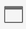

# Übersicht über Projekte

Mit Workspace-Projekten können Sie Bedienfelder, Visualisierungen und Komponenten kombinieren, um eine Analyse zu erstellen, und diese für andere Personen in Ihrem Unternehmen freigeben. Bevor Sie mit Ihrem ersten Projekt beginnen, erfahren Sie, wie Sie auf Ihre Projekte zugreifen, darin navigieren und sie verwalten können.

Um auf Projekte in Customer Journey Analytics zuzugreifen, wählen Sie **[!UICONTROL Workspace]** aus.  Der **[!UICONTROL Projekte]**-Manager listet alle Projekte auf, deren Inhaber Sie sind, bzw. Projekte, die für Sie freigegeben wurden. Der Projekt-Manager mit der Projektliste ist auch die standardmäßige Landingpage für das Customer Journey Analytics, es sei denn, in den Voreinstellungen wurde etwas Anderes konfiguriert.

## Titelbereich

Im Titelbereich können ein Projekt erstellen, einen Ordner erstellen, Ihre Voreinstellungen bearbeiten und ein Bedienfeld mit zusätzlichen Kacheln ein- oder ausblenden.

* Um ein linkes Bedienfeld ein- oder auszublenden, in dem Sie zwischen **[!UICONTROL Projekten]** und **[!UICONTROL Lernen]** wählen können, wählen Sie .
* Der Titel zeigt Projekte an, die optional mit einem Pfad zu dem ausgewählten Ordner hinzugefügt wurden. Beispiel: [!UICONTROL Projekte] > **[!UICONTROL Unternehmensordner]**. Sie können einzelne Unterordnerteile auswählen, um direkt zu dem jeweiligen Ordner zu gehen.
* Um Kacheln für ein [**[!UICONTROL Leeres Projekt]**](create-projects.md), [**[!UICONTROL Leere mobile Scorecard]**](/help/mobile-app/create-scorecard.md), [**[!UICONTROL Geführte Analyse]**](/help/guided-analysis/overview.md), **[!UICONTROL Dokumentation öffnen]** und **[!UICONTROL Versionshinweise öffnen]**, wählen Sie  ChevronDown **[!UICONTROL Mehr anzeigen]**. Um den Bereich mit Kacheln auszublenden, wählen Sie  **[!UICONTROL Weniger anzeigen]**.
* Je nachdem, was angezeigt werden soll, können Sie mit der [Auswahl anzeigen](#show-selector) die Voreinstellungen bearbeiten und Aktionen für den aktuellen Ordner durchführen, der in &quot;**[!UICONTROL &quot; sichtbar]**:

  | Aktion | Beschreibung |
  |---|---|
  | **[!UICONTROL Erstellen eines Projekts]** | Wählen Sie aus[ um ein neues Projekt zu ](create-projects.md). |
  | **[!UICONTROL Ordner erstellen]** | Wählen Sie aus[ um einen neuen Ordner zu ](workspace-folders/create-folders.md). |
  |  **[!UICONTROL Voreinstellungen bearbeiten]** | [Voreinstellungen bearbeiten](/help/analysis-workspace/user-preferences.md) für alle Ihre Projekte. Wenn der Breadcrumb zu begrenztem Platz führt, ist diese Aktion Teil des Untermenüs . |
  | **[!UICONTROL Projekte hinzufügen]** | Wählen Sie aus[ um Projekte ](workspace-folders/add-projects.md) aktuellen Ordner hinzuzufügen. Wenn der Breadcrumb zu begrenztem Platz führt, ist diese Aktion Teil des Untermenüs . |
  | **[!UICONTROL Ordner umbenannt]** | [Benennt](workspace-folders/manage-folders.md#rename-folders) den aktuellen Ordner um. |
  | **[!UICONTROL Ordner verschieben]** | [Verschiebt ](workspace-folders/manage-folders.md#move-folders) aktuellen Ordner. |
  | **[!UICONTROL Ordner löschen]** | [Löscht ](workspace-folders/manage-folders.md#delete-folders) aktuellen Ordner. |

## Projektliste

In der Projektliste werden alle Projekte angezeigt, deren Eigentümer Sie sind und die für Sie freigegeben wurden. Die Liste umfasst die folgenden Spalten:

| Spalte | Beschreibung |
| --- | --- | 
|  | Wenn ein oder mehrere Projekte ausgewählt sind, wird unten in der Projektoberfläche eine blaue Aktionsleiste angezeigt. Weitere Informationen finden [ unter ](#actions). |
|  | Wählen Sie ausStarOutline“ oder  zu bevorzugen. |
| **[!UICONTROL Titel und Beschreibung]** | Um das Projekt zu bearbeiten, wählen Sie den Titel-Link aus, über den das [Workspace-Projekt geöffnet wird](/help/analysis-workspace/home.md). Für Sie freigegebene Projekte sind mit &quot;. Wählen Sie  aus, um ein Popup-Menü mit weiteren Details zum Projekt anzuzeigen. Wählen Sie , um ein Kontextmenü mit Aktionen zu öffnen. Weitere Informationen finden [ unter ](#actions). |
| **[!UICONTROL Typ]** | Ein Workspace-Projekt, ein -Ordner oder eine [mobile Scorecard](/help/mobile-app/home.md). |
| **[!UICONTROL Tags]** | Die auf das Projekt angewendeten Tags. |
| Eingeplant | Ob ein Projekt für die E-Mail an Empfänger geplant ist. Die Optionen sind  **[!UICONTROL On]** oder  **[!UICONTROL Off]**. Siehe [Senden von Projektdaten an andere](/help/analysis-workspace/export/t-schedule-report.md). |
| **[!UICONTROL Freigegebener Link (alle)]** | Ob ein Projekt für alle freigegeben wird, auch für Personen, die keinen Zugriff auf Analysis Workspace haben. Die Optionen sind  **[!UICONTROL Active]** oder  **[!UICONTROL Inaktiv]**. Weitere Informationen finden Sie [Freigeben eines Projekts für alle (keine Anmeldung erforderlich](/help/analysis-workspace/curate-share/share-projects.md#share-a-project-with-anyone-no-login-required) unter [Freigeben ](/help/analysis-workspace/curate-share/share-projects.md) Projekten). |
| **[!UICONTROL Projektrolle]** | Ihre Rolle für das Projekt. Die Optionen sind: Bearbeiten, Duplizieren, Anzeigen. Weitere Informationen finden [ unter ](/help/analysis-workspace/curate-share/curate.md)Projektrollen“. |
| **[!UICONTROL Datenansicht]** | Die Datenansicht, mit der das Projekt verknüpft ist. |
| **[!UICONTROL Inhabende]** | Die Person, die dieses Projekt erstellt hat (entweder Sie oder eine Person, die das Projekt für Sie freigegeben hat). |
| **[!UICONTROL Freigegeben für]** | Benutzende, für die das Projekt freigegeben wurde. |
| **[!UICONTROL Zuletzt geändert]** | Datum und Zeitpunkt der letzten Änderung des Projekts. |
| **[!UICONTROL Zuletzt geöffnet]** | Datum und Uhrzeit der letzten Öffnung des Projekts. |
| **[!UICONTROL Projekt-ID]** | Die ID des Projekts. |
| **[!UICONTROL Längster Datumsbereich]** | Der längste Datumsbereich von allen Bedienfeldern oder Visualisierungen im Projekt. |
| **[!UICONTROL Anzahl der Abfragen]** | Die Gesamtzahl der im Projekt enthaltenen Abfragen. |
| **[!UICONTROL Ort]** | Der Ordner, in dem sich das Projekt befindet. |

Bewegen Sie den Mauszeiger über eine beliebige Spaltenüberschrift, um  anzuzeigen, und wählen Sie aus dem Kontextmenü aus:

* **[!UICONTROL Aufsteigend sortieren]**
* **[!UICONTROL Absteigend sortieren]**
* **[!UICONTROL Spaltengröße ändern]**. Eine blaue Linie wird angezeigt, um Ihnen zu helfen, die Größe der Spalte zu ändern.

### Aktionen

Sie können Aktionen für ein oder mehrere Projekte mithilfe des Kontextmenüs ( der blauen Aktionsleiste durchführen.

| Symbol | Aktion | Beschreibung |
|:---:| ---|---|
|  | **[!UICONTROL *x *ausgewählt]** | Heben Sie die Auswahl der ausgewählten Projekte und Ordner auf und entfernen Sie die blaue Aktionsleiste. |
|  | **[!UICONTROL Löschen]** | Löschen Sie ein oder mehrere Projekte oder Ordner. Sie werden zur Bestätigung aufgefordert. |
|  | **[!UICONTROL Freigeben]** | Freigeben eines Projekts. Weitere Informationen finden [ unter ](/help/analysis-workspace/curate-share/share-projects.md) eines Projekts . |
|  | **[!UICONTROL Umbenennen]** | Benennen Sie ein Projekt um. Öffnet einen **[!UICONTROL Dialog *Umbenennen: (Projektname *]**. Geben Sie einen neuen Namen ein und wählen Sie**[!UICONTROL Speichern ]**. |
|  | **[!UICONTROL Kopieren]** | Kopieren Sie ein oder mehrere Projekte. Das Projekt erhält denselben Namen und dieselbe `(Copy)`. |
|  | **[!UICONTROL Pin]** oder **[!UICONTROL Unpin]** | Fixieren oder Aufheben der Fixierung eines oder mehrerer Projekte oder Ordner. Angeheftete Projekte und Ordner werden oben in der Liste angezeigt und ignorieren die von Ihnen angegebene Sortierreihenfolge. |
|  | **[!UICONTROL Nach oben]** | Verschieben eines fixierten Projekts oder Ordners in der Projektliste nach oben. |
|  | **[!UICONTROL Nach unten]** | Verschieben Sie ein fixiertes Projekt oder einen fixierten Ordner in der Projektliste nach unten. |
|  | **[!UICONTROL Tag]** | Taggen Sie ein oder mehrere Projekte oder Ordner. Das **[!UICONTROL „Tag-]**&quot; wird angezeigt, um ein oder mehrere Tags auszuwählen. Klicken Sie **[!UICONTROL Speichern]**, um die Tags für die ausgewählten Projekte oder Ordner zu speichern. |
|  | **[!UICONTROL Genehmigen]** oder **[!UICONTROL Nicht genehmigen]** | Genehmigen eines Projekts oder Aufheben der Genehmigung Nur Administratoren können Projekte genehmigen. |
|  | **[!UICONTROL CSV exportieren]** | Exportieren Sie die ausgewählten Projekte in eine CSV-Datei mit dem Namen `Project List.csv`. |
|  | **[!UICONTROL Projekte hinzufügen]** | Ein oder mehrere Projekte zu einem ausgewählten Ordner hinzufügen. In **[!UICONTROL Projekte hinzufügen]** können Sie ein oder mehrere Projekte auswählen. Wählen Sie **[!UICONTROL Hinzufügen]** aus, um die Projekte zum Ordner hinzuzufügen. Weitere Informationen [ Sie unter „Hinzufügen ](workspace-folders/add-projects.md#from-inside-a-folder) Projekten zu Ordnern“. |
|  | **[!UICONTROL Verschieben nach]** | Verschiebt ein oder mehrere ausgewählte Projekte in einen Ordner. Wählen Sie **[!UICONTROL Ordner]**, in den das ausgewählte Projekt verschoben werden soll, und wählen Sie **[!UICONTROL Verschieben]** aus. Weitere Informationen [ Sie unter „Hinzufügen ](workspace-folders/add-projects.md#from-the-project-list) Projekten zu Ordnern“. |

## Selektor anzeigen

Sie können das Erscheinungsbild der Benutzeroberfläche „Projekte“ mithilfe der **[!UICONTROL Anzeigen]**-Selektoren ändern. Der **[!UICONTROL Anzeigen]**-Selektor definiert, welche Optionen im [Titelbereich“ verfügbar sind ](#title-area) welche Spalten in der [Projektliste) angezeigt ](#project-list).

* Um die verfügbaren Optionen für den Bereich [Titel](#title-area) zu ändern, wählen Sie **[!UICONTROL Anzeigen]** **[!UICONTROL Alle Projekte]** oder **[!UICONTROL Anzeigen]****[!UICONTROL Ordner und Projekte]**.

* Um zu definieren, welche Spalten für die [Projektliste“ angezeigt werden sollen](#project-list) wählen Sie  und wählen Sie im Dialogfeld **[!UICONTROL Tabelle anpassen]** Spalten aus oder heben Sie die Auswahl auf. Wählen Sie **[!UICONTROL Anwenden]** aus, um die Anpassung anzuwenden. Siehe [Projektliste](#project-list) für weitere Informationen zu den Spalten.

## Bedienfeld „Filter“

Sie können die Projekte und Ordner in der [Projektliste) mithilfe ](#project-list) Filterbedienfelds filtern. Verwenden Sie zum Ein- oder Ausblenden des Filterbereichs .

Das Filterbedienfeld besteht aus den folgenden Abschnitten.

### Tags

| Tags | Beschreibung |
|---|---|
| {width="300"} | Im Abschnitt **[!UICONTROL Tags]** können Sie nach Tags filtern. <ul><li>Sie verwenden  *Tags suchen* um nach Tags zu suchen, die Sie zum Filtern verwenden möchten.</li><li>Sie können mehrere Tags auswählen. Die verfügbaren Tags hängen von Auswahlen ab, die in anderen Abschnitten im Filterbedienfeld vorgenommen wurden.</li><li>Die Zahlen geben Folgendes an:<ul><li>**2︎⃣**: Die Anzahl der Tags, die für die aus dem aktuellen Filter resultierenden Projekte verfügbar sind.</li><li>7︎⃣: Die Anzahl der mit dem jeweiligen Tag verknüpften Projekte.</li></ul></li></ul> |

### Datenansicht

| Datenansicht | Beschreibung |
|---|---|
| {width="300"} | Im **[!UICONTROL Datenansicht]** können Sie nach Datenansichten filtern. <ul><li>Sie verwenden  *Datenansichten suchen* um nach Datenansichten zu suchen, die Sie zum Filtern verwenden möchten.</li><li>Sie können mehrere Datenansichten auswählen. Die verfügbaren Datenansichten hängen von den Auswahlen ab, die in anderen Abschnitten im Filterbedienfeld vorgenommen wurden.</li><li>Die Zahlen geben Folgendes an:<ul><li>**3︎⃣**: Die Anzahl der Datenansichten, die für die aus dem aktuellen Filter resultierenden Projekte verfügbar sind.</li><li>4︎⃣: Die Anzahl der Projekte, die der spezifischen Datenansicht zugeordnet sind.</li></ul></li></ul> |

### Inhaber

| Besitzer | Beschreibung |
|---|---|
| {width="300"} | Im Abschnitt **[!UICONTROL Verantwortlicher]** können Sie nach Verantwortlichen filtern. <ul><li>Sie verwenden  *Nach Inhabern suchen* um nach Inhabern zu suchen, die Sie zum Filtern verwenden möchten.</li><li>Sie können mehrere Besitzer auswählen. Die verfügbaren Besitzer hängen von den Auswahlen ab, die in anderen Abschnitten im Filterbedienfeld vorgenommen wurden.</li><li>Die Zahlen geben Folgendes an:<ul><li>**3︎⃣**: Die Anzahl der Verantwortlichen, die für die aus dem aktuellen Filter resultierenden Projekte verfügbar sind.</li><li>4︎⃣: Die Anzahl der Projekte, die dem jeweiligen Eigentümer zugeordnet sind.</li></ul></li></ul> |

### Typ

| Typ | Beschreibung |
|---|---|
| {width="300"} | Im Abschnitt **[!UICONTROL Typ]** können Sie nach dem Typ der Projekte oder Ordner filtern.<ul><li>Sie können eine oder mehrere der folgenden Optionen auswählen:<ul><li> **[!UICONTROL Ordner]**</li><li>**[!UICONTROL Analysis Workspace-Projekt]**</li><li>**[!UICONTROL Mobile Scorecard]**</li></ul> <li>Sie können mehr als einen anderen Filter auswählen. Die anderen verfügbaren Filter hängen von Auswahlen ab, die in anderen Abschnitten im Filterbedienfeld vorgenommen wurden.</li><li>Die Zahlen geben Folgendes an:<ul><li>**5︎⃣**: Die Anzahl weiterer Filter, die für die aus dem aktuellen Filter resultierenden Projekte verfügbar sind.</li><li>4︎⃣: Die Anzahl der Projekte, die dem jeweiligen anderen Filter zugeordnet sind.</li></ul></li></ul> |

### Andere Filter

| Andere Filter | Beschreibung |
|---|---|
| {width="300"} | Im Abschnitt **[!UICONTROL Sonstige Filter]** können Sie nach anderen vordefinierten Filtern filtern.<ul><li>Sie können eine oder mehrere der folgenden Optionen auswählen:<ul><li> **[!UICONTROL Alle anzeigen]**</li><li>**[!UICONTROL Für mich freigegeben]**</li><li>**[!UICONTROL meins]**</li><li>**[!UICONTROL Genehmigt]**</li><li>**[!UICONTROL Favoriten]**</li></ul> Was Sie auswählen können, hängt von Ihrer Rolle und Ihren Berechtigungen ab.</li><li>Sie können mehr als einen anderen Filter auswählen. Die anderen verfügbaren Filter hängen von Auswahlen ab, die in anderen Abschnitten im Filterbedienfeld vorgenommen wurden.</li><li>Die Zahlen geben Folgendes an:<ul><li>**5︎⃣**: Die Anzahl weiterer Filter, die für die aus dem aktuellen Filter resultierenden Projekte verfügbar sind.</li><li>4︎⃣: Die Anzahl der Projekte, die dem jeweiligen anderen Filter zugeordnet sind.</li></ul></li></ul> |

## Durchsuchen

Sie verwenden die ➎ Suchbereich , um mithilfe des Felds  nach Projekten und Ordnern zu suchen. Beginnen Sie mit der Eingabe und die [Projektliste](#project-list) wird automatisch nach Ihrer Sucheingabe gefiltert.

Im Suchbereich werden auch die im Bedienfeld Filter angewendeten Filter angezeigt.

* Um einen Filter zu entfernen, wählen Sie CrossSize75) aus.
* Um alle Filter zu entfernen, wählen Sie Alle löschen aus.

Wenn der Platz für die Anzeige der einzelnen Filter begrenzt ist, sehen Sie **[!UICONTROL Filtern nach *x* Filtern]**.

* So entfernen Sie einen Filter:

   1. Verwenden Sie **[!UICONTROL *x *Filter]**, um ein Kontextmenü zu öffnen, in dem die Filtertypen und die einzelnen Filter aufgeführt sind.
   1. Verwenden Sie , um einen Filter zu entfernen.

<!--

The Projects page contains the following information: 

>[!NOTE]
>
>Some columns are not displayed by default. To customize the columns you see, click the **Customize table** icon .

|  Element  | Description  |
|---|---|
| [Edit preferences](/help/analysis-workspace/user-preferences.md) | Manage settings for Analysis Workspace and its related components for all new projects or panels that you create.  |
| [Create folder](/help/analysis-workspace/build-workspace-project/workspace-folders/create-folders.md)  | Add a new folder or subfolder to the list of projects and folders. |
| [Create project](/help/analysis-workspace/build-workspace-project/create-projects.md)  | Start a new project from scratch.  |
|  Show more  |Reveals options for creating a blank project or mobile scorecard, [viewing training tutorials](https://experienceleague.adobe.com/docs/analytics-learn/tutorials/analysis-workspace/analysis-workspace-basics/analysis-workspace-introduction.html), or [viewing release notes](/help/release-notes/latest.md).  |
| Show Folders & Projects| Choose whether to show the folder structure of projects. For more information, see [About Folders in Analytics](/help/analysis-workspace/build-workspace-project/workspace-folders/about-folders.md). |
|  Customize table (icon)  | Allows you to customize the information that shows for each project on the Projects page.  |
|  Name  | Name of the Workspace project.  |
| Type | Indicates whether this is a Workspace Project, a folder, or a [Mobile Scorecard](https://experienceleague.adobe.com/docs/analytics/analyze/mobapp/home.html). |
|  Tags  |Tags that were applied to the project.  |
| Scheduled | Indicates whether projects are scheduled to be emailed to recipients on a schedule. See [Send project data to others](/help/analysis-workspace/export/t-schedule-report.md). |
| Shared link (anyone) | Projects can be shared with anyone--even with people who don't have access to Analysis Workspace. This column shows whether projects have been shared in this way. See [Share a project with anyone (no login required)](/help/analysis-workspace/curate-share/share-projects.md#share-public-link) in [Share projects](/help/analysis-workspace/curate-share/share-projects.md) for more information. |
| Data view | The data view that the project is associated with. |
| [Project Role](https://experienceleague.adobe.com/docs/analytics/analyze/analysis-workspace/curate-share/share-projects.html) | Indicates your role for the project - owners, edit, duplicate, view. |
|  Owner  | The person who created this project (either you or someone who shared the project with you.)  |
|  Shared with  | Users that the project has been shared with.  |
|  Last Modified  | Date and time when the project was last modified.  |
|  Last Opened  | Date and time when the project was last opened.  |
|  Project ID  | The ID of the project.  |
|  Longest Date Range  | The longest date range of the project.  |
|  Number of Queries  | The total number of queries contained in the project.  |
|  Location  | The folder where the project resides.  |

## Menu bar {#menu-bar}

Within a project, the menu provides options for managing your project, adding components, finding help, and more. Each menu option can also be accessed by keyboard [shortcuts](/help/analysis-workspace/build-workspace-project/fa-shortcut-keys.md).

|  Menu item  | Description  |
|---|---|
|  Project  | Includes common actions for project management, including New, Open, Save, and Save As. You can also refresh the entire project to retrieve the most recent data and definitions by clicking Refresh Project. [Download project data](/help/analysis-workspace/export/download-send.md) options enable you to export data from Workspace. **Project Info & Settings** (see below) offers many options for managing your project.  |
|  Edit  | Undo or redo your last action. Clear All will reset your project to a blank starting point. |
|  Insert  | Insert new panels or visualizations from this menu. You can also insert new panels and visualizations from the left panel.  |
|  [Components](/help/components/overview.md)  | Create new filters, calculated metric, date range, or alert components from your project. You can also create new components from the left panel. If your component definitions have recently changed, Refresh Components will retrieve the latest definitions. |
|  [Share](/help/analysis-workspace/curate-share/send-schedule-files.md)  | Curate, share and schedule PDF/CSV projects to recipients in your organization.  |
|  Help  | Access help documentation, videos, and the Analytics [Experience League community](https://experienceleaguecommunities.adobe.com/t5/adobe-analytics/ct-p/adobe-analytics-community). Manage the visibility of Workspace tips as well as the [debugger](https://experienceleague.adobe.com/en/docs/analytics-learn/tutorials/apis/using-analysis-workspace-to-build-api-2-requests). Find details about Workspace and factors that impact project [performance](/help/technotes/optimizing-performance.md).  |
|  Share button or Owner  | If you are in an Own or Edit for the project, the Share button in the top-right gives you one-click access to manage your project recipients. If you are in a Duplicate or View role for the project, you will see the project owner's name. |

### Project Info & Settings {#info-settings}

**[!UICONTROL Workspace]** > **[!UICONTROL Project]** > **[!UICONTROL Project info & settings]** provides project-level information on the currently active project.

Settings include:

|  Setting  | Description  |
|---|---|
|  Project Name  | The name given to the project. You can double-click the name to edit it.  |
|  Created By  | Project owner name  |
|  Last Modified  | Date of last modification to the project.  |
|  Tags  |Lists any tags applied to a project for easier categorization.  |
|  Description  | A description is useful for clarifying the purpose of a project. You can double-click the description to edit it.  |
|  Count repeat instances in project  | Specifies whether repeat instances are counted in reports. Note: this setting does not apply to Flow or Fallout visualizations.  |
|  [Project color palette](/help/analysis-workspace/build-workspace-project/color-palettes.md)  | You can change the categorical color palette used in Workspace, by choosing from out-of-the-box palettes that have been optimized for color blindness, or by specifying your custom palette. This feature affects many things in Workspace, including most visualizations.  |
| [View Density](/help/analysis-workspace/build-workspace-project/view-density.md) | Lets you see more data on the screen by reducing the vertical padding of the left panel, freeform tables and cohort tables. |

## Left panel

Within a project, various icons are available in the left panel, and each represents important parts of a project:

* [Panels](/help/analysis-workspace/c-panels/panels.md) 

* [Visualizations](/help/analysis-workspace/visualizations/freeform-analysis-visualizations.md)

* [Components](/help/components/overview.md)

* [Data dictionary](/help/components/data-dictionary/data-dictionary-overview.md)

* [Table of contents](/help/analysis-workspace/build-workspace-project/project-table-of-contents.md) 

Components (Dimensions, Metrics, Filters, Date Ranges) in the left panel relate to the active panel data view. The active panel is identified by the blue border that surrounds it, and the active data view is listed at the top of the component panel.

## Project canvas {#canvas}

The project canvas is where you bring together panels, tables, visualizations, and components to build your analysis. A project can contain many panels, and each panel can contain many tables and visualizations.

Panels are helpful when you want to organize your projects according to time periods, data views, or analysis use case. The active panel will have a blue border around it, and determines what components are available in the left panel.

Depending on the starting point you chose for your projects, you will either have a [freeform table](/help/analysis-workspace/visualizations/freeform-table/freeform-table.md) or a [blank panel](/help/analysis-workspace/c-panels/blank-panel.md) in the canvas to begin with. The quickest way to start analyzing is to select one or many components and simply drag & drop them into the project canvas. A table of data will automatically be rendered for you. [Learn more](/help/analysis-workspace/visualizations/freeform-table/freeform-table.md) about the different options for building a table, or leverage our [training tutorial](/help/analysis-workspace/home.md) for more guidance on building your first project.

## Project Manager {#manager}

Analysis Workspace projects can be managed under **Analytics > Components >  Projects**. The Project Manager shows the projects that a specific user created. You can transfer project ownership to a new user under Admin > Analytics Users & Assets > Transfer Assets.

In Projects Manager, you can add, tag, share, duplicate/copy, and more. Search for a project in the search bar or by using the filter options in the left panel. You can filter by tag, owners, project type and more.

The following are common actions in the Projects manager, and can be taken on one or many projects at once:

|  Action  | Description  |
|---|---|
|  Add  | Create a new project from scratch.  |
|  Tag or Approve  | Choose "Tag" or "Approve" to organize your projects and make them easier to search for.  |
|  [Share](/help/analysis-workspace/curate-share/share-projects.md)  | Make a project available to other Analysis Workspace users in your organization.  |
|  Delete  | Delete your project.  |
|  Rename  | Edit the name of your project.  |
|  Copy  | Create a duplicate copy of your project. This creates a new project and project ID. Any shares or schedules tied to the original project will not be copied. |
|  Export to CSV  | Download your project as a CSV file, which includes plain-text data.  |

-->

