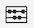

# Überblick über Projekte

Mit Workspace-Projekten können Sie Panels, Visualisierungen und Komponenten kombinieren, um Ihre Analyse zu erstellen und sie für andere Mitarbeitende Ihrer Organisation freizugeben. Bevor Sie mit Ihrem ersten Projekt beginnen, sollten Sie sich damit vertraut machen, wie Sie auf Projekte zugreifen, durch sie navigieren und diese verwalten.

Um auf Projekte in Customer Journey Analytics zuzugreifen, wählen Sie **[!UICONTROL Arbeitsbereich]** aus.  Der Manager **[!UICONTROL Projekte]** listet alle Projekte auf, die Ihnen gehören bzw. die für Sie freigegeben wurden. Mit der Projektliste ist er zudem die standardmäßige Landingpage von Customer Journey Analytics, sofern Sie in den Voreinstellungen nichts anderes konfiguriert haben.

## Titelbereich

Im Titelbereich ➊ können Sie ein Projekt erstellen, einen Ordner anlegen, Voreinstellungen bearbeiten und ein Panel mit zusätzlichen Kacheln ein- oder ausblenden.

* Um links ein Panel ein- oder auszublenden, in dem Sie zwischen **[!UICONTROL Projekte]** und **[!UICONTROL Lernen]** wählen können, wählen Sie  aus.
* Als Titel wird „Projekte“ angezeigt, optional ergänzt mit dem Pfad zum ausgewählten Ordner, z. B. [!UICONTROL Projekte] > **[!UICONTROL Unternehmensordner]**. Sie können einzelne Unterordnerteile auswählen, um direkt zum jeweiligen Ordner zu gelangen.
* Um Kacheln für [**[!UICONTROL Leeres Projekt]**](create-projects.md), [**[!UICONTROL Leere mobile Scorecard]**](/help/mobile-app/create-scorecard.md), [**[!UICONTROL Geführte Analyse]**](/help/guided-analysis/overview.md), **[!UICONTROL Dokumentation öffnen]** und **[!UICONTROL Versionshinweise öffnen]** anzuzeigen, wählen Sie  ChevronDown **[!UICONTROL Mehr zeigen]** aus. Um den Bereich mit den Kacheln auszublenden, wählen Sie  **[!UICONTROL Weniger zeigen]** aus.
* Je nachdem, was angezeigt werden soll, können Sie mit der Auswahl [Anzeigen](#show-selector) Voreinstellungen bearbeiten und Aktionen für den aktuellen unter **[!UICONTROL Projekte]** angezeigten Ordner durchführen:

  | Aktion | Beschreibung |
  |---|---|
  | **[!UICONTROL Erstellen eines Projekts]** | Wählen Sie diese Aktion aus, um [ein neues Projekt zu erstellen](create-projects.md). |
  | **[!UICONTROL Ordner erstellen]** | Wählen Sie diese Aktion aus, um [einen neuen Ordner zu erstellen](workspace-folders/create-folders.md). |
  |  **[!UICONTROL Voreinstellungen bearbeiten]** | Wählen Sie diese Aktion aus, um [Voreinstellungen für alle Ihre Projekte zu bearbeiten](/help/analysis-workspace/user-preferences.md). Wenn der Breadcrumb zu Platzproblemen führt, ist diese Aktion Teil des Untermenüs . |
  | **[!UICONTROL Projekte hinzufügen]** | Wählen Sie diese Aktion aus, um dem aktuellen Ordner [Projekte hinzuzufügen](workspace-folders/add-projects.md). Wenn der Breadcrumb zu Platzproblemen führt, ist diese Aktion Teil des Untermenüs . |
  | **[!UICONTROL Ordner umbenennen]** | Wählen Sie diese Aktion aus, um den aktuellen Ordner [umzubenennen](workspace-folders/manage-folders.md#rename-folders). |
  | **[!UICONTROL Ordner verschieben]** | Wählen Sie diese Aktion aus, um den aktuellen Ordner zu [verschieben](workspace-folders/manage-folders.md#move-folders). |
  | **[!UICONTROL Ordner löschen]** | Wählen Sie diese Aktion aus, um den aktuellen Ordner zu [löschen](workspace-folders/manage-folders.md#delete-folders). |

## Projektliste

Die Projektliste ➋ zeigt alle Projekte, die Ihnen gehören bzw. die für Sie freigegeben wurden. Die Liste umfasst die folgenden Spalten:

| Spalte | Beschreibung |
| --- | --- | 
|  | Wenn ein oder mehrere Projekte ausgewählt sind, wird unten in der Benutzeroberfläche „Projekt“ eine blaue Aktionsleiste angezeigt. Weitere Informationen finden Sie unter [Aktionen](#actions). |
|  | Wählen Sie diese Option aus, um einen Filter als Favoriten zu markieren  oder aus den Favoriten zu entfernen . |
| **[!UICONTROL Titel und Beschreibung]** | Wählen Sie zum Bearbeiten des Projekts den Titel-Link aus. Dadurch wird das [Workspace-Projekt](/help/analysis-workspace/home.md) geöffnet. Für Sie freigegebene Projekte sind mit  gekennzeichnet. Wählen Sie  aus, um ein Popup-Menü mit weiteren Details zum Projekt anzuzeigen. Wählen Sie , um ein Kontextmenü mit Aktionen zu öffnen. Weitere Informationen finden Sie unter [Aktionen](#actions). |
| **[!UICONTROL Typ]** | Ein Workspace-Projekt, ein Ordner  oder eine [Mobile Scorecard](/help/mobile-app/home.md). |
| **[!UICONTROL Tags]** | Die auf das Projekt angewendeten Tags. |
| **[!UICONTROL Geplant]** | Ob ein Projekt für den E-Mail-Versand an Empfangende geplant ist. Die Optionen lauten  **[!UICONTROL Ein]** oder  **[!UICONTROL Aus]**. Siehe [Senden von Projektdaten an andere](/help/analysis-workspace/export/t-schedule-report.md). |
| **[!UICONTROL Freigegebener Link (alle)]** | Ob ein Projekt für alle freigegeben wird, auch für Personen ohne Zugriff auf Analysis Workspace. Die Optionen lauten  **[!UICONTROL Aktiv]** oder  **[!UICONTROL Inaktiv]**. Weitere Informationen finden Sie unter [Freigeben eines Projekts für alle (keine Anmeldung erforderlich)](/help/analysis-workspace/curate-share/share-projects.md#share-a-project-with-anyone-no-login-required) in [Freigeben von Projekten](/help/analysis-workspace/curate-share/share-projects.md). |
| **[!UICONTROL Projektrolle]** | Ihre Rolle für das Projekt. Die Optionen lauten: Bearbeiten, Duplizieren, Anzeigen. Weitere Informationen finden Sie unter [Projektrollen](/help/analysis-workspace/curate-share/curate.md). |
| **[!UICONTROL Datenansicht]** | Die Datenansicht, mit der das Projekt verknüpft ist. |
| **[!UICONTROL Inhabende]** | Die Person, die dieses Projekt erstellt hat (entweder Sie oder eine Person, die das Projekt für Sie freigegeben hat). |
| **[!UICONTROL Freigegeben für]** | Benutzende, für die das Projekt freigegeben wurde. |
| **[!UICONTROL Zuletzt geändert]** | Datum und Zeitpunkt der letzten Änderung des Projekts. |
| **[!UICONTROL Zuletzt geöffnet]** | Datum und Zeitpunkt der letzten Öffnung des Projekts. |
| **[!UICONTROL Projekt-ID]** | Die ID des Projekts. |
| **[!UICONTROL Längster Datumsbereich]** | Der längste Datumsbereich von allen Panels oder Visualisierungen im Projekt. |
| **[!UICONTROL Anzahl der Abfragen]** | Die Gesamtzahl der im Projekt enthaltenen Abfragen.  |
| **[!UICONTROL Ort]** | Der Ordner, in dem sich das Projekt befindet. |

Bewegen Sie den Mauszeiger über eine beliebige Spaltenüberschrift, um  anzuzeigen, und wählen Sie Folgendes aus dem Kontextmenü aus:

* **[!UICONTROL Aufsteigend sortieren]**
* **[!UICONTROL Absteigend sortieren]**
* **[!UICONTROL Spaltengröße ändern]**. Es wird eine blaue Linie angezeigt, mit der Sie die Größe der Spalte ändern können.

### Aktionen

Sie können Aktionen für ein oder mehrere Projekte mithilfe des Kontextmenüs  der blauen Aktionsleiste durchführen.

| Symbol | Aktion | Beschreibung |
|:---:| ---|---|
|  | **[!UICONTROL *x *ausgewählt]** | Heben Sie die Auswahl der ausgewählten Projekte und Ordner auf und entfernen Sie die blaue Aktionsleiste. |
|  | **[!UICONTROL Löschen]** | Löschen Sie ein oder mehrere Projekte oder Ordner. Sie werden zur Bestätigung aufgefordert. |
|  | **[!UICONTROL Freigeben]** | Geben Sie ein Projekt frei. Weitere Informationen finden Sie unter [Freigeben eines Projekts](/help/analysis-workspace/curate-share/share-projects.md). |
|  | **[!UICONTROL Umbenennen]** | Benennen Sie ein Projekt um. Öffnet ein **[!UICONTROL Dialogfeld „Umbenennen *Projektname *]**“. Geben Sie einen neuen Namen ein und wählen Sie**[!UICONTROL Speichern ]**aus. |
|  | **[!UICONTROL Kopieren]** | Kopieren Sie ein oder mehrere Projekte. Das Projekt erhält denselben Namen und dasselbe Suffix `(Copy)`. |
|  | **[!UICONTROL Anheften]** oder **[!UICONTROL Loslösen]** | Heften Sie ein oder mehrere Projekte oder einen oder mehrere Ordner an oder lösen Sie sie los. Angeheftete Projekte und Ordner werden oben in der Liste angezeigt und ignorieren die von Ihnen angegebene Sortierreihenfolge. |
|  | **[!UICONTROL Nach oben]** | Verschieben Sie ein angeheftetes Projekt oder einen angehefteten Ordner in der Projektliste nach oben. |
|  | **[!UICONTROL Nach unten]** | Verschieben Sie ein angeheftetes Projekt oder einen angehefteten Ordner in der Projektliste nach unten. |
|  | **[!UICONTROL Tag]** | Versehen Sie ein oder mehrere Projekte oder einen oder mehrere Ordner mit einem Tag. Das Dialogfeld **[!UICONTROL Komponenten Taggen]** wird angezeigt, in dem Sein ein oder mehrere Tags auswählen können. Wählen Sie **[!UICONTROL Speichern]** aus, um die Tags für die ausgewählten Projekte oder Ordner zu speichern. |
|  | **[!UICONTROL Genehmigen]** oder **[!UICONTROL Genehmigung aufheben]** | Genehmigen Sie ein Projekt oder heben Sie die Genehmigung für ein Projekt auf. Nur Admins können Projekte genehmigen. |
|  | **[!UICONTROL CSV exportieren]** | Exportieren Sie die ausgewählten Projekte in eine CSV-Datei mit dem Namen `Project List.csv`. |
|  | **[!UICONTROL Projekte hinzufügen]** | Fügen Sie ein oder mehrere Projekte zu einem ausgewählten Ordner hinzu. In **[!UICONTROL Projekte hinzufügen]** können Sie ein oder mehrere Projekte auswählen. Wählen Sie **[!UICONTROL Hinzufügen]** aus, um die Projekte zu dem Ordner hinzuzufügen. Weitere Informationen finden Sie unter [Hinzufügen von Projekten zu Ordnern](workspace-folders/add-projects.md#from-inside-a-folder). |
|  | **[!UICONTROL Verschieben nach]** | Verschieben Sie ein oder mehrere ausgewählte Projekte in einen Ordner. Wählen Sie in **[!UICONTROL Ordner auswählen]** den Ordner aus, in den das ausgewählte Projekt verschoben werden soll, und wählen Sie dann **[!UICONTROL Verschieben]** aus. Weitere Informationen finden Sie unter [Hinzufügen von Projekten zu Ordnern](workspace-folders/add-projects.md#from-the-project-list). |

## Auswahl „Anzeigen“

Sie können das Look-and-Feel der Benutzeroberfläche „Projekte“ mithilfe der Auswahl **[!UICONTROL Anzeigen]** ➌ ändern. Die Auswahl **[!UICONTROL Anzeigen]** definiert, welche Optionen im [Titelbereich](#title-area) verfügbar sind und welche Spalten in der [Projektliste](#project-list) angezeigt werden.

* Um die für den [Titelbereich](#title-area) verfügbaren Optionen zu ändern, wählen Sie unter **[!UICONTROL Anzeigen]** die Option **[!UICONTROL Alle Projekte]** bzw. unter **[!UICONTROL Anzeigen]** die Option **[!UICONTROL Ordner und Projekte]** aus.

* Um zu definieren, welche Spalten in der [Projektliste](#project-list) angezeigt werden sollen, wählen Sie  aus. Dadurch wird das Dialogfeld **[!UICONTROL Tabelle anpassen]** angezeigt, in dem Sie die gewünschten Spalten aus- oder abwählen können. Wählen Sie **[!UICONTROL Übernehmen]** aus, um die Anpassung anzuwenden. Weitere Informationen finden Sie unter [Projektliste](#project-list).

## Panel „Filter“

Sie können die Projekte und Ordner in der [Projektliste](#project-list) mithilfe des Panels „Filter“ ➍ filtern. Verwenden Sie , um das Panel „Filter“ ein- oder auszublenden.

Das Panel „Filter“ besteht aus den folgenden Abschnitten.

### Tags

| Tags | Beschreibung |
|---|---|
| {width="300"} | Im Abschnitt **[!UICONTROL Tags]** können Sie nach Tags filtern. <ul><li>Mit  *Tags suchen* können Sie nach Tags suchen, die Sie zum Filtern verwenden möchten.</li><li>Sie können auch mehr als ein Tag auswählen. Die verfügbaren Tags hängen von der Auswahl ab, die in anderen Abschnitten im Panel „Filter“ vorgenommen wurde.</li><li>Die Zahlen geben Folgendes an:<ul><li>**2︎⃣**: Die Anzahl der Tags, die für die aus dem aktuellen Filter resultierenden Projekte verfügbar sind.</li><li>7︎⃣: Die Anzahl der Projekte, die mit dem jeweiligen Tag verknüpft sind.</li></ul></li></ul> |

### Datenansicht

| Datenansicht | Beschreibung |
|---|---|
| {width="300"} | Im Abschnitt **[!UICONTROL Datenansicht]** können Sie nach Datenansichten filtern. <ul><li>Mit  *Datenaufrufe suchen* können Sie nach Datenansichten suchen, die Sie zum Filtern verwenden möchten.</li><li>Sie können mehr als nur eine Datenansicht auswählen. Die verfügbaren Datenansichten hängen von der Auswahl ab, die in anderen Abschnitten im Panel „Filter“ vorgenommen wurde.</li><li>Die Zahlen geben Folgendes an:<ul><li>**3︎⃣**: Die Anzahl der Datenansichten, die für die aus dem aktuellen Filter resultierenden Projekte verfügbar sind.</li><li>4︎⃣: Die Anzahl der Projekte, die mit der jeweiligen Datenansicht verknüpft sind.</li></ul></li></ul> |

### Inhaberinnen oder Inhaber

| Inhaberin oder Inhaber | Beschreibung |
|---|---|
| {width="300"} | Im Abschnitt **[!UICONTROL Inhaberin oder Inhaber]** können Sie nach Inhaberinnen und Inhabern filtern. <ul><li>Sie verwenden  *Verantwortliche(n) suchen*, um nach Inhaberinnen und Inhabern zu suchen, die Sie zum Filtern verwenden möchten.</li><li>Sie können mehr als eine Inhaberin bzw. einen Inhaber auswählen. Die verfügbaren Inhaberinnen und Inhaber hängen von der Auswahl ab, die in anderen Abschnitten im Panel „Filter“ vorgenommen wurde.</li><li>Die Zahlen geben Folgendes an:<ul><li>**3︎⃣**: Die Anzahl der Inhaberinnen und Inhaber, die für die aus dem aktuellen Filter resultierenden Projekte verfügbar sind.</li><li>4︎⃣: Die Anzahl der Projekte, die mit der jeweiligen Inhaberin bzw. dem jeweiligen Inhaber verknüpft sind.</li></ul></li></ul> |

### Typ

| Typ | Beschreibung |
|---|---|
| {width="300"} | Im Abschnitt **[!UICONTROL Typ]** können Sie nach Projekt- oder Ordnertyp filtern.<ul><li>Sie können eine oder mehrere der folgenden Optionen auswählen:<ul><li> **[!UICONTROL Ordner]**</li><li>**[!UICONTROL Analysis Workspace-Projekt]**</li><li>**[!UICONTROL Mobile Scorecard]**</li></ul> <li>Sie können mehr als einen Filter auswählen. Die anderen verfügbaren Filter hängen von der Auswahl ab, die in anderen Abschnitten im Panel „Filter“ vorgenommen wurde.</li><li>Die Zahlen geben Folgendes an:<ul><li>**5︎⃣**: Die Anzahl weiterer Filter, die für die aus dem aktuellen Filter resultierenden Projekte verfügbar sind.</li><li>4︎⃣: Die Anzahl der Projekte, die mit dem jeweiligen anderen Filter verknüpft sind.</li></ul></li></ul> |

### Andere Filter

| Andere Filter | Beschreibung |
|---|---|
| {width="300"} | Im Abschnitt **[!UICONTROL Andere Filter]** können Sie nach anderen vordefinierten Filtern filtern.<ul><li>Sie können eine oder mehrere der folgenden Optionen auswählen:<ul><li> **[!UICONTROL Alle anzeigen]**</li><li>**[!UICONTROL Mit mir geteilt]**</li><li>**[!UICONTROL Meine]**</li><li>**[!UICONTROL Genehmigt]**</li><li>**[!UICONTROL Favoriten]**</li></ul> Was Sie auswählen können, hängt von Ihrer Rolle und Ihren Berechtigungen ab.</li><li>Sie können mehr als einen Filter auswählen. Die anderen verfügbaren Filter hängen von der Auswahl ab, die in anderen Abschnitten im Panel „Filter“ vorgenommen wurde.</li><li>Die Zahlen geben Folgendes an:<ul><li>**5︎⃣**: Die Anzahl weiterer Filter, die für die aus dem aktuellen Filter resultierenden Projekte verfügbar sind.</li><li>4︎⃣: Die Anzahl der Projekte, die mit dem jeweiligen anderen Filter verknüpft sind.</li></ul></li></ul> |

## Suche

Sie verwenden den Suchbereich ➎, um mithilfe des Felds  nach Projekten und Ordnern zu suchen. Sobald Sie mit der Eingabe beginnen, filtert die [Projektliste](#project-list) automatisch auf Ihre Sucheingabe.

Im Suchbereich werden auch die im Panel „Filter“ angewendeten Filter angezeigt.

* Wählen Sie zum Verschieben eines Filters die Option  im Filter aus.
* Wählen Sie zum Entfernen aller Filter die Option „Alle löschen“ aus.

Wenn der Platz für die Anzeige der einzelnen Filter begrenzt ist, sehen Sie **[!UICONTROL Segmentieren nach *x* Filter]**.

* So entfernen Sie einen Filter:

   1. Verwenden Sie **[!UICONTROL *x *Filter]**, um ein Kontextmenü mit einer Liste der Filtertypen und der einzelnen Filter zu öffnen.
   1. Wählen Sie  aus, um einen Filter zu entfernen.

<!--

The Projects page contains the following information: 

>[!NOTE]
>
>Some columns are not displayed by default. To customize the columns you see, click the **Customize table** icon .

|  Element  | Description  |
|---|---|
| [Edit preferences](/help/analysis-workspace/user-preferences.md) | Manage settings for Analysis Workspace and its related components for all new projects or panels that you create.  |
| [Create folder](/help/analysis-workspace/build-workspace-project/workspace-folders/create-folders.md)  | Add a new folder or subfolder to the list of projects and folders. |
| [Create project](/help/analysis-workspace/build-workspace-project/create-projects.md)  | Start a new project from scratch.  |
|  Show more  |Reveals options for creating a blank project or mobile scorecard, [viewing training tutorials](https://experienceleague.adobe.com/docs/analytics-learn/tutorials/analysis-workspace/analysis-workspace-basics/analysis-workspace-introduction.html), or [viewing release notes](/help/release-notes/latest.md).  |
| Show Folders & Projects| Choose whether to show the folder structure of projects. For more information, see [About Folders in Analytics](/help/analysis-workspace/build-workspace-project/workspace-folders/about-folders.md). |
|  Customize table (icon)  | Allows you to customize the information that shows for each project on the Projects page.  |
|  Name  | Name of the Workspace project.  |
| Type | Indicates whether this is a Workspace Project, a folder, or a [Mobile Scorecard](https://experienceleague.adobe.com/docs/analytics/analyze/mobapp/home.html). |
|  Tags  |Tags that were applied to the project.  |
| Scheduled | Indicates whether projects are scheduled to be emailed to recipients on a schedule. See [Send project data to others](/help/analysis-workspace/export/t-schedule-report.md). |
| Shared link (anyone) | Projects can be shared with anyone--even with people who don't have access to Analysis Workspace. This column shows whether projects have been shared in this way. See [Share a project with anyone (no login required)](/help/analysis-workspace/curate-share/share-projects.md#share-public-link) in [Share projects](/help/analysis-workspace/curate-share/share-projects.md) for more information. |
| Data view | The data view that the project is associated with. |
| [Project Role](https://experienceleague.adobe.com/docs/analytics/analyze/analysis-workspace/curate-share/share-projects.html) | Indicates your role for the project - owners, edit, duplicate, view. |
|  Owner  | The person who created this project (either you or someone who shared the project with you.)  |
|  Shared with  | Users that the project has been shared with.  |
|  Last Modified  | Date and time when the project was last modified.  |
|  Last Opened  | Date and time when the project was last opened.  |
|  Project ID  | The ID of the project.  |
|  Longest Date Range  | The longest date range of the project.  |
|  Number of Queries  | The total number of queries contained in the project.  |
|  Location  | The folder where the project resides.  |

## Menu bar {#menu-bar}

Within a project, the menu provides options for managing your project, adding components, finding help, and more. Each menu option can also be accessed by keyboard [shortcuts](/help/analysis-workspace/build-workspace-project/fa-shortcut-keys.md).

|  Menu item  | Description  |
|---|---|
|  Project  | Includes common actions for project management, including New, Open, Save, and Save As. You can also refresh the entire project to retrieve the most recent data and definitions by clicking Refresh Project. [Download project data](/help/analysis-workspace/export/download-send.md) options enable you to export data from Workspace. **Project Info & Settings** (see below) offers many options for managing your project.  |
|  Edit  | Undo or redo your last action. Clear All will reset your project to a blank starting point. |
|  Insert  | Insert new panels or visualizations from this menu. You can also insert new panels and visualizations from the left panel.  |
|  [Components](/help/components/overview.md)  | Create new segments, calculated metric, date range, or alert components from your project. You can also create new components from the left panel. If your component definitions have recently changed, Refresh Components will retrieve the latest definitions. |
|  [Share](/help/analysis-workspace/curate-share/send-schedule-files.md)  | Curate, share and schedule PDF/CSV projects to recipients in your organization.  |
|  Help  | Access help documentation, videos, and the Analytics [Experience League community](https://experienceleaguecommunities.adobe.com/t5/adobe-analytics/ct-p/adobe-analytics-community). Manage the visibility of Workspace tips as well as the [debugger](https://experienceleague.adobe.com/en/docs/analytics-learn/tutorials/apis/using-analysis-workspace-to-build-api-2-requests). Find details about Workspace and factors that impact project [performance](/help/technotes/optimizing-performance.md).  |
|  Share button or Owner  | If you are in an Own or Edit for the project, the Share button in the top-right gives you one-click access to manage your project recipients. If you are in a Duplicate or View role for the project, you will see the project owner's name. |

### Project Info & Settings {#info-settings}

**[!UICONTROL Workspace]** > **[!UICONTROL Project]** > **[!UICONTROL Project info & settings]** provides project-level information on the currently active project.

Settings include:

|  Setting  | Description  |
|---|---|
|  Project Name  | The name given to the project. You can double-click the name to edit it.  |
|  Created By  | Project owner name  |
|  Last Modified  | Date of last modification to the project.  |
|  Tags  |Lists any tags applied to a project for easier categorization.  |
|  Description  | A description is useful for clarifying the purpose of a project. You can double-click the description to edit it.  |
|  Count repeat instances in project  | Specifies whether repeat instances are counted in reports. Note: this setting does not apply to Flow or Fallout visualizations.  |
|  [Project color palette](/help/analysis-workspace/build-workspace-project/color-palettes.md)  | You can change the categorical color palette used in Workspace, by choosing from out-of-the-box palettes that have been optimized for color blindness, or by specifying your custom palette. This feature affects many things in Workspace, including most visualizations.  |
| [View Density](/help/analysis-workspace/build-workspace-project/view-density.md) | Lets you see more data on the screen by reducing the vertical padding of the left panel, freeform tables and cohort tables. |

## Left panel

Within a project, various icons are available in the left panel, and each represents important parts of a project:

* [Panels](/help/analysis-workspace/c-panels/panels.md) 

* [Visualizations](/help/analysis-workspace/visualizations/freeform-analysis-visualizations.md)

* [Components](/help/components/overview.md)

* [Data dictionary](/help/components/data-dictionary/data-dictionary-overview.md)

* [Table of contents](/help/analysis-workspace/build-workspace-project/project-table-of-contents.md) 

Components (Dimensions, Metrics, Segments, Date Ranges) in the left panel relate to the active panel data view. The active panel is identified by the blue border that surrounds it, and the active data view is listed at the top of the component panel.

## Project canvas {#canvas}

The project canvas is where you bring together panels, tables, visualizations, and components to build your analysis. A project can contain many panels, and each panel can contain many tables and visualizations.

Panels are helpful when you want to organize your projects according to time periods, data views, or analysis use case. The active panel will have a blue border around it, and determines what components are available in the left panel.

Depending on the starting point you chose for your projects, you will either have a [freeform table](/help/analysis-workspace/visualizations/freeform-table/freeform-table.md) or a [blank panel](/help/analysis-workspace/c-panels/blank-panel.md) in the canvas to begin with. The quickest way to start analyzing is to select one or many components and simply drag & drop them into the project canvas. A table of data will automatically be rendered for you. [Learn more](/help/analysis-workspace/visualizations/freeform-table/freeform-table.md) about the different options for building a table, or leverage our [training tutorial](/help/analysis-workspace/home.md) for more guidance on building your first project.

## Project Manager {#manager}

Analysis Workspace projects can be managed under **Analytics > Components >  Projects**. The Project Manager shows the projects that a specific user created. You can transfer project ownership to a new user under Admin > Analytics Users & Assets > Transfer Assets.

In Projects Manager, you can add, tag, share, duplicate/copy, and more. Search for a project in the search bar or by using the filter options in the left panel. You can filter by tag, owners, project type and more.

The following are common actions in the Projects manager, and can be taken on one or many projects at once:

|  Action  | Description  |
|---|---|
|  Add  | Create a new project from scratch.  |
|  Tag or Approve  | Choose "Tag" or "Approve" to organize your projects and make them easier to search for.  |
|  [Share](/help/analysis-workspace/curate-share/share-projects.md)  | Make a project available to other Analysis Workspace users in your organization.  |
|  Delete  | Delete your project.  |
|  Rename  | Edit the name of your project.  |
|  Copy  | Create a duplicate copy of your project. This creates a new project and project ID. Any shares or schedules tied to the original project will not be copied. |
|  Export to CSV  | Download your project as a CSV file, which includes plain-text data.  |

-->

