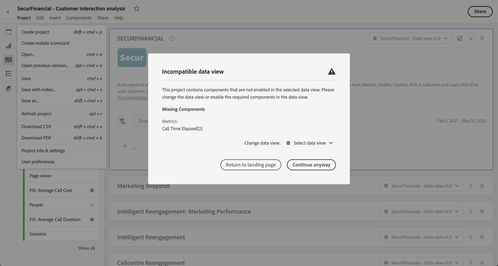

# Öffnen von Projekten

Sie können ein Projekt direkt über die Seite [Projekte](/help/analysis-workspace/build-workspace-project/freeform-overview.md) öffnen. Suchen Sie in der Liste nach Ihrem Projekt. Verwenden Sie [Suche](/help/analysis-workspace/build-workspace-project/freeform-overview.md#search) oder das [Segmentbedienfeld](/help/analysis-workspace/build-workspace-project/freeform-overview.md#segment-panel), um die Liste einzugrenzen.

* Wählen Sie den Titel Ihres Projekts aus, um das Projekt in Analysis Workspace zu öffnen.

Sie können ein Projekt auch öffnen, während Sie in einem anderen Projekt arbeiten.

* Wählen Sie im Menü **[!UICONTROL Projekt]** die Option **[!UICONTROL Öffnen]** aus. Es wird ein Dialogfeld angezeigt, das der Seite [Projekte](/help/analysis-workspace/build-workspace-project/freeform-overview.md) ähnelt.  Verwenden Sie [Suche](/help/analysis-workspace/build-workspace-project/freeform-overview.md#search) oder das [Segmentbedienfeld](/help/analysis-workspace/build-workspace-project/freeform-overview.md#segment-panel), um die Liste einzugrenzen.
* Wählen Sie den Titel Ihres Projekts aus, um das Projekt in Analysis Workspace zu öffnen.

Wenn Sie das Projekt nicht finden können und ein neues Projekt starten möchten, wählen Sie **[!UICONTROL Neu erstellen]** aus.

## Vorherige Version öffnen

So öffnen Sie eine zuvor gespeicherte Version eines Projekts:

1. Wählen Sie im Menü **[!UICONTROL Projekt]** die Option **[!UICONTROL Vorherige Version öffnen]** aus.

   

1. Überprüfen Sie die Liste der verfügbaren vorherigen Versionen im Dialogfeld **[!UICONTROL Zuvor gespeicherte Versionen]**. Sie können zwischen **[!UICONTROL Alle Versionen]** und **[!UICONTROL Nur Versionen mit Hinweisen]** wechseln.

   Die Liste zeigt für jede Version einen Zeitstempel, den Editor und gespeicherte Hinweise an.

1. Wählen Sie eine frühere Version aus und klicken Sie auf **[!UICONTROL Laden]**.
Die vorherige Version wird dann mit einer Benachrichtigung geladen. Die vorherige Version wird nur dann zur aktuell gespeicherten Version Ihres Projekts, wenn Sie auf **[!UICONTROL Speichern]** klicken. Wenn Sie die geladene Version verlassen und eine frühere Version erneut öffnen möchten, wird die zuletzt gespeicherte Version angezeigt.

## Inkompatible Datenansicht

Beim Öffnen eines Projekts wird möglicherweise das Warnungsdialogfeld **[!UICONTROL Inkompatible Datenansicht]** angezeigt. In diesem Panel wird erläutert, dass bestimmte Komponenten innerhalb des Projekts in der ausgewählten Datenansicht für eines der Panels im Projekt nicht aktiviert sind.

Zum Beheben dieser Warnung haben Sie folgende Möglichkeiten:

* **[!UICONTROL Ändern der Datenansicht]**. Wählen Sie eine geeignete Datenansicht über **[!UICONTROL Datenansicht ändern:]** . Wenn die ausgewählte Datenansicht gültig ist, wird Ihr Projekt in Analysis Workspace geöffnet.
* **[!UICONTROL Zurückkehren zur Landingpage]**. Ihr ausgewähltes Projekt wird nicht geöffnet, und Sie können ein anderes Projekt auswählen.
* **[!UICONTROL Trotzdem fortfahren]**. Ihr Projekt wird in Analysis Workspace geöffnet, zeigt jedoch Fehler in einigen Visualisierungen an und die inkompatiblen Datenansichten enthalten einen Warnhinweis  vor dem Namen der Datenansicht.
