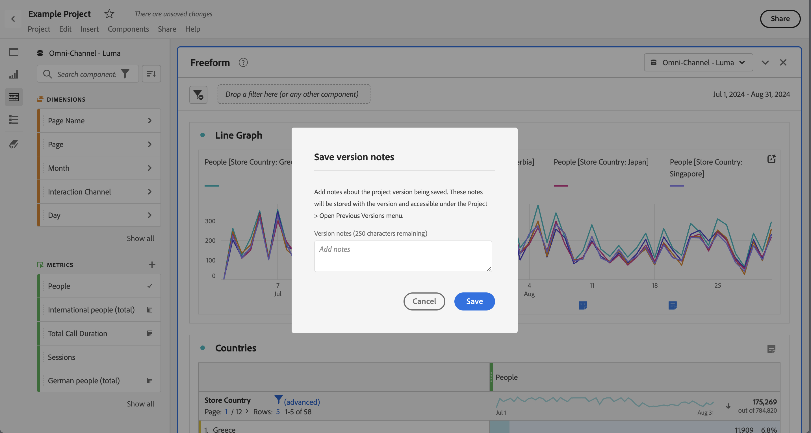

# Projekte speichern

Projekte in Analysis Workspace werden automatisch alle zwei Minuten gespeichert. Sie können auch Projekte selbst speichern, ein Projekt als Duplikat speichern oder ein Projekt mit Versionshinweisen speichern.

## Speichern

Um ein Projekt manuell zu speichern, wählen Sie bei geöffnetem Projekt in Analysis Workspace **[!UICONTROL Projekt]** aus und wählen Sie dann aus den folgenden Optionen:

* **[!UICONTROL Speichern]**

  Speichern Sie die Änderungen an Ihrem Projekt. Wenn das Projekt freigegeben ist, sehen die Empfänger des Projekts auch die Änderungen.

  Wenn Sie das Projekt zum ersten Mal speichern, wird ein Dialogfeld **[!UICONTROL Speichern]** angezeigt.

  

   1. Geben Sie Folgendes an:

      * **[!UICONTROL Name]** (erforderlich). Name Ihres Projekts.
      * **[!UICONTROL Beschreibung]**. Eine Beschreibung Ihres Projekts.
      * **[!UICONTROL Tags]**. Suchen Sie im Feld [!UICONTROL *Tags durchsuchen*] nach Tags oder fügen Sie neue Tags mithilfe von **[!UICONTROL ENTER]** hinzu.
      * **[!UICONTROL Ordner]**. Wählen Sie einen Ordner aus dem Dropdown-Menü [!UICONTROL *Ordner auswählen*] aus. Wenn Sie keinen Ordner angeben, wird das Projekt in dem aktuellen Ordner gespeichert, aus dem Sie ein neues Projekt erstellt haben.
      * **[!UICONTROL Versionshinweise]**. Fügen Sie im Textbereich *Notizen hinzufügen* Versionshinweise hinzu.

   1. Wählen Sie **[!UICONTROL Speichern]** aus, um Ihr Projekt zu speichern.

  Durch das Speichern Ihres Projekts wird tatsächlich eine Version Ihres Projekts gespeichert, die 90 Tage lang gespeichert ist.

  Wenn Sie ein freigegebenes Projekt speichern, werden Sie im Warndialogfeld **[!UICONTROL Änderungen an freigegebenem Projekt speichern]** zur Bestätigung aufgefordert.

  

   * Wählen Sie **[!UICONTROL Speichern]** aus, um das Projekt zu speichern.
   * Wählen Sie **[!UICONTROL Speichern unter]** aus, um das Projekt als doppeltes Projekt mit einem neuen Namen zu speichern.

* **[!UICONTROL Mit Hinweisen speichern]**

  

  Fügen Sie beim Speichern Ihres Projekts Notizen zu den Änderungen im Projekt hinzu. Im Dialogfeld Versionshinweise speichern :

   1. Geben Sie Ihre **[!UICONTROL Versionshinweise]** im Textbereich **[!UICONTROL Notizen hinzufügen]** ein.
   1. Wählen Sie **[!UICONTROL Speichern]** aus.

  Notizen werden mit der Projektversion gespeichert und sind verfügbar, wenn Sie [eine frühere Version öffnen](open-projects.md#open-previous-version) des Projekts. Eine mit Anmerkungen gespeicherte Version wird automatisch ein Jahr lang gespeichert.

* **[!UICONTROL Speichern unter]**

  

  Erstellen Sie ein Duplikat Ihres Projekts mit einem neuen Namen. Das Dialogfeld Speichern unter wird angezeigt.

   1. Geben Sie Folgendes an:

      * **[!UICONTROL Name]** (erforderlich). Name Ihres Projekts.
      * **[!UICONTROL Beschreibung]**. Eine Beschreibung Ihres Projekts.
      * **[!UICONTROL Tags]**. Suchen Sie im Feld [!UICONTROL *Tags durchsuchen*] nach Tags oder fügen Sie neue Tags mithilfe von **[!UICONTROL ENTER]** hinzu.
      * **[!UICONTROL Ordner]**. Wählen Sie einen Ordner aus dem Dropdown-Menü [!UICONTROL *Ordner auswählen*] aus. Wenn Sie keinen Ordner angeben, wird das Projekt in dem aktuellen Ordner gespeichert, aus dem Sie ein neues Projekt erstellt haben.
      * **[!UICONTROL Versionshinweise]**. Fügen Sie im Textbereich *Notizen hinzufügen* Versionshinweise hinzu.

   1. Wählen Sie **[!UICONTROL Speichern]** aus, um Ihr Projekt zu speichern.

  Sie können das Projekt in einem anderen Ordner speichern. Das ursprüngliche Projekt ist nicht betroffen.

<!-- Cannot find this option in CJA 
| **[!UICONTROL Save as template]** | Save your project as a [custom template](https://experienceleague.adobe.com/docs/analytics/analyze/analysis-workspace/build-workspace-project/starter-projects.html) that becomes available to your organization under **[!UICONTROL Project > New]** | 
-->

## Automatisches Speichern

>[!IMPORTANT]
>
>Obwohl neue Projekte automatisch gespeichert werden, müssen Sie jedes neue Projekt manuell speichern, indem Sie **zuerst** Mal speichern.
>

Alle Projekte in Analysis Workspace werden automatisch alle 2 Minuten auf Ihrem lokalen Computer gespeichert. Diese automatische Speicherung umfasst neu erstellte Projekte, die noch nicht manuell gespeichert wurden.

### Neue Projekte

Analysis Workspace fordert Sie auf, neue Projekte manuell zu speichern, wenn Sie zu einem anderen Projekt wechseln, die Browser-Registerkarte schließen usw.

Wenn Sie aus irgendeinem Grund unerwartet den Zugriff auf ein neu erstelltes Projekt verlieren, bevor Sie es manuell speichern, wird eine Wiederherstellungsversion Ihres Projekts auf der Analysis Workspace-Landingpage in einem Ordner namens **[!UICONTROL Wiederhergestellte Projekte (Letzte 7 Tage)]** gespeichert. Stellen Sie das wiederhergestellte Projekt wieder her und speichern Sie es manuell an einem gewünschten Ort.

Gehen Sie folgendermaßen vor, um ein Projekt wiederherzustellen:

1. Markieren Sie auf der Analysis Workspace-Landingpage den Ordner **[!UICONTROL Wiederhergestellte Projekte (Letzte 7 Tage)]** .

<!-- 
     
  -->

1. Öffnen Sie das Projekt und speichern Sie es an einem gewünschten Ort.

### Bestehende Projekte

Wenn Sie ein Projekt mit noch nicht automatisch gespeicherten Änderungen aus irgendeinem Grund verlassen, fordert Sie Analysis Workspace entweder auf, Ihre Änderungen zu speichern, oder gibt eine Warnmeldung aus.

Einige gängige Szenarien:

#### Öffnen eines weiteres Projekts

Wenn Sie beim Bearbeiten eines Projekts, das noch nicht automatisch gespeicherte Änderungen enthält, ein anderes Projekt öffnen, werden Sie von Analysis Workspace aufgefordert, das aktuelle Projekt zu speichern.

Die folgenden Optionen sind verfügbar:

* **[!UICONTROL Speichern]**: Ersetzt die neueste automatisch gespeicherte lokale Kopie Ihres Projekts durch Ihre neuesten Änderungen.
* **[!UICONTROL Änderungen verwerfen]**: Verwirft Ihre neuesten Änderungen. Das Projekt behält die neueste automatisch gespeicherte lokale Kopie bei.
* **[!UICONTROL Abbrechen]**: Brechen Sie die Aktion ab, um ein anderes Projekt zu öffnen und das vorhandene Projekt zu öffnen.

<!--  -->

#### Verlassen oder Schließen einer Registerkarte

Wenn Sie von der Seite weg navigieren oder die Browser-Registerkarte schließen, während Sie ein Projekt mit noch nicht automatisch gespeicherten Änderungen anzeigen, warnt der Browser Sie, dass Ihre nicht gespeicherten Änderungen verloren gehen. Sie können wählen, ob Sie gehen oder abbrechen möchten. Wie der Browser Sie warnt, hängt vom verwendeten Browser ab.

### Browser-Abstürze oder Zeitüberschreitung der Sitzung

Wenn Ihr Browser abstürzt oder die Sitzung abbricht, werden Sie beim nächsten Zugriff auf Analysis Workspace aufgefordert, alle Änderungen am Projekt wiederherzustellen, die noch nicht automatisch gespeichert wurden.

* Wählen Sie **[!UICONTROL Ja]**, um das Projekt auf der Basis der letzten automatisch gespeicherten Kopie wiederherzustellen.

* Wählen Sie **[!UICONTROL Nein]**, um die automatisch gespeicherte Kopie zu löschen und die letzte vom Benutzer bzw. der Benutzerin gespeicherte Version des Projekts zu öffnen.

<!---->

Bei **neuen** Projekten, die noch nie gespeichert wurden, können nicht gespeicherte Änderungen nicht wiederhergestellt werden.

<!-- Shouldn't this belong to another page?  Moved it to a new open projects page

## Open previously saved version

To open a previously saved version of a project:

1. Select **[!UICONTROL Open previous version]** from the **[!UICONTROL Project]** menu.

   

1. Review the list of previous versions available. You can switch between **[!UICONTROL All versions]** and **[!UICONTROL Only versions with notes]**.

   For each version, the list shows a timestamp
   [!UICONTROL Timestamp] and [!UICONTROL Editor] are shown, in addition to [!UICONTROL Notes] if they were added when the [!UICONTROL Editor] saved. Versions without notes are stored for 90 days; versions with notes are stored for 1 year.
1. Select a previous version and click **[!UICONTROL Load]**.
   The previous version then loads with a notification. The previous version does not become the current saved version of your project until you click **[!UICONTROL Save]**. If you navigate away from the loaded version, when you return, you will see the last saved version of the project.

-->
