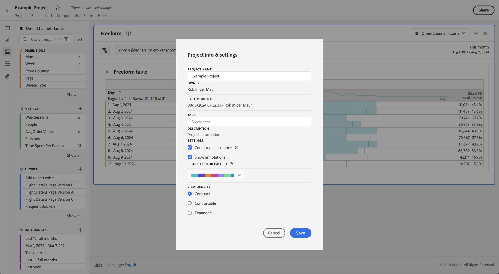
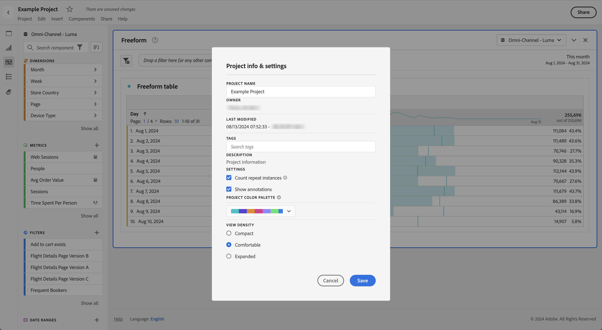
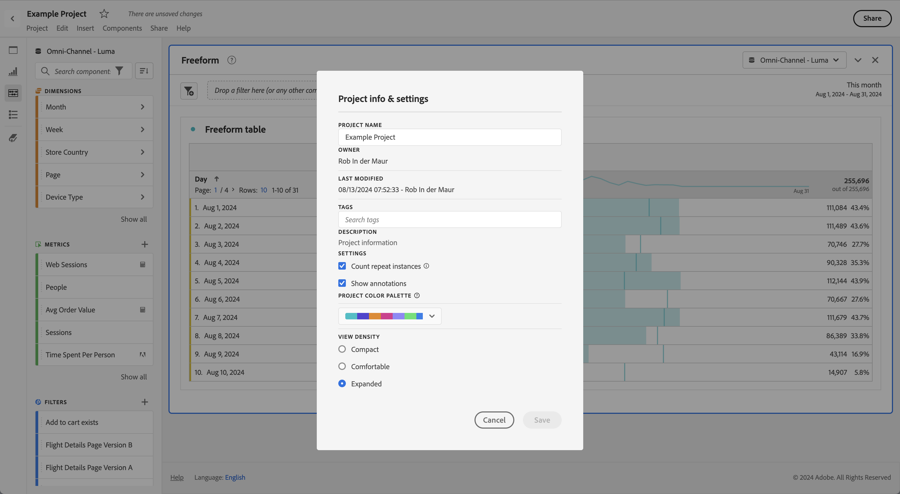

# Dichte anzeigen

Durch die Anpassung der Anzeigedichte können Sie mehr Daten auf dem Bildschirm anzeigen, indem Sie den vertikalen Abstand des linken Panels, der Freiformtabellen und der Kohortentabellen reduzieren. Drei Optionen stehen zur Wahl:

>[!BEGINTABS]

>[!TAB Kompakt]

Die Version mit der am stärksten komprimierten Anzeige.

>[!TAB Komfortabel]

Die aus Workspace bekannte Ansicht.

>[!TAB Erweitert]

Dies ist die Version mit der am meisten erweiterten Ansicht.

>[!ENDTABS]

So stellen Sie die Anzeigedichte ein:

1. Navigieren Sie in Workspace zu **[!UICONTROL Projekte]** > **[!UICONTROL Projektinformationen und -einstellungen]**.

1. Wählen Sie die Option **[!UICONTROL Dichte anzeigen]** und anschließend **[!UICONTROL Speichern]** aus.
