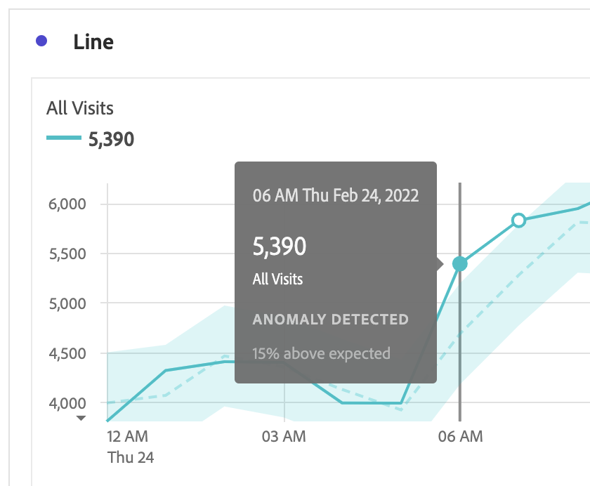

# Anzeigen von Anomalien

Sie können Anomalien in Analysis Workspace in einer Tabelle oder einem Liniendiagramm anzeigen.

## Anzeigen von Anomalien in einer Tabelle {#section_869A87B92B574A38B017A980ED8A29C5}

Sie können Anomalien in einer Freiformtabelle für Zeitreihen anzeigen.

1. Wählen Sie  in der Spaltenüberschrift aus und stellen Sie sicher, dass die Option **[!UICONTROL Anomalien anzeigen]** in der Optionsliste ausgewählt ist. Weitere Informationen finden Sie unter [Spalteneinstellungen](/help/analysis-workspace/visualizations/freeform-table/column-row-settings/column-settings.md).

1. Anomalien werden in der Tabelle wie folgt angezeigt:

   

   Ein ◥ wird in der oberen rechten Ecke jeder Zeile angezeigt, in der eine Datenanomalie erkannt wird.

   Die **farbige senkrechte Linie** in jeder Zeile zeigt ➋ den erwarteten Wert an. Der **farbig schattierte Bereich** in jeder Zeile zeigt ➊ den tatsächlichen Wert an. Der Vergleich der Linie (erwarteter Wert) mit dem schattierten Bereich (tatsächlicher Wert) bestimmt, ob eine Anomalie vorliegt. (Eine Anomalie wird durch die fortschrittlichen statistischen Verfahren festgestellt, die im Abschnitt [In der Anomalieerkennung verwendete statistische Verfahren“ beschrieben &#x200B;](/help/analysis-workspace/c-anomaly-detection/statistics-anomaly-detection.md).)

1. Wählen Sie ◥ in der oberen rechten Ecke einer Zeile aus, um Details zur Anomalie anzuzeigen. Angezeigt wird das Ausmaß (in Prozent), in dem der tatsächliche Wert über oder unter dem erwarteten Wert liegt.

## Darstellen von Anomalien in einem Liniendiagramm

Anomalien können ausschließlich in Liniendiagrammen visuell dargestellt werden.

So stellen Sie Anomalien in einem Liniendiagramm dar:

1. Wählen Sie  in der Visualisierungskopfzeile aus und stellen Sie sicher, dass die Option [!UICONTROL **Anomalien anzeigen**] in der Optionsliste ausgewählt ist. Weitere Informationen finden Sie im Abschnitt [Linie](/help/analysis-workspace/visualizations/line.md).

1. (Optional) Damit das Diagramm anhand des Konfidenzintervalls skaliert werden kann, wählen Sie in der Visualisierungskopfzeile  und dann die Option „Skalierung der Y-Achse durch Anomalien **[!UICONTROL &quot;]**.

   Diese Option ist nicht standardmäßig aktiviert, da das Diagramm dadurch unübersichtlicher werden kann.

   Anomalien werden im Liniendiagramm wie folgt dargestellt:

   

   Ein **weißer Punkt** auf der Linie bedeutet, dass an dieser Stelle eine Datenanomalie erkannt wurde. (Eine Anomalie wird durch die fortschrittlichen statistischen Verfahren festgestellt, die im Abschnitt [In der Anomalieerkennung verwendete statistische Verfahren“ beschrieben &#x200B;](/help/analysis-workspace/c-anomaly-detection/statistics-anomaly-detection.md).)

   Der **hell schattierte Bereich** ist das Konfidenzband bzw. der erwartete Bereich, in dem Werte auftreten sollten. Jeder Wert, der außerhalb dieses erwarteten Bereichs liegt, ist eine Anomalie.

   Wenn das Liniendiagramm mehrere Metriken enthält, werden nur die Anomalien angezeigt. Bewegen Sie in diesem Fall den Mauszeiger über jede einzelne Anomalie, damit das Konfidenzband für diese Metrik eingeblendet wird.

   Die **gepunktete Linie** ist der erwartete Wert.

1. Wählen Sie eine Anomalie (weißer Punkt) aus, um die folgenden Informationen anzuzeigen:

   * Das Datum, an dem die Anomalie aufgetreten ist.

   * Der Rohwert der Anomalie.

   * Der Prozentwert über oder unter dem erwarteten Wert, der durch die durchgezogene grüne Linie dargestellt wird.

<!--
# View anomalies in Analysis Workspace

You can view anomalies in a table or in a line chart.

## View anomalies in a table {#table}

You can view anomalies in a time-series Freeform Table.

1. Select the column settings icon in the column header, then ensure that the [!UICONTROL **Anomalies**] option is selected in the list of options. For more information, see [Column settings](/help/analysis-workspace/visualizations/freeform-table/column-row-settings/column-settings.md).

1. Click away from the settings menu to view the updated table.

   

1. Anomalies are shown in the table as follows:

   A **dark gray triangle** appears in the upper-right corner of each row where a data anomaly is detected.

   The colored **vertical line** in each row indicates the expected value. The colored **shaded area** in each row indicates the actual value. How the line (expected value) compares with the shaded area (actual value) determines whether there is an anomaly. (An observation is considered anomolous based on the advanced statistical techniques described in [Statistical techniques used in anomaly detection](/help/analysis-workspace/c-anomaly-detection/statistics-anomaly-detection.md).)

1. Select the gray triangle in the upper-right corner of a row to view details about the anomaly. This shows the extent (as a percentage) to which the actual value diverges either above or below the expected value.

## View anomalies in a line chart {#line-chart}

A Line chart is the only visualization that allows you to view anomalies.

To view anomalies in a line chart:

1. Select the settings icon in the visualization header, then ensure that the [!UICONTROL **Show anomalies**] option is selected in the list of options. For more information, see [Line](/help/analysis-workspace/visualizations/line.md).

1. (Optional) To allow the confidence interval to scale the chart, select the settings icon in the visualization header, then select the option, **[!UICONTROL Allow anomalies to Scale Y-axis]**. 

   This option is not selected by default because it can sometimes make the chart less legible.
   
1. Click away from the settings menu to view the updated line chart.

      

   Anomalies are shown in the line chart as follows:
   
   A **white dot** appears on the line wherever a data anomaly is detected. (An observation is considered anomolous based on the advanced statistical techniques described in [Statistical techniques used in anomaly detection](/help/analysis-workspace/c-anomaly-detection/statistics-anomaly-detection.md).)

   The **light shaded area** is the confidence band, or expected range, where values should occur. Any value that falls outside of this expected range is an anomaly. 

   If you have multiple metrics in the line chart, only the anomalies are shown and you have to hover over each anomaly to see the confidence band for that metric. 

   The **dotted line** is the exact expected value.

1. Click an anomaly (white dot) to view the following information:

   * The date the anomaly occurred 
   
   * The raw value of the anomaly 
   
   * The percentage value above or below the expected value, which is represented by the solid green line.
   
-->
