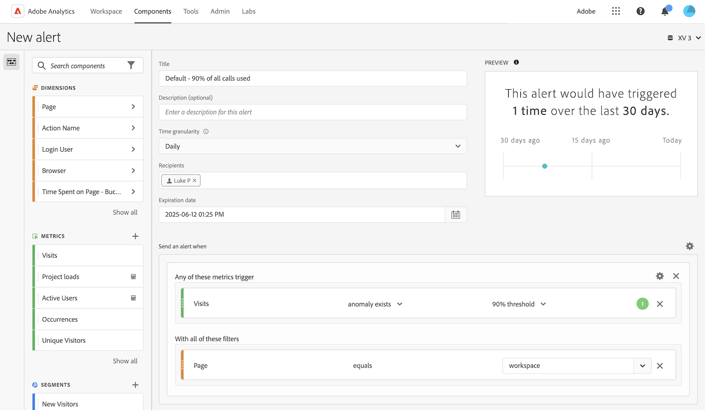

# Erstellen von Warnhinweisen

>[!NOTE]
>
>Intelligente Warnhinweise stehen allen Kunden zur Verfügung. Um jedoch die Anomalieerkennung in intelligenten Warnhinweisen zu verwenden, müssen Sie über Customer Journey Analytics Select, Prime oder Ultimate verfügen.

Intelligente Warnhinweise (oder nur &quot;Warnhinweise&quot;) in Customer Journey Analytics ermöglichen es Ihnen, sofort benachrichtigt zu werden, wenn in Ihren Daten abnorme Ereignisse auftreten.

Detaillierte Übersichtsinformationen zu intelligenten Warnhinweisen finden Sie unter [Übersicht über intelligente Warnhinweise](/help/analysis-workspace/c-intelligent-alerts/intellligent-alerts.md).

So erstellen Sie einen Warnhinweis:

1. Beginnen Sie mit der Erstellung eines Warnhinweises, indem Sie auf die Warnhinweiserstellung zugreifen. Sie haben folgende Möglichkeiten, auf den Warnhinweiserstellung zuzugreifen:

   * Öffnen Sie ein Projekt in Analysis Workspace und wählen Sie dann **[!UICONTROL Komponenten]** > **[!UICONTROL Warnhinweis erstellen]** aus.
   * Öffnen Sie ein Projekt in Analysis Workspace und verwenden Sie dann die folgende Verknüpfung:

     `ctrl (or cmd) + shift + a`
   * Öffnen Sie ein Projekt in Analysis Workspace, wählen Sie mindestens ein Zeilenelement in einer Freiformtabelle aus, klicken Sie mit der rechten Maustaste darauf und wählen Sie **[!UICONTROL Warnhinweis aus Auswahl erstellen]** aus.

     Dadurch wird der Warnhinweiserstellung sofort vorausgefüllt, um einen Warnhinweis mit den richtigen Metriken und Filtern zu erstellen.
   * Wählen Sie unter Customer Journey Analytics **[!UICONTROL Komponenten]** > [!UICONTROL **Warnhinweise**] > **[!UICONTROL Neuen Warnhinweis erstellen]** aus.

   Die Warnhinweiserstellung wird angezeigt. Diese Benutzeroberfläche ist mit jenen vertraut, die Segmente oder berechnete Metriken in Analytics erstellt haben:

   

1. Geben Sie die folgenden Optionen zum Konfigurieren des Warnhinweises an:

   | Option | Beschreibung |
   |---------|----------|
   | [!UICONTROL **Titel**] | Geben Sie einen Namen für den Warnhinweis an. Der Warnhinweisname könnte den Namen des Berichts oder den Schwellenwert einer Metrik enthalten. |
   | [!UICONTROL **Beschreibung (optional)**] | Geben Sie eine Beschreibung für den Warnhinweis an. |
   | [!UICONTROL **Zeitgranularität**] | Wählen Sie aus, wie oft die Metrik überprüft werden soll: täglich, wöchentlich oder monatlich.
<b>Hinweis:</b>Bei Datenansichten mit einem benutzerdefinierten Kalender wird die monatliche Granularität in der Warnhinweiserstellung nicht unterstützt.<!--true?-->
 |
   | [!UICONTROL **Empfänger**] | Geben Sie an, wo der Warnhinweis hingeschickt werden soll. Ein Warnhinweis kann an einen Analyse-Benutzer, eine Analyse-Gruppe, eine E-Mail-Adresse oder eine Telefonnummer gesendet werden.
<b>Wichtig:</b>Der Telefonnummer muss ein &quot;+&quot;- und ein &quot;[Ländercode](https://countrycode.org/)&quot; vorangestellt werden.

Die E-Mail, die ein Benutzer erhält, nachdem ein Warnhinweis ausgelöst wurde, sieht in etwa so aus:

 |
   | [!UICONTROL **Ablaufdatum**] | Legen Sie Datum und Uhrzeit für den Ablauf des Warnhinweises fest. |
   | [!UICONTROL **Verzögerung**] | Die Zeit, die erforderlich ist, bevor die Daten vollständig sind und zur Berichterstattung auf der Customer Journey Analytics zur Verfügung stehen, variiert je nach Organisation, in der Regel zwischen 3 und 9 Stunden nach der Ereignis-Zeit. Damit Warnhinweise akkurat sind, müssen die Ereignisdaten für einen bestimmten Ereignisbereich vollständig sein, d. h. Adobe empfängt keine Ereignisdaten mehr für den angegebenen Ereignisbereich.
Um diese Verzögerung bei der Erfassungszeit zu berücksichtigen, dauert es standardmäßig neun Stunden, bis Warnhinweise gesendet werden.

Sie können die Standardverzögerung von 9 Stunden auf einen beliebigen Wert zwischen 0 und 24 Stunden einstellen. Eine Verringerung der Verzögerung auf unter 9 Stunden kann jedoch bedeuten, dass Sie über unvollständige Daten berichten, was zu ungenauen Warnhinweisinformationen führt.

Beachten Sie bei der Verkürzung der Verzögerungszeit Folgendes:
<ul><li>**Datenverfügbarkeit und -vollständigkeit verstehen**: Auch wenn einige Daten möglicherweise bereits früher für Berichte verfügbar sind, werden alle Batch-Daten erst nach einem Zeitraum von 3 bis 9 Stunden in einen Platform-Datensatz aufgenommen. Damit Warnhinweise korrekt sind, muss die Datenerfassung abgeschlossen sein und alle Batch-Daten im Datensatz verfügbar sein.</li><li>**Bestimmen Sie, wie lange es dauert, bis Ihre Daten vollständig und im Datensatz verfügbar sind**: Die Datenerfassungszeiten unterscheiden sich je nach Organisation. Stellen Sie sicher, dass die von Ihnen für die Bereitstellung eines Warnhinweises gewählte Verzögerungszeit mit der Zeit übereinstimmt oder geringer ist, die benötigt wird, damit die Batch-Daten im Platform-Datensatz verfügbar sind<!--add link? -->.</li>
**Tipp:** Die genaueste Möglichkeit, die Zeit zu kennen, die erforderlich ist, damit alle Batch-Daten vollständig sind und in den Platform-Datensatz aufgenommen werden, besteht darin, die Dateningenieure in Ihrer Organisation zu konsultieren.

Alternativ können Sie sich eine allgemeine Vorstellung davon verschaffen, wie lange es dauert, bis die Batch-Bereitstellung in Ihrem Unternehmen im Platform-Datensatz verfügbar ist, indem Sie die folgende Freiformtabelle in Analysis Workspace erstellen:
<ol><li>Fügen Sie in einer Freiformtabelle in Analysis Workspace die Dimension [!UICONTROL **Ereignisse**] und die Dimension [!UICONTROL **Tag**] hinzu.</li><li>Schlüsseln Sie die Dimension [!UICONTROL **Tag**] mit der Dimension [!UICONTROL **Stunden**] auf.
Stunden ohne Daten werden als 0 angezeigt.
</li></ol><li>**Fehler in Ihren Berechnungen berücksichtigen**: Wenn Sie die standardmäßige Verzögerungszeit verringern, empfehlen wir, die Verzögerung mindestens eine Stunde länger zu konfigurieren, als Ihr Unternehmen für die Vollständigkeit der Datenerfassung benötigt. Wenn es beispielsweise eine Verzögerung von 3 Stunden gibt, bevor die Datenerfassung abgeschlossen ist, sollten Sie die Verzögerung auf 4 Stunden setzen.</li></ul>
Weitere Informationen finden Sie unter [Die Datenerfassungszeiten variieren in Customer Journey Analytics](/help/analysis-workspace/c-intelligent-alerts/alerts-feature-comparison.md#data-ingestion-times-vary-in-customer-journey-analytics) im Artikel [Vergleich der Funktion &quot;Intelligente Warnhinweise&quot;: Customer Journey Analytics und Adobe Analytics](/help/analysis-workspace/c-intelligent-alerts/alerts-feature-comparison.md). |
   | [!UICONTROL **Warnhinweis senden, wenn**] | [!UICONTROL **Jeder dieser Metriken Trigger**]: Ziehen Sie Metriken (einschließlich berechneter Metriken) hierher, um Trigger für den Warnhinweis zu erstellen.
Wenn nicht alle Metriken, Dimensionen oder Segmente im Warnhinweis mit der aktuell ausgewählten Datenansicht kompatibel sind, wird die Meldung **&quot;Nicht kompatible Komponenten&quot;** angezeigt.

Legen Sie den Schwellenwert fest, den die Metrik überschreiten muss, damit ein Warnhinweis ausgegeben wird. Sie können diesen Wert auf einen Schwellenwert und anschließend auf eine der folgenden Bedingungen setzen:
<ul><li>Anomalie vorhanden</li><li>Anomalie liegt über erwartetem Wert</li><li>Anomalie liegt unter erwartetem Wert</li><li>ist größer oder gleich</li><li>ist kleiner oder gleich</li><li>ändert sich um</li><li>Sie können einen Schwellenwert von 90 %, 95 %, 99 %, 99,75 % und 99,9 % festlegen.</li></ul>
[!UICONTROL **Mit all diesen Filtern**]: Ziehen Sie Segmente oder Dimensionen per Drag-and-Drop, um Filter hinzuzufügen. Wenn Sie beispielsweise das Segment &quot;Nur Mobilgeräte&quot;hinzufügen, würde die Regel nur für Mobilgeräte Trigger. Mithilfe einer AND-Anweisung können Sie weitere Filter hinzufügen. Per Klick auf das Zahnrad-Symbol können Sie AND- oder OR-Regeln hinzufügen.

Siehe [Intelligente Warnhinweise - Anwendungsbeispiele](/help/analysis-workspace/c-intelligent-alerts/alerts-use-cases.md) für Anwendungsfälle.
 |
   | [!UICONTROL **Vorschau**] | Die interaktive Warnhinweisvorschau zeigt Ihnen basierend auf Daten aus der Vergangenheit, wie oft damit zu rechnen ist, dass ein Warnhinweis ausgelöst wird.
Beispiel: Wenn Sie die Zeitgranularität auf „Stündlich“ festlegen, kann Ihnen die Vorschau verraten, dass der Warnhinweis zu einer bestimmten Metrik während der letzten 30 oder 31 Tage x-mal ausgelöst worden wäre.

Wenn Sie feststellen, dass Warnhinweise zu oft ausgelöst werden würden, können Sie den Schwellenwert im [Warnhinweis-Manager](/help/analysis-workspace/c-intelligent-alerts/alert-manager.md) anpassen.

 |

1. Wählen Sie [!UICONTROL **Speichern**] aus.

