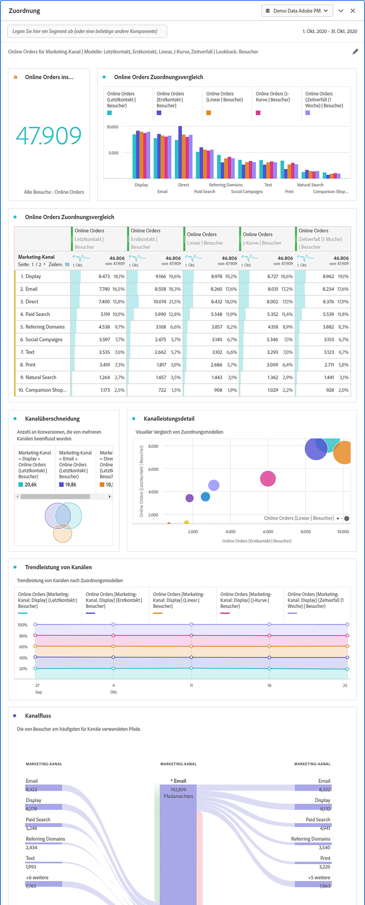

# Attributionsbedienfeld {#attribution-panel}

<!-- markdownlint-disable MD034 -->

>[!CONTEXTUALHELP]
>id="cja_workspace_attribution_button"
>title="Attribution"
>abstract="Vergleichen und visualisieren Sie im Handumdrehen eine beliebige Anzahl von Attributionsmodellen unter Verwendung verschiedener Dimensionen und Konversionskennzahlen."
>additional-url="https://www.youtube.com/watch?v=Yu0hy2klzA0" text="Attribution IQ-Bedienfeld"

>[!CONTEXTUALHELP]
>id="cja_workspace_attribution_panel"
>title="Attributionsbedienfeld"
>abstract="Vergleichen und visualisieren Sie im Handumdrehen eine beliebige Anzahl von Attributionsmodellen unter Verwendung verschiedener Dimensionen und Konversionskennzahlen.  **Parameter ** **Kanal**  Die Dimension, der zugeschrieben werden soll. Diese Dimension kann Marketing-Kanäle, Kampagnen oder eine beliebige andere Dimension sein. **Modelle**  Das Modell bestimmt, wie Guthaben zu Touchpoints zugewiesen wird. **Lookback-Fenster**  Diese Einstellung bestimmt das Fenster der Datenzuordnung, das für jede Konvertierung gilt."
>additional-url="https://www.youtube.com/watch?v=Yu0hy2klzA0" text="Attribution IQ-Bedienfeld"

<!-- markdownlint-enable MD034 -->

Das **[!UICONTROL Attributionsbedienfeld]** bietet eine einfache Möglichkeit, eine Analyse zu erstellen, mit der verschiedene Attributionsmodelle verglichen werden. Der Bereich bietet Ihnen einen eigenen Arbeitsbereich zum Verwenden und Vergleichen von Attributionsmodellen.

Customer Journey Analytics erweitert die Attribution und ermöglicht Ihnen Folgendes:

* Definition der Attribution über gebührenpflichtige Medien: Jede Dimension, Metrik, jeder Kanal oder jedes Ereignis kann auf Modelle (z. B. interne Suche) und nicht nur auf Marketing-Kampagnen angewendet werden.
* Verwenden Sie einen unbegrenzten Attributionsmodellvergleich: Vergleichen Sie dynamisch beliebig viele Modelle.
* Implementierungsänderungen vermeiden: Mit der Berichtszeitverarbeitung und kontextabhängigen Sitzungen kann der Journey-Kontext für Kunden integriert und zur Laufzeit angewendet werden.
* Die Sitzung erstellen, die Ihrem Attributionsszenario am ehesten entspricht.
* Attribution nach Filtern aufschlüsseln: Vergleichen Sie einfach die Leistung Ihrer Marketing-Kanäle über einen beliebigen wichtigen Filter (z. B. Neu vs. Wiederholte Kunden, Produkt X vs. Produkt Y, Treuestufe oder CLV).
* Wechsel zwischen Kanälen und Multi-Touch-Analyse beachten: Verwenden Sie Venn-Diagramme und Histogramme und erstellen Sie Trends anhand von Attributionsergebnissen.
* Wichtige Marketing-Sequenzen visuell analysieren: Erkunden Sie zur Konversion führende Pfade visuell mithilfe von mehrknotigen Fluss- und Fallout-Visualisierungen.
* Berechnete Metriken erstellen: Verwenden Sie eine beliebige Anzahl an Attributionszuordnungsmethoden.

## Verwenden Sie stattdessen 

So verwenden Sie ein Bedienfeld &quot;**[!UICONTROL Attribution]**&quot;:

1. Erstellen Sie ein Bedienfeld &quot;**[!UICONTROL Attribution]**&quot;. Informationen zum Erstellen eines Bedienfelds finden Sie unter [Erstellen eines Bedienfelds](panels.md#create-a-panel).

1. Geben Sie die [Eingabe](#panel-input) für das Bedienfeld an.

1. Beobachten Sie die [Ausgabe](#panel-output) für das Bedienfeld.

### Bedienfeldeingabe

Sie können das Attributionsbedienfeld mithilfe der folgenden Eingabeeinstellungen konfigurieren:

1. Fügen Sie eine **[!UICONTROL Erfolgsmetrik]** und eine Dimension aus dem **[!UICONTROL Kanal]** hinzu, für den Sie eine Zuordnung vornehmen möchten. Beispiele sind Marketing-Kanäle oder benutzerdefinierte Dimensionen wie interne Promotions.

   

1. Wählen Sie ein oder mehrere [Attributionsmodelle](#attribution-models) aus **[!UICONTROL Einbezogene Modelle]** und ein [Lookback-Fenster](#lookback-window) aus dem **[!UICONTROL Lookback-Fenster]** aus, das Sie zum Vergleich verwenden möchten.

1. Wählen Sie **[!UICONTROL Build]** aus, um die Visualisierungen im Bedienfeld zu erstellen.

### Bedienfeldausgabe

Das Bedienfeld **[!UICONTROL Attribution]** gibt einen umfangreichen Satz von Daten und Visualisierungen zurück, die die Attribution für die ausgewählte Dimension und Metrik vergleichen.

### Visualisierungen der Attribution

Die folgende Visualisierung ist Teil der Bereichsausgabe.

* **Metrik insgesamt**: Die Gesamtanzahl der Konversionen, die im Berichtszeitfenster aufgetreten sind und der ausgewählten Dimension zugeordnet werden.
* **Balkendiagramm für den Vergleich der Metrik-Attribution**: Vergleicht visuell die zugeordneten Konversionen über die einzelnen Dimensionselemente der von Ihren ausgewählten Dimension hinweg. Jede Balkenfarbe stellt ein bestimmtes Attributionsmodell dar.
* **Attributionsvergleichstabelle**: Zeigt dieselben Daten wie das Balkendiagramm in Tabellenform an. Durch die Auswahl verschiedener Spalten oder Zeilen in dieser Tabelle werden das Balkendiagramm sowie mehrere andere Visualisierungen im Bedienfeld gefiltert. Diese Tabelle ähnelt jeder anderen Freiformtabelle in Workspace. Sie ermöglicht das Hinzufügen von Komponenten wie Metriken, Filtern oder Aufschlüsselungen.
* **Überlagerungsdiagramm**: Eine Venn-Visualisierung, die die drei wichtigsten Dimensionselemente zeigt und wie oft sie gemeinsam an einer Konversion beteiligt sind. Beispielsweise gibt die Größe der Blasenüberschneidung an, wie oft Konversionen auftraten, wenn eine Person beiden Dimensionselementen ausgesetzt war. Durch die Auswahl anderer Zeilen in der angrenzenden Freiformtabelle wird die Visualisierung entsprechend Ihrer Auswahl aktualisiert.
* **Leistungsdetails**: Eine Streuvisualisierung zum visuellen Vergleich von bis zu drei Attributionsmodellen.
* **Trendleistung**: Zeigt den Trend der zugeordneten Konvertierungen für das Element der obersten Dimension. Durch die Auswahl anderer Zeilen in der angrenzenden Freiformtabelle wird die Visualisierung entsprechend Ihrer Auswahl aktualisiert.
* **Fluss**: Hiermit können Sie sehen, mit welchen Kanälen am häufigsten interagiert wird und in welcher Reihenfolge sie auf dem Journey einer Person angeordnet sind.

## Attributionsmodelle

{{attribution-models-details}}

## Lookback-Fenster

{{attribution-lookback-window}}

>[!MORELIKETHIS]
>
> [Erstellen eines Bedienfelds](/help/analysis-workspace/c-panels/panels.md#create-a-panel)
>
