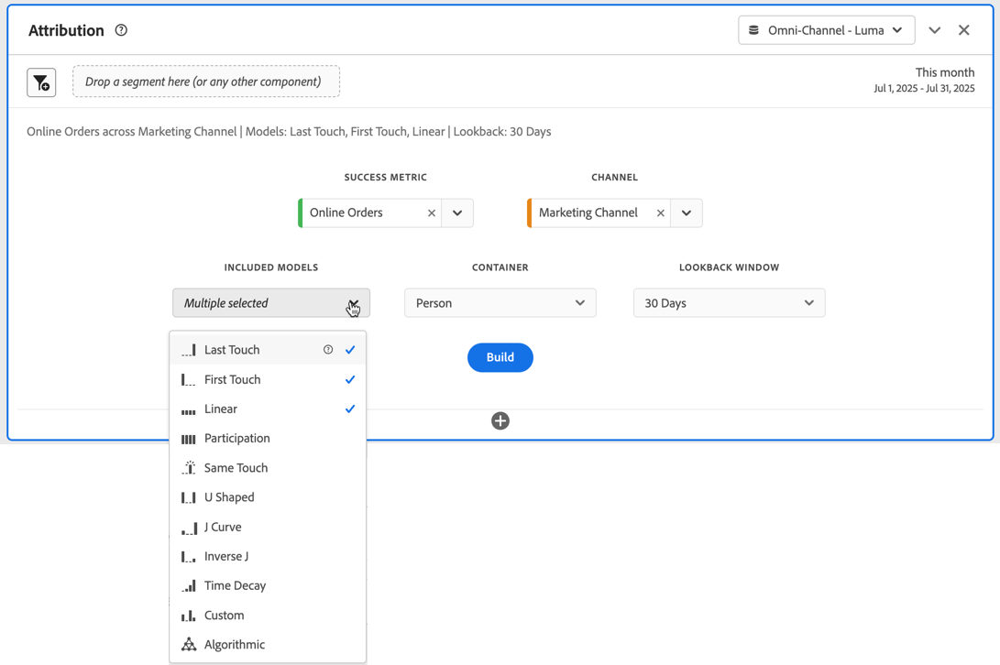

# Panel „Attribution“ {#attribution-panel}

<!-- markdownlint-disable MD034 -->

>[!CONTEXTUALHELP]
>id="workspace_attribution_button"
>title="Attribution"
>abstract="Vergleichen und visualisieren Sie im Handumdrehen eine beliebige Anzahl von Attributionsmodellen für eine Erfolgsmetrik, einen Kanal und das Lookback-Fenster."
>additional-url="https://www.youtube.com/watch?v=Yu0hy2klzA0" text="Attribution IQ-Bedienfeld"

>[!CONTEXTUALHELP]
>id="workspace_attribution_panel"
>title="Panel „Attribution“"
>abstract="Vergleichen und visualisieren Sie im Handumdrehen eine beliebige Anzahl von Attributionsmodellen für eine Erfolgsmetrik. Wählen Sie den Kanal (Dimension), die einzuschließenden Modelle und das Lookback-Fenster aus."
>additional-url="https://www.youtube.com/watch?v=Yu0hy2klzA0" text="Attribution IQ-Bedienfeld"

<!-- markdownlint-enable MD034 -->

>[!BEGINSHADEBOX]

_In diesem Artikel wird das Panel „Attribution“ in_  _**Customer Journey Analytics**_ beschrieben. _Unter [Panel „Attribution“ ](https://experienceleague.adobe.com/de/docs/analytics/analyze/analysis-workspace/panels/attribution) finden Sie die Version dieses Artikels für_  _**Adobe Analytics**._

>[!ENDSHADEBOX]

Das **[!UICONTROL Attributionsbedienfeld]** bietet eine einfache Möglichkeit, eine Analyse zu erstellen, mit der verschiedene Attributionsmodelle verglichen werden. Das Panel bietet Ihnen einen speziellen Arbeitsbereich zum Verwenden und Vergleichen von Attributionsmodellen.

Customer Journey Analytics erweitert die Attribution und ermöglicht Ihnen Folgendes:

* Die Attribution über bezahlte Medien definieren: Dimensionen, Metriken, Kanäle oder Ereignisse können auf Modelle (z. B. die interne Suche) angewendet werden, nicht nur Marketing-Kampagnen.
* Den Vergleich für unbegrenzte Attributionsmodelle verwenden: Vergleichen Sie dynamisch so viele Modelle, wie Sie möchten.
* Implementierungsänderungen vermeiden: Mit der Berichtszeitverarbeitung und kontextabhängigen Sitzungen kann Customer Journey-Kontext erstellt und zur Laufzeit angewendet werden.
* Die Sitzung erstellen, die Ihrem Attributionsszenario am ehesten entspricht.
* Die Attribution nach Segmenten aufschlüsseln: Vergleichen Sie problemlos die Leistung Ihrer Marketing-Kanäle über jedes wichtige Segment hinweg (z. B. Neu- mit Bestandskunden, Produkt X vs. Produkt Y, Treuestufe oder CLV).
* Wechsel zwischen Kanälen und Multi-Touch-Analyse beachten: Verwenden Sie Venn-Diagramme und Histogramme und erstellen Sie Trends anhand von Attributionsergebnissen.
* Wichtige Marketing-Sequenzen visuell analysieren: Erkunden Sie zur Konversion führende Pfade visuell mithilfe von mehrknotigen Fluss- und Fallout-Visualisierungen.
* Berechnete Metriken erstellen: Verwenden Sie eine beliebige Anzahl an Attributionszuordnungsmethoden.

## Verwenden

So verwenden Sie das Panel **[!UICONTROL Attribution]**:

1. Erstellen Sie das Panel **[!UICONTROL Attribution]**. Informationen zum Erstellen eines Bedienfelds finden Sie unter [Erstellen eines Bedienfelds](panels.md#create-a-panel).

1. Legen Sie die [Eingabe](#panel-input) für das Bedienfeld fest.

1. Sehen Sie sich die [Ausgabe](#panel-output) für das Bedienfeld an.

### Panel-Eingabe

Sie können das Panel „Attribution“ mithilfe der folgenden Eingabeeinstellungen konfigurieren:

1. Fügen Sie eine **[!UICONTROL Erfolgsmetrik]** und eine Dimension aus dem **[!UICONTROL Kanal]** für die Attribution hinzu. Beispiele sind Marketing-Kanäle oder benutzerdefinierte Dimensionen wie interne Promotions.

   

1. Wählen Sie ein oder mehrere [Attributionsmodelle](#attribution-models) aus **[!UICONTROL Enthaltene Modelle]** und ein [Lookback-Fenster](#lookback-window) aus dem **[!UICONTROL Lookback-Fenster]** aus, das Sie für den Vergleich verwenden möchten.

1. Wählen Sie **[!UICONTROL Erstellen]** aus, um die Visualisierungen im Panel zu erstellen.

### Panel-Ausgabe

Das Panel **[!UICONTROL Attribution]** gibt einen umfangreichen Satz an Daten und Visualisierungen zurück, die die Attribution für die ausgewählte Dimension und Metrik vergleichen.

### Visualisierungen der Attribution

Die folgenden Visualisierungen sind Teil der Panel-Ausgabe.

* **Summenmetrik**: Die Gesamtzahl der Konversionen, die im Berichtszeitfenster stattgefunden haben und der ausgewählten Dimension zugeordnet wurden.
* **Balkendiagramm für den Vergleich der Metrik-Attribution**: Vergleicht visuell die zugeordneten Konversionen über die einzelnen Dimensionselemente der von Ihren ausgewählten Dimension hinweg. Jede Balkenfarbe stellt ein bestimmtes Attributionsmodell dar.
* **Attributionsvergleichstabelle**: Zeigt dieselben Daten wie das Balkendiagramm in Tabellenform an. Durch die Auswahl verschiedener Spalten oder Zeilen in dieser Tabelle werden das Balkendiagramm sowie mehrere andere Visualisierungen im Bedienfeld segmentiert. Diese Tabelle verhält sich ähnlich wie jede andere Freiformtabelle in Workspace. So können Sie Komponenten wie Metriken, Segmente oder Aufschlüsselungen hinzufügen.
* **Überlagerungsdiagramm**: Eine Venn-Visualisierung, die die drei wichtigsten Dimensionselemente zeigt und wie oft sie gemeinsam an einer Konversion beteiligt sind. Beispielsweise gibt die Größe der Blasenüberlagerung an, wie oft Konversionen auftraten, wenn eine Person beiden Dimensionselementen ausgesetzt war. Durch die Auswahl anderer Zeilen in der angrenzenden Freiformtabelle wird die Visualisierung entsprechend Ihrer Auswahl aktualisiert.
* **Leistungsdetail**: Eine Visualisierung vom Typ „Streuung“ zum visuellen Vergleich von bis zu drei Attributionsmodellen.
* **Trendleistung**: Zeigt den Trend der zugeordneten Konvertierungen für das Element der obersten Dimension. Durch die Auswahl anderer Zeilen in der angrenzenden Freiformtabelle wird die Visualisierung entsprechend Ihrer Auswahl aktualisiert.
* **Fluss**: Hiermit können Sie anzeigen, mit welchen Kanälen am häufigsten interagiert wird und wie sich die Reihenfolge in der Journey einer Person darstellt.

## Attributionsmodelle

{{attribution-models-details}}

## Container

{{attribution-container}}

## Lookback-Fenster

{{attribution-lookback-window}}

## Beispiel

{{attribution-example}}

>[!MORELIKETHIS]
>
> [Erstellen eines Bedienfelds](/help/analysis-workspace/c-panels/panels.md#create-a-panel)
>
