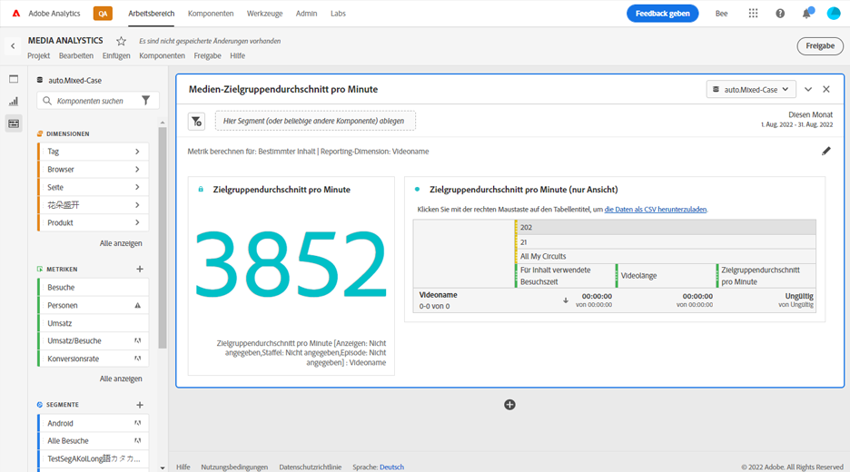

# Bedienfeld „Zielgruppendurchschnitt pro Minute“ {#media-average-minute-audience-panel}

<!-- markdownlint-disable MD034 -->

>[!CONTEXTUALHELP]
>id="workspace_mediaminuteaverageaudience_button"
>title="Medien-Zielgruppendurchschnitt pro Minute"
>abstract="Erstellen Sie ein Panel, um den Zielgruppendurchschnitt pro Minute für bestimmte Inhalte oder über einen bestimmten Zeitraum zu analysieren."

<!-- markdownlint-enable MD034 -->

<!-- markdownlint-disable MD034 -->

>[!CONTEXTUALHELP]
>id="workspace_mediaaverageminuteaudience_panel"
>title="Medien-Zielgruppendurchschnitt pro Minute"
>abstract="Zeigt die Leistung bestimmter Medieninhalte oder die Leistung über einen benutzerdefinierten Zeitraum an. Geben Sie die Reporting-Dimension an und segmentieren Sie optional die Inhalte."

<!-- markdownlint-enable MD034 -->

>[!BEGINSHADEBOX]

_In diesem Artikel wird das Panel Medien-Zielgruppendurchschnitt pro Minute in_  _&#x200B;**Customer Journey Analytics**&#x200B;_ beschrieben. _Unter [Panel Medien-Zielgruppendurchschnitt pro Minute](https://experienceleague.adobe.com/de/docs/analytics/analyze/analysis-workspace/panels/average-minute-audience-panel) finden Sie die Version dieses Artikels für_  _&#x200B;**Adobe Analytics**._

>[!ENDSHADEBOX]

>[!NOTE]
>
>Das Panel **[!UICONTROL Medien-Zielgruppendurchschnitt pro Minute]** ist nur für Kundinnen und Kunden verfügbar, die die Streaming-Mediensammlung für Customer Journey Analytics gekauft haben.
>
>Wenden Sie sich an Ihren Adobe-Vertriebskontakt oder Ihr Adobe-Acountteam, um weitere Informationen zu erhalten.
>

In Analysis Workspace kann der Zielgruppendurchschnitt pro Minute Informationen zu folgenden Themen liefern:

* die mit der Ansicht eines bestimmten Medien-Streams verbrachte Zeit dividiert durch die Dauer des Inhalts oder
* die mit der Ansicht während eines benutzerdefinierten Zeitraums verbrachte Zeit mit ausgewählter Granularität.

Das Panel „Medien-Zielgruppendurchschnitt pro Minute“ ermöglicht es Ihnen, die durchschnittliche Nutzung Ihrer Inhalte zu verstehen, indem Sie Programme beliebiger Länge oder Genres vergleichen. Sie können beispielsweise den durchschnittlichen Konsum erfahren, wenn Sie eine 30-minütige Sitcom mit einem 3-stündigen Sportereignis vergleichen.

Darüber hinaus können Sie das Panel „Medien-Zielgruppendurchschnitt pro Minute“ verwenden, um diesen Zielgruppendurchschnitt pro Minute für digitale Sendungen mit linearen Metriken für TV-Durchschnittsminuten zu vergleichen oder ihn anzuhängen.

Das Panel „Medien-Zielgruppendurchschnitt pro Minute“ bietet gegenüber der Metrik „Zielgruppendurchschnitt pro Minute“ die folgenden Vorteile:

* Unterstützt benutzerdefinierte Zeiträume

* Ermöglicht die Aktualisierung der Klassifizierung der Dauer, nachdem Ansichten verarbeitet wurden (wenn die Klassifizierung der Dauer nicht vorhanden war oder korrigiert werden muss)

  Wenn Sie diese Aktualisierung bei Verwendung der Metrik durchführen, ist die Klassifizierung der Dauer nicht vorhanden (wenn die Klassifizierung nicht vorhanden war). Oder die Klassifizierung der Dauer ist veraltet (wenn die Klassifizierung vorhanden, aber falsch war).

## Verwenden

So verwenden Sie das Panel **[!UICONTROL Medien-Zielgruppendurchschnitt pro Minute]**:

1. Erstellen Sie das Panel **[!UICONTROL Medien-Zielgruppendurchschnitt pro Minute]**. Informationen zum Erstellen eines Bedienfelds finden Sie unter [Erstellen eines Bedienfelds](panels.md#create-a-panel).

1. Stellen Sie sicher, dass Sie eine Datenansicht für das Panel auswählen, in der Komponenten aus der Streaming-Mediensammlung konfiguriert sind.

1. Legen Sie die [Eingabe](#panel-input) für das Bedienfeld fest.

1. Sehen Sie sich die [Ausgabe](#panel-output) für das Bedienfeld an.

### Panel-Eingabe

Verwenden Sie die in diesem Abschnitt beschriebenen Eingabeeinstellungen, um das Panel „Medien-Zielgruppendurchschnitt pro Minute“ zu konfigurieren.

1. Konfigurieren Sie die folgenden Eingabeeinstellungen:

   | Einstellung | Beschreibung |
   |---------|------------|
   | **Datumsbereich des Panels** | Der Datumsbereich des Panels ist standardmäßig [!UICONTROL **Dieser Monat**]. Sie können ihn so verändern, dass Sie einen einzelnen Tag oder viele Monate auf einmal betrachten können.    Diese Visualisierung ist auf 1.440 Datenzeilen beschränkt (z. B. 24 Stunden bei einer Granularität auf Minutenebene). Wenn eine Kombination aus Datumsbereich und Granularität mehr als 1.440 Zeilen zur Folge hat, wird die Granularität automatisch aktualisiert, um den vollständigen Datumsbereich anzuzeigen. |
   | [!UICONTROL **Segment (oder eine beliebige andere Komponente) hier ablegen**] | Wie andere Bedienfelder segmentiert diese Einstellung Ihre Auswahl basierend auf Segmenten, die Sie erstellt haben. Diese Einstellung ist eine hervorragende Möglichkeit, sich bestimmte Plattformen, Livestreams oder andere gängige Mediensegmente anzusehen. |
   | [!UICONTROL **Metrik berechnen für**] | Wählen Sie aus, ob der Zielgruppendurchschnitt pro Minute für [**[!UICONTROL Bestimmter Inhalt]**](#specific-content) angezeigt werden soll. Alternativ können Sie den Zielgruppendurchschnitt pro Minute für einen [**[!UICONTROL benutzerdefinierten Zeitraum]**](#custom-time-period) anzeigen.  Wählen Sie [!UICONTROL **Benutzerdefinierter Zeitraum**] aus: <ul><li>wenn die Dauer nicht verfügbar ist oder </li><li>wenn Sie den Zielgruppendurchschnitt pro Minute für eine Zeitreihe mit mehreren Inhalten anzeigen möchten oder</li><li>für Inhalte, denen keine bestimmte Dauer zugewiesen ist, (z. B. während eines Livestreams oder Ereignisses)</li></ul></li></li></ul> 
Diese Einstellung ändert den Workflow und die Berichtsausgabe.
 |

1. Fahren Sie mit [Bestimmter Inhalt](#specific-content) oder [Benutzerdefinierter Zeitraum](#custom-time-period) fort, je nach der Option, die Sie im Dropdown-Menü [!UICONTROL **Metrik berechnen für**] ausgewählt haben.

#### Bestimmter Inhalt

1. Wenn Sie bei der [Konfiguration der Panel-Eingaben](#panel-inputs) im Dropdown-Menü [!UICONTROL **Metrik berechnen für**] die Option [!UICONTROL **Bestimmter Inhalt**] ausgewählt haben, geben Sie die folgenden Konfigurationsoptionen an:

   | Einstellung | Beschreibung |
   |---------|------------|
   | [!UICONTROL **Reporting-Dimension**] | Wenn Sie einen bestimmten Inhalt auswählen, können Sie für die Berichtsausgabe entweder das Feld für den Videonamen oder die Inhalts-ID verwenden, um den Inhalt und den zugehörigen Zielgruppendurchschnitt pro Minute anzuzeigen. |
   | [!UICONTROL **Content filtern nach (optional)**] | Legen Sie fest, wie der spezifische Inhalt abhängig von der gewünschten Ansicht oder der Struktur Ihrer Daten gefiltert werden soll. <ul>[!UICONTROL **Sendung, Staffel, Folge**]: Zeigt Ihre verfügbaren Sendungen im Dropdown-Menü an, die Sie mithilfe einer Suche filtern können (oder indem Sie den Namen der Sendung per Drag-and-Drop aus der linken Spalte ziehen). Sie können Ihre Auswahl hier beenden, um alle Staffeln Ihrer Sendung zu sehen, oder Sie können nach einzelnen Staffeln und dann nach einzelnen Folgen filtern. Diese Einstellung zeigt die Daten für diese Sendungen, Staffeln oder Folgen für den ausgewählten Zeitraum an.</li><li>[!UICONTROL **Benutzerdefinierte Dimension**]: Wenn sich der Name der Sendung unter einer benutzerdefinierten Dimension befindet, können Sie ihn entweder über die Suche im Dropdown-Menü der Dimension (optional) oder über die Suche in der linken Spalte finden. Das Dimensionselement wird basierend auf dieser Auswahl automatisch ausgefüllt und als Folge behandelt.</li><li>[!UICONTROL **Keine**]: Zeigt alle Videonamen an, für die Daten über den Zielgruppendurchschnitt pro Minute für die von Ihnen gewählte Auswahl vorliegen. (Diese Option ist standardmäßig ausgewählt.)</li></ul> |

1. Fahren Sie mit [Erweiterte Einstellungen für spezifischen Inhalt](#specific-content-advanced-settings) fort, um erweiterte Einstellungen zu konfigurieren.

#### Erweiterte Einstellungen für spezifischen Inhalt

1. Wenn im Dropdown-Menü [!UICONTROL **Metrik berechnen für**] die Option [!UICONTROL **Bestimmter Inhalt**] aktiviert ist, wählen Sie [!UICONTROL **Erweiterte Einstellungen einblenden**] aus und geben Sie dann die folgenden Konfigurationsoptionen an:

   | Optionen | Beschreibung |
   |---------|------------|
   | **[!UICONTROL Tabelleneinstellungen]** | Die Standardoption **[!UICONTROL Berechnungswerte in Tabelle zeigen]** zeigt den Zähler und Nenner des Zielgruppendurchschnitts pro Minute als die vorangehenden Spalten in der Tabelle an. Durch Deaktivieren dieser Option werden diese beiden Spalten entfernt. Die Spalte für den Zielgruppendurchschnitt pro Minute verbleibt in der Tabelle neben dem Videonamen oder der Inhalts-ID. |
   | **[!UICONTROL Besuchszeitmetrik]** | Sie können die Standardoption **[!UICONTROL Für Inhalt verwendete Besuchszeit]** auswählen, die nur die Inhaltszeit umfasst. Sie können auch die Option **[!UICONTROL Mit Medien verbrachte Zeit]** auswählen, die die mit dem Inhalt und den Werbeanzeigen verbrachte Zeit als Zählerberechnung für den Zielgruppendurchschnitt pro Minute enthält. |

1. Wählen Sie [!UICONTROL **Erstellen**], um das Erstellen des Panels Medien-Zielgruppendurchschnitt pro Minute abzuschließen.

1. Fahren Sie mit [Panel-Ausgabe](#panel-output) fort, um Informationen zur Verwendung des Panels Medien-Zielgruppendurchschnitt pro Minute zu erhalten.

#### Benutzerdefinierter Zeitraum

1. Wenn Sie bei der [Konfiguration der Panel-Eingaben](#panel-inputs) im Dropdown-Menü [!UICONTROL **Metrik berechnen für**] die Option [!UICONTROL **Benutzerdefinierter Zeitraum**] ausgewählt haben, geben Sie die folgenden Konfigurationsoptionen an:

   | Optionen | Beschreibung |
   |---------|------------|
   | **[!UICONTROL Granularität]** | Die Standardgranularität beträgt [!UICONTROL **5 Minuten**]. Sie können jedoch eine beliebige andere Granularität auswählen, die als Nenner für die Zeitreihe innerhalb Ihres ausgewählten Zeitraums verwendet wird. Wenn Sie beispielsweise 12:00 Uhr bis 12:30 Uhr mit einer Granularität von 5 Minuten auswählen, erhalten Sie den Zielgruppendurchschnitt pro Minute über die gesamte halbe Stunde sowie sechs Zeilen mit dem Zielgruppendurchschnitt pro Minute für jeden 5-minütigen Zeitraum. Diese Zeilen werden als Datenpunkte für das Zeitreihendiagramm verwendet. |
   | [!UICONTROL **Content filtern nach (optional)**] | Legen Sie fest, wie der spezifische Inhalt abhängig von der gewünschten Ansicht oder der Struktur Ihrer Daten gefiltert werden soll. <ul>[!UICONTROL **Sendung, Staffel, Folge**]: Zeigt Ihre verfügbaren Sendungen im Dropdown-Menü an, die Sie mithilfe einer Suche filtern können (oder indem Sie den Namen der Sendung per Drag-and-Drop aus der linken Spalte ziehen). Sie können Ihre Auswahl hier beenden, um alle Staffeln Ihrer Sendung zu sehen, oder Sie können nach einzelnen Staffeln und dann nach einzelnen Folgen filtern. Diese Einstellung zeigt die Daten für diese Sendungen, Staffeln oder Folgen für den ausgewählten Zeitraum an.</li><li>[!UICONTROL **Benutzerdefinierte Dimension**]: Wenn sich der Name der Sendung unter einer benutzerdefinierten Dimension befindet, können Sie ihn entweder über die Suche im Dimensionsmenü (optional) oder über die Suche in der linken Spalte finden. Das Dimensionselement wird basierend auf dieser Auswahl automatisch ausgefüllt und als Folge behandelt.</li><li>[!UICONTROL **Keine**]: Zeigt alle Videonamen an, für die Daten über den Zielgruppendurchschnitt pro Minute für die von Ihnen gewählte Auswahl vorliegen. (Diese Option ist standardmäßig ausgewählt.)</li></ul> |

1. Fahren Sie mit [Erweiterte Einstellungen für benutzerdefinierten Zeitraum](#custom-time-period-advanced-settings) fort, um erweiterte Einstellungen zu konfigurieren.

#### Erweiterte Einstellungen für benutzerdefinierte Zeiträume

1. Wenn [!UICONTROL **Benutzerdefinierter Zeitraum**] im Dropdown-Menü [!UICONTROL **Metrik berechnen für**] ausgewählt ist, wählen Sie [!UICONTROL **Erweiterte Einstellungen einblenden**] aus und geben Sie dann die folgenden Konfigurationsoptionen an:

   | Option | Beschreibung |
   |---------|------------|
   | **[!UICONTROL Tabelleneinstellungen]** | Die Standardeinstellung zeigt die Berechnungswerte in der Tabelle an, die den Zähler und Nenner des Zielgruppendurchschnitts pro Minute als die vorangehenden Spalten in der Tabelle anzeigt. Wenn Sie diese Option deaktivieren, werden die beiden Spalten entfernt, sodass neben dem Zeitraum nur der Zielgruppendurchschnitt pro Minute verbleibt. |

1. Wählen Sie [!UICONTROL **Erstellen**], um das Erstellen des Panels Medien-Zielgruppendurchschnitt pro Minute abzuschließen.

1. Fahren Sie mit [Panel-Ausgabe](#panel-output) fort, um Informationen zur Verwendung des Panels Medien-Zielgruppendurchschnitt pro Minute zu erhalten.

### Panel-Ausgabe

Die Panel-Ausgabe variiert je nachdem, ob Sie bei der [Konfiguration der Panel-Eingaben](#panel-inputs) im Dropdown-Menü [!UICONTROL **Metrik berechnen für**] die Option [!UICONTROL **Bestimmter Inhalt**] oder [!UICONTROL **Benutzerdefinierter Zeitraum**] ausgewählt haben.

#### Bestimmter Inhalt

Das Panel „Medien-Zielgruppendurchschnitt pro Minute“ gibt Folgendes zurück:

* Gesamtwert des Zielgruppendurchschnitts pro Minute für Ihre gesamte Auswahl
* Filter und Zielgruppendurchschnitt pro Minute für die einzelnen Videos, die in einer Tabelle angezeigt werden
* Mit dem Inhalt verbrachte Zeit und Videolänge (Dauer), wenn diese erweiterte Einstellung ausgewählt wurde

Sie können das Panel jederzeit bearbeiten und neu erstellen. Wählen Sie dazu oben rechts  aus.

#### Bestimmte Inhaltsdatenquelle

Das Panel „Medien-Zielgruppendurchschnitt pro Minute“ verwendet nur die Metrik „Zielgruppendurchschnitt pro Minute“, um Daten zu erfassen. Aufschlüsselungen oder andere Metriken können nicht im Panel verwendet werden.

| Metrik | Beschreibung |
|--------|-------------|
| **[!UICONTROL Zielgruppendurchschnitt pro Minute]** | Die Zeit, die mit der Ansicht Ihres Medien-Streams verbracht wurde, dividiert durch die Videolänge (Dauer), die über Classifications bereitgestellt wird. |

#### Benutzerdefinierter Zeitraum {#custom-time-period-output}

Das Panel „Medien-Zielgruppendurchschnitt pro Minute“ gibt Folgendes zurück:

* Den Gesamtwert des Zielgruppendurchschnitts pro Minute für Ihre gesamte Auswahl

* Den maximalen und minimalen Zielgruppendurchschnitt pro Minute

* Das Linienreihendiagramm, das den Zielgruppendurchschnitt pro Minute für die gesamte Auswahl anzeigt.

* Eine Tabelle mit den Filtern und dem Zielgruppendurchschnitt pro Minute für die Granularitäten sowie die mit dem Inhalt verbrachte Zeit und die Granularität für jeden Zeitraum

  Diese Tabelle wird nur angezeigt, wenn die Option unter Erweiterte Einstellungen namens [!UICONTROL **Berechnungswerte in Tabelle anzeigen**] ausgewählt ist.

Sie können das Panel jederzeit bearbeiten und neu erstellen. Wählen Sie dazu oben rechts  aus.

#### Datenquelle für den benutzerdefinierten Zeitraum

Das Panel „Medien-Zielgruppendurchschnitt pro Minute“ verwendet nur die Metrik „Zielgruppendurchschnitt pro Minute“, um Daten zu erfassen. Aufschlüsselungen oder andere Metriken können nicht im Panel verwendet werden.

| Metrik | Beschreibung |
|---|---|
| **[!UICONTROL Zielgruppendurchschnitt pro Minute]** | Die mit der Ansicht Ihres Medien-Streams verbrachte Zeit dividiert durch die Gesamtauswahl oder die ausgewählte Granularität in Minuten. |

>[!MORELIKETHIS]
>
> [Erstellen eines Bedienfelds](/help/analysis-workspace/c-panels/panels.md#create-a-panel)
> &#x200B;> [Panel Gleichzeitige Medienbetrachter](media-concurrent-viewers.md)
> &#x200B;> [Panel Verbrachte Zeit bei der Medienwiedergabe](media-playback-time-spent.md)
>