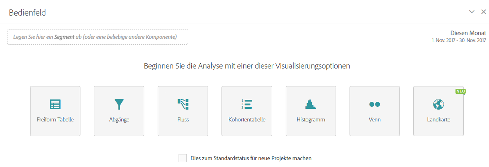

# Leeres Bedienfeld

In einem leeren Bedienfeld werden alle Visualisierungen hervorgehoben, die Sie innerhalb eines Bedienfelds erstellen können, einschließlich Freiformtabelle, Zuordnung, Fallout, Fluss, Histogramm, Kohorte und Venn. Sie können das leere Bedienfeld auch anstelle des Freiform-Bedienfelds standardmäßig für den Projektbeginn auswählen.

