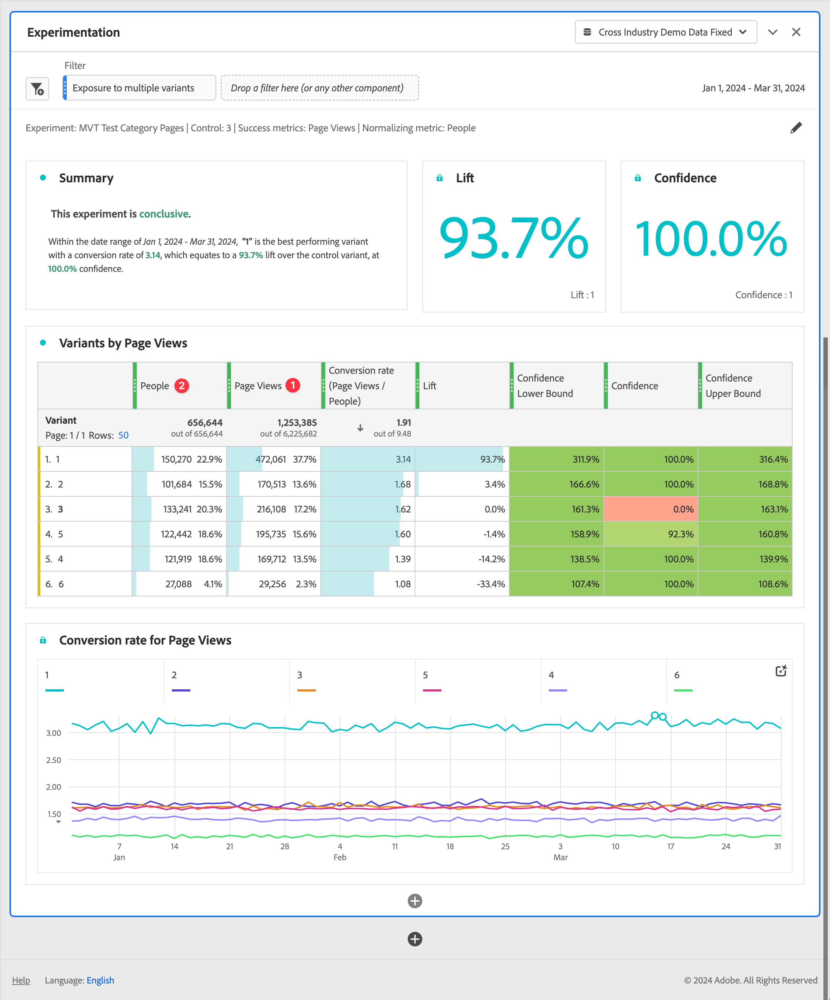

# Experimentier-Bedienfeld {#experimentation-panel}

<!-- markdownlint-disable MD034 -->

>[!CONTEXTUALHELP]
>id="workspace_experimentation_button"
>title="Experimentieren"
>abstract="Erstellen Sie ein Bedienfeld, um verschiedene Anwendererlebnisse bzw. Marketing- oder Messaging-Varianten zu vergleichen. Außerdem können Sie dadurch feststellen, welche Variante die beste Lösung für ein bestimmtes Ergebnis ist."

<!-- markdownlint-enable MD034 -->

<!-- markdownlint-disable MD034 -->

>[!CONTEXTUALHELP]
>id="workspace_experimentation_panel"
>title="Experimentieren"
>abstract="Vergleichen Sie verschiedene Benutzererlebnisse, Marketing- oder Messaging-Variationen, um zu bestimmen, welche am besten geeignet ist, um ein bestimmtes Ergebnis zu erzielen. Geben Sie das Experiment, die zu vergleichende Kontrollvariante, die Erfolgsmetrik und die Normalisierungsmetrik an. Legen Sie optional Ober- und Untergrenzen für die Konfidenz fest."

<!-- markdownlint-enable MD034 -->

>[!BEGINSHADEBOX]

_In diesem Artikel wird das Experimentier-Bedienfeld in {_} _**Customer Journey Analytics**._ _Siehe [Bedienfeld „Analytics for Target](https://experienceleague.adobe.com/en/docs/analytics/analyze/analysis-workspace/panels/a4t-panel) für Informationen zur Analyse von Adobe Target-Aktivitäten und -Erlebnissen_ _**Adobe Analytics**._

>[!ENDSHADEBOX]

Im Bedienfeld **[!UICONTROL Experimentieren]** können Analysten verschiedene Benutzererlebnisse, Marketing- oder Messaging-Variationen vergleichen, um zu ermitteln, welche am besten geeignet ist, um ein bestimmtes Ergebnis zu erzielen. Sie können den Anstieg und die Konfidenz von A/B-Experimenten von jeder beliebigen Experimentierplattform aus bewerten: online, offline, aus Adobe-Lösungen wie Target oder Journey Optimizer und sogar aus BYO-Daten (bring-your-own).

Lesen Sie mehr über die [Integration zwischen Adobe Customer Journey Analytics und Adobe Target](https://experienceleague.adobe.com/de/docs/target/using/integrate/cja/target-reporting-in-cja).

## Zugangssteuerung {#access}

Das Bedienfeld „Experimentieren“ kann von allen Customer Journey Analytics-Benutzern verwendet werden. Es sind keine Administratorrechte oder anderen Berechtigungen erforderlich. Die Voraussetzungen erfordern jedoch Aktionen, die nur Admins ausführen können.

## Funktionen in berechneten Metriken

Zwei erweiterte Funktionen sind verfügbar: Anstieg und Konfidenz. Weitere Informationen finden Sie unter [Referenz – Erweiterte Funktionen](/help/components/calc-metrics/cm-adv-functions.md).

## Voraussetzungen

Um das Experimentier-Bedienfeld zu verwenden, müssen Sie die folgenden Voraussetzungen erfüllen:

### Erstellen einer Verbindung zu Experiment-Datensätzen

Laut dem empfohlenen Datenschema sollten die Experimentdaten in einem -Objekt[Array gespeichert sein, ](https://experienceleague.adobe.com/en/docs/experience-platform/xdm/ui/fields/array) die Experiment- und Variantendaten in zwei separaten Dimensionen enthält. Beide Dimensionen müssen sich in einem **einzelnen** Objekt-Array befinden. Wenn sich Ihre Experimentierdaten in einer einzigen Dimension befinden (mit Experiment- und Variantendaten in einer begrenzten Zeichenfolge), können Sie die Einstellung [Teilzeichenfolge](/help/data-views/component-settings/substring.md) in Datenansichten verwenden, um die Dimension zur Verwendung im Bereich in zwei zu teilen.

Nachdem Ihre Experimentierdaten in Adobe Experience Platform [aufgenommen](https://experienceleague.adobe.com/en/docs/experience-platform/ingestion/home) erstellt [eine Verbindung in Customer Journey Analytics](/help/connections/create-connection.md) zu einem oder mehreren Experimentierdatensätzen.

### Hinzufügen von Kontextbeschriftungen in Datenansichten

In den Einstellungen für Datenansichten in Customer Journey Analytics können Administratoren [Kontextbeschriftungen](/help/data-views/component-settings/overview.md) zu einer Dimension oder Metrik hinzufügen, und Customer Journey Analytics-Services wie das Bedienfeld [!UICONTROL Experimentieren] können diese Beschriftungen für ihre Zwecke verwenden. Für das Bedienfeld „Experimentieren“ werden zwei vordefinierte Beschriftungen verwendet:

* [!UICONTROL Experimentierexperiment]
* [!UICONTROL Experimentiervariante]

Wählen Sie in Ihrer Datenansicht, die Experimentierdaten enthält, zwei Dimensionen aus: eine mit den Experimentierdaten und eine mit den Variantendaten. Geben Sie diesen Dimensionen dann die Beschriftungen **[!UICONTROL Experimentierexperiment]** und **[!UICONTROL Experimentiervariante]**.

Ohne diese Beschriftungen funktioniert das Bedienfeld „Experiment“ nicht, da keine Experimente vorhanden sind, mit denen gearbeitet werden kann.

## Verwenden

So verwenden Sie ein **[!UICONTROL Experimentier]** Bedienfeld:

1. Erstellen Sie ein **[!UICONTROL Experimentier]** Bedienfeld. Informationen zum Erstellen eines Bedienfelds finden Sie unter [Erstellen eines Bedienfelds](panels.md#create-a-panel).

1. Legen Sie die [Eingabe](#panel-input) für das Bedienfeld fest.

1. Sehen Sie sich die [Ausgabe](#panel-output) für das Bedienfeld an.

   >[!IMPORTANT]
   >
   >Wenn die erforderliche Einrichtung in Customer Journey Analytics-Datenansichten nicht abgeschlossen wurde, erhalten Sie diese Nachricht, bevor Sie fortfahren können: [!UICONTROL Konfigurieren Sie die Experiment- und Variantendimensionen in Datenansichten].
   >

### Bedienfeldeingabe

So verwenden Sie das Bedienfeld „Experimentieren“:

1. Konfigurieren Sie die Einstellungen für die Bedienfeldeingabe:

   

   | Einstellung | Definition |
   | --- | --- |
   | **[!UICONTROL Datumsbereich]** | Der Datumsbereich für das Bedienfeld Experimentieren wird automatisch auf der Grundlage des ersten Ereignisses festgelegt, das für das ausgewählte Experiment in Customer Journey Analytics empfangen wurde. Sie können den Datumsbereich bei Bedarf auf einen spezifischeren Zeitraum beschränken oder erweitern. |
   | **[!UICONTROL Experiment]** | Eine Reihe von Varianten eines Erlebnisses, die Endbenutzern präsentiert wurden, um zu bestimmen, welche am besten dauerhaft beibehalten werden sollte. Ein Experiment besteht aus zwei oder mehr Varianten, von denen eine als Kontrollvariante gilt. Diese Einstellung wird vorab mit den Dimensionen gefüllt, die in den Datenansichten mit der Beschriftung **[!UICONTROL Experiment]** gekennzeichnet wurden, sowie mit den Experimentdaten der letzten drei Monate. |
   | **[!UICONTROL Kontrollvariante]** | Eine von zwei oder mehr Änderungen im Erlebnis eines Endbenutzers, die verglichen werden, um die bessere Alternative zu ermitteln. Eine Variante muss als Kontrolle ausgewählt werden und nur eine Variante kann als Kontrollvariante betrachtet werden. Diese Einstellung wird vorab mit den Dimensionen gefüllt, die in den Datenansichten mit der Beschriftung **[!UICONTROL Variante]** gekennzeichnet wurden. Mit dieser Einstellung werden die Variantendaten abgerufen, die mit diesem Experiment verknüpft sind. |
   | **[!UICONTROL Erfolgsmetriken]** | Die Metrik(en), die ein Anwender verwendet, um Varianten zu vergleichen. Die Variante mit dem wünschenswertesten Ergebnis für die Konversionsmetrik (egal ob am höchsten oder am niedrigsten) wird zur *Variante mit der besten Performance* eines Experiments erklärt. Sie können bis zu 5 Metriken hinzufügen. |
   | **[!UICONTROL Normalisierungsmetrik]** | Die Grundlage ([!UICONTROL Personen], [!UICONTROL Sitzungen] oder [!UICONTROL Ereignisse]) für die Ausführung eines Tests. Beispielsweise kann ein Test die Konversionsraten verschiedener Varianten vergleichen, bei denen **[!UICONTROL Konversionsrate]** als Seitenansicht berechnet wird |
   | **[!UICONTROL Obere/Untere Konfidenzgrenzen einschließen]** | Aktivieren Sie diese Option, um Ober- und Untergrenzen für Konfidenzstufen anzuzeigen. |

1. Wählen Sie **[!UICONTROL Erstellen]** aus.

### Bedienfeldausgabe

Das Bedienfeld „Experimentieren“ liefert umfangreiche Daten und Visualisierungen, die Ihnen helfen, die Performance Ihrer Experimente besser zu verstehen. Oben im Bedienfeld werden Visualisierungen [Zusammenfassungsänderung](../visualizations/summary-number-change.md) bereitgestellt, um Sie an die von Ihnen ausgewählten Bedienfeldeinstellungen zu erinnern. Sie können das Bedienfeld jederzeit bearbeiten, indem Sie oben rechts auf den Stift zum Bearbeiten klicken.

Sie erhalten auch eine Textzusammenfassung, die anzeigt, ob das Experiment schlüssig ist oder nicht, und die das Ergebnis zusammenfasst. Das Fazit basiert auf der statistischen Signifikanz (siehe [Statistische Methodik](#adobes-statistical-methodology).) Sie können Zusammenfassungszahlen für die Variante mit der besten Performance mit dem höchsten Anstieg und der höchsten Konfidenz anzeigen.

Für jede ausgewählte Erfolgsmetrik werden eine [Freiformtabellen](../visualizations/freeform-table/freeform-table.md)-Visualisierung und eine [-Visualisierung ](../visualizations/line.md).

>[!NOTE]
>
>Die Analyse von A/A-Tests wird aktuell von diesem Bedienfeld nicht unterstützt.

#### Interpretieren der Ergebnisse

1. **Experiment ist schlüssig**: Jedes Mal, wenn Sie den Experimentbericht anzeigen, werden die Daten analysiert, die bis zu diesem Zeitpunkt im Experiment gesammelt wurden. Die Analyse erklärt ein Experiment als schlüssig, wenn die *jederzeit* gültige Konfidenz einen Schwellenwert von 95 % für *mindestens eine* der Varianten überschreitet. Bei mehr als zwei Armen wird eine Benjamini-Hochberg-Korrektur angewendet, um Mehrfach-Hypothesentests zu korrigieren.

2. **Variante mit der** Performance: Wenn ein Experiment als endgültig deklariert wird, wird die Variante mit der höchsten Konversionsrate als Variante mit der besten Performance gekennzeichnet. Beachten Sie, dass diese Variante entweder die Kontroll- oder Baseline-Variante sein muss oder eine der Varianten, die die 95 %-*(jederzeit* gültige Konfidenzschwelle überschreiten (mit Benjamini-Hochberg-Korrekturen).

3. **Konversionsrate**: Die angezeigte Konversionsrate ist ein Verhältnis zwischen dem Wert der Erfolgsmetrik und dem Wert der Normalisierungsmetrik &quot;&quot;. Dieser Wert kann größer als 1 sein, wenn die Metrik nicht binär ist (1 oder 0 für jede Einheit im Experiment)

4. **Anstieg**: Die Zusammenfassung des Experimentberichts zeigt den Anstieg im Vergleich zur Baseline und ist somit ein Messwert für die prozentuale Verbesserung der Konversionsrate einer bestimmten Variante gegenüber der Baseline. Genau bestimmt ist dies der Performance-Unterschied zwischen einer bestimmten Variante und der Baseline, geteilt durch die Performance der Baseline und ausgedrückt in Prozent.

5. **Konfidenz**: Die angezeigte „immer gültige Konfidenz“ ist ein wahrscheinlicher Messwert dafür, wie viele Nachweise dafür vorliegen, dass eine bestimmte Variante der Kontrollvariante entspricht. Eine höhere Konfidenz deutet auf weniger Nachweise hin, die die Annahme stützen, dass die Kontroll- und Nicht-Kontrollvariante die gleiche Performance aufweisen. Die Konfidenz ist eine Wahrscheinlichkeit (ausgedrückt als Prozentsatz), mit der Sie einen kleineren Unterschied bei den Konversionsraten zwischen einer bestimmten Variante und dem Kontrollerlebnis beobachtet hätten. Während es in Wirklichkeit keinen Unterschied bei den tatsächlichen zugrunde liegenden Konversionsraten gibt. Im Hinblick auf *p*-Werte ist die angezeigte Konfidenz 1 - *p*-Wert.

>[!NOTE]
>
>Bei einer vollständigen Beschreibung der Ergebnisse sollten alle verfügbaren Nachweise berücksichtigt werden (z. B. Experimentaufbau, Stichprobengrößen, Konversionsraten, Konfidenz und andere) und nicht nur, ob das Experiment als endgültig deklariert wurde oder nicht. Selbst wenn ein Ergebnis noch nicht endgültig ist, können überzeugende Beweise dafür vorliegen, dass sich eine Variante von einer anderen unterscheidet (z. B. wenn sich Konfidenzintervalle nahezu nicht überlappen). Idealerweise sollten alle statistischen Daten, die auf einem kontinuierlichen Spektrum interpretiert werden, in die Entscheidungsfindung einfließen.

## Statistische Methodik von Adobe {#statistics}

Um leicht verständliche und sichere statistische Rückschlüsse zu ermöglichen, hat Adobe eine statistische Methodik eingeführt, die auf [Immer gültige Konfidenzsequenzen](https://arxiv.org/abs/2103.06476) basiert.

Eine Konfidenzsequenz ist ein *sequenzielles* Analogon eines Konfidenzintervalls. Um zu verstehen, was eine Konfidenzsequenz ist, stellen Sie sich vor, Sie wiederholen Ihre Experimente hundertmal. Und berechnen Sie eine Schätzung der durchschnittlichen Geschäftsmetrik (z. B. die Öffnungsrate einer E-Mail) und der zugehörigen 95-%-Konfidenzsequenz für *jeden neuen Benutzer* der zum Experiment hinzukommt.

Eine Konfidenzsequenz von 95 % enthält in 95 der 100 Experimente, die Sie durchgeführt haben, den Wert „true“ der Geschäftsmetrik. (Ein 95-%-Konfidenzintervall kann nur einmal pro Experiment berechnet werden, um dieselbe 95-%-Garantie zu erhalten; nicht für jeden einzelnen neuen Benutzer). Konfidenzsequenzen ermöglichen es Ihnen daher, Experimente kontinuierlich zu überwachen, ohne die Falsch-Positiv-Fehlerrate zu erhöhen, d. h. sie ermöglichen einen Einblick in die Ergebnisse.

## Interpretieren nicht-randomisierter Dimensionen {#non-randomized}

Mit Customer Journey Analytics können Analysten eine beliebige Dimension als Experiment auswählen. Aber wie interpretiert man eine Analyse, bei der die als Experiment gewählte Dimension nicht diejenige ist, für die die Personen randomisiert werden?

Betrachten Sie beispielsweise eine Anzeige, die eine Person sieht. Es könnte für Sie interessant sein, die Änderung an einer Metrik zu messen (z. B. durchschnittlicher Umsatz), wenn Sie Personen *Anzeige B* anstelle von *Anzeige A* anzeigen. Die Kausalwirkung der Anzeige von AD B anstelle von AD A ist für die Entscheidung über das Inverkehrbringen von zentraler Bedeutung. Dieser kausale Effekt kann als durchschnittlicher Umsatz über die gesamte Population gemessen werden, wenn Sie den Status quo der Anzeige von Anzeige A durch die alternative Strategie der Anzeige von Anzeige B ersetzt haben.

A/B-Tests sind in der Branche der Goldstandard für die objektive Messung der Auswirkungen solcher Interventionen. Der entscheidende Grund, warum ein A/B-Test zu einer kausalen Schätzung führt, liegt in der Randomisierung der Personen, die eine der möglichen Varianten erhalten sollen.

Betrachten wir nun eine Dimension, die durch Randomisierung nicht erreicht wird, zum Beispiel den US-Bundesstaat der Person. Die Menschen kommen hauptsächlich aus zwei Bundesstaaten, New York und Kalifornien. Der durchschnittliche Umsatz mit dem Verkauf einer Winterkleidungsmarke kann in den beiden Bundesstaaten aufgrund der Unterschiede im regionalen Wetter unterschiedlich sein. In einer solchen Situation kann das Wetter der wahre Kausalfaktor für den Verkauf von Winterkleidung sein und nicht die Tatsache, dass die geografischen Zustände von Personen unterschiedlich sind.

Im Experimentier-Bedienfeld in Customer Journey Analytics können Sie Daten als durchschnittliche Umsatzdifferenz nach Status der Personen analysieren. In einer solchen Situation hat die Ausgabe keine kausale Interpretation. Eine solche Analyse kann jedoch weiterhin von Interesse sein. Er enthält eine Schätzung (zusammen mit Messgrößen für die Unsicherheit) der Differenz der durchschnittlichen Einnahmen der einzelnen Staaten.  Dieser Wert wird auch als &quot;*Hypothesentest“*. Die Ergebnisse dieser Analyse können interessant sein, müssen aber nicht unbedingt umsetzbar sein. Einfach deshalb, weil Sie Personen nicht randomisiert haben und manchmal auch nicht auf einen der möglichen Werte der Dimension randomisieren können.

Die folgende Abbildung stellt diese Situationen gegenüber:

Wenn Sie die Auswirkung von Intervention X auf Ergebnis Y messen möchten, ist es möglich, dass die wahre Ursache für beide der Störfaktor C ist. Wenn die Daten nicht durch die Randomisierung von Personen auf X erreicht werden, ist die Auswirkung schwieriger zu messen, und die Analyse berücksichtigt explizit C. Die Randomisierung beseitigt die Abhängigkeit von X auf C, sodass wir die Wirkung von X auf Y messen können, ohne uns über andere Variablen Gedanken machen zu müssen.

## Verwenden von berechneten Metriken in Experimenten {#use-in-experimentation}

>[!NOTE]
>
>Für Unternehmen, die sowohl Customer Journey Analytics als auch Adobe Journey Optimizer verwenden, gelten die Informationen in diesem Abschnitt auch für Experimentierfunktionen in Journey Optimizer.

Nicht alle berechneten Metriken sind mit dem Bedienfeld Experimentieren kompatibel.

Berechnete Metriken, die eine der folgenden Metriken oder Konstanten enthalten, sind nicht mit dem Bedienfeld Experimentieren kompatibel:

* Basismetriken aus einem [Zusammenfassungsdatensatz](https://experienceleague.adobe.com/en/docs/analytics-platform/using/cja-dataviews/summary-data)
* Basismetriken, die untereinander aufgeteilt oder miteinander multipliziert werden (z. B. `Revenue`/`Orders`)
* Konstanten, die zu einer Basismetrik hinzugefügt oder von ihr subtrahiert werden (z. B. `Revenue+50`)
* Eine der folgenden Basismetriken:
   * Personen

Customer Journey Analytics Berechnete Metriken, die nicht mit dem Bedienfeld „Experimentieren“ kompatibel sind, haben bei [!UICONTROL **Erstellung der berechneten Metrik den Wert Überall in (ohne Experimentieren**] im Feld [!UICONTROL **Produktkompatibilität**] . Informationen zum Erstellen einer berechneten Metrik finden Sie unter [Metriken erstellen](/help/components/calc-metrics/cm-workflow/cm-build-metrics.md).

## Verwenden von berechneten Metriken im Bedienfeld „Experimentieren“

In diesem Blogpost erhalten Sie Informationen zur [Verwendung berechneter Metriken im Bedienfeld „Experimentieren](https://experienceleaguecommunities.adobe.com/t5/adobe-analytics-blogs/using-derived-metrics-in-cja-s-experimentation-panel/ba-p/593119).

>[!MORELIKETHIS]
>[Beherrschen von Adobe Customer Journey Analytics-Experimenten](https://experienceleaguecommunities.adobe.com/t5/adobe-analytics-blogs/mastering-adobe-customer-journey-analytics-experimentation-your/ba-p/732338)
>
