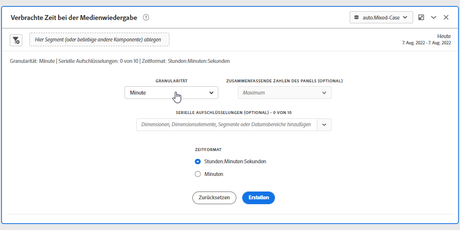
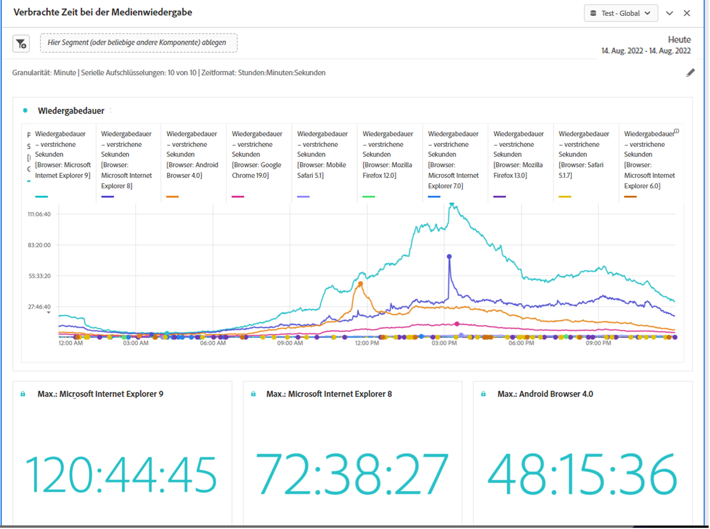

# Panel „Bei der Medienwiedergabe verbrachte Zeit“ {#media-playback-time-spent-panel}

<!-- markdownlint-disable MD034 -->

>[!CONTEXTUALHELP]
>id="workspace_mediaplaybacktimespent_button"
>title="Bei der Medienwiedergabe verbrachte Zeit"
>abstract="Erstellen Sie ein Bedienfeld, um den Videokonsum im Zeitverlauf mit verschiedenen Granularitätsebenen analysieren sowie Aufschlüsselungen und Vergleiche durchführen zu können."

<!-- markdownlint-enable MD034 -->

<!-- markdownlint-disable MD034 -->

>[!CONTEXTUALHELP]
>id="workspace_mediaplaybacktimespent_panel"
>title="Bei der Medienwiedergabe verbrachte Zeit"
>abstract="Analysieren Sie den Videokonsum im Zeitverlauf, wählen Sie verschiedene Granularitäten aus, schlüsseln Sie die Daten auf und vergleichen Sie sie.  **Granularität**: Wählen Sie aus, nach welchem Zeitraum gleichzeitige Betrachtende angezeigt werden sollen. **Zusammenfassende Zahlen der Bedienfelder (optional)**: Wählen Sie diese Option aus, um für jede Zeile zusammenfassende Zahlen mit Datums- oder Uhrzeitangaben anzuzeigen. „Maximum“ zeigt Details für die maximale Wiedergabedauer an. „Minimum“ zeigt Details für die minimale Wiedergabedauer an. „Summe“ zeigt Details zur Gesamtwiedergabedauer an. **Serienaufschlüsselung (optional)**: Schlüsseln Sie Visualisierungen nach Segmenten, Dimensionen, Dimensionselementen oder Datumsbereichen auf. Sie können jeweils bis zu 10 Zeilen anzeigen. Aufschlüsselungen sind auf eine einzelne Ebene beschränkt. **Zeitformat**: Wählen Sie diese Option aus, um das Zeitformat für Visualisierungen in Stunden oder Minuten anzuzeigen."

<!-- markdownlint-enable MD034 -->

>[!NOTE]
>
>Das Bedienfeld „Medien-Zielgruppendurchschnitt pro Minute“ ist nur für Kunden verfügbar, die das Add-on „Streaming Media Collection“ zum Customer Journey Analytics erworben haben.
>Weitere Informationen erhalten Sie von Ihrem Adobe-Kundenbetreuer oder Ihrem Adobe-Account-Team.
>

Das Bedienfeld **[!UICONTROL Bei Medienwiedergabe verbrachte Zeit]** ermöglicht die Analyse der Wiedergabe im Zeitverlauf, mit Details zu Spitzenzeiten, in denen gleichzeitige Aufrufe stattfanden, und der Möglichkeit, diese aufzuschlüsseln und zu vergleichen.

In Analysis Workspace bezeichnet die Wiedergabedauer die Zeit, die mit der Anzeige Ihrer Medien-Streams zu einem bestimmten Zeitpunkt verbracht wurde. Dazu gehören Pausen, Pufferung und die Zeit bis zum Start.

Kunden, die das Add-on zur Streaming-Mediensammlung erworben haben, können die Wiedergabedauer analysieren, um wertvolle Einblicke in die Qualität von Inhalten und die Interaktion mit Betrachtern zu erhalten. Und als Hilfe bei der Fehlerbehebung oder Planung von Volumen oder Skalierung.

Die Wiedergabedauer kann Ihnen dabei helfen, Folgendes zu verstehen:

* Wo Spitzenzeiten bei gleichzeitigen Ansichten auftraten.

* Wo es zu Abbrüchen kam.

+++ Sehen Sie sich eine Videodemonstration dieser Funktion an.

>[!VIDEO](https://video.tv.adobe.com/v/338699)

+++

## Verwenden

So verwenden Sie ein Bedienfeld **[!UICONTROL Mit Medienwiedergabe verbrachte Zeit]**:

1. Erstellen Sie ein Bedienfeld **[!UICONTROL Mit Medienwiedergabe verbrachte Zeit]**. Informationen zum Erstellen eines Bedienfelds finden Sie unter [Erstellen eines Bedienfelds](panels.md#create-a-panel).

1. Stellen Sie sicher, dass Sie eine Datenansicht für das Bedienfeld auswählen, in dem Komponenten vom Add-on Streaming Media Collection konfiguriert sind.

1. Legen Sie die [Eingabe](#panel-input) für das Bedienfeld fest.

1. Sehen Sie sich die [Ausgabe](#panel-output) für das Bedienfeld an.

### Bedienfeldeingabe

Sie können das Panel „Verbrachte Zeit bei der Medienwiedergabe“ mithilfe der folgenden Eingabeeinstellungen konfigurieren:

| Einstellung | Beschreibung |
|---|---|
| Datumsbereich der Bedienfelder | Der Datumsbereich des Panels ist standardmäßig „Heute“. Sie können ihn so verändern, dass Sie einen einzelnen Tag oder viele Monate auf einmal betrachten können. Diese Visualisierung ist auf 1440 Datenzeilen beschränkt (z. B. 24 Stunden bei einer Granularität auf Minutenebene). Wenn eine Kombination aus Datumsbereich und Granularität zu mehr als 1440 Zeilen führt, wird die Granularität automatisch reduziert, um den vollständigen Datumsbereich zu erlauben. |
| Granularität | Die Standardeinstellung für die Granularität ist „Minute“. Diese Visualisierung ist auf 1440 Datenzeilen beschränkt (z. B. 24 Stunden bei einer Granularität auf Minutenebene). Wenn eine Kombination aus Datumsbereich und Granularität zu mehr als 1440 Zeilen führt, wird die Granularität automatisch reduziert, um den vollständigen Datumsbereich zu erlauben. |
| Zusammenfassende Zahlen der Bedienfelder | Um Details zu Datum und Uhrzeit für die verbrachte Zeit bei der Medienwiedergabe anzuzeigen, steht eine zusammenfassende Zahl zur Verfügung. Das Maximum zeigt Details zu Spitzenzeiten von gleichzeitigen Aufrufen an. Das Minimum zeigt Details zum Tiefpunkt an. In der Summe wird die gesamte Wiedergabezeit für diese Auswahl dargestellt. Im Panel wird standardmäßig nur der maximale Wert angezeigt. Sie können dies jedoch ändern, sodass das Minimum, die Summe oder eine beliebige Kombination der drei Werte angegeben wird. Wenn Sie Aufschlüsselungen verwenden, wird jeweils eine Zusammenfassungsnummer angezeigt. |
| Serienaufschlüsselung | Optional können Sie Ihre Visualisierung nach Filtern, Dimensionen, Dimensionselementen oder Datumsbereichen aufschlüsseln.
– Sie können bis zu 10 Zeilen auf einmal ansehen. Aufschlüsselungen sind auf eine einzelne Ebene beschränkt.

- Beim Ziehen einer Dimension werden die oberen Dimensionselemente automatisch anhand des im Bedienfeld ausgewählten Datumsbereichs ausgewählt.
– Ziehen Sie zum Vergleichen von Datumsbereichen zwei oder mehr Datumsbereiche in den Filter für die Aufschlüsselung der Serie. |
| Zeitformat | Sie können die Wiedergabedauer entweder in `Hours:Minutes:Seconds` (Standard) oder in `Minutes` anzeigen (in Ganzzahlen, auf 0,5 aufgerundet). |
| Anzeige der Datumsreihe | Wenn Sie mindestens zwei Datumsbereichsfilter als Serienaufschlüsselungen platziert haben, sehen Sie die Option zur Auswahl einer Überlagerung (Standard) oder einer Sequenz. In der Überlagerung werden die Linien mit einem gemeinsamen X-Achsen-Beginn angezeigt, sodass sie parallel verlaufen, während in der Sequenz die Linien mit ihrem jeweiligen X-Achsen-Beginn angezeigt werden. Wenn die Daten aufeinander folgend sind (z. B. Filter 1 endet um 20:44 Uhr und Filter 2 beginnt um 20:45 Uhr), werden die Zeilen nacheinander angezeigt. |

### Bedienfeldausgabe

Das Panel „Verbrachte Zeit bei der Medienwiedergabe“ gibt ein Liniendiagramm und zusammenfassende Zahlen zurück, die Details zur maximalen Wiedergabedauer, minimalen Wiedergabedauer und/oder der Summe der Wiedergabedauer enthalten. Oben im Bedienfeld wird eine Zusammenfassungszeile angezeigt, die Sie an die ausgewählten Bedienfeldeinstellungen erinnert.

Wählen Sie jederzeit  aus, um das Bedienfeld zu bearbeiten und neu zu erstellen.

Wenn Sie Serienaufschlüsselung auswählen, wird für jede Zeile im Liniendiagramm eine Zusammenfassungsnummer angezeigt:

### Datenquelle

Die einzige Metrik, die in diesem Panel verwendet werden kann, ist „Wiedergabedauer“.

| Metrik | Beschreibung |
|---|---|
| Wiedergabedauer | `hours:minutes:seconds` (oder `minutes`) des Inhalts, der während der ausgewählten Granularität betrachtet wurde, einschließlich Pausen, Pufferung und der Zeit bis zum Start. |

## Häufig gestellte Fragen (FAQ)

| Frage | Antwort |
|---|---|
| Wo ist die Freiformtabelle? Wie kann ich die Datenquelle anzeigen? | 

Die Freiformtabelle ist in dieser Ansicht nicht verfügbar. Um die Datenquelle herunterzuladen, wählen Sie aus dem Kontextmenü im Liniendiagramm die Option zum Herunterladen der CSV-Datei aus.
 |
| 
Warum hat sich meine Granularität verändert?
 | 
Diese Visualisierung ist auf 1440 Datenzeilen beschränkt (z. B. 24 Stunden bei einer Granularität auf Minutenebene). Wenn eine Kombination aus Datumsbereich und Granularität mehr als 1.440 Zeilen zur Folge hat, wird die Granularität automatisch aktualisiert, um den vollständigen Datumsbereich anzuzeigen.

Wenn Sie von einem größeren auf einen kleineren Datumsbereich wechseln, wird die Granularität auf das niedrigste zulässige Detail aktualisiert, sobald der Datumsbereich geändert wird. Um eine höhere Granularität zu sehen, bearbeiten Sie das Bedienfeld und erstellen Sie es erneut.
 |
| 

Wie vergleiche ich Videonamen, Filter, Inhaltstypen und mehr?
 | 
Um diese in einer einzigen Visualisierung zu vergleichen, ziehen Sie Filter, Dimensionen oder bestimmte Dimensionselemente in den Filter für die Serienaufschlüsselung.

Die Ansicht ist auf 10 Aufschlüsselungen beschränkt. Um mehr als 10 ansehen zu können, müssen Sie mehrere Bedienfelder verwenden.
 |
| Wie vergleiche ich Datumsbereiche? | Um Datumsbereiche in einer einzigen Visualisierung zu vergleichen, verwenden Sie die Serienaufschlüsselungen, indem Sie zwei oder mehr Datumsbereiche in das Panel ziehen. Diese Datumsbereiche setzen den Datumsbereich des Bedienfelds außer Kraft. |
| Wie ändere ich den Visualisierungstyp? | 

Dieses Bedienfeld ermöglicht nur die Linienvisualisierung für die Zeitreihen.
 |
| Kann ich die Anomalieerkennung ausführen? | 

Nein. Die Anomalieerkennung ist für dieses Panel nicht verfügbar.
 |

>[!MORELIKETHIS]
>
>[Erstellen eines Bedienfelds](/help/analysis-workspace/c-panels/panels.md#create-a-panel)
>[Bedienfeld „Medien-Zielgruppendurchschnitt pro Minute“](average-minute-audience-panel.md)
>[Bedienfeld „Gleichzeitige Medienbetrachter“](media-concurrent-viewers.md)
>