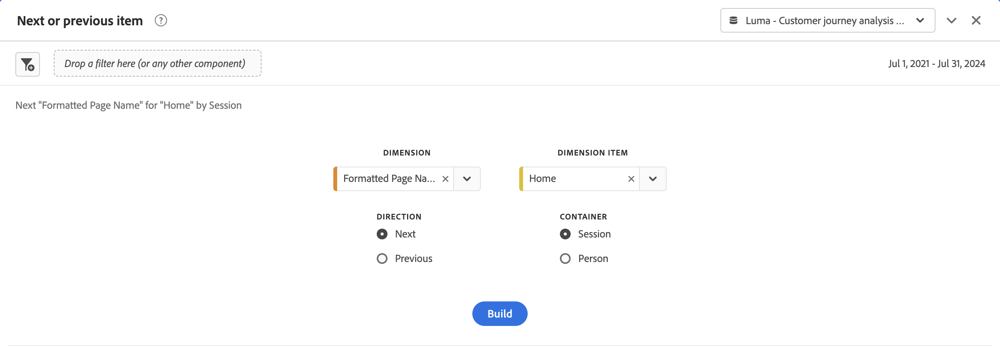

# Panel „Nächstes oder vorheriges Objekt“ {#next-or-previous-item-panel}

>[!CONTEXTUALHELP]
>id="workspace_nextorpreviousitem_button"
>title="Nächstes oder vorheriges Objekt"
>abstract="Erstellen Sie ein Bedienfeld, um mehr über die vorherigen Dimensionen zu erfahren, aus denen Personen kommen, oder über die nächste Dimension, zu der sie gehen."

>[!CONTEXTUALHELP]
>id="workspace_nextorpreviousitem_panel"
>title="Nächstes oder vorheriges Objekt"
>abstract="Analysieren Sie, von wo Besuchende am häufigsten gekommen sind oder wohin sie als Nächstes gehen. Geben Sie die Dimension, das Dimensionselement, die Richtung und den Container an, der für die Visualisierung verwendet werden soll."

>[!BEGINSHADEBOX]

_In diesem Artikel wird das Bedienfeld für das nächste oder vorherige Element in_ _&#x200B;**Customer Journey Analytics**&#x200B;_. _Siehe [Bedienfeld für das nächste oder vorherige Element](https://experienceleague.adobe.com/de/docs/analytics/analyze/analysis-workspace/panels/next-previous)_ für die  _&#x200B;**Adobe Analytics** Version dieses Artikels._

>[!ENDSHADEBOX]

Das Panel **[!UICONTROL Nächstes oder vorheriges Objekt]** enthält eine Reihe von Tabellen und Visualisierungen, um das nächste oder vorherige Dimensionselement für eine bestimmte Dimension zu identifizieren. Nehmen wir an, Sie möchten erkunden, welche Seiten Kundinnen und Kunden nach dem Besuch der Startseite am häufigsten besucht haben.

## Verwenden {#use}

>[!CONTEXTUALHELP]
>id="workspace_nextorpreviousitem_container"
>title="Container"
>abstract="Wählen Sie den Container aus, um den Umfang Ihrer Anfrage zu bestimmen."

So verwenden Sie das Panel **[!UICONTROL Nächstes oder vorheriges Objekt]**:

1. Erstellen Sie das Panel **[!UICONTROL Nächstes oder vorheriges Objekt]**. Informationen zum Erstellen eines Bedienfelds finden Sie unter [Erstellen eines Bedienfelds](panels.md#create-a-panel).

1. Legen Sie die [Eingabe](#panel-input) für das Bedienfeld fest.

1. Sehen Sie sich die [Ausgabe](#panel-output) für das Bedienfeld an.

### Panel-Eingabe

Sie können das Panel [!UICONTROL Nächstes oder vorheriges Objekt] mithilfe der folgenden Eingabeeinstellungen konfigurieren:

| Eingabe | Beschreibung |
| --- | --- |
| **[!UICONTROL Dimension]** | Wählen Sie die Dimension aus, für die Sie die nächsten oder vorherigen Elemente untersuchen möchten. |
| **[!UICONTROL Dimensionselement]** | Wählen Sie das spezifische Dimensionselement in der Mitte Ihrer Anfrage für das nächste/vorherige Element aus. |
| **[!UICONTROL Richtung]** | Geben Sie an, ob Sie nach dem [!UICONTROL nächsten] oder [!UICONTROL vorherigen] Dimensionselement suchen. |
| **[!UICONTROL Container]** | Wählen Sie den Container **[!UICONTROL Globales Konto]** [!BADGE B2B Edition]{type=Informative url="https://experienceleague.adobe.com/de/docs/analytics-platform/using/cja-overview/cja-b2b/cja-b2b-edition" newtab=true tooltip="Customer Journey Analytics B2B Edition"}, **[!UICONTROL Konto]** [!BADGE B2B Edition]{type=Informative url="https://experienceleague.adobe.com/de/docs/analytics-platform/using/cja-overview/cja-b2b/cja-b2b-edition" newtab=true tooltip="Customer Journey Analytics B2B Edition"}, **[!UICONTROL Käufergruppe]** [!BADGE B2B Edition]{type=Informative url="https://experienceleague.adobe.com/de/docs/analytics-platform/using/cja-overview/cja-b2b/cja-b2b-edition" newtab=true tooltip="Customer Journey Analytics B2B Edition"}, **[!UICONTROL Opportunity]** [!BADGE B2B Edition]{type=Informative url="https://experienceleague.adobe.com/de/docs/analytics-platform/using/cja-overview/cja-b2b/cja-b2b-edition" newtab=true tooltip="Customer Journey Analytics B2B Edition"}, **[!UICONTROL Sitzung]** oder **[!UICONTROL Person]**, um den Umfang Ihrer Anfrage zu bestimmen. |

{style="table-layout:auto"}

Wählen Sie **[!UICONTROL Erstellen]** aus, um das Panel zu erstellen.

### Panel-Ausgabe

Das Panel [!UICONTROL Nächstes oder vorheriges Objekt] gibt einen umfangreichen Satz von Daten und Visualisierungen zurück, damit Sie besser verstehen können, welche Ereignisse bestimmten Dimensionselementen folgen oder vorausgehen.

| Visualisierung | Beschreibung |
| --- | --- |
| **[!UICONTROL Horizontalbalken]** | Listet die nächsten (oder vorherigen) Elemente basierend auf dem von Ihnen ausgewählten Dimensionselement auf. Wenn Sie den Mauszeiger über einen Balken bewegen, wird der entsprechende Eintrag in der Freiformtabelle hervorgehoben. |
| **[!UICONTROL Zusammenfassungszahl]** | Allgemeine Zusammenfassungszahl aller Vorkommen von nächsten oder vorherigen Dimensionselementen für den aktuellen Monat (bis jetzt). |
| **[!UICONTROL Freiformtabelle]** | Listet die nächsten (oder vorherigen) Elemente basierend auf dem von Ihnen ausgewählten Dimensionselement in einem Tabellenformat auf. Was waren beispielsweise die beliebtesten Seiten (nach Vorkommen), zu denen Personen nach (oder vor) der Start- oder Arbeitsbereichsseite gegangen sind? |

{style="table-layout:auto"}

>[!MORELIKETHIS]
>
>[Erstellen eines Bedienfelds](/help/analysis-workspace/c-panels/panels.md#create-a-panel)
>
