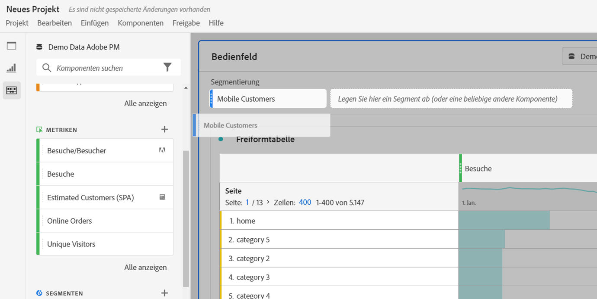
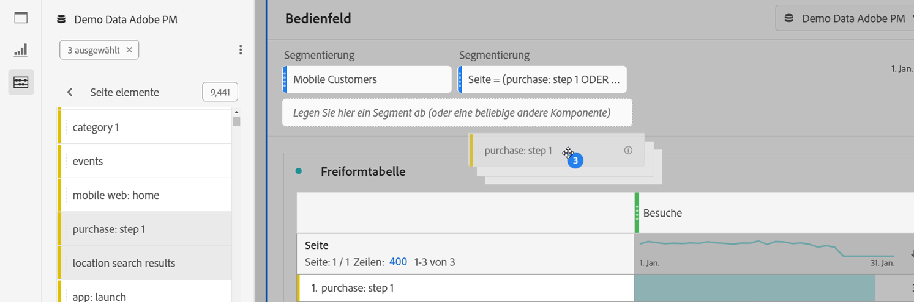
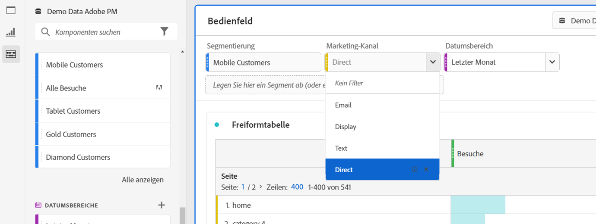
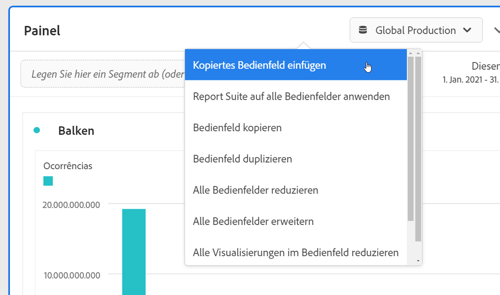

# Überblick über Panels {#panels-overview}

Ein [!UICONTROL Panel] ist eine Sammlung von Tabellen und Visualisierungen. Sie können über das Symbol oben links in Arbeitsbereich oder über ein [leeres Bedienfeld](/help/analysis-workspace/c-panels/blank-panel.md) auf Bedienfelder zugreifen. Bedienfelder sind hilfreich, wenn Sie Ihre Projekte nach Zeiträumen, Datenansichten oder Anwendungsfällen für Analysen organisieren möchten.

## Bedienfeldtypen

Die folgenden Bedienfeldtypen sind in Analysis Workspace für [!UICONTROL Customer Journey Analytics] verfügbar:

| Name des Bedienfelds | Beschreibung |
| --- | --- |
| [Leeres Bedienfeld](/help/analysis-workspace/c-panels/blank-panel.md) | Wählen Sie zum Beginnen Ihrer Analyse aus den verfügbaren Bedienfeldern und Visualisierungen. |
| [Attribution](attribution.md) | Vergleichen und visualisieren Sie im Handumdrehen eine beliebige Anzahl von Attributionsmodellen unter Verwendung verschiedener Dimensionen und Konversionskennzahlen. |
| [Experimentieren](experimentation.md) | Vergleichen Sie verschiedene Benutzererfahrungen, Marketing- oder Messaging-Variationen, um zu bestimmen, welche am besten geeignet ist, um ein bestimmtes Ergebnis zu erzielen. |
| [Freiform](freeform-panel.md) | Führen Sie unbegrenzt Vergleiche und Aufschlüsselungen durch und fügen Sie dann Visualisierungen hinzu, um eine ausführliche Story mit den Daten zu erzählen. |
| [Medien-Zielgruppendurchschnitt pro Minute](average-minute-audience-panel.md) | Analysieren Sie den Zielgruppendurchschnitt pro Minute für einen bestimmten Inhalt oder für einen benutzerdefinierten Zeitraum. |
| [Gleichzeitige Medienbetrachtende](media-concurrent-viewers.md) | Analysieren Sie gleichzeitige Betrachtende über einen längeren Zeitraum. Sie erhalten Details zum maximalen gleichzeitigen Zugriff und die Möglichkeit, aufzuschlüsseln und zu vergleichen. |
| [Verbrachte Zeit bei der Medienwiedergabe](/help/analysis-workspace/c-panels/media-playback-time-spent.md) | Analysieren Sie die Wiedergabedauer, um nachzuvollziehen, wo Spitzenzeiten bei gleichzeitigen Ansichten auftreten oder wo es zu Abbrüchen kommt. |
| [Nächstes oder vorheriges Objekt](next-previous.md) | Zeigen Sie die nächsten oder vorherigen Seiten an, zu denen Personen navigieren. |
| [Quick Insights](quickinsight.md) | Erstellen Sie im Nu eine Freiformtabelle und eine entsprechende Visualisierung, um Erkenntnisse schneller zu analysieren und bereitzustellen. |

Die Bedienfelder [!UICONTROL Quick Insights], [!UICONTROL Leer] und [!UICONTROL Freiform] eignen sich hervorragend als Ausgangspunkt für Ihre Analyse. [!UICONTROL Attribution] bietet sich hingegen für erweiterte Analysen an. Unten auf der Arbeitsfläche ist das Symbol  verfügbar, durch das Sie jederzeit leere Bedienfelder hinzufügen können.

Das standardmäßige Startbedienfeld ist das Bedienfeld [!UICONTROL Freiform]. Sie können jedoch auch das Bedienfeld [Leer](/help/analysis-workspace/c-panels/blank-panel.md) oder [Quick Insights](/help/analysis-workspace/c-panels/quickinsight.md) als Standard festlegen. Siehe [Voreinstellungen für Projekte und Analysen](/help/analysis-workspace/user-preferences.md#projects--analyses-preferences).

## Erstellen eines Bedienfelds

So erstellen Sie ein Bedienfeld:

* Ziehen Sie ein Bedienfeld aus dem linken Bedienfeld **[!UICONTROL Bedienfelder]** auf Ihre Arbeitsfläche.
* Wählen Sie ein Bedienfeld aus dem Bedienfeld [Leer](blank-panel.md) aus.
* Verwenden Sie das Menü **[!UICONTROL Einfügen]** in Workspace und wählen Sie Ihr Bedienfeld aus. Alternativ können Sie Bedienfelder mit einem der [Tastaturbefehle](../build-workspace-project/fa-shortcut-keys.md) einfügen.

  

Sie haben folgende Möglichkeiten:

* Wählen Sie das Symbol  **in** einem beliebigen Bedienfeld aus, um eine weitere Visualisierung hinzuzufügen. Es wird ein Popup angezeigt, in dem Sie eine Visualisierung auswählen können.

  

  | Auswahl | Erstelltes Element |
  |---|---|
  |  | [Freiformtabelle](/help/analysis-workspace/visualizations/freeform-table/freeform-table.md) |
  |  | [Linie](/help/analysis-workspace/visualizations/line.md) |
  |  | [Balken](/help/analysis-workspace/visualizations/bar.md) |
  |  | [Zusammenfassungszahl](/help/analysis-workspace/visualizations/summary-number-change.md) |
  |  | [Text](/help/analysis-workspace/visualizations/text.md) |
  |  | [Fallout](/help/analysis-workspace/visualizations/fallout/fallout-flow.md) |
  |  | [Fluss](/help/analysis-workspace/visualizations/c-flow/flow.md) |
  |  | [Bereiche gestapelt](/help/analysis-workspace/visualizations/area.md) |
  |  | [Kohortentabelle](/help/analysis-workspace/visualizations/cohort-table/t-cohort.md) |
  |  | [Bullet](/help/analysis-workspace/visualizations/bullet-graph.md) |
  |  | [Ringdiagramm](/help/analysis-workspace/visualizations/donut.md) |
  |  | [Zusammenfassungsänderung](/help/analysis-workspace/visualizations/summary-number-change.md) |
  |  | [Histogramm](/help/analysis-workspace/visualizations/histogram.md) |
  |  | [Streuung](/help/analysis-workspace/visualizations/scatterplot.md) |
  |  | [Venn](/help/analysis-workspace/visualizations/venn.md) |
  |  | [Treemap](/help/analysis-workspace/visualizations/treemap.md) |

* Wählen Sie  **außerhalb** des letzten Panels in Ihrem Arbeitsbereich aus, um ein weiteres [leeres Panel](blank-panel.md) hinzuzufügen.

## Verwalten eines Panels

Sie können ein Panel wie folgt verwalten:

* Um ein Panel zu reduzieren, wählen Sie  aus.
* Um ein reduziertes Panel anzuzeigen, wählen Sie  aus.
* Um ein Panel zu löschen, wählen Sie  aus. Um eine Aktion rückgängig zu machen, wählen Sie **[!UICONTROL Bearbeiten]** > **[!UICONTROL Rückgängig]** aus (**[!UICONTROL *Befehl+Z *]**|**[!UICONTROL * Strg+Z *]**).
* Verschieben Sie ein Panel per Drag-and-Drop, wenn das Symbol  sichtbar ist (in der Regel, wenn Sie den Mauszeiger über die Kopfzeile bewegen).

## Datenansicht

Jedes Panel ist mit einer [Datenansicht](/help/data-views/data-views.md) verknüpft, die durch den  **[!UICONTROL *Namen der Datenansicht *]**im Dropdown-Menü oben rechts im Panel identifiziert wird.

Wenn Sie ein leeres Workspace-Projekt erstellen, ist die Standarddatenansicht für das erste Panel die Datenansicht, an der Sie zuletzt in Customer Journey Analytics gearbeitet haben.

Wenn Sie ein neues Panel erstellen, basiert die Standarddatenansicht auf der Datenansicht des Panels, an dem Sie zuletzt im Workspace-Projekt gearbeitet haben.

>[!IMPORTANT]
>
>Die ausgewählte Datenansicht legt fest, welche Dimensionen, Metriken und Segmente zum Erstellen von Visualisierungen in einem Panel verfügbar sind.
>
>
>Wenn Sie eine Datenansicht für ein Panel wechseln, sind einige Komponenten in dieser neuen Datenansicht möglicherweise nicht verfügbar. Diese Änderung kann dazu führen, dass Ihre Visualisierung nicht ordnungsgemäß gerendert wird. Möglicherweise werden Warnungen wie diese angezeigt:
>
>* Dieses Panel enthält Komponenten, die in der ausgewählten Datenansicht nicht aktiviert sind. Ändern Sie die Datenansicht oder aktivieren Sie die erforderlichen Komponenten in der Datenansicht.
>* Visualisierung kann nicht gerendert werden: Überprüfen Sie Ihre Spalten und Zeilen, um sicherzustellen, dass sie gültige Komponenten enthalten.
>

## Kalender

Der Panel-Kalender steuert den Reporting-Datumsbereich für Tabellen und Visualisierungen innerhalb eines Panels.

>[!NOTE]
>
>Wenn eine Komponente des -Datumsbereichs in einer Visualisierung oder einem Bedienfeld verwendet wird (z. B. als Segment), überschreibt die Datumsbereichskomponente den Bedienfeldkalender.
>

1. Wählen Sie einen Datumsbereich aus, indem Sie zuerst das Startdatum und dann das Enddatum auswählen.
Alternativ können Sie eine **[!UICONTROL Voreinstellung]** aus dem Dropdown-Menü [!UICONTROL *Voreinstellung auswählen*] auswählen.

1. Wählen Sie optional **[!UICONTROL Erweiterte Einstellungen einblenden]** für Folgendes aus:

   * Geben Sie eine andere **[!UICONTROL Startzeit]** und **[!UICONTROL Endzeit]** als die Standardwerte `12:00 AM` (`0:00`) und `11:59 PM` (`23:59`) an. Endzeiten umfassen immer 59 Sekunden. Für einen Datumsbereich, der viele Tage umfasst, gilt die Startzeit für den ersten Tag des Datumsbereichs und die Endzeit gilt für den letzten Tag in Ihrem Datumsbereich. Verwenden Sie **[!UICONTROL (Zeitwerte zurücksetzen)]**, um die Start- und Endzeit auf ihre Standardwerte zurückzusetzen.
   * **[!UICONTROL Erstellen von Datumsbereichskomponenten relativ zum Panel-Kalender]**. Wenn diese Option deaktiviert ist, beziehen sich die im Bedienfeld verwendeten Datumsbereichskomponenten auf die aktuelle Zeit. Wenn diese Option aktiviert ist, beziehen sich die im Bedienfeld verwendeten Datumsbereichskomponenten auf den Kalender des Bedienfelds.
   * **[!UICONTROL Rollierende Termine verwenden]**. Wenn diese Option aktiviert ist, werden voreingestellte Datumsbereiche wie **[!UICONTROL Letzte 7 volle Tage]** dynamisch als aktueller Datums- und Uhrzeitfortschritt aktualisiert. Wenn diese Option deaktiviert ist, werden diese Vorgaben nach der Anwendung nicht aktualisiert.

     

     Sie können den Text in eckigen Klammern auswählen (z. B. **[!UICONTROL Festgelegter Start – täglich rollierend]**), um das Bedienfeld zu erweitern und Details für **[!UICONTROL Start]** und **[!UICONTROL Ende]** anzugeben.

      1. Wählen Sie **[!UICONTROL Anfang von]**, **[!UICONTROL Ende von]** oder **[!UICONTROL Festgelegter Tag]** aus.
      1. Wenn Sie **[!UICONTROL Anfang von]** oder **[!UICONTROL Ende von]** ausgewählt haben, können Sie einen vollständigen Ausdruck erstellen. Beispiel: **[!UICONTROL Ende von]** **[!UICONTROL Aktuelles Jahr]** **[!UICONTROL plus]** `1` **[!UICONTROL Tag]**. Wählen Sie den entsprechenden Wert für jeden einzelnen Teil des Ausdrucks aus.
         * Wählen Sie einen Wert für den aktuellen Zeitraum aus, z. B. **[!UICONTROL Aktuelles Jahr]**.
         * Wählen Sie einen Wert für die zusätzliche Berechnung aus, z. B. **[!UICONTROL plus]**.
         * Wenn Sie eine zusätzliche Berechnung angegeben haben, geben Sie einen Wert an. Zum Beispiel `1`.
         * Wenn Sie eine zusätzliche Berechnung angegeben haben, wählen Sie den Zeitraum aus, der für die Berechnung verwendet werden soll, z. B. **[!UICONTROL Tag]**.

     Wählen Sie **[!UICONTROL Details ausblenden]** aus, um die Details für die Berechnung rollierender Termine auszublenden.

1. Wählen Sie **[!UICONTROL Übernehmen]** aus, um den Datumsbereich auf das Bedienfeld anzuwenden, über das der Kalender aufgerufen wurde.
Wählen Sie **[!UICONTROL Auf alle Panels anwenden]** aus, um den Datumsbereich auf alle Panels im Workspace-Projekt anzuwenden.

## Ablegebereich {#dropzone}

Mithilfe des Ablegebereichs eines Bedienfelds können Sie Segment- und Dropdown-Segmente auf alle Tabellen und Visualisierungen innerhalb eines Bedienfelds anwenden. Sie können ein oder mehrere Segmente auf ein Bedienfeld anwenden.

### Segmente

Ziehen Sie beliebige Segmente per Drag-and-Drop aus dem linken Bedienfeld in den Ablagebereich des Bedienfelds, um das Bedienfeld zu segmentieren.  Wiederholen Sie diesen Vorgang, um dem Bedienfeld weitere Segmente hinzuzufügen. Segmente werden oben im Bedienfeld nebeneinander angezeigt.

#### Schnellsegmente

Komponenten, die keine Segmente sind, können auch direkt in den Ablagebereich gezogen werden, um Schnellsegmente zu erstellen, wodurch Sie sich das mühsame Aufrufen des [Segment Builders](/help/components/segments/seg-builder.md) ersparen können. Die auf diese Weise erstellten Segmente werden automatisch als Segmente auf Ereignisebene definiert. Diese Definition kann schnell geändert werden, indem Sie neben dem Segmentnamen die Option  auswählen.

Weitere Informationen finden Sie unter [Schnellsegmente](/help/components/segments/seg-quick.md).

### Dropdown-Segmente

>[!BEGINSHADEBOX]

Unter  [Dropdown-Segmente](https://video.tv.adobe.com/v/327486?quality=12&learn=on&captions=ger){target="_blank"} finden Sie ein Demovideo.

{{videoaa}}

>[!ENDSHADEBOX]

#### Statische Dropdown-Segmente

Statische Dropdown-Segmente ermöglichen Ihnen eine kontrollierte Interaktion mit den Daten. Sie können beispielsweise ein Dropdown-Segment für Gerätetypen hinzufügen, damit Sie das Bedienfeld nach Tablet, Handy oder Desktop segmentieren können.

Statische Dropdown-Segmente können auch verwendet werden, um mehrere Projekte in einem Projekt zu bündeln. Wenn Sie beispielsweise mehrere Versionen desselben Projekts mit unterschiedlichen Ländersegmenten verwenden, können Sie alle Versionen in einem Projekt zusammenfassen und ein Dropdown-Segment „Land“ hinzufügen.

##### Erstellen von statischen Dropdown-Segmenten

* Wählen Sie für Dropdown-Segmente mit Dimensionselementen eine einzelne Dimension aus dem linken Bedienfeld aus und legen Sie sie im Ablagebereich des Bedienfelds ab, während Sie ⇧ (*Umschalt*) gedrückt halten. Dadurch wird ein Dropdown-Segment mit allen Dimensionselementen erstellt, die mit dieser Dimension verknüpft sind.

  Wenn das Dropdown-Segment nur bestimmte Dimensionselemente enthalten soll, die mit einer Dimension verknüpft sind, wählen Sie im linken Bedienfeld neben der gewünschten Dimension das Symbol mit dem Pfeil nach rechts aus. Durch diese Aktion werden alle verfügbaren Dimensionselemente offengelegt. Wählen Sie mithilfe von ⇧+ (*Umschalt* + *Auswählen*) oder ^+ (*Steuerung* + *Auswählen*) mehrere Dimensionselemente aus dieser Liste aus und legen Sie sie dann bei im Ablegebereich des Panels ab, **während Sie ⇧ gedrückt halten**.

* Wählen Sie für Dropdown-Segmente, die einen einzelnen Komponententyp verwenden (z. B. nur Dimensionen, nur Segmente oder nur Metriken), im linken Bedienfeld mehrere Elemente desselben Typs mithilfe von ⇧+ oder ^+ aus. Legen Sie die Elemente dann im Ablegebereich des Panels ab, **während Sie ⇧ gedrückt halten**.

  Mit den von Ihnen ausgewählten Komponenten wird ein einzelnes Dropdown-Segment erstellt.

* Wählen Sie für Dropdown-Segmente, die gemischte Komponententypen (etwa 2 Metriken und 3 Filter) verwenden, mithilfe von ⇧+ oder ^+ mehrere Komponenten aus. Legen Sie die Auswahl im Ablegebereich des Bedienfelds ab, **während Sie ⇧ gedrückt halten**. In diesem Kontext werden alle Komponententypen als separate Dropdown-Segmente behandelt. Wenn Sie beispielsweise sowohl Metriken als auch Dimensionselemente in Ihre Auswahl aufnehmen, werden zwei separate Dropdown-Segmente erstellt: Das eine enthält Dimensionselemente und das andere Metriken.

Ein Dropdown-Segment bietet die folgenden Kontextmenüoptionen:

* **[!UICONTROL Dropdown löschen]**: Entfernt das Dropdown-Segment aus dem Bedienfeld.
* **[!UICONTROL Label löschen]**: Entfernt den Text, der über einem Dropdown-Segment angezeigt wird.  Um das Label zu ändern, bewegen Sie den Mauszeiger über das Label und wählen Sie  aus.
* **[!UICONTROL Label hinzufügen]**: Wenn Sie einem Projekt ein Dropdown-Segment hinzufügen, wird als Label automatisch der Komponentenname festgelegt. Wenn Sie das Label löschen, können Sie es mit dieser Option erneut hinzufügen.
* **[!UICONTROL Auswahl erforderlich]**: Erfordert, dass im Bedienfeld ein Segment festgelegt ist.

##### Verwenden statischer Dropdown-Segmente

Benutzende können das Dropdown-Segmentmenü auf eine der folgenden Arten verwenden, um das Bedienfeld zu segmentieren:

* Anwenden eines einzelnen Segments auf das Bedienfeld, indem es über das Dropdown-Segment ausgewählt wird.

* Anwenden mehrerer Segmente auf das Bedienfeld, indem mehr als ein Segment über das Dropdown-Segment ausgewählt wird. Das Bedienfeld wird segmentiert, um alle ausgewählten Segmente einzuschließen.

#### Dynamische Dropdown-Segmente

Dynamische Dropdown-Segmente ermöglichen es Ihnen, verfügbare Werte basierend auf Daten innerhalb des Berichtsbereichs des Bedienfelds und Werten in anderen Dropdown-Segmenten zu bestimmen. Sie können beispielsweise zwei dynamische Dropdown-Filter mit einer Dimension „Länder“ und einer Dimension „Städte“ erstellen. Wenn Sie ein Land aus dem Dropdown-Menü **[!UICONTROL Länder]** auswählen, wird das Dropdown-Menü **[!UICONTROL Städte]** dynamisch angepasst, sodass nur Städte in diesem Land angezeigt werden.

Dieses Konzept gilt für alle Dimensionen. Es sind nur Dimensionselemente, die innerhalb des Datumsbereichs des Bedienfelds angezeigt werden, sowie ausgewählte Segmente sichtbar.  Die in statischen Dropdown-Segmenten ausgewählten Dimensionen wirken sich auf die verfügbaren Werte in dynamischen Dropdown-Segmenten aus. Das Gegenteil ist jedoch nicht der Fall: In dynamischen Dropdown-Segmenten ausgewählte Dimensionselemente wirken sich nicht auf die verfügbaren Werte in statischen Dropdown-Segmenten aus.

Eine manuelle Auswahl von Dimensionselementen ist verfügbar, wenn Sie erwarten, dass ein bestimmtes Dimensionselement in Zukunft erfasst wird. Sie können auch ein dynamisches Dropdown-Segment löschen, sodass dieses keinen Wert enthält, wodurch andere dynamische Dropdown-Segmente mehr Werte enthalten können. Wählen Sie **[!UICONTROL Alle zurücksetzen]** aus, um die Auswahl aus allen Dropdown-Segmenten für dieses Bedienfeld zu löschen.

So erstellen Sie ein dynamisches Dropdown-Segment:

* Ziehen Sie eine einzelne Dimension per Drag-and-Drop in den Ablegebereich des Bedienfelds, **während Sie ⇧ gedrückt halten**.

Beachten Sie, dass dynamische Dropdown-Segmente nicht für Metriken, Segmente oder Datumsbereiche verfügbar sind.

Ein dynamisches Dropdown-Segment bietet dieselben Kontextmenüoptionen wie statische Dropdown-Segmente.

## Kontextmenü

Weitere Funktionen für ein Panel sind über ein Kontextmenü (Rechtsklick) auf der Panel-Überschrift verfügbar.

Die folgenden Optionen sind verfügbar:

| Option | Beschreibung |
| --- | --- |
| **[!UICONTROL Kopiertes Panel einfügen]** | Ermöglicht es Ihnen, ein kopiertes Panel an einer anderen Stelle innerhalb des Projekts oder in ein ganz anderes Projekt einzufügen. |
| **[!UICONTROL Kopierte Visualisierung einfügen]** | Fügen Sie eine kopierte Visualisierung an einer anderen Stelle innerhalb des Panels oder des Projekts oder in ein ganz anderes Projekt ein. |
| **[!UICONTROL Datenansicht auf alle Panels anwenden]** | Wenden Sie die Datenansicht für dieses Panel auf alle anderen Panels im Projekt an. |
| **[!UICONTROL Panel kopieren]** | Kopieren Sie ein Panel, sodass Sie es an einer anderen Stelle innerhalb des Projekts oder in ein anderes Projekt einfügen können. |
| **[!UICONTROL Panel duplizieren]** | Fertigt ein exaktes Duplikat des aktuellen Panels an, das Sie dann bearbeiten können. |
| **[!UICONTROL Alle Bedienfelder reduzieren]** | Ermöglicht es Ihnen, alle Projektbedienfelder zu reduzieren. |
| **[!UICONTROL Alle Bedienfelder erweitern]** | Ermöglicht es Ihnen, alle Projektbedienfelder zu erweitern. |
| **[!UICONTROL Alle Visualisierungen im Bedienfeld reduzieren]** | Ermöglicht es Ihnen, alle Visualisierungen im aktuellen Bedienfeld zu reduzieren. |
| **[!UICONTROL Alle Visualisierungen im Bedienfeld erweitern]** | Ermöglicht es Ihnen, alle Visualisierungen im aktuellen Bedienfeld zu erweitern. |
| **[!UICONTROL Beschreibung bearbeiten]** | Hiermit können Sie einen Text zur Beschreibung des Bedienfelds hinzufügen (oder bearbeiten). |
| **[!UICONTROL Bereichslink abrufen]** | Ermöglicht es Ihnen, Personen zu einem bestimmten Bedienfeld innerhalb eines Projekts zu leiten. Wenn der Link ausgewählt wird, muss sich die empfangende Person anmelden, bevor sie genau zu dem Bedienfeld weitergeleitet wird, zu dem eine Verknüpfung besteht. |

## Konfiguration

Einige Panels (z. B. [!UICONTROL Attribution], [!UICONTROL Experimentieren] und [!UICONTROL Medien-Zielgruppendurchschnitt pro Minute]) verfügen über ein Konfigurationsdialogfeld, das Sie beim Erstellen der Visualisierung unterstützt. Verwenden Sie  oben im Panel, um auf die Konfiguration zuzugreifen und diese zu ändern.

