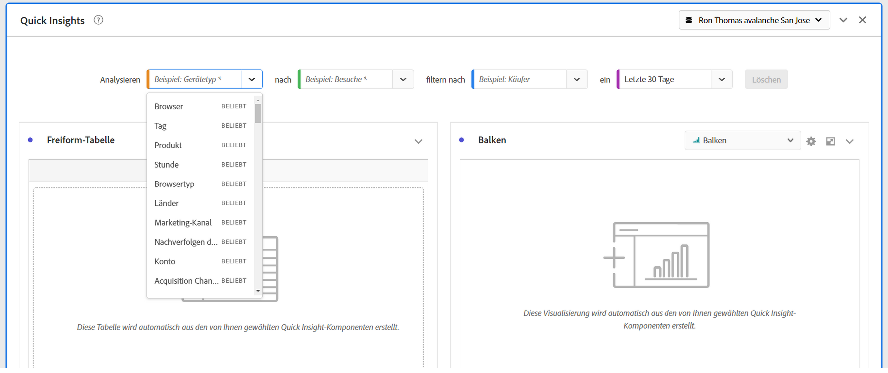

# Bedienfeld „Quick Insights“ {#quick-insights-panel}

<!-- markdownlint-disable MD034 -->

>[!CONTEXTUALHELP]
>id="cja_workspace_quickinsights_button"
>title="Quick Insights"
>abstract="Erstellen Sie ein Bedienfeld, um im Handumdrehen eine Freiformtabelle und die zugehörige Visualisierung zu erstellen und so Erkenntnisse schneller gewinnen und analysieren zu können."

<!-- markdownlint-enable MD034 -->

[!UICONTROL Quick Insights] bietet Nicht-Analytikern und neuen Benutzern von [!UICONTROL Analysis Workspace] die Möglichkeit, betriebliche Fragen schnell und einfach zu beantworten. Es ist auch ein großartiges Tool für fortgeschrittene Benutzer, die eine einfache Frage schnell beantworten möchten, ohne selbst eine Tabelle erstellen zu müssen.

Wenn Sie diese [!UICONTROL Analysis Workspace] zum ersten Mal verwenden, fragen Sie sich vielleicht:

* Welche Visualisierungen sind am nützlichsten?
* Welche Dimensionen und Metriken können Einblicke erleichtern?
* wo Elemente per Drag-and-Drop eingefügt werden sollen
* wo ein Filter erstellt werden soll,
* und mehr.

Um bei diesen Fragen zu helfen, nutzt[!UICONTROL Quick Insights] einen Algorithmus, der Ihnen die beliebtesten Dimensionen, Metriken, Filter und Datumsbereiche präsentiert, die Ihr Unternehmen verwendet. Dieser Algorithmus basiert auf der Verwendung von Datenkomponenten durch Ihr eigenes Unternehmen in [!UICONTROL Analysis Workspace]. In der Dropdown-Liste sehen Sie Dimensionen, Metriken und Filter, die mit [!UICONTROL POPULAR] getaggt sind, wie hier dargestellt:

[!UICONTROL Quick Insights] hilft Ihnen bei Folgendem:

* Ordnungsgemäßes Erstellen einer Datentabelle und einer zugehörigen Visualisierung in [!UICONTROL Analysis Workspace].
* Vertrautmachen mit der Terminologie und dem Vokabular für grundlegende Komponenten und Bestandteile von [!UICONTROL Analysis Workspace].
* Ausführen einfacher Aufschlüsselungen von Dimensionen, Hinzufügen mehrerer Metriken oder Vergleichen von Filtern in einer [!UICONTROL Freiformtabelle].
* Ändern oder Ausprobieren verschiedener Visualisierungstypen, um das Suchwerkzeug für Ihre Analyse schnell und intuitiv zu finden.

## Grundlegende Terminologie

Im Folgenden finden Sie einige der grundlegenden Begriffe, mit denen Sie vertraut sein müssen. Jede Datentabelle besteht aus zwei oder mehr Bausteinen (Komponenten), mit denen Sie Ihren Datenverlauf gestalten.

| Baustein (Komponente) | Definition |
|---|---|
| **[!UICONTROL Dimension]** | Dimensionen sind Beschreibungen oder Eigenschaften metrischer Daten, die in einem Projekt angezeigt, aufgeschlüsselt und verglichen werden können. Es handelt sich um nicht-numerische Werte und Daten, die in Dimensionselemente aufgeschlüsselt werden. Beispiel: *browser* oder *page* ist eine Dimension. |
| **[!UICONTROL Dimensionselement]** | Dimensionselemente sind individuelle Werte für eine Dimension. Beispielsweise wären die Dimensionselemente für die Browserdimension *Chrome*, *Firefox*, *Edge* oder andere. |
| [!UICONTROL Metrik] | Metriken sind quantitative Informationen über Aktivitäten von Personen wie Ansichten, Clickthroughs, Neuladungen, durchschnittliche Besuchszeit, Einheiten, Bestellungen, Umsatz usw. |
| **[!UICONTROL Visualisierung]** | Workspace bietet [eine Reihe von Visualisierungen](/help/analysis-workspace/visualizations/freeform-analysis-visualizations.md), um visuelle Darstellungen Ihrer Daten zu erstellen. Zum Beispiel Balkendiagramme, Ringdiagramme, Histogramme, Liniendiagramme, Karten, Streudiagramme und andere. |
| **[!UICONTROL Dimensionsaufschlüsselung]** | Eine Dimensionsaufschlüsselung ist eine Möglichkeit, eine Dimension nach anderen Dimensionen zu unterteilen. Sie können beispielsweise die US-Bundesstaaten nach Mobilgeräten aufschlüsseln, um die Besuche der Mobilgeräte pro Bundesland zu erhalten. Oder Sie können Mobilgeräte nach Mobilgerätetypen, Regionen, internen Kampagnen und mehr aufschlüsseln. |
| **[!UICONTROL Filter]** | Mit Filtern können Sie Untergruppen von Personen anhand von Merkmalen oder Website-Interaktionen identifizieren. Sie können beispielsweise [!UICONTROL Personen]-Filter basierend auf <li>Attribute: Browsertyp, Gerät, Anzahl Besuche, Land, Geschlecht oder</li><li>Interaktionen: Kampagnen, Keyword-Suche, Suchmaschine oder</li><li>Ausstiege und Einstiege: Personen aus Facebook, einer definierten Landingpage, einer verweisenden Domäne oder</li><li> benutzerdefinierte Variablen: Formularfeld, definierte Kategorien, Kunden-ID. |

## Verwenden Sie stattdessen 

So verwenden Sie ein Bedienfeld mit **[!UICONTROL Quick Insights]** :

1. Erstellen Sie ein Bedienfeld mit **[!UICONTROL Quick Insights]** . Informationen zum Erstellen eines Bedienfelds finden Sie unter [Erstellen eines Bedienfelds](panels.md#create-a-panel).

1. Wenn Sie zum ersten Mal ein Bedienfeld mit **[!UICONTROL Quick Insights]** verwenden, sollten Sie sich das kurze [!UICONTROL Intro-Tutorial] ansehen, in dem Sie einige Grundlagen lernen. Wählen Sie &quot;&quot;neben dem Titel des Bedienfelds &quot;Quick Insights&quot;und dann &quot;**[!UICONTROL Intro Tutorial]**&quot;aus dem Popup-Fenster.

1. Geben Sie die [Eingabe](#panel-input) für das Bedienfeld an.

1. Beobachten Sie die [Ausgabe](#panel-output) für das Bedienfeld.

### Bedienfeldeingabe

Wählen Sie die Bausteine aus:

* **[!UICONTROL Analysieren]** - Festlegen einer Dimension (orange)
* **[!UICONTROL by]** - Angabe einer Metrik (grün)
* **[!UICONTROL Filter nach]** - Angabe eines Filters (blau)
* **[!UICONTROL on]** - Geben Sie einen Datenbereich (violett) an.

Sie müssen mindestens eine Dimension und eine Metrik auswählen, damit die Visualisierung ordnungsgemäß funktioniert.

Sie können die Bausteine auf drei Arten spezifizieren:

* Ziehen Sie Komponenten per Drag-and-Drop aus dem linken Bereich.
* Beginnen Sie mit der Eingabe in eines der Bausteinfelder. Wenn eine Eingabe gefunden wird, wird das Bausteinfeld automatisch mit möglichen Werten gefüllt.
* Geben Sie eine Baustein-Dropdown-Liste an (z. B. `Country` in **[!UICONTROL Analyze]**) und suchen Sie in der Liste der möglichen Werte (mit ) nach dem Wert, den Sie verwenden möchten (z. B. **[!UICONTROL Ländercode]**).

Wählen Sie **[!UICONTROL Löschen]** aus, um alle Eingabefelder zu löschen.

### Bedienfeldausgabe

1. Wenn Sie mindestens eine Dimension und eine Metrik hinzugefügt haben, können Sie die Ergebnisse sehen.

   

   * Eine Freiformtabelle mit der Dimension (Ländercode) und der Metrik (Sitzungen), gefiltert nach Websitzungen für die letzten 12 Monate.

   * Eine begleitende Visualisierung, in diesem Fall ein [Balkendiagramm](/help/analysis-workspace/visualizations/bar.md). Die erstellte Visualisierung basiert auf dem Datentyp, den Sie der Tabelle hinzugefügt haben. Zeitbasierte Daten (z. B. [!UICONTROL Sitzungen] pro Tag/Monat) verwenden standardmäßig ein [!UICONTROL Linien] -Diagramm. Alle nicht zeitbasierten Daten (z. B. [!UICONTROL Sitzungen] pro [!UICONTROL Gerät]) verwenden standardmäßig ein [!UICONTROL Balken] -Diagramm. Sie können den Visualisierungstyp ändern, indem Sie auf den Dropdown-Pfeil neben dem Visualisierungstyp klicken.

1. Versuchen Sie, einige weitere Verfeinerungen hinzuzufügen, wie unten unter [Weitere Tipps](#more-tips) beschrieben.

1. Möglicherweise möchten Sie Ihr Projekt speichern, indem Sie **[!UICONTROL Projekt > Speichern]** verwenden.

## Weitere Tipps

Weitere nützliche Hinweise werden im [!UICONTROL Quick Insights Builder] angezeigt, einige davon hängen von Ihrer letzten Aktion ab.

* Zunächst möchten Sie möglicherweise das Tutorial **[!UICONTROL Weitere Tipps]** abschließen. Dieses Tutorial wird 24 Stunden nach der Erstellung eines Projekts mit mindestens einer Dimension und einer Metrik angezeigt. Wählen Sie &quot;&quot;neben dem Titel des Bedienfelds &quot;Quick Insights&quot;und wählen Sie &quot;**[!UICONTROL Mehr Tipps]**&quot;aus dem Popup-Fenster.

  

* Sie können mehrere Dimensionen und Metriken analysieren, Filter kombinieren oder vergleichen und einen Datenbereich angeben:

  

   * **[!UICONTROL Dimension]** analysieren **[!UICONTROL Aufschlüsselung nach]**: Sie können bis zu drei Aufschlüsselungsebenen für Dimensionen verwenden, um einen Drilldown zu den wirklich benötigten Daten durchzuführen. Siehe auch , und .

   * Weitere Metriken **[!UICONTROL bis]** hinzufügen: Sie können bis zu 2 weitere Metriken hinzufügen. Siehe ➍ und ➎.

   * **[!UICONTROL Filtern nach]**: Sie können bis zu 2 weitere Filter hinzufügen. Fügen Sie beispielsweise Buchungen als Filter hinzu und kombinieren Sie diesen Filter mit den von Ihnen verglichenen Filtern Häufige Lesezeichen und Erstflüge . Siehe ➏, ➐ und ➑.

   * on: Sie können den Datenbereich angeben. Siehe ➒.

## Bekannte Einschränkungen

Wenn Sie versuchen, direkt innerhalb der Tabelle zu bearbeiten, kann das Bedienfeld [!UICONTROL Quick Insights] nicht mehr synchronisiert sein. Wählen Sie oben rechts im Bedienfeld die Option **[!UICONTROL Builder neu synchronisieren]** aus, um die vorherigen Einstellungen für [!UICONTROL Quick Insights] wiederherzustellen.

Sie erhalten eine Warnung, bevor Sie etwas direkt zur Tabelle hinzufügen:

Andernfalls führt das direkte Erstellen dazu, dass sich die Tabelle wie eine herkömmliche Freiformtabelle verhält, ohne dass die nützlichen Funktionen für neue Benutzer verfügbar sind.

>[!MORELIKETHIS]
>
>[Erstellen eines Bedienfelds](/help/analysis-workspace/c-panels/panels.md#create-a-panel)
>