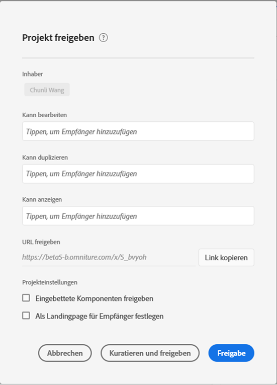

# Freigeben von Projekten {#share-projects}

<!-- markdownlint-disable MD034 -->

>[!CONTEXTUALHELP]
>id="workspace_shareprojects"
>title="Freigeben von Projekten"
>abstract="Sie können diese Projektrollen für andere Benutzende in Ihrer Organisation freigeben."

<!-- markdownlint-enable MD034 -->

Sie können ein Analysis Workspace-Projekt für die folgenden Personentypen freigeben:

* Benutzer und Gruppen in Ihrer Organisation, die Zugriff auf Adobe Customer Journey Analytics haben

  Sie können den Zugriff zum Bearbeiten, Duplizieren oder Anzeigen freigeben

* Benutzende und Gruppen in Ihrer Organisation, die keinen Zugriff auf Customer Journey Analytics haben

  Empfängerinnen und Empfänger haben schreibgeschützten Zugriff

* Personen außerhalb Ihrer Organisation

  Empfängerinnen und Empfänger haben schreibgeschützten Zugriff

Jede [Kuration](curate.md), die Sie vor der Freigabe vorgenommen haben, wird beim Öffnen des Projekts durch die Empfängerinnen bzw. Empfänger angezeigt.

+++ Sehen Sie sich ein Video an, in dem gezeigt wird, wie die Projektfreigabe verwendet wird.

>[!VIDEO](https://video.tv.adobe.com/v/36207/?quality=12)

{{videoaa}}

+++

## Für Customer Journey Analytics-Benutzende und -Gruppen in der Organisation freigeben {#Add}

Sie können ein Projekt für bestehende Customer Journey Analytics-Benutzende oder -Gruppen in Ihrer Organisation freigeben. Wenn Sie ein Projekt wie in diesem Abschnitt beschrieben freigeben, müssen die Benutzenden, für die Sie es freigeben, bereits über ein Customer Journey Analytics-Konto verfügen.

Sie können eine bestimmte Rolle für Benutzende oder Gruppen freigeben oder einen Link freigeben.

* [Freigeben einer bestimmten Projektrolle](#share-a-specific-project-role)

* [Freigeben eines Links zu einem Projekt](#share-a-link-to-a-project)

## Freigeben einer bestimmten Projektrolle

Beachten Sie beim Freigeben einer bestimmten Projektrolle für Benutzende und Gruppen in Ihrer Organisation Folgendes:

* Projektrollen (**[!UICONTROL Original bearbeiten]**, **[!UICONTROL Kopie bearbeiten]** und **[!UICONTROL Schreibgeschützt]**) sind an die Benutzenden und die spezifische Projekt-ID gebunden. Projektrollen sind unabhängig von Benutzerberechtigungen, die in der [Adobe Experience Cloud Admin Console](https://experienceleague.adobe.com/docs/core-services/interface/manage-users-and-products/admin-getting-started.html?lang=de) verwaltet werden.

* Beim Customer Journey Analytics werden Gruppen durch Produktprofile in der [Adobe Experience Cloud Admin Console](https://experienceleague.adobe.com/docs/core-services/interface/manage-users-and-products/admin-getting-started.html?lang=de) definiert. Die von Administrierenden durchgeführte Freigabe ist für jede Gruppe möglich, einschließlich „Alle“. Nichtadministrierende können Freigaben für Gruppen durchführen, denen sie angehören (mit Ausnahme von „Alle“).

* Benutzende, denen mehrere Rollen zugewiesen sind, erhalten immer die maximale Berechtigung. Dies kann vorkommen, wenn Benutzende sowohl als Einzelpersonen als auch als Gruppenmitglieder hinzugefügt werden. Wenn Benutzenden beispielsweise die Rolle **[!UICONTROL Original bearbeiten]** als Einzelpersonen und die Rolle **[!UICONTROL Schreibgeschützt]** als Gruppenmitgliedern zugewiesen wird, erhalten sie die Projektberechtigung **[!UICONTROL Original bearbeiten]**.

* Admins, die die Rolle **[!UICONTROL Kopie bearbeiten]** oder **[!UICONTROL Schreibgeschützt]** erhalten, verfügen über diese eingeschränkten Berechtigungen, wenn sie ein Projekt öffnen. Admin können ihre Rolle in **[!UICONTROL Original bearbeiten]** ändern, indem sie das Projekt für sich selbst freigeben und sich die Rolle „Bearbeiten“ zuweisen, wie im folgenden Verfahren beschrieben.

* Wenn mehrere Projekte zum Freigeben ausgewählt wurden, werden die Empfangenden für jedes Projekt der bestehenden Empfängerliste hinzugefügt.

  Beispiel: Projekt A wurde bereits für die Empfangenden 1, 2 und 3 freigegeben, während Projekt B bereits für die Empfangenden 4, 5 und 6 freigegeben wurde.

  Die Projekte A und B werden dann für die Empfangenden 4 und 7 freigegeben. Die neue Freigabeliste für Projekt A ist jetzt 1, 2, 3, 4 und 7, während die neue Freigabeliste für Projekt B 4, 5, 6 und 7 lautet.

So geben Sie eine bestimmte Projektrolle für Benutzende oder Gruppen in Ihrer Organisation frei:

1. Wählen Sie beim Customer Journey Analytics die Registerkarte [!UICONTROL **Workspace**] und dann [!UICONTROL **Projekte**] im linken Bereich aus.

1. Wählen Sie das Kontrollkästchen neben einem oder mehreren freizugebenden Projekten und dann [!UICONTROL **Freigeben**] aus.

   Oder

   Wenn Sie nur ein einzelnes Projekt freigeben möchten, können Sie das freizugebende Projekt öffnen und dann **[!UICONTROL Freigeben]** > **[!UICONTROL Für Arbeitsbereich-Benutzende freigeben]** auswählen.
Wenn es nicht gespeicherte Änderungen gibt, werden Sie aufgefordert, das Projekt zuerst zu speichern.

   Das Dialogfeld „Freigeben“ wird angezeigt. Die Abschnitte [!UICONTROL **Über Link freigeben**] und [!UICONTROL **Einstellungen**] des Dialogfelds sind nur sichtbar, wenn ein einzelnes Projekt freigegeben wird.

   

1. Fügen Sie Empfangende oder Empfängergruppen in einem der angegebenen Rollenfelder hinzu:

   **Original bearbeiten**: Empfängerinnen und Empfänger können Änderungen an einem Projekt **[!UICONTROL speichern]** und als Co-Inhaberinnen bzw. Co-Inhaber auftreten. Diese Rolle ist nützlich, wenn Sie ein Projekt mit anderen Kollegen gemeinsam verwalten möchten. Dazu gehören das Bearbeiten, Löschen und Bearbeiten von Empfängerlisten für ein freigegebenes Projekt.  Hinweis: Analysis Workspace unterstützt derzeit keine Live-Zusammenarbeit. Es wird daher empfohlen, dass zu jedem Zeitpunkt nur ein Benutzer ein Projekt bearbeitet. Wenn Projekte zum gleichen Zeitpunkt gespeichert werden, wird die letzte Version beibehalten.

   **Kopie bearbeiten** Empfänger und Empfängerinnen können **[!UICONTROL Speichern unter]** und auf den linken Bereich zugreifen. Projektinteraktionen sind in dieser Rolle nicht beschränkt. Diese Rolle ist nützlich, wenn Sie ein Projekt für Benutzende freigeben möchten, die mit der Datennutzung in Ihrem Unternehmen und der Verwendung von Analysis Workspace vertraut sind, Ihr Projekt jedoch nicht geändert werden soll.

   **Schreibgeschützt:** Empfänger können nicht **[!UICONTROL Speichern]** oder **[!UICONTROL Speichern unter]** und haben keinen Zugriff auf den linken Bereich. Auch die Projektinteraktionen sind begrenzt. Diese Rolle ist nützlich, wenn Sie ein Projekt für Benutzende freigeben möchten, die mit der Datenstruktur Ihres Unternehmens im Allgemeinen, Analysis Workspace oder Customer Journey Analytics, weniger vertraut sind. Sie möchten jedoch, dass sie Daten und Erkenntnisse in einer sicheren Umgebung einsehen können. Erhalten Sie weitere Informationen zum [Erlebnis eines schreibgeschützten Projekts](/help/analysis-workspace/curate-share/view-only-projects.md).

1. (Bedingt) Wenn Sie ein einzelnes Projekt freigeben, wählen Sie aus, ob die folgenden Optionen beim Freigeben des Projekts aktiviert werden sollen:

   * **Freigeben von eingebetteten Projektkomponenten** Freigabe von Filtern, berechneten Metriken und Datumsbereichen für alle Empfänger und Empfängerinnen. Nach der Freigabe werden diese Komponenten im Dropdown-Menü „Komponenten“ im Arbeitsbereich des Empfängers bzw. der Empfängerin angezeigt. Diese Einstellung wird nicht beibehalten. Es handelt sich um eine einmalige Aktion zum Zeitpunkt der Freigabe.

   * **Als Landingpage für Empfänger und Empfängerinnen festlegen:** Legt diese Seite als Landingpage für Empfänger und Empfängerinnen fest. Diese Einstellung wird nicht beibehalten. Es handelt sich um eine einmalige Aktion zum Zeitpunkt der Freigabe.

1. Wählen Sie **[!UICONTROL Freigeben]** aus. (Wenn das Projekt bereits freigegeben wurde, wählen Sie [!UICONTROL **Aktualisieren**] aus.)

   Oder

   Wählen Sie **[!UICONTROL Kuratieren und freigeben]**, um die Projektkuratierung automatisch anzuwenden. (Wenn das Projekt bereits freigegeben wurde, wählen Sie **[!UICONTROL Kuratieren und aktualisieren]**.) Weitere Informationen [Projektkuratierung](curate.md).

## Freigeben eines Links zu einem Projekt

Beachten Sie bei der Freigabe eines Links, wie in diesem Abschnitt beschrieben, Folgendes:

* Empfänger, die den Link verwenden, müssen sich bei Customer Journey Analytics anmelden, bevor sie Zugriff auf das Projekt erhalten.

* Wenn Empfängern oder Empfängerinnen keine Rolle zugewiesen wurde und sie einen [Link](/help/analysis-workspace/curate-share/shareable-links.md) zum Projekt erhalten (**[!UICONTROL Freigeben] > [!UICONTROL Projekt-Link abrufen]**), wird ihnen standardmäßig eine Rolle zugewiesen. Admins erhalten **[!UICONTROL Original bearbeiten]** und Nicht-Admins erhalten **[!UICONTROL Kopie bearbeiten]**.

So geben Sie den Projekt-Link für Personen in Ihrer Organisation frei:

1. Speichern Sie das Projekt. Wenn es nicht gespeicherte Änderungen gibt, werden Sie aufgefordert, Ihr Projekt zu speichern, bevor Sie einen Link teilen.

1. Wählen Sie **[!UICONTROL Freigeben]** > **[!UICONTROL Freigeben für Workspace-Benutzende]** und anschließend **[!UICONTROL Kopieren]** neben dem Feld **[!UICONTROL Über Link freigeben]**.

   

1. Geben Sie den Link für Benutzende in Ihrer Organisation frei. Sie können ihn beispielsweise in eine E-Mail oder eine interne Website usw. einfügen.

## Freigeben eines Projekts für alle (keine Anmeldung erforderlich) {#share-public-link}

Sie können Personen[ die keinen Zugriff auf Customer Journey Analytics haben, ](/help/analysis-workspace/curate-share/view-only-projects.md) schreibgeschützten Zugriff auf Analysis Workspace-Projekte gewähren. Dazu können gehören:

* Personen außerhalb Ihrer Organisation

* Personen innerhalb Ihres Unternehmens, die keinen Zugriff auf Customer Journey Analytics haben

>[!NOTE]
>
>Beachten Sie Folgendes, wenn Sie ein Analysis Workspace-Projekt für Personen freigeben, die keinen Zugriff auf Customer Journey Analytics haben:
>
>* Die Möglichkeit, ein Projekt auf diese Weise freizugeben, kann vom Customer Journey Analytics-Administrator deaktiviert werden, wie unter [ beschrieben](/help/analysis-workspace/user-preferences.md). Wenn Sie ein Projekt nicht wie in diesem Abschnitt beschrieben freigeben können, hat Ihr Customer Journey Analytics-Administrator diese Funktion deaktiviert.
>
>* Projekte mit mehr als 50 erweiterten Visualisierungen können nicht für Personen freigegeben werden, die keinen Zugriff auf Customer Journey Analytics haben.
>
>* Benutzer, für die Sie freigeben, können alle Filter anzeigen, die während der Kuratierung [ das Projekt angewendet ](curate.md).
> 
>* Personen, für die Sie das Projekt freigeben, können den Projektdatumsbereich ändern. Standardmäßig wird der Datumsbereich angezeigt, den Sie für das Projekt festgelegt haben.
>
>* Wenn viele Personen gleichzeitig versuchen, auf einen bestimmten Link zuzugreifen, ist das Projekt möglicherweise nicht mehr zugänglich. Standardmäßig können alle 5 Minuten mehr als 190 Personen auf einen einzelnen Link zugreifen. Sollte Ihr Unternehmen diese Grenze erreichen, warten Sie 5 Minuten und versuchen Sie dann erneut, den Link zu öffnen.
>
>* Die Funktion [!UICONTROL Für alle freigeben] ist sowohl für Healthcare Shield- als auch für Privacy &amp; Security Shield-Lizenzen blockiert.

Die folgende Videodemonstration und die zugehörige Dokumentation beschreiben die Optionen im Zusammenhang mit der Freigabe eines Links für alle:

>[!VIDEO](https://video.tv.adobe.com/v/3420093/?learn=on)

So geben Sie ein Analysis Workspace-Projekt für andere frei:

1. Öffnen Sie das Analysis Workspace-Projekt, das Sie freigeben möchten.

1. Wählen Sie **[!UICONTROL Freigeben]** > **[!UICONTROL Für alle freigeben]**.

   Wenn es nicht gespeicherte Änderungen gibt, werden Sie aufgefordert, das Projekt zuerst zu speichern.

   <!-- Add screen shot of new modal -->

1. Aktivieren Sie die Option **[!UICONTROL Link ist aktiv]**, falls diese nicht bereits aktiviert ist.

   Beim Auswählen dieser Option wird ein Link zum Projekt erstellt, der für alle freigegeben werden kann. Sie können den Zugriff auf das Projekt jederzeit deaktivieren, indem Sie diese Option deaktivieren.

   Die für das Projekt verantwortliche Person ist auch für diesen Link verantwortlich. Die Eigentümerschaft an Links kann nur dann an einen anderen Benutzer übertragen werden, wenn die Projekteigentümerschaft übertragen wird, wie [Übertragen von Benutzer-Assets](/help/tools/asset-transfer/transfer-assets.md) im Administratorhandbuch für Analytics beschrieben.

1. Wählen Sie aus, ob die folgende Sicherheitsoption aktiviert werden soll (diese Option kann von Ihrem Customer Journey Analytics-Administrator gesteuert werden):

   * **[!UICONTROL Experience Cloud-Authentifizierung verlangen]:**

     Wenn diese Option aktiviert ist, können nur diejenigen Benutzer auf das Projekt zugreifen, die sich bei der Adobe Experience Cloud-Organisation anmelden können, in der das freigegebene Projekt erstellt wurde. Benutzende, für die Sie freigeben, müssen jedoch keinen Zugriff auf Customer Journey Analytics haben.

     Customer Journey Analytics-Administratoren können diese Voreinstellung für das Unternehmen konfigurieren, wie unter [ beschrieben](/help/analysis-workspace/user-preferences.md). Je nachdem, wie die Admins diese Option konfiguriert haben, können die folgenden Szenarien auftreten:

      * Wenn diese Option nicht angezeigt wird, hat Ihr Customer Journey Analytics-Administrator diese Funktion nicht aktiviert.

      * Wenn diese Option aktiviert ist und Sie sie nicht deaktivieren können, bedeutet dies, dass Ihr Customer Journey Analytics-Administrator für alle, die auf Analysis Workspace-Projekte zugreifen, eine Experience Cloud-Authentifizierung benötigt. Dies ist immer der Fall für Organisationen, die Healthcare Shield lizenzieren.

1. Klicken Sie neben dem Feld **[!UICONTROL Für alle freigeben (keine Anmeldung erforderlich]** auf , um den Link in die Zwischenablage Ihres Systems zu kopieren.

1. Teilen Sie den Link mit den Personen, die Zugriff auf das Projekt haben sollen. Sie können beispielsweise den Link in eine E-Mail einfügen.

   Alle Personen, mit denen Sie den Link teilen, können das Analysis Workspace-Projekt ansehen.

1. (Optional) Sie können auf  klicken, um Benutzern den Zugriff zu entziehen, die zuvor einen Link zum Projekt erhalten haben. Es wird ein neuer Link generiert, den Sie für Benutzende freigeben können, die auf das Projekt zugreifen können sollen.

1. Wählen Sie **[!UICONTROL Schließen]** aus, um das Dialogfeld „Freigeben“ zu schließen. Ihre Änderungen werden automatisch gespeichert.

## Anzeigen der für Sie freigegebenen Projekte

Wenn jemand durch [Freigeben einer bestimmten Projektrolle](#share-a-specific-project-role) ein Projekt für Sie freigibt, können Sie über die [Registerkarte „Projekte“ auf der Analytics-Landingpage](/help/getting-started/landing.md#navigate-the-projects-tab) auf diese freigegebenen Projekte zugreifen.

Wenn jemand ein Projekt für Sie freigibt, indem er einen Link freigibt (entweder über die Registerkarte [Projekt freigeben](#share-a-link-to-a-project) oder mithilfe eines [Für alle freigeben](#share-a-project-with-anyone-no-login-required)), müssen Sie den Link verwenden, der für Sie freigegeben wurde, um auf das Projekt zugreifen zu können. Der Link wurde beispielsweise in eine E-Mail oder eine interne Website eingefügt.

## Freigeben von eingebetteten Komponenten

Im Folgenden finden Sie ein Video zum Thema:

>[!VIDEO](https://video.tv.adobe.com/v/24713/?quality=12)

## Häufig gestellte Fragen (FAQ) {#FAQs}

| Frage | Antwort |
|---|---|
| Was passiert, wenn zwei Bearbeiter ein Projekt gleichzeitig speichern? | Die Änderungen werden nicht zusammengeführt und die zuletzt gespeicherte Projektversion bleibt erhalten. Analysis Workspace unterstützt derzeit keine Live-Zusammenarbeit. |
| Welches Projekterlebnis sehe ich als Administrator? | Administrierende, die in die Rolle **[!UICONTROL Kopie bearbeiten]** oder **[!UICONTROL Schreibgeschützt]** eingebunden sind, erhalten diese eingeschränkten Berechtigungen, wenn sie ein Projekt öffnen. Falls gewünscht, kann ein Administrator bzw. eine Administratorin seine/ihre Rolle jederzeit auf **[!UICONTROL Original bearbeiten]** über **[!UICONTROL Komponenten] > [!UICONTROL Projekte]** erhöhen. |
| Was passiert, wenn ein Empfänger als Einzelperson einer Rolle und als Gruppenmitglied einer weiteren Rolle zugewiesen wird? | Wenn einem Empfänger mehrere Rollen zugewiesen werden, erhält er immer das höhere Erlebnis. Wenn einem Empfänger beispielsweise die Rolle **[!UICONTROL Original bearbeiten]** als Einzelperson und die Rolle **[!UICONTROL Kann anzeigen]** als Mitglied einer Gruppe zugewiesen wird, erhält er **[!UICONTROL Projekterlebnis Original bearbeiten]**. |
| Welches Erlebnis erhält ein Empfänger, wenn er einen Projekt-Link öffnet? | Empfänger erhalten die Rolle, die Sie ihnen im Freigabe-Modal zugewiesen haben. Wenn Empfängerinnen oder Empfängern keine Rolle zugewiesen wurde und sie einen Link zum Projekt erhalten (**[!UICONTROL Freigeben]** > **[!UICONTROL Für Workspace-Benutzer freigeben]**, dann **[!UICONTROL Kopieren]** neben dem Feld **[!UICONTROL Über Link freigeben]** auswählen), werden sie standardmäßig in eine Rolle aufgenommen. Admins erhalten **[!UICONTROL Original bearbeiten]** und Nicht-Admins erhalten **[!UICONTROL Kopie bearbeiten]**. |
