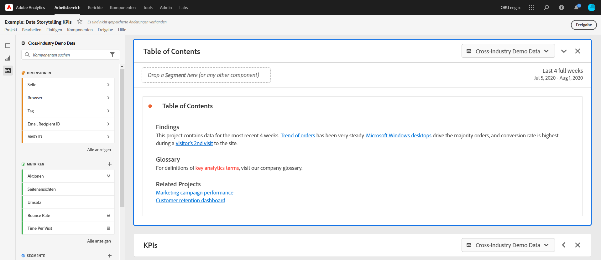

# Erstellen von freigebbaren Links

Analysis Workspace bietet viele Möglichkeiten, ein Projekt für Ihre Benutzer freizugeben, einschließlich der Möglichkeit, einen Link zu einem Projekt oder einem bestimmten Teil eines Projekts absurufen. Bei einigen Link-Typen muss sich der Empfänger vor dem Zugriff auf das Projekt bei Customer Journey Analytics anmelden, bei anderen nicht.

## Abrufen eines Projekt-Links zur Freigabe für andere Workspace-Benutzende {#project-link}

Um einen Link für ein Projekt freizugeben, gehen Sie zu dem Projekt, das Sie freigeben möchten, und wählen Sie dann **[!UICONTROL Freigeben]** > **[!UICONTROL Projektlink abrufen]** (oder **[!UICONTROL Freigeben]** > **[!UICONTROL Für Workspace-Benutzer freigeben]** > **[!UICONTROL Über Link freigeben]**). Benutzende, für die Sie den Link freigeben, müssen sich anmelden.

Wenn dem Empfänger des Links keine [Projektrolle“ zugewiesen wurde](/help/analysis-workspace/curate-share/share-projects.md) erhalten Administratoren **[!UICONTROL Original bearbeiten]** und Nicht-Administratoren **[!UICONTROL Kopie bearbeiten]** Erlebnisse.

## Abrufen eines schreibgeschützten Links zur Freigabe für alle

Sie können einen schreibgeschützten Link zu Analysis Workspace-Projekten für Personen freigeben, die keinen Zugriff auf Customer Journey Analytics haben.

Weitere Informationen finden Sie unter [Für alle freigeben](/help/analysis-workspace/curate-share/share-projects.md#share-a-project-with-anyone-no-login-required).

## Abrufen eines Bedienfelds oder Visualisierungs-Links {#panel-link}

Sie können auch einen Link zu einem bestimmten Teil eines Projekts freigeben, z. B. einem Bedienfeld oder einer individuellen Visualisierung. Dies wird manchmal auch als Intra-Linking bezeichnet. Dies kann nützlich sein, um die Aufmerksamkeit Ihrer Benutzerinnen und Benutzer auf wichtige Erkenntnisse im Projekt zu lenken.

* Wählen Sie im Kontextmenü einer Bereichskopfzeile die Option **[!UICONTROL Bereichslink abrufen]**
* Wählen Sie im Kontextmenü einer Visualisierungskopfzeile die Option **[!UICONTROL Visualisierungslink abrufen]**

[Sehen Sie sich das Video an](https://experienceleague.adobe.com/docs/analytics-learn/tutorials/analysis-workspace/visualizations/intra-linking-in-analysis-workspace.html?lang=de), wie Sie Links erstellen und diese verwenden, um Empfänger zu bestimmten Teilen Ihres Projekts zu führen.

## Verwenden von Links in einem Inhaltsverzeichnis {#TOC}

Ein Tipp für die Nutzung der verschiedenen Link-Optionen besteht darin, immer ein Inhaltsverzeichnis am Anfang Ihres Workspace-Projekts einzufügen. Im Inhaltsverzeichnis können Sie Links zu anderen relevanten Projekten, spezifischen Bedienfeldern und spezifischen Visualisierungen erstellen. Dies erleichtert dem Empfänger des Projekts die Navigation.

[Sehen Sie sich das Video an](https://experienceleague.adobe.com/docs/analytics-learn/tutorials/analysis-workspace/navigating-workspace-projects/create-a-toc-in-analysis-workspace.html?lang=de), wie Sie mithilfe von Links und dem Rich-Text-Editor von Workspace ein Inhaltsverzeichnis erstellen.

