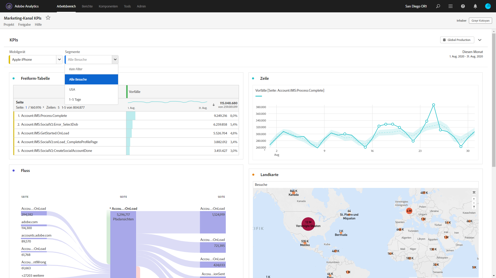

# Schreibgeschützte Projekte

Sie können Projekte über den [Projektfreigabe-Workflow](/help/analysis-workspace/curate-share/share-projects.md) für Empfänger als „schreibgeschützt“ freigeben. Empfänger mit der Rolle „Kann anzeigen“ erhalten ein eingeschränkteres Projekterlebnis. Dies kann wünschenswert sein, wenn Sie ein Projekt für Benutzende freigeben, die mit der Datenstruktur Ihres Unternehmens, Analysis Workspace oder Customer Journey Analytics im Allgemeinen nicht so vertraut sind, aber dennoch Daten und Erkenntnisse in einer sicheren Umgebung nutzen sollen.

## Deaktivierte Interaktionen

Zu den deaktivierten Interaktionen in einem schreibgeschützten Projekt gehören:

* Ausgeblendeter linker Bereich
* Datumsbereich des Bedienfeldkalenders. Hinweis: Wenn Sie zulassen möchten, dass die Empfänger Kontrolle über den Kalender haben, fügen Sie einen [Dropdown-Filter mit Datumsbereichen](https://experienceleague.adobe.com/docs/analytics-learn/tutorials/analysis-workspace/using-panels/using-drop-down-filters.html?lang=de) hinzu.
* Freiformfilterung
* Freiform – Anzahl der sichtbaren Zeilen
* Freiformzeilen-, Spalten- oder Visualisierungseinstellungen
* Bedienfeldfilter
* Menüs „Bearbeiten“, „Einfügen“ und „Komponenten“
* Workspace-Tipps

## Aktivierte Interaktionen

Zu den wichtigen aktivierten Interaktionen in einem schreibgeschützten Projekt gehören:

| Bereich | Aktivierte Interaktionen |
| --- | --- |
| Freiformtabellen | <ul><li>Paginierung und Sortierung</li><li>Bewegen</li><li>Zellauswahl, die verknüpfte Visualisierungen aktualisiert</li><li>Rechtsklick > Visualisierungs-Link abrufen</li><li>Rechtsklick > In Zwischenablage kopieren</li></ul> |
| Visualisierungen | <ul><li>Klicken zum Aktivieren/Deaktivieren der Legende</li><li>Bewegen</li><li>Rechtsklick > Visualisierungs-Link abrufen</li><li>Reduzieren/Erweitern</li><li>Fluss – Flussknoten erweitern</li><li>Karte – Zoomen</li></ul> |
| Bedienfelder | <ul><li>Interaktive Dropdown-Filter</li><li>Rechtsklick > Bedienfeld-Link abrufen</li><li>Reduzieren/Erweitern</li></ul> |
| Projekt | <ul><li>Alle Infosymbole überprüfen</li><li>Projektmenü – Neu, Öffnen, Als Landingpage festlegen, Aktualisieren, CSV/PDF herunterladen, eingeschränkte Projektinfo und Einstellungen</li><li>Menü „Freigeben“ – Projekt-Link abrufen, Datei jetzt senden</li><li>Menü „Hilfe“ – Alle Aktionen mit Ausnahme der Optionen für Tipps und Debugger</li></ul> |
