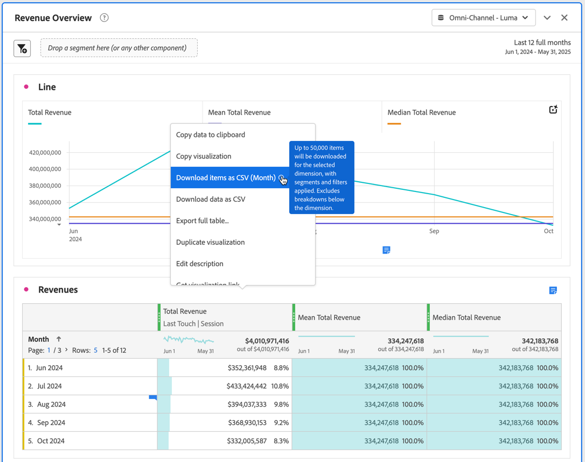

# Projekte und Daten herunterladen

Sie können Analysis Workspace-Projekte und -Daten auf Ihr lokales Gerät herunterladen. Dieser Download kann in eine CSV-Datei (CSV = Comma Separated Value Data) oder ein PDF-Dokument (Portable Document Format) kopiert werden.

* Wählen Sie die Option PDF aus, wenn Sie möchten, dass Visualisierungen in der heruntergeladenen Datei enthalten sind.
* Wählen Sie die Optionen CSV und Kopierte Daten aus, wenn Sie einfach Nur-Text-Daten benötigen.

Weitere Methoden zum Exportieren von Customer Journey Analytics-Daten finden Sie unter [Exportübersicht](/help/analysis-workspace/export/export-project-overview.md).

## Herunterladen eines Projekts als PDF- oder CSV-Datei {#download-project}

### Herunterladen eines Projekts als PDF-Datei

Beachten Sie beim Herunterladen eines Projekts als PDF Folgendes:

* Verlassen Sie das Projekt erst, wenn das Projekt auf Ihre Workstation heruntergeladen wurde. Der Download kann einige Minuten dauern, da das Projekt erneut auf Adobe-Servern ausgeführt wird, damit PDF gerendert werden kann. Sie können weitere Änderungen am Projekt vornehmen, während der Download gerendert wird. Wenn das Rendern einer PDF länger als 5 Minuten dauert, werden Sie aufgefordert, stattdessen eine E[Mail an die PDF &#x200B;](../curate-share/send-schedule-files.md) senden.
* Downloads werden als einzelne Seite ohne Seitenumbruch gerendert.
* Die PDF enthält, was auf der Browser-Seite in Analysis Workspace angezeigt wird. Um abgeschnittene Inhalte zu vermeiden, wählen Sie  aus, um die Größe aller Visualisierungen oder Bedienfelder in benutzerdefinierter Größe automatisch zu ändern.
* [Hyperlinks](/help/analysis-workspace/visualizations/freeform-table/freeform-table-hyperlinks.md) innerhalb von Freiformtabellen sind in der heruntergeladenen PDF klickbar.

So laden Sie ein Projekt als PDF-Datei herunter:

1. Wählen Sie **[!UICONTROL Projekt]** > **[!UICONTROL PDF herunterladen]**.

   Ein grüner Balken mit der folgenden Meldung wird angezeigt:  **[!UICONTROL Ihr Download wurde angefordert. Bitte warten.]**

1. Sobald der Download fertig ist, wird ein grüner Balken mit der folgenden Meldung angezeigt:  **[!UICONTROL *Name des Projekts *PDF ist bereit.]**

1. Wählen **[!UICONTROL in]** grünen Leiste „Herunterladen“ aus.

   Abhängig von Ihren Browsereinstellungen wird die PDF automatisch in den Ordner heruntergeladen, den Sie zuvor konfiguriert haben, oder Sie werden aufgefordert, einen Ordner auszuwählen, in den die PDF heruntergeladen werden soll.

   Der Dateiname besteht aus *Projektname* - *Name der Report Suite* - *Datum*. Zum Beispiel `Example Project - Omni-Channel - Luma - Jun 30, 2025.pdf`.

### Ein Projekt als CSV-Datei herunterladen

1. Wählen Sie **[!UICONTROL Projekt]** > **[!UICONTROL CSV herunterladen]** aus.

   Abhängig von Ihren Browser-Einstellungen wird die CSV-Datei automatisch in einen Ordner heruntergeladen, den Sie zuvor konfiguriert haben. Andernfalls werden Sie aufgefordert, einen Ordner auszuwählen, in den die CSV-Datei heruntergeladen werden soll.

   Der Dateiname besteht aus *Projektname* - *Name der Report Suite* - *Datum*. Zum Beispiel `Example Project - Omni-Channel - Luma - Jun 30, 2025.csv`.

## Kopieren von Daten innerhalb einer Visualisierung in die Zwischenablage {#copy-data}

Mit **[!UICONTROL Option „In Zwischenablage]**&quot; im Kontextmenü können Sie Daten schnell aus Analysis Workspace kopieren und in ein Tool eines Drittanbieters einfügen.

* Wenn die angezeigten Tabellendaten kopiert werden sollen, wählen Sie die Tabellenkopfzeile aus und wählen **Daten in die Zwischenablage kopieren** aus dem Kontextmenü.
* Wenn Sie möchten, dass nur ein Teil der Daten kopiert wird, wählen Sie die Tabelle aus und dann **Auswahl in Zwischenablage kopieren** aus dem Kontextmenü.

>[!TIP]
>
>Sie können die Hotkeys **_cmd + c_** (macOS) oder **_Strg + c_** (Windows) verwenden, um Ihre Auswahl in die Zwischenablage zu kopieren. Verwenden Sie dann **_cmd + v_** (macOS) oder **_Strg + v_** (Windows), um die Daten einzufügen.

{zoomable="yes"}

## Herunterladen von Daten innerhalb einer Visualisierung als CSV-Datei {#download-data}

Mit den Optionen Als CSV herunterladen aus dem Kontextmenü können Sie eine Datentabelle oder die Datenquelle einer beliebigen Visualisierung als CSV herunterladen.

Gehen Sie dazu wie folgt vor:

* Wählen Sie in der Kopfzeile einer Tabelle oder Visualisierung **[!UICONTROL Daten als CSV herunterladen]** aus dem Kontextmenü aus. Dadurch werden die in der Tabelle angezeigten Daten bzw. die zugrunde liegende Datenquelle für eine Visualisierung als CSV heruntergeladen.

<!-- Only relevant as soon as CJA supports Map visualization 
  >[!NOTE]
  >
  >  Note: the Map visualization does not support this option.
-->

* Wählen Sie in einer Tabelle **[!UICONTROL Auswahl als CSV herunterladen]** aus dem Kontextmenü aus. Mit dieser Option wird nur die Auswahl heruntergeladen, nicht die vollständige, angezeigte Tabelle.

## Objekte als CSV-Datei herunterladen {#download-items}

Wenn Sie mehr als die 400 sichtbaren Zeilen mit Daten in einer Tabelle analysieren möchten, wählen Sie **Elemente als CSV herunterladen (_Dimension-Name_)** aus dem Kontextmenü der Tabellenkopfzeile oder einer beliebigen Zeile. Diese Option exportiert bis zu 50.000 Dimensionselemente (basierend auf der Tabellensortierung) für die ausgewählte Dimension, wobei Sortieroptionen und Filter angewendet werden. Wenn Sie diese Option oben in der Tabelle auswählen, wird die erste Dimension in der Tabelle exportiert.

In der Freiformtabelle werden keine Einschränkungen erzwungen. Um eine optimale Leistung zu gewährleisten, wird empfohlen, diese Option in Tabellen mit weniger als 20 Spalten zu verwenden.

>[!TIP]
>
> Wenn Ihre Dimension 50.000 Elemente überschreitet, laden Sie die Datei mit unterschiedlichen Sortiermetriken herunter oder wenden Sie ein Segment an. Sortieren Sie z. B. absteigend nach Besuchen in einem Download und dann aufsteigend nach Besuchen in einem zweiten Download. Dieser Tipp hilft Ihnen beim Abrufen von längeren Elementen.

Während eines Downloads können Sie mehrere Aufgaben im Projekt ausführen und sogar zu einem neuen Workspace-Projekt auf derselben Registerkarte navigieren. Der Download wird angehalten, wenn Sie eine neue Browser-Registerkarte öffnen. Der Download wird abgebrochen, wenn Sie Workspace vollständig verlassen oder die Browser-Registerkarte schließen.

### Datei mit heruntergeladenen Elementen {#items-file}

Die folgenden Funktionen einer Freiformtabelle werden auf die heruntergeladene Datei angewendet:

* Alle Bedienfeldsegmente werden als Filter angewendet.
* Aufschlüsselungen **oberhalb** der ausgewählten Dimension in der Tabelle werden als Filter über jeder einzelnen Spalte angezeigt.
* Aufschlüsselungen **unterhalb** der ausgewählten Dimension in der Tabelle werden entfernt.

### Download-Benachrichtigungen {#notifications}

Beim Herunterladen der Datei werden die folgenden Benachrichtigungen angezeigt:

* Ein blauer **[!UICONTROL _Tabellenname _-_Dimension _.csv wurde angefordert._x _% abgeschlossen]**&#x200B;was den Fortschritt anzeigt. Um den Download jederzeit abzubrechen, wählen Sie **[!UICONTROL Download abbrechen]**. Wählen Sie  aus, wenn Sie die Nachricht schließen möchten. Der Download wird dadurch nicht abgebrochen.
* Ein grüner **[!UICONTROL _Tabellenname _-_Dimension _.csv wurde heruntergeladen]**&#x200B;Fertigstellungsbenachrichtigung, sobald der Dateidownload abgeschlossen ist. Die Datei wird in den Ordner „Downloads“ heruntergeladen, der für Ihren Browser konfiguriert ist.

Wenn Sie mehrere Downloads gleichzeitig anfordern, erhalten Sie eine Benachrichtigung, dass jeder weitere Download in die Warteschlange gestellt wird, bis der vorherige Download abgeschlossen ist.

## Herunterladen sensibler Daten {#sensitive}

Stellen Sie sich eine [Data Governance-Richtlinie](/help/data-views/data-governance.md) vor, die den Download von Daten verhindert. Und dass diese Richtlinie in der Datenansicht, über die Sie Bericht erstatten, aktiviert ist. Daher werden beim Herunterladen (z. B. beim Senden von E-Mails oder beim Freigeben von PDF-Dateien) von Projekten die als sensibel gekennzeichneten Datenfelder durchleuchtet. Sie können in Analysis Workspace weiterhin Analysen zu diesen Feldern durchführen. Wenn Sie versuchen, ein Projekt per E-Mail zu versenden oder anderweitig freizugeben, erscheinen die sensiblen Datenfelder in der PDF- oder CSV-Datei als leer.

Wenn als sensibel gekennzeichnete Datenfelder in der Datenansicht enthalten sind, ist die Option zum Auswählen und Kopieren von Daten auf dem Bildschirm für alle Daten in der Datenansicht eingeschränkt.

## Häufig gestellte Fragen {#faq}

| Frage | Antwort |
| --- | --- |
| Warum besteht meine heruntergeladene PDF nur aus einer Seite? | Mit [&#x200B; Funktion &quot;PDF herunterladen](#download-as-csv-or-pdf) werden heruntergeladene PDFs nicht in Seiten unterteilt. |
| Kann ich mehr als 50.000 Elemente mit der Option **[!UICONTROL Elemente als CSV herunterladen]** exportieren? | Während jeder Download bis zu 50.000 Dimensionselemente enthalten kann, können Sie die Sortierung der Tabelle ändern, um längere Elemente abzurufen, oder einen Filter anwenden, um spezifischere Elemente herunterzuladen. |
| Beschreibung der Funktion **[!UICONTROL Visualisierung kopieren]** | Im Gegensatz [!UICONTROL **Daten in Zwischenablage kopieren**] oder [!UICONTROL **Auswahl in Zwischenablage kopieren**] ist die Kontextmenüoption **[!UICONTROL Visualisierung kopieren]** keine Exportoption. Mit dieser Option können Sie [eine Visualisierung kopieren](/help/analysis-workspace/visualizations/freeform-analysis-visualizations.md#context-menu) oder [ein Bedienfeld kopieren](/help/analysis-workspace/c-panels/panels.md#context-menu) von einer Stelle in Workspace an eine andere. Beispielsweise von einem Bedienfeld zu einem anderen im selben Projekt oder von einem Projekt zu einem anderen. |
