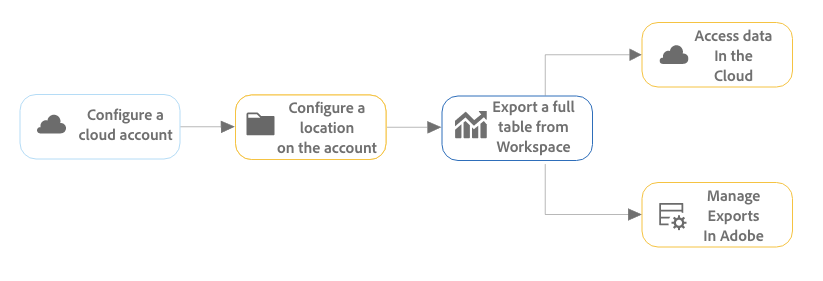
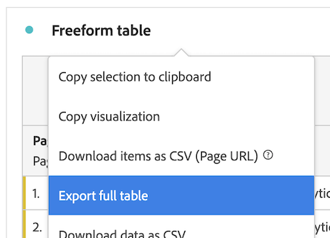

# Exportieren von vollständigen Tabellen in die Cloud {#full-table-export}

<!-- markdownlint-disable MD034 -->

>[!CONTEXTUALHELP]
>id="cja-upgrade-full-table-export"
>title="Erstellen vollständiger Tabellenexporte ähnlich wie in Data Warehouse"
>abstract="Vollständige Tabellenexporte sind verfügbar, sobald Daten in Analysis Workspace angezeigt werden. Sie können bei Bedarf vollständige Tabellenexporte erstellen oder planen.  Das Erstellen vollständiger Tabellenexporte dauert nur wenige Minuten, wenn Sie bereits wissen, welche Daten in den Export aufgenommen werden sollen."

<!-- markdownlint-enable MD034 -->

In Customer Journey Analytics können Sie vollständige Tabellen aus Analysis Workspace in bestimmte Cloud-Ziele exportieren.

Es sind auch andere Methoden zum Exportieren von Customer Journey Analytics-Berichten verfügbar, wie unter [Exportübersicht](/help/analysis-workspace/export/export-project-overview.md) beschrieben.

## Informationen zum vollständigen Tabellenexport

Sie können vollständige Tabellen aus Analysis Workspace zu Cloud-Anbietern wie Google, Azure, Amazon und Adobe exportieren.

[Vorteile des vollständigen Tabellenexports](#advantages-of-full-table-export) umfassen die Möglichkeit, Millionen von Zeilen zu exportieren, berechnete Metriken einzubeziehen, die Ausgabe von Strukturdaten in verketteten Werten zu strukturieren und vieles mehr.

Berücksichtigen Sie beim Exportieren vollständiger Tabellen Folgendes:

* Stellen Sie vor dem Export in die Cloud sicher, dass Ihre Tabellen, Ihre Umgebung und Ihre Berechtigungen die [Mindestanforderungen für den Export](#minimum-requirements) erfüllen.

* Einige [Funktionen](#unsupported-features) und [Komponenten](#unsupported-components) werden beim Exportieren vollständiger Tabellen in die Cloud nicht unterstützt.

Verwenden Sie den folgenden Prozess beim Exportieren vollständiger Tabellen in die Cloud:

1. [Konfigurieren eines Cloud-Kontos](/help/components/exports/cloud-export-accounts.md)

1. [Konfigurieren eines Speicherorts für das Konto](/help/components/exports/cloud-export-locations.md)

1. [Exportieren einer vollständigen Tabelle aus Workspace](#export-full-tables)

1. Zugriff auf Daten in der Cloud in Ihrem Cloud-Konto und [Exporte in Adobe verwalten](/help/components/exports/manage-exports.md)

## Exportieren von vollständigen Tabellen  {#export-from-workspace}

<!-- markdownlint-disable MD034 -->

>[!CONTEXTUALHELP]
>id="cja-export-details"
>title="Details"
>abstract="Geben Sie einen Namen für den Export an. Sie können auch eine Beschreibung und beliebige Tags hinzufügen. Diese Informationen helfen bei der Identifizierung des Exports in der Exporttabelle und in E-Mail-Benachrichtigungen."

<!-- markdownlint-enable MD034 -->

<!-- markdownlint-disable MD034 -->

>[!CONTEXTUALHELP]
>id="cja-export-data-structure"
>title="Datenstruktur"
>abstract="Dies ist die Freiformtabelle, die Sie exportieren. Sie können die Datenstruktur ändern, indem Sie Komponenten aus dem linken Panel in die Tabelle ziehen. Sie können einen Filter anwenden, indem Sie eine Komponente in den Filterbereich ziehen. Die Tabelle wird dynamisch aktualisiert, wenn Sie Komponenten zur Arbeitsfläche hinzufügen."

<!-- markdownlint-enable MD034 -->

<!-- markdownlint-disable MD034 -->

>[!CONTEXTUALHELP]
>id="export-manifest"
>title="Manifestdatei einschließen"
>abstract="Wenn diese Option ausgewählt wird, ist eine Manifestdatei in jedem erfolgreichen Exportversand enthalten. Mit der Manifestdatei können Sie bestätigen, dass alle Dateien erfolgreich bereitgestellt wurden."

<!-- markdownlint-enable MD034 -->

<!-- markdownlint-disable MD034 -->

>[!CONTEXTUALHELP]
>id="cja-export-schedule"
>title="Zeitplan"
>abstract="Wählen Sie aus, wie oft der Export erfolgen soll. Wählen Sie „Jetzt senden (einmalig)“ aus, um den Export sofort zu starten. Geplante Exporte werden zu dem von Ihnen angegebenen Zeitpunkt initiiert."

<!-- markdownlint-enable MD034 -->

<!-- markdownlint-disable MD034 -->

>[!CONTEXTUALHELP]
>id="cja-export-destination"
>title="Ziel"
>abstract="Wählen Sie das Cloud-Konto und den Speicherort aus, an den die Daten gesendet werden sollen. Sie können ein vorhandenes Konto und einen Speicherort auswählen oder auf „Neu hinzufügen“ klicken, um diese zu erstellen. Geben Sie Benutzende und Gruppen an, die über fehlgeschlagene oder ablaufende Exporte benachrichtigt werden sollen."

<!-- markdownlint-enable MD034 -->

<!-- markdownlint-disable MD034 -->

>[!CONTEXTUALHELP]
>id="cja-export-file-format"
>title="Dateiformat"
>abstract="Bei Auswahl des Parquet-Dateiformats werden einige in Komponentennamen enthaltene Sonderzeichen durch einen Unterstrich (_) ersetzt. Eine vollständige Liste der ersetzten Zeichen finden Sie unter dem unten stehenden Link."

<!-- markdownlint-enable MD034 -->

<!-- markdownlint-disable MD034 -->

>[!CONTEXTUALHELP]
>id="cja-export-notifications"
>title="Benachrichtigungen"
>abstract="Fügen Sie Benutzende und Gruppen hinzu, die benachrichtigt werden sollen, wenn dieser Export fehlschlägt oder demnächst abläuft."

<!-- markdownlint-enable MD034 -->

>[!NOTE]
>
>Bevor Sie Daten wie in diesem Abschnitt beschrieben exportieren, lesen Sie oben im Abschnitt [Informationen zum vollständigen Tabellenexport](#understand-full-table-export) mehr über den vollständigen Tabellenexport.

So exportieren Sie vollständige Tabellen aus Analysis Workspace:

1. Falls noch nicht geschehen, konfigurieren Sie ein Exportkonto und einen Speicherort, wie unter [Konfigurieren von Cloud-Exportkonten](/help/components/exports/cloud-export-accounts.md) und [Konfigurieren von Exportspeicherorten](/help/components/exports/cloud-export-locations.md) beschrieben.

1. Klicken Sie in Analysis Workspace mit der rechten Maustaste auf die Überschrift einer Freiformtabelle, um das Kontextmenü aufzurufen, und wählen Sie dann [!UICONTROL **Vollständige Tabelle exportieren**].

   

1. Geben Sie im Dialogfeld [!UICONTROL **Neuer vollständiger Tabellenexport**] die folgenden Informationen an:

   | Feldname | Funktion |
   |---------|----------|
   | Name | Geben Sie einen Namen für den Export an. Dieser Name wird in der Liste der Exporte angezeigt. |
   | Tags | Sie können ein vorhandenes Tag auf den Export anwenden oder ein neues Tag erstellen und anwenden. 
Um ein vorhandenes Tag auf den Export anzuwenden, wählen Sie beliebige Tags aus dem Dropdown-Menü aus. Alle Tags in Ihrem Unternehmen können angewendet werden.
 
Geben Sie zum Erstellen eines neuen Tags den Namen des neuen Tags ein und drücken Sie dann die Eingabetaste.

Beachten Sie beim Anwenden von Tags auf einen Export Folgendes: <ul><li>Es ist möglich, in der Exporttabelle Tags, die Sie verwenden, zu filtern, oder nach diesen zu suchen.</li> <li>Tags, die auf ein Projekt angewendet werden, werden beim Exportieren einer vollständigen Tabelle nicht automatisch angewendet, wie unter „Konfigurieren von Spalten auf der Seite „Exporte“ in [Exporte verwalten](/help/components/exports/manage-exports.md) beschrieben. (Alternativ werden bei [Planung eines vollständigen Projekts für den Export](/help/analysis-workspace/export/t-schedule-report.md) alle auf das Projekt angewendeten Tags automatisch auf den Export angewendet.) </li></ul> |
   | Beschreibung | Fügen Sie eine Beschreibung zu dem Export hinzu. Beim Anzeigen von Exporten können Sie die Beschreibungen als Spalte auf der [Seite Exporte](/help/components/exports/manage-exports.md) anzeigen. |
   | Datenansicht | Wählen Sie die Datenansicht mit den Komponenten aus, die Sie in den Export einbeziehen möchten. Das  Dropdown-Menü Datenansicht befindet sich in der oberen linken Ecke des Dialogfelds.  
**Hinweis:** Wenn Sie eine Datenansicht auswählen, in der Komponenten fehlen, die bereits in der Datentabelle enthalten sind, werden Sie aufgefordert, den Bereich zu löschen und erneut zu erstellen. Verwenden Sie dazu Komponenten, die in der ausgewählten Datenansicht enthalten sind. 
 |
   | Datenstruktur | Zeigt die Freiformtabelle an, die exportiert wird. Sie können die Datenstruktur ändern, indem Sie Komponenten aus dem linken Panel in die Tabelle ziehen. Sie können einen Filter anwenden, indem Sie eine Komponente in den Filterbereich ziehen. Die Tabelle wird dynamisch aktualisiert, wenn Sie Komponenten zur Arbeitsfläche hinzufügen. Sie können bis zu 10 Spalten einschließen.
Alle Segmente, die auf die vollständige Tabelle im Projekt angewendet wurden, werden über der Tabelle angezeigt. Sie können ein Segment oder eine Gruppe von Segmenten auf einen Export anwenden.
 |
   | Berichtsfenster | Wählen Sie den Berichtszeitrahmen aus, der in jede Exportdatei aufgenommen werden soll. Die Optionen umfassen [!UICONTROL **Heute**], **[!UICONTROL Gestern]**, **[!UICONTROL Letzte 7 Tage]**, **[!UICONTROL Letzte 30 Tage]**, **[!UICONTROL Diese Woche]** und **[!UICONTROL Diesen Monat]**. 
Diese Option wird nicht angezeigt, wenn **[!UICONTROL Exporthäufigkeit]** auf **[!UICONTROL Jetzt senden (einmalig)]** festgelegt ist.
 |
   | Alle löschen | Löscht den Inhalt der Datentabelle. Auf diese Weise können Sie direkt im Dialogfeld „Neuer vollständiger Tabellenexport“ mit dem Erstellen einer neuen Tabelle beginnen. |
   | Dateiformat | Wählen Sie aus, ob die exportierten Daten im .csv-, .json- oder .parquet-Format vorliegen sollen. 
Bei der Auswahl des Parquet-Dateiformats wird eines der folgenden in Komponentennamen enthaltenen Zeichen durch einen Unterstrich (_) ersetzt: <ul><li>&#39; &#39; - ASCII-Leerzeichen</li><li>&quot;,“ - ASCII-Komma</li><li>&#39;;&#39; - ASCII-Doppelpunkt</li><li>&#39;{&#39; oder &#39;}&#39; - öffnende/schließende ASCII-geschweifte Klammer</li><li>&#39;(&#39; oder &#39;)&#39; - öffnende/schließende ASCII-Klammer</li><li>&#39;\n&#39; - ASCII-Zeilenumbruch</li><li>&#39;\t&#39; - Registerkarte ASCII</li><li>&#39;=&#39; - ASCII ist gleich</li></ul>
 |
   | Manifestdatei einschließen | Wenn diese Option aktiviert ist, ist eine Manifestdatei in jedem erfolgreichen Exportversand enthalten. 
Mit der Manifestdatei können Sie bestätigen, dass alle Dateien erfolgreich bereitgestellt wurden. Sie enthält die folgenden Informationen:
 <ul><li>Eine Liste aller zugestellten Dateien</li><li>Die MD5-Prüfsumme jeder Datei</li></ul>
Exportierte Daten sind als komprimierte Datei in dem von Ihnen konfigurierten Cloud-Ziel verfügbar, wie in [Konfigurieren von Cloud-Exportkonten](/help/components/exports/cloud-export-accounts.md) und [Konfigurieren von Cloud-Exportspeicherorten](/help/components/exports/cloud-export-locations.md) beschrieben.

Der Dateiname der komprimierten Datei lautet wie folgt, je nachdem, ob Sie **[!UICONTROL csv]**, **[!UICONTROL json]** oder **[!UICONTROL parquet]** als Dateiformat ausgewählt haben:
<ul> <li>`cja-export-{reportInstanceId}-{idx}.csv.gz`</li><li>`cja-export-{reportInstanceId}-{idx}.json.gz`</li><li>`cja-export-<instanceId>-<idx>.snappy.parquet`
Jede Spalte in der Parquet-Datei wird komprimiert.
</li></ul>
Wählen Sie oben im Feld **[!UICONTROL Dateiformat]** das Dateiformat aus.
 |
   | Häufigkeit | Legen Sie fest, wie oft der Export erfolgen soll. 
Sie können [!UICONTROL **Jetzt senden (einmalig)**] wählen, um den Export nur einmal zu senden. Bei Auswahl dieser Option wird der Export sofort gestartet.

Sie können alternativ festlegen, dass der Export gemäß einem festgelegten Zeitplan gesendet wird. Zu den Optionen beim Versand gemäß Zeitplan zählen **[!UICONTROL Täglich]**, **[!UICONTROL Wöchentlich]**, **[!UICONTROL Monatlich am Wochentag]**, **[!UICONTROL Monatlich am Tag des Monats]**, **[!UICONTROL Jährlich am Tag des Monats]** und **[!UICONTROL Jährlich an einem bestimmten Datum]**. 
 
Beachten Sie bei der Auswahl einer Exporthäufigkeit Folgendes:
<ul><li>Die Optionen im Feld **[!UICONTROL Lookback]** ändern sich je nachdem, was Sie hier auswählen.</li><li>Zusätzliche Konfigurationsfelder werden je nach ausgewählter Option angezeigt.</li></ul> |
   | Startet am | Der Tag und die Uhrzeit, an dem bzw. zu der der geplante Export beginnen soll. 
Diese Option ist nur bei Auswahl einer Häufigkeit für den geplanten Export verfügbar.
 |
   | Endet am | Der Tag und die Uhrzeit, an dem bzw. zu der der geplante Export abläuft. Der geplante Export wird nach dem von Ihnen festgelegten Datum und der von Ihnen festgelegten Uhrzeit nicht mehr ausgeführt. 
Diese Option ist nur bei Auswahl einer Häufigkeit für den geplanten Export verfügbar.
 |
   | Ziele aller Benutzenden anzeigen | Systemadministratoren können diese Option auswählen, um alle Konten und Standorte anzuzeigen, unabhängig davon, wer sie erstellt hat. |
   | Konto | Wählen Sie das Cloud-Exportkonto aus, an das die Daten gesendet werden sollen. 
Wenn Sie noch kein Cloud-Konto konfiguriert haben, das Sie verwenden möchten, können Sie auch ein neues Konto konfigurieren:<ol><li>Wählen Sie **[!UICONTROL Dropdown]** Menü „Konto“ die Option **[!UICONTROL Konto hinzufügen]** und geben Sie dann die folgenden Informationen an:<ul><li>**[!UICONTROL Name des Standortkontos]**: Geben Sie einen Namen für das Standortkonto an. Dieser Name wird beim Erstellen eines Speicherorts angezeigt. </li><li>**[!UICONTROL Beschreibung des Standortkontos]**: Geben Sie eine kurze Beschreibung des Kontos ein, um es von anderen Konten desselben Kontotyps zu unterscheiden.</li><li>**Konto für alle Benutzer in Ihrer Organisation verfügbar machen**: Wählen Sie diese Option aus, wenn Sie anderen Benutzern in Ihrer Organisation die Verwendung des Kontos erlauben möchten.</li><li>**[!UICONTROL Kontotyp]**: Wählen Sie den Typ des Cloud-Kontos aus, in das Sie exportieren. Verfügbare Kontotypen sind Amazon S3 Role ARN, Google Cloud Platform, Azure SAS, Azure RBAC, Snowflake und AEP Data Landing Zone.</li></ul><li>Um die Konfiguration Ihres Kontos abzuschließen, fahren Sie mit dem unten stehenden Link fort, der dem von Ihnen ausgewählten **[!UICONTROL Kontotyp]** entspricht:<ul><li>[AEP Data Landing Zone](/help/components/exports/cloud-export-accounts.md#aep-data-landing-zone)</li><li>[Amazon S3 Role ARN](/help/components/exports/cloud-export-accounts.md#amazon-s3-role-arn)</li><li>[Google Cloud Platform](/help/components/exports/cloud-export-accounts.md#google-cloud-platform)</li><li>[Azure SAS](/help/components/exports/cloud-export-accounts.md#azure-sas)</li><li>[Azure RBAC](/help/components/exports/cloud-export-accounts.md#azure-rbac)</li><li>[Snowflake](/help/components/exports/cloud-export-accounts.md#snowflake)</li></ul></ol> |
   | Standort | Wählen Sie den Speicherort in dem Konto aus, an den die Exportdaten gesendet werden sollen.
Wenn Sie noch kein Cloud-Konto konfiguriert haben, das Sie verwenden möchten, können Sie auch ein neues Konto konfigurieren:<ol><li>Wählen Sie **[!UICONTROL Dropdown]** Menü „Speicherort hinzufügen **[!UICONTROL aus und geben Sie]** Informationen an:<ul><li>**[!UICONTROL Name:]** Der Name des Speicherorts.</li><li>**[!UICONTROL Beschreibung]**: Geben Sie eine kurze Beschreibung des Speicherorts an, um ihn von anderen Speicherorten im Konto zu unterscheiden.</li><li>**Standort allen Benutzern in Ihrer Organisation zur Verfügung stellen**: Wählen Sie diese Option aus, wenn Sie anderen Benutzern in Ihrer Organisation die Verwendung des Standorts ermöglichen möchten.</li><li>**[!UICONTROL Standortkonto]**: Wählen Sie das Konto aus, in dem Sie den Speicherort erstellen möchten.</li></ul><li>Um die Konfiguration Ihres Speicherorts abzuschließen, fahren Sie mit dem untenstehenden Link fort, der dem Kontotyp entspricht, den Sie im Feld **[!UICONTROL Standortkonto]** ausgewählt haben:<ul><li>[AEP Data Landing Zone](/help/components/exports/cloud-export-locations.md#aep-data-landing-zone).</li><li>[Amazon S3 Role ARN](/help/components/exports/cloud-export-locations.md#amazon-s3-role-arn)</li><li>[Google Cloud Platform](/help/components/exports/cloud-export-locations.md#google-cloud-platform)</li><li>[Azure SAS](/help/components/exports/cloud-export-locations.md#azure-sas)</li><li>[Azure RBAC](/help/components/exports/cloud-export-locations.md#azure-rbac)</li><li>[Snowflake](/help/components/exports/cloud-export-locations.md#snowflake)</li></ul> |
   | Benachrichtigungen | Fügen Sie Benutzende und Gruppen hinzu, die benachrichtigt werden sollen, wenn dieser Export fehlschlägt oder demnächst abläuft. Beginnen Sie mit der Eingabe des Namens oder der E-Mail-Adresse eines Benutzers oder beginnen Sie mit der Eingabe des Namens einer Gruppe und wählen Sie sie aus, wenn sie in der Dropdown-Liste angezeigt wird. |

   {style="table-layout:auto"}

1. Wählen Sie auf [!UICONTROL **Speichern**] aus, um den Export zu speichern.

   Die Daten werden mit der von Ihnen angegebenen Häufigkeit an das von Ihnen angegebene Cloud-Konto gesendet.

1. (Optional) Unabhängig davon, ob Sie den Export jetzt oder nach einem festgelegten Zeitplan senden, können Sie ihn nach der Erstellung auf der [Seite Exporte](/help/components/exports/manage-exports.md) anzeigen und verwalten und in den [Exportprotokollen](/help/components/exports/manage-export-logs.md) anzeigen.

## Verwalten von Exporten

Nachdem Daten aus Analysis Workspace exportiert wurden, können Sie bestehende Exporte bearbeiten, erneut exportieren, duplizieren, taggen oder löschen, wie in [Verwalten von Exporten](/help/components/exports/manage-exports.md) beschrieben.

## Vorteile des vollständigen Tabellenexports {#advantages}

Das Exportieren von Customer Journey Analytics-Daten in die Cloud ermöglicht Ihnen Folgendes:

* Exportieren Sie an einen gemeinsamen Speicherort, z. B. Adobe Experience Platform Data Landing Zone, Google Cloud Platform, Microsoft Azure, Amazon S3 oder Snowflake.

* Speichern Sie große Mengen historischer Daten.

  Diese Art von Daten kann verwendet werden, um langfristige Trends zu erkennen, um Business Intelligence zu erhalten, und letztendlich zu einer besseren Geschäftsentscheidung zu führen.

* Exportieren Sie vollständige Tabellen, die Tausende oder Millionen von Zeilen enthalten ( je nach Lizenztyp 3 Millionen, 30 Millionen, 150 Millionen oder 300 Millionen Zeilen). Andere Exportmethoden erlauben maximal 50.000 Zeilen.

* Schließen Sie berechnete Metriken in die exportierten Customer Journey Analytics-Daten ein.

* Strukturieren Sie die Datenausgabe als verkettete Werte.

* Exportieren Sie einmalig oder gemäß einem Zeitplan. (Auch verfügbar mit [anderen Exportoptionen](/help/analysis-workspace/export/export-project-overview.md).)

* Exportieren Sie Dateien im CSV-, JSON- oder Parquet-Format. (Auch verfügbar mit [anderen Exportoptionen](/help/analysis-workspace/export/export-project-overview.md).)

* Exportieren Sie Tabellen, die mehrere Dimensionen enthalten.

## Mindestanforderungen

Stellen Sie sicher, dass Ihre Tabellen, Ihre Umgebung und Ihre Berechtigungen die folgenden Anforderungen erfüllen:

* **Tabellen:** Alle Tabellen müssen mindestens eine Dimension in der Zeile und eine Metrik in jeder Spalte enthalten, damit sie durch einen vollständigen Tabellenexport unterstützt werden.

* **Umgebung:** Stellen Sie sicher, dass die von Customer Journey Analytics verwendeten [IP-Adressen](/help/technotes/ip-addresses.md) und [Domains](/help/technotes/domains.md) durch die Firewall ihrer Organisation zugelassen werden.

* **Berechtigungen:** In der Adobe Admin Console müssen Benutzenden ein Produktprofil zugewiesen werden, das über die Berechtigung **[!UICONTROL Vollständiger Tabellenexport]** verfügt, um vollständige Tabellen zu exportieren. Informationen zum Zuweisen einer Berechtigung zu einem Produktprofil in der Admin Console finden Sie unter [Berechtigung für Customer Journey Analytics in der Admin Console](/help/technotes/access-control.md).

  >[!NOTE]
  >
  >  Benutzende, denen die [Rolle Produktadmin](/help/technotes/access-control.md#product-admin-role) zugewiesen ist, haben immer Zugriff auf den Export vollständiger Tabellen. Diese Benutzenden müssen nicht über die Berechtigung **[!UICONTROL Vollständiger Tabellenexport]** verfügen.

## Nicht unterstützte Funktionen

Die folgenden Funktionen werden nicht unterstützt und automatisch aus vollständigen Tabellenexporten entfernt:

* Prozentsatz
* Gesamt
* Suchfilterung
* Statische Zeilen
* Datumsausrichtung
* Metriken aus Zusammenfassungsdatensätzen
* Dynamische Dimensionselemente

  Dynamische Dimensionselemente werden erstellt, wenn Sie eine Dimension in einer Spaltenüberschrift in einer Freiformtabelle ablegen. Dies führt dazu, dass die Spalte dynamisch nach den fünf wichtigsten Dimensionselementen gefiltert wird. In Analysis Workspace werden diese fünf wichtigsten Dimensionselemente jedes Mal aktualisiert, wenn Sie das Projekt laden. In einem Export als vollständige Tabelle werden diese Dimensionselemente statisch. Weitere Informationen finden Sie unter [Dynamische und statische Dimensionselemente in Freiformtabellen](/help/analysis-workspace/visualizations/freeform-table/column-row-settings/manual-vs-dynamic-rows.md).
* Dimensionen in der ersten Aufschlüsselung werden konvertiert und als sekundäre Dimension in der Zeile der exportierten Tabelle hinzugefügt. Alle anderen Aufschlüsselungen sind nicht in der Tabelle enthalten.
* Die Sortierung wird für die meisten Datensätze nicht unterstützt. Daten können für kleine Datensätze sortiert werden.

## Nicht unterstützte Komponenten

Die folgenden Komponenten werden nicht unterstützt und Analysis Workspace fordert Sie auf, sie aus Ihrer Tabelle zu entfernen, wenn Sie einen vollständigen Tabellenexport durchführen:

* Berechnete Metriken, die nicht unterstützte Funktionen in der Metrikdefinition verwenden (weitere Informationen finden Sie unter [Nicht unterstützte &#x200B;](#unsupported-calculated-metric-functions) Metrikfunktionen)
* Komponenten, die von einem Administrator am Export gehindert wurden (weitere Informationen finden Sie im Abschnitt *Segment zu Data Governance* Richtlinien in [Kennzeichnungen und &#x200B;](/help/data-views/data-governance.md))
* Jede Dimension, die alle der folgenden Kriterien erfüllt:
   * Er wird aus einem Feld erstellt, das Teil eines [Arrays von Objekten](/help/use-cases/object-arrays.md) ist (ähnlich wie Variablen mit mehreren Werten in Adobe Analytics).
   * Hat &quot;[&#x200B; aktiviert](/help/data-views/component-settings/persistence.md).
   * Verwendet keine [Bindungsdimension](/help/use-cases/data-views/binding-dimensions-metrics.md).
* Mehrere Dimensionen, die aus Feldern stammen, die auf verschiedene [Arrays von Objekten](/help/use-cases/object-arrays.md) verweisen. (Mehrere Dimensionen, die auf dasselbe Array von Objekten verweisen, sind zulässig.)
* Mehr als 10 Dimensionen und 10 Metriken pro Bericht (bis zu 10 Dimensionen und 10 Metriken werden unterstützt)
* In Tabellenspalten:
   * Datumsbereiche
   * Dimensionen
* In Tabellenzeilen:
   * Berechnete Metriken
   * Metriken
   * Datumsbereiche
   * Segmente

## Unterstützung von Funktionen für berechnete Metriken

In den folgenden grundlegenden und erweiterten Abschnitten sind die Funktionen für berechnete Metriken aufgeführt, die beim Exportieren vollständiger Tabellen unterstützt werden:

### Grundlegende Funktionsunterstützung

| Grundfunktion | Support-Status |
|---------|----------|
| Absolutwert |  Unterstützt |
| Spaltenmaximum |  Unterstützt |
| Spaltenminimum |  Unterstützt |
| Spaltensumme |  Unterstützt |
| Anzahl |  Unterstützt |
| Exponent |  Unterstützt |
| Arithmetisches Mittel |  Unterstützt |
| Median |  Nicht unterstützt |
| Modulo |  Unterstützt |
| Perzentil |  Nicht unterstützt |
| Potenzierungsoperator |  Unterstützt |
| Quartil |  Nicht unterstützt |
| Zeilenanzahl |  Unterstützt |
| Zeilenmaximum |  Unterstützt |
| Zeilenminimum |  Unterstützt |
| Zeilensumme |  Unterstützt |
| Runden |  Unterstützt |
| Quadratwurzel |  Unterstützt |
| Standardabweichung |  Nicht unterstützt |
| Varianz |  Geplant |

### Erweiterte Funktionsunterstützung

#### Algebra-Funktionen

| Erweiterte Funktion | Support-Status |
|---------|----------|
| Logarithmus zur Basis 10 (exponentielle Algebra) |  Unterstützt |
| Kubikwurzel (exponentielle Algebra) |  Unterstützt |
| Natürliches Protokoll (exponentielle Algebra) |  Unterstützt |
| FLOOR (Numerische Anpassungsalgebra) |  Unterstützt |

#### Logische Funktionen

| Erweiterte Funktion | Support-Status |
|---------|----------|
| if (logic) |  Unterstützt |

#### Boolesche Funktionen

| Erweiterte Funktion | Support-Status |
|---------|----------|
| NOT (Boolesche Operatorlogik) |  Unterstützt |
| ODER (Boolesche Operatorlogik) |  Unterstützt |
| und (boolesche Operatorlogik) |  Unterstützt |

#### Vergleichsfunktionen

| Erweiterte Funktion | Support-Status |
|---------|----------|
| Kleiner als (Vergleichslogik) |  Unterstützt |
| Kleiner oder gleich (Vergleichslogik) |  Unterstützt |
| Gleich (Vergleichslogik) |  Unterstützt |
| Größer oder gleich (Vergleichslogik) |  Unterstützt |
| Größer als (Vergleichslogik) |  Unterstützt |
| Ungleich (Vergleichslogik) |  Unterstützt |

#### Trigonometrische Funktionen

| Erweiterte Funktion | Support-Status |
|---------|----------|
| Pi |  Unterstützt |
| Sinus (Standard) |  Unterstützt |
| Kosinus (Standard) |  Unterstützt |
| Tangente (Standard) |  Unterstützt |
| Kreisbogensinus (Standard) |  Unterstützt |
| Arkuskosinus (Standard) |  Unterstützt |
| Bogen-Tangente (Standard) |  Unterstützt |

#### Hyperbolische Funktionen

| Erweiterte Funktion | Support-Status |
|---------|----------|
| Hyperbolic Cosine |  Unterstützt |
| Hyperbolic Sine |  Unterstützt |
| Hyperbolic Tangent |  Unterstützt |

#### WASKR-Funktionen

| Erweiterte Funktion | Support-Status |
|---------|----------|
| Konfidenz (WASKR) |  Nicht unterstützt |
| Konfidenz (niedriger) (WASKR) |  Nicht unterstützt |
| Konfidenz (oben) (WASKR) |  Nicht unterstützt |

#### Verteilungsfunktionen

| Erweiterte Funktion | Support-Status |
|---------|----------|
| T-Score (Student-T-Verteilung) |  Nicht unterstützt |
| T-Test (Student-T-Verteilung) |  Nicht unterstützt |
| CDF-T (Student-T-Verteilung) |  Nicht unterstützt |
| Z-Score (Normalverteilung) |  Nicht unterstützt |
| Z-Test (Normalverteilung) |  Nicht unterstützt |
| CDF-Z (Normalverteilung) |  Nicht unterstützt |

#### Regressionsfunktionen

| Erweiterte Funktion | Support-Status |
|---------|----------|
| Korrelationskoeffizient (exponentielle Regression) |  Nicht unterstützt |
| Intercept (exponentielle Regression) |  Nicht unterstützt |
| Prognostiziertes Y (exponentielle Regression) |  Nicht unterstützt |
| Steigung (exponentielle Regression) |  Nicht unterstützt |
| Korrelationskoeffizient (lineare Regression) |  Nicht unterstützt |
| Intercept (lineare Regression) |  Nicht unterstützt |
| Prognostiziertes Y (lineare Regression) |  Nicht unterstützt |
| Steigung (lineare Regression) |  Nicht unterstützt |
| Korrelationskoeffizient (Logregression) |  Nicht unterstützt |
| Intercept (Log-Regression) |  Nicht unterstützt |
| Prognostiziertes Y (Regression protokollieren) |  Nicht unterstützt |
| Steigung (Log-Regression) |  Nicht unterstützt |
| Korrelationskoeffizient (Potenzregression) |  Nicht unterstützt |
| Intercept (Power Regression) |  Nicht unterstützt |
| Prognostiziertes Y (Leistungs-Regression) |  Nicht unterstützt |
| Steigung (Leistungs-Regression) |  Nicht unterstützt |
| Korrelationskoeffizient (quadratische Regression) |  Nicht unterstützt |
| Intercept (quadratische Regression) |  Nicht unterstützt |
| Prognostiziertes Y (quadratische Regression) |  Nicht unterstützt |
| Steigung (quadratische Regression) |  Nicht unterstützt |
| Korrelationskoeffizient (gegenseitige Regression) |  Nicht unterstützt |
| Intercept (reziproke Regression) |  Nicht unterstützt |
| Prognostiziertes Y (reziproke Regression) |  Nicht unterstützt |
| Steigung (reziproke Regression) |  Nicht unterstützt |

#### Weitere erweiterte Funktionen

| Erweiterte Funktion | Support-Status |
|---------|----------|
| Ungefähre Zählung Verschiedener |  Geplant |
| Kumulativ |  Geplant |
| Kumulativer Durchschnitt |  Geplant |
| Lift |  Geplant |
| Stichprobenvarianz |  Geplant |

## Attributionsverhalten

Der vollständige Tabellenexport unterstützt berechnete Metriken, die ein nicht standardmäßiges Attributionsmodell verwenden (wie im Abschnitt *Verwenden eines nicht standardmäßigen Attributionsmodells* in [Spalteneinstellungen](/help/analysis-workspace/visualizations/freeform-table/column-row-settings/column-settings.md) beschrieben).

Wenn in einem Bericht ein nicht standardmäßiges Attributionsmodell verwendet wird, wird das im Bericht verwendete Zuordnungsmodell entweder ignoriert oder beibehalten, je nachdem, ob der Bericht eine einzelne Dimension oder mehrere Dimensionen aufweist:

* **Bei Berichten, die eine Metrikattribution in einer einzigen Dimension enthalten: die** [Metrikattribution](/help/data-views/component-settings/attribution.md) überschreibt das [Zuordnungsmodell](/help/data-views/component-settings/persistence.md) entsprechend der normalen Vorgehensweise bei Verwendung der Metrikattribution.

  Beispielsweise überschreibt eine Metrikattribution „Erstkontakt“ eine Dimensionszuordnung „Zuletzt verwendet“.

* **Bei Berichten, die eine Metrikattribution in mehreren Dimensionen enthalten: die** [Metrikattribution](/help/data-views/component-settings/attribution.md) wird zusätzlich zum [Zuordnungsmodell](/help/data-views/component-settings/persistence.md) der Dimension angewendet.

  Beispielsweise wird eine Metrikattribution „Erstkontakt“ zusätzlich zur Dimensionszuordnung „Zuletzt verwendet“ angewendet. Darüber hinaus wird die Metrik-Attribution auf nach der Zuordnung zugewiesene Dimensionselement-Paare angewendet, als ob es sich um einzelne Dimensionselemente handelte, und nicht wie normalerweise in einer Freiformtabelle, unabhängig auf jedes Dimensionselement.

  >[!NOTE]
  >
  >Berichte mit mehreren Dimensionen werden nur beim Exportieren von Daten in die Cloud unterstützt, wie in diesem Artikel beschrieben.

## Vergleich mit Data Warehouse

Wenn Sie Data Warehouse zuvor zum Exportieren von Adobe Analytics-Daten verwendet haben, können Sie anhand der folgenden Tabelle die Unterschiede zwischen dem Exportieren vollständiger Tabellen in Customer Journey Analytics und dem Exportieren von Daten mit Data Warehouse in Adobe Analytics besser verstehen.

| Funktion | Vollständiger Tabellenexport in Customer Journey Analytics | Data Warehouse in Adobe Analytics |
|---------|----------|---------|
| Erstellen eines benutzerspezifischen Berichts | Ja | Ja |
| Berechnete Metriken | Ja | Nein |
| Segmente | Ja | Begrenzt |
| Dimensionen | Limit von 10 | Unbegrenzt |
| Metriken | Limit von 10 | Unbegrenzt |
| Berichtszeilen | Je nach Stufe ein Limit von 3 Millionen, 30 Millionen, 150 Millionen oder 300 Millionen | Unbegrenzt |
| Anzahl der Berichte | Unbegrenzt | Unbegrenzt |
| Ad-hoc-Versand (einmalig) | Ja | Ja |
| Planen eines wiederkehrenden Versands | Ja | Ja |
| E-Mail-Versand | Nein | Ja |
| FTP / SFTP | Nein | Unterstützung der Vorgängerversion |
| Azure | Ja | Ja |
| Amazon S3 | Ja | Ja |
| Google Cloud Platform | Ja | Ja |
| Snowflake | Ja | Nein |
| Bereitstellungshäufigkeit | Täglich | Stündlich |
