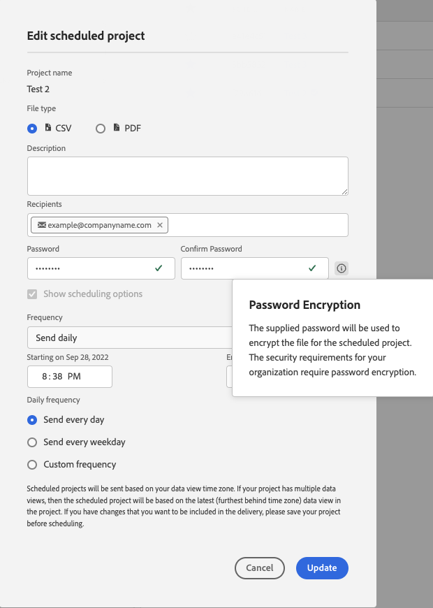

# Dateien An andere senden

Sie können Customer Journey Analytics-Berichte als Dateien per E-Mail an ausgewählte Benutzende senden. Sie können Dateien ad hoc senden oder Sie können Dateien so konfigurieren, dass sie nach einem Zeitplan gesendet werden. Dateien können im CSV- oder PDF-Format gesendet werden.

Alle auf das Projekt angewendeten Tags werden automatisch auf den Export angewendet.

Es sind auch andere Methoden zum Exportieren von Customer Journey Analytics-Daten verfügbar, wie unter [Exportübersicht](/help/analysis-workspace/export/export-project-overview.md) beschrieben.

## Datei jetzt senden {#now}

So senden Sie eine Datei sofort per E-Mail an die Empfangenden:

1. Klicken Sie auf **[!UICONTROL Freigeben] > [!UICONTROL Datei exportieren]**.
1. Geben Sie den Dateityp an:
   * [!UICONTROL **CSV**]: Wählen Sie diese Option aus, wenn Sie Daten in Textform verwenden möchten.
   * [!UICONTROL **PDF**]: Wählen Sie diese Option, wenn die heruntergeladene Datei alle angezeigten (sichtbaren) Tabellen und Visualisierungen im Projekt enthalten soll.
1. (Optional) Fügen Sie eine Beschreibung hinzu, die in der E-Mail enthalten sein soll, um die empfangene Datei zu erklären.
1. Fügen Sie Empfänger oder Gruppen hinzu. E-Mail-Adressen können auch eingegeben werden.
1. (Nur für Kunden von Health Care Shield) Geben Sie ein Passwort an. Siehe Abschnitt „Passwortschutz für terminierte Berichte“.
1. (Optional) Klicken Sie auf **[!UICONTROL Planungsoptionen anzeigen]**, um einen Zeitplan für den Versand festzulegen.
1. Klicken Sie auf **[!UICONTROL Jetzt senden]**.

## Datei nach Zeitplan senden {#schedule}

So senden Sie eine Datei basierend auf einem wiederkehrenden Zeitplan per E-Mail an die Empfangenden:

1. Klicken Sie auf **[!UICONTROL Freigeben] > [!UICONTROL Dateiexport planen]**.
1. Geben Sie den Dateityp an (CSV oder PDF).
1. (Optional) Fuegen Sie eine Beschreibung hinzu, die in der E-Mail enthalten sein wird, um die empfangene Datei zu erklären.
1. Fügen Sie Empfänger oder Gruppen hinzu. E-Mail-Adressen können auch eingegeben werden.
1. (Nur für Kunden von Health Care Shield) Geben Sie ein Passwort an. Siehe Abschnitt „Passwortschutz für terminierte Berichte“.
1. Geben Sie den Datumsbereich an, über den anhand des Zeitplans gesendet werden soll, indem Sie die Einstellungen „Start am“ und „Ende am“ ändern. Das Enddatum muss innerhalb eines Jahres ab dem Tag liegen, an dem der Zeitplan erstellt oder geändert wurde.
1. Geben Sie die Versandhäufigkeit an. Jede Häufigkeit ermöglicht unterschiedliche Anpassungen.
1. Klicken Sie auf **[!UICONTROL Planmäßig senden]**.

## Manager für geplante Projekte {#manager}

Geplante Analysis Workspace-Projekte können unter **[!UICONTROL Analytics] > [!UICONTROL Komponenten] > [!UICONTROL Geplante Projekte]** verwaltet werden.

Im Manager für geplante Projekte können wiederkehrende Projektzeitpläne bearbeitet und gelöscht werden. Suchen Sie in der Suchleiste oder mithilfe der Filteroptionen im linken Panel nach einem Zeitplan. Sie können nach Tag, genehmigten Zeitplänen, Inhabern und mehr filtern.

| Feld | Beschreibung |
| --- | --- |
| [!UICONTROL Favoriten] | Wenn Sie das Sternsymbol auswählen, wird dieser Zeitplan zu einem Favoriten. |
| [!UICONTROL Zeitplan-ID] | Diese ID wird hauptsächlich zum Debugging verwendet. |
| [!UICONTROL Titel und Beschreibung] | Titel und Beschreibung dieses Projekts. |
| [!UICONTROL Inhabende] | Die Person, die das Projekt erstellt hat und dafür verantwortlich ist. |
| [!UICONTROL Tags] | (Optional) Mit Tagging können Projekte praktisch organisiert werden. Alle Benutzer können Tags erstellen und eines oder mehrere Tags auf ein Projekt anwenden. Sie sehen Tags jedoch nur für die Projekte, deren Verantwortlicher Sie sind oder die für Sie freigegeben wurden. |
| [!UICONTROL Gesendet an] | Die Empfängerinnen bzw. Empfänger dieses geplanten Projekts. |
| [!UICONTROL Ablaufdatum] | Sie können das Ablaufdatum auf bis zu ein Jahr festlegen, unabhängig von der Häufigkeit des Zeitplans. |
| [!UICONTROL Häufigkeit] | Wie oft Sie dieses geplante Projekt an die Empfängerinnen bzw. Empfänger senden möchten. |
| [!UICONTROL Durchführungszeit] | Zu welcher Tageszeit dieses geplante Projekt gesendet wird. |
| [!UICONTROL Anzahl der Abfragen] | Die Anzahl der Abfragen für dieses Projekt. |

Die folgenden Aktionen werden im Manager für geplante Projekte häufig ausgeführt:

| Aktion | Beschreibung |
|---|---|
| **[!UICONTROL Zeitplan bearbeiten]** | Klicken Sie auf den Titel des Zeitplans, um seine Versandeinstellungen zu aktualisieren. |
| **[!UICONTROL Zeitplan löschen]** | Wählen Sie das geplante Projekt in der Liste aus und klicken Sie dann im Menü auf „Löschen“. Dadurch wird der ausgewählte Zeitplan für das Projekt gelöscht. Das Projekt selbst wird nicht gelöscht. |
| **[!UICONTROL Tags hinzufügen]** | Wählen Sie das geplante Projekt in der Liste aus und wählen Sie dann „Taggen“ oder „Genehmigen“ aus, um Ihre Zeitpläne zu organisieren und die Suche zu vereinfachen. |
| **[!UICONTROL Fehlgeschlagene Zeitpläne anzeigen]** | Navigieren Sie zum linken Panel > „Andere Filter“ > „Fehlgeschlagen“, um Zeitpläne anzuzeigen, die fehlgeschlagen sind. |
| **[!UICONTROL Abgelaufene Zeitpläne anzeigen]** | Navigieren Sie zum linken Panel > „Andere Filter“ > „Abgelaufen“, um Zeitpläne anzuzeigen, die abgelaufen sind. Klicken Sie auf den Titel des Zeitplans, um einen neuen Versandplan einzurichten. |
| **[!UICONTROL Zeitplan-ID anzeigen]** | Navigieren Sie oben rechts zu den Spaltenoptionen und fügen Sie der Tabelle die Spalte „Zeitplan-ID“ hinzu. Die Zeitplan-ID ist oft zum Debugging nützlich. |

Im Manager für geplante Projekte werden die Elemente angezeigt, die von einem bestimmten Benutzer erstellt wurden. Wenn das Benutzerkonto in der Anwendung deaktiviert wird, werden alle geplanten Bereitstellungen gestoppt.
Weitere Informationen finden Sie unter [Geplante Projekte](/help/components/scheduled-projects-manager.md).

## Passwortschutz für ein geplantes Projekt {#password}

<!-- markdownlint-disable MD034 -->

>[!CONTEXTUALHELP]
>id="workspace_sendfile_password"
>title="Passwortverschlüsselung"
>abstract="Das angegebene Passwort dient dazu, die Datei für das geplante Projekt zu verschlüsseln. Gemäß den Sicherheitsanforderungen Ihrer Organisation ist eine Passwortverschlüsselung erforderlich."

<!-- markdownlint-enable MD034 -->

>[!NOTE]
>
>Die Option, ein geplantes Projekt mit einem Passwort zu schützen, wird nur für Customer Journey Analytics-Kunden angezeigt, die das [Healthcare Shield](https://business.adobe.com/solutions/industries/healthcare.html)-Add-on-Produkt gekauft haben.

Adobe verwendet das Passwort zum Verschlüsseln geplanter Projekte, unabhängig davon, ob sie im .pdf- oder .csv-Format gesendet werden.

Nachdem Ihr Unternehmen die Healthcare Shield-Produktnummer erworben hat und mit ihr verknüpft wurde, wird die Aufforderung zur Erstellung eines Passworts für ein geplantes Projekt unter den folgenden Bedingungen angezeigt:

* Wenn jemand ein neues geplantes Projekt erstellt.

* Wenn ein vorhandenes geplantes Projekt kurz vor dem Senden steht. Das aktuell geplante Projekt wird deaktiviert, bis der Passwortschutz eingerichtet ist. Die Inhaberin oder der Inhaber des geplanten Projekts erhält eine E-Mail, in der sie bzw. er über diese Anforderung informiert wird.

### Passwortanforderungen

Die Passwortanforderungen entsprechen dem Adobe-Standard und schreiben mindestens acht Zeichen mit mindestens einer Zahl und einem Sonderzeichen vor.

### Passwortschutz für ein neues geplantes Projekt

1. Nachdem Sie Ihr Projekt gespeichert haben, navigieren Sie zu **[!UICONTROL Freigeben]** > **[!UICONTROL Jetzt Datei senden]** oder **[!UICONTROL Freigeben]** > **[!UICONTROL Datei nach Zeitplan senden]**.
1. Befolgen Sie die oben stehenden Anweisungen unter [Datei jetzt senden](https://experienceleague.adobe.com/docs/analytics-platform/using/cja-workspace/curate-share/t-schedule-report.html?lang=de#now) oder [Datei planmäßig senden](https://experienceleague.adobe.com/docs/analytics-platform/using/cja-workspace/curate-share/t-schedule-report.html?lang=de#schedule).

### Passwortschutz für ein vorhandenes geplantes Projekt

Vor der Planung eines Projekts erhält die Inhaberin oder der Inhaber des Projekts eine E-Mail wie die folgende:

1. Melden Sie sich bei Customer Journey Analytics an.
1. Wählen Sie **[!UICONTROL Geplantes Projekt anzeigen]** aus.
1. Geben Sie in **[!UICONTROL Geplantes Projekt bearbeiten]** ein Passwort ein und bestätigen Sie es.
1. Teilen Sie den Empfangenden des geplanten Projekts dieses Passwort mit. Geben Sie das Passwort nicht an Personen weiter, die keine Empfangenden des geplanten Projekts sind.
