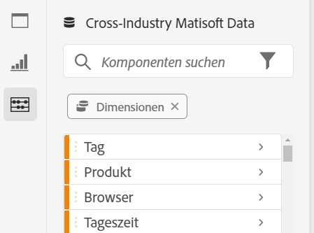

# Analysis Workspace – Übersicht {#analysis-workspace-overview}

>[!CONTEXTUALHELP]
>id="cja_workspace_fundamentals"
>title="Analysis Workspace-Grundlagen"
>abstract="Im Folgenden erfahren Sie mehr über die Grundlagen von Analysis Workspace, wie das Erstellen einer Tabelle, das Hinzufügen einer Visualisierung, das Ändern Ihres Datumsbereichs und mehr."
>additional-url="https://images-tv.adobe.com/mpcv3/7381/7a0633f8-972f-4367-a2ed-b169981efa7b_1681135724.854x480at800_h264.mp4" text="Analysis Workspace – Übersicht"

Mit Analysis Workspace können Sie schnell Analysen erstellen, um Einblicke zu gewinnen und diese Einblicke dann für andere freizugeben. Mithilfe der Drag-and-Drop-Browser-Oberfläche können Sie Ihre Analyse erstellen, Visualisierungen hinzufügen, um Daten lebendig werden zu lassen, einen Datensatz kuratieren sowie Projekte für andere in Ihrer Organisation freigeben und planen.

Das folgende Video bietet einen kurzen Überblick mit Beispielen, was alles möglich ist.

>[!VIDEO](https://video.tv.adobe.com/v/26266/?quality=12)

## Bereiche von Analysis Workspace

Das folgende Bild und die zugehörige Tabelle erläutern einige der Hauptbereiche in Analysis Workspace:

| Position im Bild | Name und Funktion |
|---------|----------|
| A  | **Ganz linke Leiste:** Enthält Registerkarten zum Hinzufügen von Bedienfeldern, Visualisierungen und Komponenten zu Analysis Workspace. Enthält außerdem das Datenwörterbuchsymbol, mit dem das Datenwörterbuch geöffnet wird. |
| B | **Linke Leiste:** Je nachdem, welche Registerkarte in der linken Leiste ausgewählt ist, enthält dieser Bereich einzelne Bedienfelder, Visualisierungen oder Komponenten. |
| C  | **Arbeitsfläche:** Dies ist der Hauptbereich, in den Sie Inhalte aus den linken Leisten ziehen, um Ihr Projekt zu erstellen. Das Projekt wird dynamisch aktualisiert, wenn Sie Bereiche, Visualisierungen und Komponenten zur Arbeitsfläche hinzufügen. |
| D | **Dropdown-Menü „Datenansicht“:** Für jedes Bedienfeld in Analysis Workspace können Sie im Dropdown-Menü „Datenansicht“ die Datenansicht auswählen, die Sie als Datenquelle verwenden möchten. |

## Funktionen in Analysis Workspace {#analysis}

Im Folgenden finden Sie einige der wichtigsten Funktionen, die in Analysis Workspace verfügbar sind:

### Bedienfelder

**Bedienfelder** dienen zur Organisation Ihrer Analyse in einem Projekt und können viele Tabellen und Visualisierungen enthalten. Viele der in Analysis Workspace bereitgestellten Bedienfelder generieren einen vollständigen Satz von Analysen auf der Grundlage einiger Benutzereingaben. Wählen Sie in der linken Leiste das Symbol **[!UICONTROL Bedienfelder]** oben aus, um eine vollständige Liste der verfügbaren Bedienfelder anzuzeigen.

Weitere Informationen zu Bedienfeldern finden Sie unter [Bedienfelder – Übersicht](/help/analysis-workspace/c-panels/panels.md).

### Visualisierungen

**Visualisierungen**, wie z. B. ein Balken- oder Liniendiagramm, können verwendet werden, um Daten visuell lebendig werden zu lassen. Wählen Sie in der linken Leiste das mittlere Symbol **[!UICONTROL Visualisierungen]** aus, um die vollständige Liste der verfügbaren Visualisierungen anzuzeigen.

Weitere Informationen zu Visualisierungen finden Sie unter [Visualisierungen – Übersicht](/help/analysis-workspace/visualizations/freeform-analysis-visualizations.md).

### Komponenten

Komponenten in Analysis Workspace sind:

* Dimensionen

* Metriken

* Filter

* Datumsbereiche

Weitere Informationen zu den einzelnen Komponententypen finden Sie unter [Komponenten – Übersicht](/help/components/overview.md).

Jeder dieser Komponententypen kann zu einer Visualisierung (z. B. einer Freiformtabelle) hinzugefügt werden, um Ihre geschäftlichen Fragen zu beantworten.

Nachdem Sie sich mit der Komponententerminologie vertraut gemacht haben, können Sie Komponenten in Visualisierungen (einschließlich Freiformtabellen) ziehen, um [Ihre Analyse zu erstellen](/help/analysis-workspace/visualizations/freeform-table/freeform-table.md).

### Datenwörterbuch

Das Datenwörterbuch in Analysis Workspace hilft Benutzenden und Admins, die Komponenten in ihrer Analytics-Umgebung zu verfolgen und besser zu verstehen.

Weitere Informationen zum Datenwörterbuch finden Sie unter [Datenwörterbuch – Übersicht](/help/components/data-dictionary/data-dictionary-overview.md).

## Datenquellen

Beim Synchronisieren von Visualisierungen können Sie kontrollieren, welche Datentabelle oder Datenquelle zu einer Visualisierung gehört. Im Folgenden finden Sie weitere Informationen dazu, wie Sie [Datenquellen verwalten](/help/analysis-workspace/visualizations/t-sync-visualization.md).

## Erste Schritte mit Analysis Workspace

### Anmelden bei Adobe Analytics {#login}

Um mit Analysis Workspace zu beginnen, melden Sie sich unter [experience.adobe.com/analytics](https://experience.adobe.com/analytics) bei Adobe Analytics an. Standardmäßig wird die Seite „Projekte“ von Analysis Workspace angezeigt. Wenn ein bestimmtes Projekt für Sie ausgewählt wurde, wird dieses Projekt standardmäßig angezeigt.

### Erstellen eines Projekts {#new-project}

Eine Analyse in Analysis Workspace wird als [Projekt](/help/analysis-workspace/build-workspace-project/freeform-overview.md) bezeichnet.

Sie können ein Projekt in Analysis Workspace erstellen, wie unter [Erstellen von Projekten](/help/analysis-workspace/build-workspace-project/create-projects.md) beschrieben.

Projekte können in Ordner und Unterordner unterteilt werden, wie unter [Ordner in Analysis Workspace](/help/analysis-workspace/build-workspace-project/workspace-folders/about-folders.md) beschrieben.

### Kuratieren und Freigeben eines Projekts

Bei der Erstellung einer Analyse in Analysis Workspace wird Ihre Arbeit [automatisch gespeichert](/help/analysis-workspace/build-workspace-project/save-projects.md).

Wenn Sie das Projekt fertiggestellt haben und es praktische Einblicke liefert, kann das Projekt auch von anderen genutzt werden. Sie können das Projekt für Benutzende sowie Gruppen in Ihrer Organisation oder auch für Personen außerhalb Ihrer Organisation freigeben. Informationen zum Freigeben eines Projekts finden Sie unter [Freigeben von Projekten](/help/analysis-workspace/curate-share/share-projects.md).

## Zusätzliche Ressourcen {#resources}

* Adobe bietet Hunderte von [Analytics-Video-Tutorials](https://experienceleague.adobe.com/docs/analytics-learn/tutorials/overview.html?lang=de).
* Für neue Funktionen siehe [Versionshinweise zu Adobe Experience Cloud](https://experienceleague.adobe.com/docs/release-notes/experience-cloud/current.html?lang=de#analytics).
* Eine gute Möglichkeit, Analysis Workspace kennenzulernen, ist die Vorlage des Training-Tutorials von Analysis Workspace. Diese Vorlage führt Sie durch die gängige Terminologie und die Schritte zur Erstellung Ihrer ersten Analyse in Workspace. So starten Sie das Tutorial:
   1. Wählen Sie auf der Registerkarte [!UICONTROL **Arbeitsbereich**] in Adobe Analytics die Option **[!UICONTROL Lernen]** auf der linken Seite aus.
   1. Klicken Sie auf **[!UICONTROL Tutorial öffnen]**.
      
