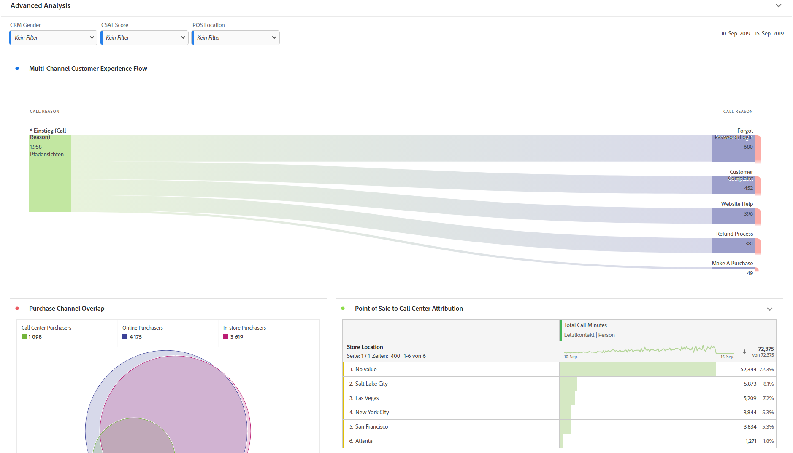
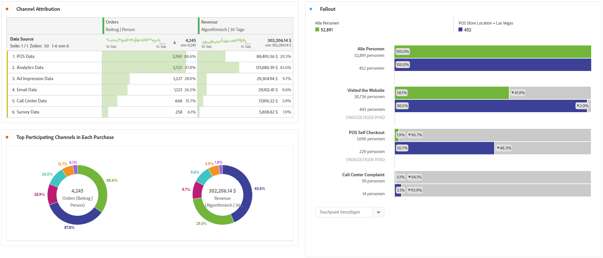

# Durchführen einer erweiterten Analyse

Bevor Sie wie unten beschrieben mit der Erstellung von Berichten und Visualisierungen zur erweiterten Analyse beginnen, sollten Sie die [grundlegende Analyse](/help/analysis-workspace/perform-basic-analysis.md) verstanden haben.

Die erweiterte Analyse nutzt Funktionen wie [Flussdiagramme](/help/analysis-workspace/visualizations/c-flow/flow.md), [Attribution](/help/analysis-workspace/c-panels/attribution.md), [Fallout-Diagramme](/help/analysis-workspace/visualizations/fallout/fallout-flow.md) und [Dimensionsaufschlüsselungen](/help/components/dimensions/t-breakdown-fa.md).

