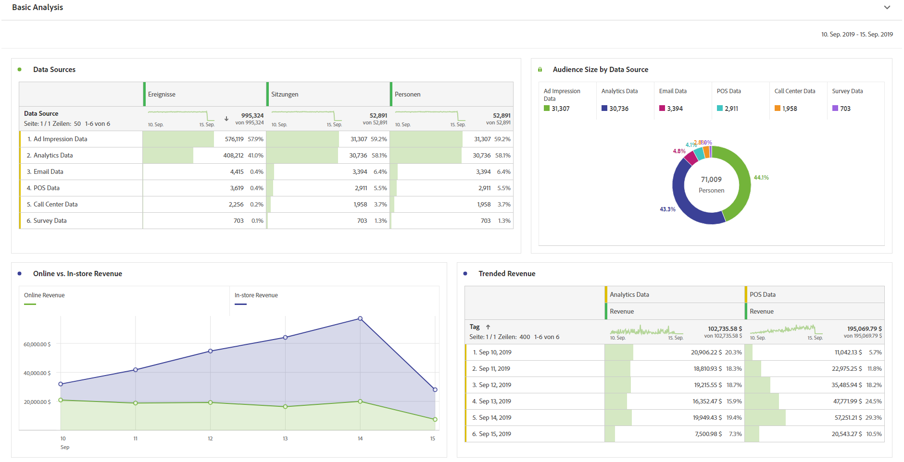
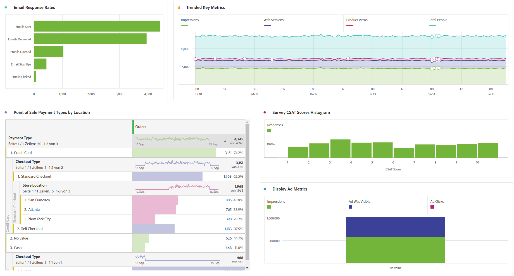

# Grundlegende Analyse durchführen

Mit Customer Journey Analytics können Sie Daten mithilfe der Leistungsfähigkeit und Flexibilität von Analysis Workspace analysieren.

>[!TIP]
>
>Wenn keine Daten in Analysis Workspace verfügbar sind, vergewissern Sie sich, dass Sie den [Datenaufnahmeprozess](/help/data-ingestion/data-ingestion.md) befolgt haben, der Folgendes umfasst:<ul><li>[Erstellen einer Verbindung](/help/connections/create-connection.md#create-and-configure-the-connection)  Vergewissern Sie sich, dass die Verbindung so konfiguriert ist, dass sie neue Daten importiert, Daten aufstockt oder beides.</li><li>[Hinzufügen von Datensätzen](/help/connections/create-connection.md#add-and-configure-datasets)</li><li>[Erstellen von Datenansichten](/help/data-views/create-dataview.md)</li></ul>

Experimentieren Sie und schließen Sie Dimensionen und Metriken ein, ändern Sie Attributionseinstellungen für Dimensionen und Metriken, Anzeigenamen, Zeitzone und Sitzungseinstellungen usw.

Im Folgenden finden Sie ein Beispiel für grundlegende Visualisierungen in Arbeitsbereich. Sie können zum Beispiel

* einen Rangbericht erstellen, der anzeigt, welche Datenquellen die meisten Ereignisse, Sitzungen und Personen aufweisen,

* einen Trend-Bericht über Online- und In-Store-Umsätze erstellen, in dem die beiden Datenquellen im Zeitverlauf verglichen werden.

* Zeigen Sie die Zielgruppengröße anhand von Datenquellen an, z. B. Daten zu Ad-Impressions, Customer Journey Analytics-Daten, E-Mail-Daten, POS-Daten, Callcenter-Daten und Umfragedaten.

