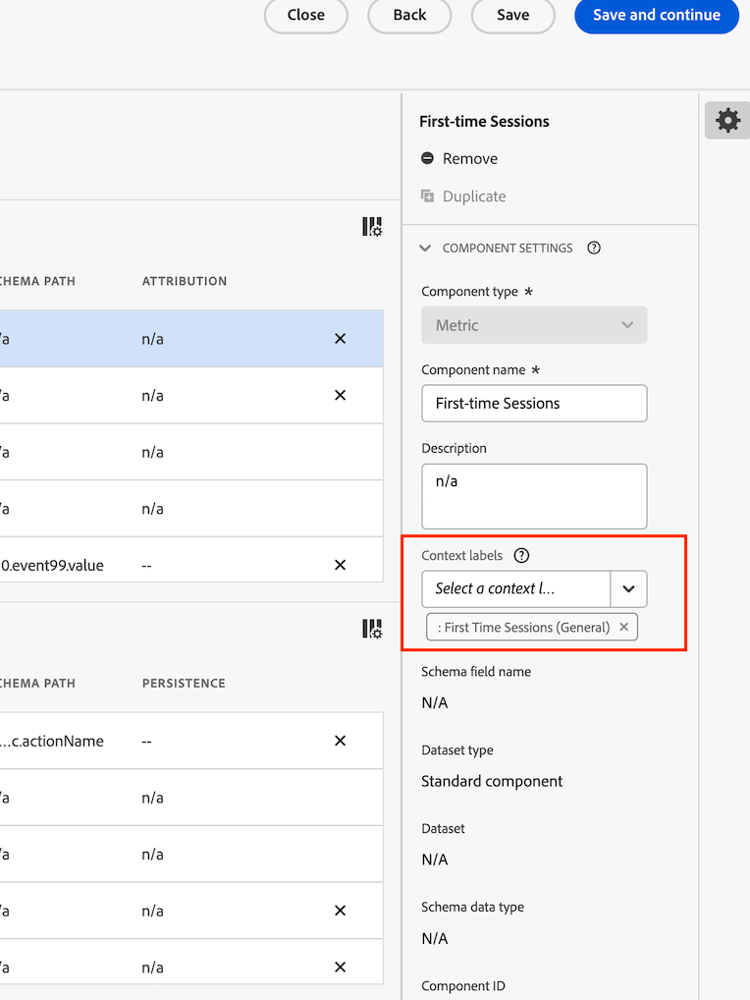

# Erstellen und Verwalten von Vorlagen

Admins können Vorlagen erstellen und sie zur Verwendung für andere Benutzende in deren Anmeldeunternehmen speichern.

Personen im Anmeldeunternehmen können diese Unternehmensvorlagen wie in [Verwenden von Vorlagen](/help/analysis-workspace/templates/use-templates.md) beschrieben verwenden.

## Erstellen einer Vorlage {#create-templates}

<!-- markdownlint-disable MD034 -->

>[!CONTEXTUALHELP]
>id="use-case-ajo-template"
>title="Verwenden von Vorlagen in Journey Optimizer"
>abstract="Wenn Sie diese Vorlage in Journey Optimizer verwenden, wird die Datenansicht verwendet, die in Adobe Journey Optimizer als Standarddatenansicht festgelegt ist. Dies erfolgt unabhängig von der Datenansicht, die mit dieser Vorlage in Customer Journey Analytics ausgewählt wurde."

<!-- markdownlint-enable MD034 -->

So erstellen Sie eine neue Vorlage, die von Personen in Ihrem Anmeldeunternehmen verwendet werden kann:

1. Erstellen Sie in Analysis Workspace ein Projekt in dem von Ihnen gewünschten Zustand.

1. Wählen Sie [!UICONTROL **Projekt**] > **[!UICONTROL Als Vorlage speichern…]**.

   

1. Geben Sie im Dialogfeld [!UICONTROL Als Vorlage speichern] folgende Informationen ein:

   | Feld | Beschreibung |
   |---------|----------|
   | **[!UICONTROL Name]** | Geben Sie einen beschreibenden Namen für die Vorlage an. |
   | **[!UICONTROL Beschreibung]** | Geben Sie eine kurze Beschreibung für die Vorlage an, die ihre Verwendungszwecke beschreibt. |
   | **[!UICONTROL Warum diese Vorlage verwenden?]** | Liefern Sie eine kurze Erklärung, in der Sie Personen in der Organisation darüber informieren, wie diese Vorlage verwendet werden könnte. Diese Erklärung wird auf der Vorschauseite der Vorlage angezeigt. |
   | **[!UICONTROL Kanäle]** | Wählen Sie alle Kanäle aus, die auf diese Vorlage zutreffen. Sie können mehrere Kanäle auswählen: **[!UICONTROL Web]**, **[!UICONTROL Mobile]**, **[!UICONTROL Kanalübergreifend]**, **[!UICONTROL Callcenter]** und **[!UICONTROL In-store]**.
Ihre Auswahl bestimmt, wo die Vorlage angezeigt wird und welche Segmente für Benutzende gelten, die über die Seite „Organisationsvorlagen“ darauf zugreifen.
 |
   | **[!UICONTROL Anwendungsbeispiele]** | Wählen Sie alle Anwendungsfälle aus, die für diese Vorlage gelten. Sie können mehrere Anwendungsszenarien auswählen: **[!UICONTROL Interaktion]**, **[!UICONTROL Konversion]**, **[!UICONTROL Zielgruppe]**, **[!UICONTROL Akquise]** und **[!UICONTROL Journey Optimizer]**. 
Ihre Auswahl bestimmt die Position der Vorlage auf der Seite „Organisationsvorlagen“. Benutzende können zur Vorlage navigieren oder die Liste nach Anwendungsfall filtern. 

**Hinweis:** Wenn Sie die Option **[!UICONTROL Journey Optimizer]** auswählen, wird die Vorlage zur Verwendung in Adobe Journey Optimizer verfügbar. In Journey Optimizer ist auf der Seite **[!UICONTROL Berichte]** ein Dropdown-Menü verfügbar, über das Benutzende diese Vorlage oder die Standardvorlage auswählen können. Weitere Informationen finden Sie unter [Erste Schritte mit dem aktualisierten Reporting-Erlebnis](https://experienceleague.adobe.com/de/docs/journey-optimizer/using/reporting/channel-report/report-gs-cja) in der Dokumentation zu Journey Optimizer.

Beachten Sie beim Auswählen der Option „Journey Optimizer“ Folgendes:
<ul><li>Diese Option ist nur verfügbar, wenn Journey Optimizer-Daten in der Datenansicht vorhanden sind, die Sie in Customer Journey Analytics verwenden. </li><li>Wenn Sie diese Vorlage in Journey Optimizer verwenden, wird die Datenansicht verwendet, die in Adobe Journey Optimizer als Standarddatenansicht festgelegt ist. Dies erfolgt unabhängig von der Datenansicht, die mit dieser Vorlage in Customer Journey Analytics ausgewählt wurde.  Weitere Informationen zum Festlegen einer Datenansicht als Standarddatenansicht in Journey Optimizer finden Sie unter [Kompatibilität](/help/data-views/create-dataview.md#compatibility) unter [Erstellen oder Bearbeiten einer Datenansicht](/help/data-views/create-dataview.md).</li></ul> |
   | **[!UICONTROL Journey Optimizer-Aktivitätstyp]** | Wählen Sie den Journey Optimizer-Aktivitätstyp aus, der mit dieser Vorlage verknüpft werden soll: **[!UICONTROL Kampagnen]**, **[!UICONTROL Journeys]**, **[!UICONTROL Landingpages]**, **[!UICONTROL Berichte]** oder **[!UICONTROL Abonnements]**. 
Lassen Sie dieses Feld leer, wenn diese Vorlage mit allen Aktivitätstypen verknüpft werden soll.

Dieses Feld wird nur angezeigt, wenn im Feld **[!UICONTROL Anwendungsfälle]** die Option **[!UICONTROL Journey Optimizer]** ausgewählt ist.
 |
   | **[!UICONTROL Journey Optimizer-Aktivität]** | Wählen Sie die Journey Optimizer-Aktivität aus, die mit dieser Vorlage verknüpft werden soll. 
Lassen Sie dieses Feld leer, wenn diese Vorlage mit allen Aktivitäten des ausgewählten Aktivitätstyps verknüpft werden soll.

Dieses Feld wird nur angezeigt, wenn im Feld **[!UICONTROL Anwendungsfälle]** die Option **[!UICONTROL Journey Optimizer]** ausgewählt ist.
 |
   | **[!UICONTROL Tags]** | Geben Sie alle Tags an, die Sie auf die Vorlage anwenden möchten. Die Benutzenden können die Liste der Vorlagen nach den von Ihnen hinzugefügten Tags filtern. |

1. Wählen Sie [!UICONTROL **Als Vorlage speichern**] aus.

Weitere Informationen dazu, wie Benutzerinnen und Benutzer ein Projekt basierend auf einer Vorlage erstellen können, finden Sie unter [Erstellen eines Projekts basierend auf einer Vorlage](/help/analysis-workspace/templates/use-templates.md#create-a-project-based-on-a-template) in [Verwenden von Vorlagen](/help/analysis-workspace/templates/use-templates.md).

## Bearbeiten oder Löschen einer Vorlage

Admins können Unternehmensvorlagen bearbeiten oder löschen.

1. Wählen Sie in Analysis Workspace die Registerkarte [!UICONTROL **Arbeitsbereich**] und dann unter **[!UICONTROL Vorlagen]** in der linken Leiste **[!UICONTROL _Name_des_Anmeldeunternehmens _-Vorlagen]**&#x200B;aus.

1. Bei Anzeige der Vorlagen in einer Spaltenansicht :

   1. Navigieren Sie zu der Vorlage, die Sie bearbeiten oder löschen möchten, und wählen Sie das Infosymbol neben dem Vorlagennamen aus.

      

   1. Wählen Sie **[!UICONTROL Vorschau]** aus.

   1. Wählen Sie das Symbol „Mehr“ und dann **[!UICONTROL Bearbeiten]** oder **[!UICONTROL Löschen]** aus.

      

1. Bei Anzeige der Vorlagen in einer Kartenansicht :

   1. Suchen Sie die Vorlage, die Sie bearbeiten oder löschen möchten.

      

   1. Bewegen Sie den Mauszeiger über die Vorlage und wählen Sie dann **[!UICONTROL Vorschau]** aus.

   1. Wählen Sie das Symbol „Mehr“ und dann **[!UICONTROL Bearbeiten]** oder **[!UICONTROL Löschen]** aus.

      

1. Wenn Sie eine Vorlage bearbeiten, nehmen Sie die gewünschten Änderungen vor und wählen Sie dann [!UICONTROL **Projekt**] > **[!UICONTROL Als Vorlage speichern…]** aus.

   

1. Geben Sie im Dialogfeld [!UICONTROL Als Vorlage speichern] folgende Informationen ein:

   | Feld | Beschreibung |
   |---------|----------|
   | **[!UICONTROL Name]** | Geben Sie einen beschreibenden Namen für die Vorlage an. |
   | **[!UICONTROL Beschreibung]** | Geben Sie eine kurze Beschreibung für die Vorlage an, die ihre Verwendungszwecke beschreibt. |
   | **[!UICONTROL Warum diese Vorlage verwenden?]** | Liefern Sie eine kurze Erklärung, in der Sie Personen in der Organisation darüber informieren, wie diese Vorlage verwendet werden könnte. Diese Erklärung wird auf der Vorschauseite der Vorlage angezeigt. |
   | **[!UICONTROL Kanäle]** | Wählen Sie alle Kanäle aus, die auf diese Vorlage zutreffen. Sie können mehrere Kanäle auswählen: **[!UICONTROL Web]**, **[!UICONTROL Mobile]**, **[!UICONTROL Kanalübergreifend]**, **[!UICONTROL Callcenter]** und **[!UICONTROL In-store]**. Wenn keine Kanäle ausgewählt sind, wird die Vorlage in alle Kanälen aufgenommen.
Ihre Auswahl bestimmt, wo die Vorlage angezeigt wird und welche Filter für Benutzende gelten, die über die Seite „Organisationsvorlagen“ darauf zugreifen.
 |
   | **[!UICONTROL Anwendungsbeispiele]** | Wählen Sie alle Anwendungsfälle aus, die für diese Vorlage gelten. Sie können mehrere Anwendungsszenarien auswählen: **[!UICONTROL Interaktion]**, **[!UICONTROL Konversion]**, **[!UICONTROL Zielgruppe]**, **[!UICONTROL Akquise]** und **[!UICONTROL Journey Optimizer]**. 
Ihre Auswahl bestimmt die Position der Vorlage auf der Seite „Organisationsvorlagen“. Benutzende können zur Vorlage navigieren oder die Liste nach Anwendungsfall filtern. 

**Hinweis:** Wenn Sie die Option **[!UICONTROL Journey Optimizer]** auswählen, wird die Vorlage zur Verwendung in Adobe Journey Optimizer verfügbar. In Journey Optimizer ist auf der Seite **[!UICONTROL Berichte]** ein Dropdown-Menü verfügbar, über das Benutzende diese Vorlage oder die Standardvorlage auswählen können. Weitere Informationen finden Sie unter [Erste Schritte mit dem aktualisierten Reporting-Erlebnis](https://experienceleague.adobe.com/de/docs/journey-optimizer/using/reporting/channel-report/report-gs-cja) in der Dokumentation zu Journey Optimizer.

Beachten Sie beim Auswählen der Option „Journey Optimizer“ Folgendes:
<ul><li>Diese Option ist nur verfügbar, wenn Journey Optimizer-Daten in der Datenansicht vorhanden sind, die Sie in Customer Journey Analytics verwenden. </li><li>Wenn Sie diese Vorlage in Journey Optimizer verwenden, wird die Datenansicht verwendet, die in Adobe Journey Optimizer als Standarddatenansicht festgelegt ist. Dies erfolgt unabhängig von der Datenansicht, die mit dieser Vorlage in Customer Journey Analytics ausgewählt wurde.  Weitere Informationen zum Festlegen einer Datenansicht als Standarddatenansicht in Journey Optimizer finden Sie unter [Kompatibilität](/help/data-views/create-dataview.md#compatibility) unter [Erstellen oder Bearbeiten einer Datenansicht](/help/data-views/create-dataview.md).</li></ul> |
   | **[!UICONTROL Journey Optimizer-Aktivitätstyp]** | Wählen Sie den Journey Optimizer-Aktivitätstyp aus, der mit dieser Vorlage verknüpft werden soll: **[!UICONTROL Kampagnen]**, **[!UICONTROL Journeys]**, **[!UICONTROL Landingpages]**, **[!UICONTROL Berichte]** oder **[!UICONTROL Abonnements]**. 
Lassen Sie dieses Feld leer, wenn diese Vorlage mit allen Aktivitätstypen verknüpft werden soll.

Dieses Feld wird nur angezeigt, wenn im Feld **[!UICONTROL Anwendungsfälle]** die Option **[!UICONTROL Journey Optimizer]** ausgewählt ist.
 |
   | **[!UICONTROL Journey Optimizer-Aktivität]** | Wählen Sie die Journey Optimizer-Aktivität aus, die mit dieser Vorlage verknüpft werden soll. 
Lassen Sie dieses Feld leer, wenn diese Vorlage mit allen Aktivitäten des ausgewählten Aktivitätstyps verknüpft werden soll.

Dieses Feld wird nur angezeigt, wenn im Feld **[!UICONTROL Anwendungsfälle]** die Option **[!UICONTROL Journey Optimizer]** ausgewählt ist.
 |
   | **[!UICONTROL Tags]** | Geben Sie alle Tags an, die Sie auf die Vorlage anwenden möchten. Die Benutzenden können die Liste der Vorlagen nach den von Ihnen hinzugefügten Tags filtern. |

1. Wählen Sie [!UICONTROL **Als Vorlage speichern**].

## Umbenennen, Taggen oder Genehmigen von Vorlagen

Admins können Unternehmensvorlagen umbenennen, taggen und genehmigen.

1. Wählen Sie in Analysis Workspace die Registerkarte [!UICONTROL **Arbeitsbereich**] und dann in der linken Leiste die **[!UICONTROL Registerkarte „Projekte“]** aus.

1. Wählen Sie das Filtersymbol aus, um die Liste der Projekte zu filtern.

1. Wählen Sie in der Filterleiste **[!UICONTROL Andere Filter]** und danach **[!UICONTROL Unternehmensvorlagen]** aus.

   Eine Liste der Unternehmensvorlagen wird angezeigt. Alle regulären Projekte werden nicht angezeigt, es sei denn, sie sind angeheftet.

   Unternehmensvorlagen sind am Symbol  erkennbar, das dem Vorlagennamen vorangestellt ist.

   

1. Klicken Sie auf das Symbol mit den Auslassungspunkten **...** neben einer Vorlage, um die verfügbaren Optionen anzuzeigen. 

   

1. Wählen Sie **[!UICONTROL Umbenennen]**, **[!UICONTROL Taggen]** oder **[!UICONTROL Genehmigen]** aus.

   Um eine Vorlage zu löschen, können Sie hier die Option „Löschen“ auswählen oder wie unter [Bearbeiten oder Löschen von Vorlagen](#edit-or-delete-templates) beschrieben vorgehen.

1. (Optional) Um zur regulären Ansicht zurückzukehren, heben Sie in der Filterleiste die Auswahl der Option **[!UICONTROL Unternehmensvorlagen]** auf.

## Hinzufügen fehlender Komponenten zur Datenansicht für eine bestimmte Vorlage

Einige der von Adobe bereitgestellten Vorlagen können nicht verwendet werden, da sie Komponenten enthalten, die sich nicht in Ihrer Datenansicht befinden.

In Ihrer Datenansicht ist für jede fehlende Komponente ein entsprechendes Kontext-Label verfügbar. Sie müssen entweder das entsprechende Kontext-Label zu einer Komponente hinzufügen, die sich bereits in Ihrer Datenansicht befindet, oder Sie müssen Ihrer Datenansicht eine neue Komponente hinzufügen und dieser das Kontext-Label hinzufügen.

So fügen Sie fehlende Komponenten zu einer Vorlage hinzu:

1. Wählen Sie in Analysis Workspace die Registerkarte [!UICONTROL **Arbeitsbereich**] und dann unter **[!UICONTROL Vorlagen]** in der linken Leiste **[!UICONTROL Adobe-Vorlagen]** aus.

1. Wählen Sie das Filtersymbol aus, um die Liste der Vorlagen zu filtern.

1. Wählen Sie **[!UICONTROL Nicht einsatzbereit]** aus, um Vorlagen anzuzeigen, für die Komponenten erforderlich sind, die sich nicht in Ihrer Datenansicht befinden.

   

1. Suchen Sie eine Vorlage, die noch nicht für die Verwendung mit Ihrer Datenansicht bereit ist.

1. Führen Sie einen der folgenden Schritte aus:

   * **Bei Anzeige der Vorlagen in einer Spaltenansicht** :

      1. Navigieren Sie zu der Vorlage, die noch nicht für die Verwendung mit Ihrer Datenansicht bereit ist, und wählen Sie dann das Infosymbol neben dem Vorlagennamen aus.

         

      1. Wählen Sie **[!UICONTROL Vorschau]** aus.

         

   * **Bei Anzeige der Vorlagen in einer Kartenansicht** :

      1. Suchen Sie eine Vorlage, die noch nicht für die Verwendung mit Ihrer Datenansicht bereit ist.

         

      1. Bewegen Sie den Mauszeiger über die Vorlage und wählen Sie dann **[!UICONTROL Vorschau]** aus.

         

1. Im Abschnitt **[!UICONTROL Fehlende Komponenten]** wird eine Liste der Komponenten angezeigt, die in der Datenansicht fehlen. Wählen Sie **[!UICONTROL Diese Komponenten zur Datenansicht hinzufügen]**.

   Die Konfigurationsseite für die Datenansicht wird auf einer neuen Registerkarte angezeigt.

1. Wählen Sie die Registerkarte **[!UICONTROL Komponenten]** für die Datenansicht aus.

   

1. Führen Sie für jede Komponente, die in der Vorlage als fehlend aufgelistet wurde, einen der folgenden Schritte auf der Registerkarte **[!UICONTROL Komponenten]** aus:

   * Wählen Sie im Abschnitt **[!UICONTROL Eingeschlossene Komponenten]** eine Komponente aus, die bereits in der Datenansicht enthalten ist, die Sie für die fehlende Komponente verwenden möchten.

   * Fügen Sie der Datenansicht eine neue Komponente hinzu, die Sie für die fehlende Komponente verwenden möchten, und wählen Sie dann die Komponente aus.

     Um eine neue Komponente zur Datenansicht hinzuzufügen, durchsuchen Sie die Liste der Schemafelder und ziehen Sie sie in den Abschnitt **[!UICONTROL Eingeschlossene Komponenten]**.

1. Suchen Sie bei ausgewählter Komponente das Dropdown-Menü **[!UICONTROL Kontext-Labels]** in der rechten Spalte.

   

1. Wählen Sie im Dropdown-Menü **[!UICONTROL Kontext-Labels]** das Kontext-Label aus, das denselben Namen wie die fehlende Komponente hat.

1. Wählen Sie **[!UICONTROL Speichern und fortfahren]** aus.

1. Wiederholen Sie den Prozess des Hinzufügens des entsprechenden Kontext-Labels zu einer Komponente in der Datenansicht für jede fehlende Komponente.

## Zugreifen auf eine Unternehmensvorlage

Wie bei den von Adobe bereitgestellten Vorlagen können Benutzende in der Organisation auf Vorlagen zugreifen, die Admins erstellen.

Informationen zum Zugreifen auf eine Unternehmensvorlage finden Sie unter [Verwenden von Vorlagen](/help/analysis-workspace/templates/use-templates.md) im Abschnitt [Zugriff auf und Verwendung einer Vorlage](/help/analysis-workspace/templates/use-templates.md#access-and-run-a-template).

## Ausblenden der Registerkarte „Vorlagen“

Admins können die Registerkarte „Vorlagen“ für alle Benutzenden in ihrer Organisation ausblenden.

1. Navigieren Sie zu **[!UICONTROL Customer Journey Analytics]** > **[!UICONTROL Komponenten]** > **[!UICONTROL Voreinstellungen]** > **[!UICONTROL Unternehmen]**.
1. Wählen Sie die Option **[!UICONTROL Registerkarte „Vorlagen“ ausblenden]** aus.
