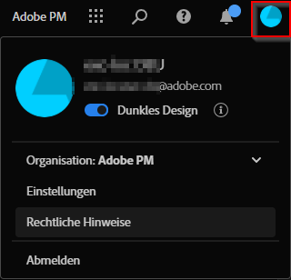

# Benutzervoreinstellungen

Sie können Benutzereinstellungen oder Voreinstellungen für Analysis Workspace und die zugehörigen Komponenten für alle neuen Projekte oder Panels verwalten, die Sie erstellen. Bestehende Projekte und Bedienfelder sind davon nicht betroffen.

## Aktualisieren von Voreinstellungen

Sie können Ihre Voreinstellungen wie folgt aktualisieren:

- Wählen Sie  **[!UICONTROL Voreinstellungen bearbeiten]** in der Hauptbenutzeroberfläche von Workspace aus.
- Wählen Sie bei der Arbeit an einem Workspace-Projekt im Menü **[!UICONTROL Projekt]** > **[!UICONTROL Benutzervoreinstellungen]** aus.
- Wählen Sie **[!UICONTROL Komponenten]** > **[!UICONTROL Voreinstellungen]** in der oberen Menüleiste in Customer Journey Analytics aus (nur für Produktadministratoren verfügbar).

## Konfigurieren von Voreinstellungen

Sie können die folgenden Voreinstellungen konfigurieren:

### Allgemeine Voreinstellungen

Die allgemeinen Voreinstellungen gelten für Ihre Customer Journey Analytics-Erfahrung im Browser. Informationen zum Zugriff auf diese Voreinstellungen finden Sie unter [Aktualisieren von Voreinstellungen](#update-preferences).

| Voreinstellung | Optionen |
| --- | --- |
| **[!UICONTROL Landingpage]** | Wählen Sie aus, welche Seite beim Zugriff auf Customer Journey Analytics als Standardseite angezeigt werden soll: <ul><li>Projektliste (Standard)</li><li>Leeres Projekt</li><li>Geführte Analyse von Blank Trends</li><li>Bestimmtes Projekt, das aus einer Liste ausgewählt wurde</li></ul> |
| **[!UICONTROL Tipps]** | Zeigt Tipps in einem blauen Feld im rechten unteren Bereich von Analysis Workspace an. 
Standardmäßig ist diese Option aktiviert.
 |
| **[!UICONTROL Komponenten, die in Gruppen im linken Panel angezeigt werden]** | Wählen Sie aus, wie viele Komponenten jeder Komponentengruppe im Komponentenmenü im linken Panel angezeigt werden sollen. 
Wenn Sie „0“ für eine Komponentengruppe auswählen, ist die Komponentengruppe nicht mehr über das linke Panel zugänglich.

Standardmäßig werden für jede der folgenden Komponentengruppen fünf Komponenten angezeigt:
 <ul><li>Dimensionen</li><li>Metriken</li><li>Segmente</li><li>Datumsbereiche</li></ul> 
Weitere Informationen zu Komponenten in Analysis Workspace finden Sie unter [Komponentenübersicht](/help/components/overview.md).
 |

### IMS-Organisations-Voreinstellungen {#ims-organization-preferences}

>[!CONTEXTUALHELP]
>id="workspace_prefs_shareonlyworkspace"
>title="Freigabe nur für Workspace-Benutzende zulassen"
>abstract="Wenn diese Option aktiviert ist, ist die Option **[!UICONTROL Für alle freigeben]** nicht mehr für Benutzende verfügbar, wenn ein Analysis Workspace-Projekt freigegeben wird. Personen, die zuvor über diese Freigabeoption Zugriff auf ein Projekt erhalten haben, können nicht mehr auf das Projekt zugreifen."

>[!CONTEXTUALHELP]
>id="workspace_prefs_requireexperiencecloudauth"
>title="Experience Cloud-Authentifizierung verlangen"
>abstract="Wenn diese Option aktiviert ist, müssen sich Personen, die über die Option **[!UICONTROL Für alle freigeben]** in Analysis Workspace Zugriff auf ein Projekt erhalten, mit ihren Experience Cloud-Anmeldeinformationen authentifizieren."

<!-- markdownlint-enable MD034 -->

>[!CONTEXTUALHELP]
>id="workspace_prefs_projectcommenting"
>title="Kommentare zu Projekten zulassen"
>abstract="Wenn diese Option aktiviert ist, ist in der rechten Leiste jedes Projekts in Analysis Workspace ein Kommentarbereich verfügbar."

<!-- markdownlint-enable MD034 -->

Sie können Unternehmensvoreinstellungen aktualisieren, die für alle Benutzerinnen und Benutzer sowie Projekte in Ihrer Organisation gelten. Informationen zum Zugriff auf diese Voreinstellungen finden Sie unter [Aktualisieren von Voreinstellungen](#update-preferences).

| Abschnitt | Voreinstellung | Optionen |
| --- | --- | --- |
| **Projektfreigabe** | | |
| | Freigabe nur für Workspace-Benutzende zulassen | Wenn diese Option aktiviert ist, können Benutzende in Ihrer Organisation im Menü **[!UICONTROL Freigeben]** die Option **[!UICONTROL Für alle freigeben]** nicht sehen. Das bedeutet, dass Benutzerinnen und Benutzer keine Projekte für Personen freigeben können, die kein Analysis Workspace-Konto in Ihrer Organisation haben, wie unter [Projekt für andere freigeben (keine Anmeldung erforderlich)](/help/analysis-workspace/curate-share/share-projects.md#share-public-link) in [Freigeben von Projekten](/help/analysis-workspace/curate-share/share-projects.md) beschrieben wird. Diese Option ist standardmäßig für alle Organisationen deaktiviert (d. h. Benutzende können Projekte für Personen außerhalb der Organisation freigeben), mit Ausnahme von Kundinnen und Kunden, die Health Care Shield lizenziert haben. 
Beachten Sie beim Aktivieren oder Deaktivieren dieser Option Folgendes:<ul><li>Wenn Sie diese Option aktivieren, können Personen, die zuvor über die Freigabeoption [!UICONTROL Für alle freigeben] Zugriff auf ein Projekt erhalten haben, nicht mehr auf das Projekt zugreifen.</li><li>Wenn diese Option aktiviert ist (um die Freigabe nur für Workspace-Benutzende zuzulassen) und später deaktiviert wird (um die Freigabe für andere zuzulassen), erhalten Personen, die zuvor über die Freigabeoption [!UICONTROL Für alle freigeben] Zugriff auf ein Projekt erhalten hatten, nicht automatisch wieder Zugriff auf das Projekt. In diesem Fall muss die Person, die das Projekt freigegeben hat, die Option [!UICONTROL **Link ist aktiv**] aktivieren, die beim Freigeben eines Projekts für alle verfügbar ist **([!UICONTROL Freigeben]** > **[!UICONTROL Für alle freigeben]**), wie unter [Freigeben von Projekten](/help/analysis-workspace/curate-share/share-projects.md) im Abschnitt [Freigeben eines Projekts für alle (keine Anmeldung erforderlich)](/help/analysis-workspace/curate-share/share-projects.md#share-public-link) beschrieben.</li><li>**Für Kundinnen und Kunden, die Healthcare Shield lizenzieren:** Diese Option ist standardmäßig aktiviert und kann nicht deaktiviert werden. Bevor Sie diese Option deaktivieren können, damit die Benutzenden die Freigabeoption [!UICONTROL Für alle freigeben] verwenden können, müssen Sie zunächst in der Adobe Admin Console die Berechtigung [!UICONTROL Projekt-Links für alle freigeben] (unter [!UICONTROL Reporting-Tools]) hinzufügen. Nachdem die Berechtigung hinzugefügt wurde, können Sie diese Option deaktivieren und dann den resultierenden rechtlichen Hinweis akzeptieren. Informationen zum Hinzufügen einer Berechtigung zur Admin Console finden Sie unter [Verwalten von Produktberechtigungen in der Admin Console](https://helpx.adobe.com/de/enterprise/using/manage-permissions-and-roles.html).</li></ul> |
| | Experience Cloud-Authentifizierung verlangen | Wenn diese Option aktiviert ist, müssen sich Personen, die über die Option Für alle freigeben in Analysis Workspace Zugriff auf ein Projekt erhalten, mit ihren Experience Cloud-Anmeldeinformationen authentifizieren.
Wenn diese Option aktiviert ist, wird jedes Mal, wenn eine Person ein Projekt mithilfe der Freigabeoption [!UICONTROL Für alle freigeben] teilt, die Option [!UICONTROL Experience Cloud-Authentifizierung verlangen] im Freigabedialogfeld aktiviert und kann von der Person, die das Projekt freigegeben hat, nicht deaktiviert werden. Informationen dazu, wie Benutzende Projekte für alle freigeben können, finden Sie unter [Freigeben von Projekten](/help/analysis-workspace/curate-share/share-projects.md) im Abschnitt [Freigeben eines Projekts für alle (keine Anmeldung erforderlich)](/help/analysis-workspace/curate-share/share-projects.md#share-public-link). 
 
Beachten Sie beim Aktivieren dieser Option Folgendes: <ul><li>Wenn Sie diese Option aktivieren, werden alle Projekte, die zuvor mit der Freigabeoption [!UICONTROL Für alle freigeben] freigegeben wurden und für die die Option [!UICONTROL Experience Cloud-Authentifizierung verlangen] nicht aktiviert ist, deaktiviert.
Wenn diese Option aktiviert ist (d. h., eine Experience Cloud-Authentifizierung erforderlich ist) und später deaktiviert wird (damit alle Benutzenden mit dem Link auf das Projekt zugreifen können), können Personen, die zuvor über die Freigabeoption [!UICONTROL Für alle freigeben] Zugriff auf ein Projekt erhalten haben, nicht automatisch wieder auf das Projekt zugreifen. In diesem Fall muss die Person, die das Projekt freigegeben hat, die Option [!UICONTROL Link ist aktiv] aktivieren, die beim Freigeben eines Projekts für alle verfügbar ist **([!UICONTROL Freigeben]** > **[!UICONTROL Für alle freigeben]** > **[!UICONTROL Link ist aktiv]**), wie unter [Freigeben von Projekten](/help/analysis-workspace/curate-share/share-projects.md) im Abschnitt [Freigeben eines Projekts für alle (keine Anmeldung erforderlich)](/help/analysis-workspace/curate-share/share-projects.md#share-public-link) beschrieben.</li><li>Diese Option ist nur verfügbar, wenn SSO in Ihrem Unternehmen implementiert ist. Informationen dazu, wie System-Admins SSO für Ihre Organisation aktivieren können, finden Sie unter [Einrichten von Identität und Single Sign-on](https://helpx.adobe.com/de/enterprise/using/set-up-identity.html).

Wenn SSO für Ihre Organisation konfiguriert ist, überprüfen Sie, ob in der Konsole eine automatische Kontoerstellung implementiert ist. Normalerweise richten System-Admins dies ein, wie unter [Aktivieren der automatischen Kontoerstellung](https://helpx.adobe.com/de/enterprise/using/automatic-account-creation.html) beschrieben wird.</li><li>Wenn Ihre Organisation eine Lizenz für Healthcare Shield besitzt, ist diese Option standardmäßig aktiviert und kann nicht deaktiviert werden.</li></ul> |
| Projektkommentar | Kommentare zu Projekten zulassen | **Hinweis:** Diese Funktion befindet sich in der eingeschränkten Testphase der Version und ist möglicherweise noch nicht in Ihrer Umgebung verfügbar. Diese Anmerkung wird entfernt, wenn die Funktion allgemein verfügbar ist. Informationen zum Customer Journey Analytics-Veröffentlichungsprozess finden Sie unter [Customer Journey Analytics-Funktionsversionen](/help/release-notes/releases.md). 
Wenn diese Option aktiviert ist, steht in der rechten Leiste jedes Projekts in Analysis Workspace ein Kommentarbereich zur Verfügung.
 
Projektbesitzer können den Kommentarbereich für ein bestimmtes Projekt deaktivieren, wie in [Erstellen von Projekten](/help/analysis-workspace/build-workspace-project/create-projects.md) beschrieben.
 
Weitere Informationen zum Kommentieren in Analysis Workspace-Projekten finden Sie unter [Hinzufügen und Verwalten von Kommentaren in Projekten](/help/analysis-workspace/build-workspace-project/comment-projects.md).
 |

{style="table-layout:auto"}

### Voreinstellungen für Projekte und Analysen {#project-and-analysis-preferences}

>[!CONTEXTUALHELP]
>id="workspace_prefs_categoricalpalette"
>title="Kategorische Palette"
>abstract="Wird auf viele Visualisierungen in Analysis Workspace und geführte Analysen angewendet. Jede Farbe steht für einen Wert einer Kategorie."

>[!CONTEXTUALHELP]
>id="workspace_prefs_divergingpalette"
>title="Divergierende Palette"
>abstract="Wird auf die Kohortentabelle in Analysis Workspace und die geführte Analyse von Benutzerwachstum angewendet. Durch diese Palette werden die Zahlen zwischen zwei Extremwerten dargestellt, getrennt durch eine Basislinie in der Mitte."

>[!CONTEXTUALHELP]
>id="workspace_prefs_sequentialpalette"
>title="Sequenzielle Palette"
>abstract="Wird bei der geführten Analyse der Frequenz-Trends angewendet (gestapelte Balken). In dieser Palette werden Zahlen durch die Helligkeitsabstufungen von hell bis dunkel dargestellt."

Sie können diese Voreinstellungen für alle neuen Analysis Workspace-Projekte, neuen Analysis Workspace-Bedienfeldern und neuen geführten Analysen anpassen. Informationen zum Zugriff auf diese Voreinstellungen finden Sie unter [Aktualisieren von Voreinstellungen](#update-preferences).

Einige dieser Einstellungen können auch für einzelne Projekte in Analysis Workspace angepasst werden, wie in der [Projektübersicht](/help/analysis-workspace/build-workspace-project/freeform-overview.md) beschrieben.

| Abschnitt | Voreinstellung | Optionen |
| --- | --- | --- |
| **Anzeigen** | | |
|  | [Dichte anzeigen](/help/analysis-workspace/build-workspace-project/view-density.md) | Wählen Sie aus, wie viel Inhalt auf dem Bildschirm angezeigt werden soll, indem Sie den vertikalen Abstand des linken Bedienfelds, der Freiformtabellen und der Kohortentabellen verkleinern. <ul><li>Kompakt</li><li>Komfortabel</li><li>Erweitert (Standard)</li></ul> |
| | [Farbpalette](/help/analysis-workspace/build-workspace-project/color-palettes.md) | Wählen Sie die Farbpaletten für die Visualisierung, die in Analysis Workspace und der geführten Analyse verwendet werden. <ul><li> Kategorische Palette: Wird bei vielen Visualisierungen in Analysis Workspace und der geführten Analyse verwendet. Jede Farbe stellt einen bestimmten kategorischen Wert dar. Wählen Sie aus den von Adobe bereitgestellten Optionen oder geben Sie eine benutzerdefinierte Palette ein, die durch kommagetrennte Hexadezimalwerte definiert ist.</li><li> Divergente Palette: Wird auf die Kohortentabelle in Analysis Workspace und auf die geführte Analyse des Benutzerwachstums angewendet. Diese Palette enthält eine numerische Bedeutung mit zwei Extremen und einer Grundlinie in der Mitte.<li> Sequenzielle Palette: Wird auf die geführte Analyse der Häufigkeits-Trends (gestapelte Balken) angewendet. Diese Palette hat eine numerische Bedeutung von hell bis dunkel.</li></ul> |
| **Daten** | | |
|  | [Datenansicht](/help/analysis-workspace/c-panels/panels.md#data-view) | Wählen Sie die Daten aus, von denen Tabellen und Visualisierungen ihre Daten beziehen sollen. <ul><li>Zuletzt verwendet (Standard)</li><li>Eine bestimmte Datenansicht, die aus einer Liste ausgewählt wird</li></ul> |
|  | [Kalender](/help/analysis-workspace/c-panels/panels.md#calendar) | Wählen Sie aus einer Liste, die Folgendes enthält: <ul><li>Von Adobe bereitgestellte Bereiche (Standard ist „Diesen Monat“)</li><li>Sie können [!UICONTROL Die Datumsbereichskomponenten sind standardmäßig relativ zum Panel-Kalender] aktivieren.</li></ul> |
|  | [Typ des Bedienfelds](/help/analysis-workspace/c-panels/panels.md#panel-types) | <ul><li>Freiform (Standard)</li><li>Leer</li><li>Quick Insights</li></ul> |
|  | Instanzzählung | Aktivieren Sie [!UICONTROL Wiederholungsinstanzen zählen], um anzugeben, ob Wiederholungsinstanzen in Berichten gezählt werden. Ist die Option beispielsweise aktiviert, werden mehrere aufeinander folgende Seitenansichten auf derselben Seite als mehrere Seitenansichten behandelt. Ist diese Option deaktiviert, zählen mehrere aufeinander folgende Seitenansichten auf derselben Seite als Einzelseitenansicht. 
**Hinweis:** Diese Einstellung wirkt sich nur auf bestimmte Metriken aus (z. B. Sitzungen) und nicht auf Fluss- oder Fallout-Visualisierungen.
 |
|  | Zahlenformat | <ul><li>1.000,00 (Standard)</li><li>1.000,00</li><li>1 000,00</li></ul> |
|  | CSV-Trennzeichen | <ul><li>Komma (Standard)</li><li>Semikolon</li><li>Doppelpunkt</li><li>Verkettungszeichen</li><li>Zeitraum</li><li>Leerzeichen</li><li>Tab</li></ul> |
|  | Anmerkungen anzeigen | Wählen Sie aus, ob Anmerkungen in Ihren Projekten sichtbar sein sollen. Weitere Informationen zu Anmerkungen finden Sie unter [Anmerkungen – Überblick](/help/components/annotations/overview.md). |

### Voreinstellungen für Freiformtabellen {#freeform-table-preferences}

>[!CONTEXTUALHELP]
>id="workspace_prefs_showanomalies"
>title="Anomalien anzeigen"
>abstract="Wenn Sie **[!UICONTROL Anomalien zeigen]** auswählen, wird die Anomalieerkennung automatisch für die erste metrische Spalte ausgeführt, die zu einer Freiformtabellenvisualisierung der Zeitreihe hinzugefügt wurde."

>[!CONTEXTUALHELP]
>id="workspace_prefs_showforecast"
>title="Prognose anzeigen"
>abstract="Wenn Sie **[!UICONTROL Prognose zeigen]** auswählen, wird die Prognose automatisch für die erste metrische Spalte ausgeführt, die zu einer Freiformtabellenvisualisierung der Zeitreihe hinzugefügt wurde."

>[!CONTEXTUALHELP]
>id="workspace_prefs_defaulttablemetric"
>title="Standard-Tabellenmetrik"
>abstract="Wählen Sie die Standardmetrik aus, die für Freiformtabellen verwendet werden soll. Wenn die ausgewählte Datenansicht die ausgewählte Standardmetrik nicht enthält, wechselt die Tabelle automatisch zu einer anderen primären Metrik."

Sie können die Voreinstellungen für Freiformtabellen für alle neuen Projekte anpassen, die Sie in Analysis Workspace erstellen. Informationen zum Zugriff auf diese Voreinstellungen finden Sie unter [Aktualisieren von Voreinstellungen](#update-preferences).

Einige dieser Voreinstellungen können auch für einzelne Tabellen angepasst werden.

Wählen Sie die verlinkten Abschnittstitel aus, um weitere Informationen und den Kontext zu den verfügbaren Voreinstellungen anzuzeigen.

| Abschnitt | Voreinstellung | Optionen |
| --- | --- | --- |
| **Tabelle** | | |
| | Tabellentyp | <ul><li>Freiform</li><li>Tabellen-Builder</li></ul> |
| | Standard-Tabellenmetrik | <ul><li>Vorkommen</li><li>Unique Visitors</li><li>Besuche</li></ul> |
| | Standarddimension der Tabelle | Wählen Sie zwischen Minute, Stunde, Tag, Woche, Monat, Quartal oder Jahr. |
| | Datum ausrichten | Wählen Sie diese Option, um die Daten in allen Spalten so auszurichten, dass sie alle in derselben Zeile beginnen. |
| **[Spalte](/help/analysis-workspace/visualizations/freeform-table/column-row-settings/column-settings.md)** | | |
| | Kopfzeilentext umbrechen | Hiermit können Sie den Kopfzeilentext in Freiformtabellen umbrechen, damit Kopfzeilen besser lesbar und Tabellen einfacher freizugeben sind. Diese Funktion ist beim .pdf-Rendering und für Metriken mit langen Namen nützlich. Standardmäßig aktiviert. |
| | Summen anzeigen | Diese Gesamtzahl entspricht in der Regel der Gesamtsumme oder einer Teilmenge der [!UICONTROL Gesamtsumme]. Es spiegelt alle Tabellensegmente wider, die in der Freiformtabelle angewendet werden, einschließlich der Option [!UICONTROL Ohne einschließen]. |
| | Gesamtsummen anzeigen | Diese Gesamtzahl stellt alle erfassten Ereignisse dar, manchmal auch als *Datenansichtssumme“*. Wenn ein Segment entweder auf Bedienfeldebene oder in der Freiformtabelle angewendet wird, passt sich diese Summe an, um alle Ereignisse wiederzugeben, die den Segmentkriterien entsprechen. Gesamtsumme wird für Tabellen oder Aufschlüsselungen mit [statischen Zeilen](/help/analysis-workspace/visualizations/freeform-table/workspace-totals.md) nicht unterstützt. |
| | Sparkline anzeigen | Liniendiagramme am unteren Rand des Diagramms anzeigen oder ausblenden. Wenn sie ausgeblendet sind, wird die Legende so geändert, dass sie keinen visuellen Bezug mehr zu den Linien hat. |
| | Nummer | Definition, ob in einer Zelle der numerische Wert der Metrik angezeigt wird oder nicht. Ist die Metrik beispielsweise „Seitenansichten“, ist der numerische Wert die Anzahl an Seitenansichten für dieses Zeilenelement. |
| | Prozent | Definition, ob in einer Zelle der Prozentwert der Metrik angezeigt wird oder nicht. Wenn es sich bei der Metrik beispielsweise um Seitenansichten handelt, ist der Prozentwert die Anzahl der Seitenansichten für das Zeilenelement dividiert durch die Gesamtzahl der Seitenansichten für die Spalte.  Hinweis: Um genauer zu sein, können Sie Prozentsätze größer als 100 % anzeigen. Sie können die Obergrenze der Obergrenze auch auf 1.000 % verschieben, um sicherzustellen, dass Spalten in Breiten zu groß werden können. |
| | Anomalien anzeigen <!-- This setting was moved from the "Project" tab. this is already in the tool/docs under "Freeform table, But the doc doesn't give a definition. --> | Gibt an, ob die Anomalieerkennung für die Werte dieser Spalte ausgeführt wird |
| | Prognose anzeigen | Bestimmt, ob die Prognosewerte für die erste Metrikspalte in einer von Ihnen erstellten Freiformtabelle der Zeitreihen automatisch angezeigt werden. |
| | Null nicht als Wert interpretieren | Definition, ob in Zellen mit 0-Wert eine 0 oder nichts angezeigt wird. Diese Option ist praktisch, wenn Sie die Daten für einzelne Tage eines Monats anzeigen und einige Tage noch in der Zukunft liegen.  Statt für in der Zukunft liegende Daten eine 0 anzuzeigen, kann die entsprechende Zelle auch leer angezeigt werden. Diagramme berücksichtigen auch diese Einstellung (z. B. zeigen Warenkörbe keine Linie oder keinen Balken mit 0 Werten an, wenn diese Einstellung aktiviert ist). |
| | Hintergrund | Gibt an, ob in einer Zelle alle Zellformatierungen ein-/ausgeblendet werden, einschließlich Balkendiagramm und bedingter Formatierung <ul><li>Balkendiagramm</li> Zeigt ein horizontales Balkendiagramm mit dem Zellenwert in Relation zum Gesamtwert der Spalte an. <li>Bedingte Formatierung</li>Weitere Informationen zur bedingten Formatierung finden Sie unter „Bedingte Formatierung“ in den [Spalteneinstellungen](/help/analysis-workspace/visualizations/freeform-table/column-row-settings/column-settings.md).</ul> |
| | Zellenvorschau | Vorschau der jeweiligen Zelle mit allen ausgewählten Formatierungsoptionen |
| **[Zeile ](/help/analysis-workspace/visualizations/freeform-table/column-row-settings/table-settings.md)** | | |
| | Aufschlüsselung nach Position | Wählen Sie diese Option aus, wenn die Aufschlüsselung bei der Position des Elements und nicht beim Element selbst bleiben soll. Weitere Informationen zur Aufschlüsselungen finden Sie unter [Dimensionen aufschlüsseln](/help/components/dimensions/t-breakdown-fa.md). |
| | Prozentuale Berechnung | <ul><li>Spalte</li><li>Zeile</li></ul> |
| | Spaltensummen (nur statische Zeilen) | <ul><li>Summe der Zeilen anzeigen: Zeigt die Summe der einzelnen Zeileneinträge an </li><li>Gesamtsumme anzeigen: Zeigt die deduplizierte Summe der Zeilen an.</li></ul> |

### Voreinstellungen für Visualisierungen {#visalization-preferences}

>[!CONTEXTUALHELP]
>id="workspace_prefs_defaultflowcontainer"
>title="Standard-Container"
>abstract="Wählen Sie den Standard-Container aus, der für [!UICONTROL Flussvisualisierungen] verwendet werden soll. Wenn die ausgewählte Datenansicht den ausgewählten Standard-Container nicht enthält, wechselt die [!UICONTROL Fluss]-Visualisierung automatisch zu einem anderen primären Container."

>[!CONTEXTUALHELP]
>id="workspace_prefs_defaultfalloutcontainer"
>title="Standard-Container"
>abstract="Wählen Sie den Standard-Container aus, der für [!UICONTROL Fallout]-Visualisierungen verwendet werden soll. Wenn die ausgewählte Datenansicht den ausgewählten Standard-Container nicht enthält, wechselt die [!UICONTROL Fallout]-Visualisierung automatisch zu einem anderen primären Container."

>[!CONTEXTUALHELP]
>id="workspace_prefs_defaulthistogramcountingmethod"
>title="Standard-Zählmethode"
>abstract="Wählen Sie die Standard-Zählmethode aus, die für [!UICONTROL Histogramm]-Visualisierungen verwendet werden soll. Wenn die ausgewählte Datenansicht nicht die ausgewählte standardmäßige Zählmethode enthält, wechselt die [!UICONTROL Histogramm]-Visualisierung automatisch zu einer anderen primären Zählmethode."

>[!CONTEXTUALHELP]
>id="workspace_prefs_defaultjourneycanvascontainer"
>title="Standard-Container"
>abstract="Wählen Sie den Standard-Container aus, der für [!UICONTROL Journey-Arbeitsflächen]-Visualisierungen verwendet werden soll. Wenn die ausgewählte Datenansicht den ausgewählten Standard-Container nicht enthält, wechselt die [!UICONTROL Journey Canvas]-Visualisierung automatisch zu einem anderen primären Container."

Sie können die Visualisierungsvoreinstellungen für alle in Analysis Workspace neu erstellten Projekte aktualisieren. Informationen zum Zugriff auf diese Voreinstellungen finden Sie unter [Aktualisieren von Voreinstellungen](#update-preferences).

Einige dieser Voreinstellungen können auch für individuelle Visualisierungen angepasst werden.

Wählen Sie die verlinkten Abschnittstitel aus, um weitere Informationen und den Kontext zu den verfügbaren Voreinstellungen anzuzeigen.

| Abschnitt | Voreinstellung | Optionen |
| --- | --- | --- |
| **Allgemeine Standardeinstellungen** | | |
| | Prozentsatz | Zeigt für alle Visualisierungen Werte in Prozentsätzen an. |
| | Legende sichtbar | Ermöglicht für alle Visualisierungen das Ausblenden des detaillierten Legendentextes. |
| | Grenzwert für max. Anzahl von Elementen | Reduziert für alle Visualisierungen die Anzahl der Elemente auf der X-Achse. Diese Voreinstellung kann bei großen Datensätzen nützlich sein. |
| | Zwei Achsen anzeigen (falls anwendbar) | Gilt nur, wenn Sie zwei Metriken haben – möglich sind eine Y-Achse links (für die eine Metrik) und eine rechts (für die andere). Diese Einstellung ist hilfreich, wenn grafisch dargestellte Metriken sehr unterschiedliche Größenordnungen aufweisen. |
| | Normalisierung (falls anwendbar) | Erzwingt Metriken für gleiche Anteile. Diese Einstellung ist hilfreich, wenn grafisch dargestellte Metriken sehr unterschiedliche Größenordnungen aufweisen. |
| | Y-Achse bei null verankern | Wenn alle im Diagramm dargestellten Werte deutlich über Null liegen, wird der untere Rand der Y-Achse standardmäßig auf einen Wert ungleich null aktualisiert. Ist dieses Ankreuzfeld markiert, wird die Y-Achse auf Null gesetzt (und das Diagramm wird neu gezeichnet). |
| | Verankern von Anomalien zur Skalierung der Y-Achse | Die Y-Achse wird mithilfe von Anomaliewerten skaliert. |
| **[Linie](/help/analysis-workspace/visualizations/line.md)** | | |
| | Prozentsatz | Zeigt in Linienvisualisierungen Werte in Prozentsätzen an. |
| | Legende sichtbar | Ermöglicht das Ausblenden des detaillierten Legendentextes für die Linienvisualisierung. |
| | Grenzwert für max. Anzahl von Elementen | Verringert die Anzahl der Elemente auf der X-Achse in der Linienvisualisierung. Diese Voreinstellung kann bei großen Datensätzen nützlich sein. |
| | Zwei Achsen anzeigen (falls anwendbar) | Gilt nur, wenn Sie zwei Metriken haben – möglich sind eine Y-Achse links (für die eine Metrik) und eine rechts (für die andere). Diese Einstellung ist hilfreich, wenn grafisch dargestellte Metriken sehr unterschiedliche Größenordnungen aufweisen. |
| | Normalisierung (falls anwendbar) | Erzwingt Metriken für gleiche Anteile. Diese Einstellung ist hilfreich, wenn grafisch dargestellte Metriken sehr unterschiedliche Größenordnungen aufweisen. |
| | X-Achse anzeigen | Zeigt die X-Achse im Liniendiagramm an. |
| | Y-Achse anzeigen | Zeigt die Y-Achse im Liniendiagramm an. |
| | Y-Achse verankern | Wenn alle im Diagramm dargestellten Werte deutlich über Null liegen, wird das untere Ende der Y-Achse standardmäßig als NICHT-Null dargestellt. Ist dieses Ankreuzfeld markiert, wird die Y-Achse auf Null gesetzt (und das Diagramm wird neu gezeichnet). |
| | Skalierung der Y-Achse durch Anomalien zulassen | Wenn ein Diagramm mehrere Metriken enthält, bewegen Sie den Mauszeiger über die einzelnen Anomalien, damit das Konfidenzband für diese Metrik eingeblendet wird. Damit die Visualisierung besser lesbar ist, wird die Y-Achse nicht automatisch durch das Konfidenzintervall der Anomalieerkennung skaliert. Mit dieser Einstellung kann die Visualisierung durch das Konfidenzintervall skaliert werden. 
Weitere Informationen finden Sie unter [Anzeigen von Anomalien in Analysis Workspace](/help/analysis-workspace/c-anomaly-detection/view-anomalies.md).
 |
| | Skalierung der y-Achse durch Prognose zulassen | Wenn Sie Prognosewerte haben, die außerhalb der oberen und unteren Grenzen der historischen Werte liegen, skaliert die Y-Achse diese prognostizierten Werte nicht automatisch. Wenn diese Option aktiviert ist, wird die Y-Achse für die prognostizierten Werte korrekt skaliert. |
| | Min. anzeigen | Blenden Sie eine Beschriftung für den Mindestwert ein, um die Täler schnell in einer Metrik hervorzuheben. Hinweis: Die Minimalwerte werden von den sichtbaren Datenpunkten in der Visualisierung abgeleitet, nicht von dem vollständigen Satz von Werten innerhalb einer Dimension. |
| | Max. anzeigen | Blenden Sie eine Kennzeichnung für den Höchstwert ein, um die Spitzen in einer Metrik schnell hervorzuheben. Hinweis: Die Maximalwerte werden von den sichtbaren Datenpunkten in der Visualisierung abgeleitet, nicht von dem vollständigen Satz von Werten innerhalb einer Dimension. |
| | Trendlinie anzeigen | Zeigen Sie zu Ihrer Linienserie eine Regressions-Trendlinie oder eine Trendlinie mit angepasstem Durchschnittswert an. Trendlinien helfen, ein Muster in den Daten besser darzustellen. |
| **[Kohorte](/help/analysis-workspace/visualizations/cohort-table/t-cohort.md)** | | |
| | [!BADGE B2B edition]{type=Informative url="https://experienceleague.adobe.com/en/docs/analytics-platform/using/cja-overview/cja-b2b/cja-b2b-edition" newtab=true tooltip="Customer Journey Analytics B2B edition"} Container | Wählen Sie den bevorzugten Container für die Kohortenanalyse im Fall einer kontobasierten [!BADGE B2B edition]{type=Informative url="https://experienceleague.adobe.com/en/docs/analytics-platform/using/cja-overview/cja-b2b/cja-b2b-edition" newtab=true tooltip="Customer Journey Analytics B2B edition"}-Verbindung aus. 
Die folgenden Optionen sind verfügbar:
 <ul><li>Globale Konten [!BADGE B2B edition]{type=Informative url="https://experienceleague.adobe.com/en/docs/analytics-platform/using/cja-overview/cja-b2b/cja-b2b-edition" newtab=true tooltip="Customer Journey Analytics B2B edition"}</li><li>Konten [!BADGE B2B edition]{type=Informative url="https://experienceleague.adobe.com/en/docs/analytics-platform/using/cja-overview/cja-b2b/cja-b2b-edition" newtab=true tooltip="Customer Journey Analytics B2B edition"}</li><li>Einkaufsgruppen [!BADGE B2B edition]{type=Informative url="https://experienceleague.adobe.com/en/docs/analytics-platform/using/cja-overview/cja-b2b/cja-b2b-edition" newtab=true tooltip="Customer Journey Analytics B2B edition"}</li><li>Opportunities [!BADGE B2B edition]{type=Informative url="https://experienceleague.adobe.com/en/docs/analytics-platform/using/cja-overview/cja-b2b/cja-b2b-edition" newtab=true tooltip="Customer Journey Analytics B2B edition"}</li><li>Person</li></ul> |
| | Granularität | Für Trend-Visualisierungen können Sie die Zeitgranularität ändern (Tag, Woche, Monat, Quartal oder Jahr). Diese Änderung gilt auch für die Datenquellentabelle. |
| | Nur Prozentwert anzeigen | Entfernt den Zahlenwert und zeigt nur den Prozentsatz an. |
| | Prozentwert auf nächste Ganzzahl runden | Rundet den Prozentwert auf den nächsten ganzzahligen Wert, anstatt den Dezimalwert anzuzeigen. |
| | Zeile mit durchschnittlichem Prozentwert anzeigen | Fügt oben in der Tabelle eine neue Zeile ein und fügt dann den Spaltendurchschnitt der Werte hinzu. |
| **[Kombinationsdiagramme](/help/analysis-workspace/visualizations/combo-charts.md)** | | |
| | X-Achse anzeigen | Zeigt die X-Achse im Kombinationsdiagramm an. |
| | Y-Achse anzeigen | Zeigt die Y-Achse im Kombinationsdiagramm an. |
| | Hanteln auf Linien anzeigen | Zeigt Hanteln auf Linien im Kombinationsdiagramm. |
| **[Zusammenfassung einer Schlüsselmetrik](/help/analysis-workspace/visualizations/key-metric.md)** | | |
| | Zusammenfassung des Anzeigetyps | <ul><li>Prozentuale Veränderung hervorheben</li><li>Zahlenwert hervorheben</li></ul> |
| | Sparklines anzeigen | Liniendiagramme am unteren Rand des Diagramms anzeigen oder ausblenden. Wenn sie ausgeblendet sind, wird die Legende so geändert, dass sie keinen visuellen Bezug mehr zu den Linien hat. |
| | Max. und Min. auf Sparklines anzeigen | Einblenden von Minimal- und Maximalwerten in Primär- und Vergleichsliniendiagrammen. |
| | Vergleich anzeigen | Anzeigen von Vergleichsdaten. Wenn diese Option ausgeblendet ist, werden sowohl das Vergleichs-Liniendiagramm als auch die Zusammenfassungsänderung der Objekte ausgeblendet. |
| | Zahlenwert-Optionen | Im Abschnitt [!UICONTROL **Zusammenfassung der Schlüsselmetriken**] <ul><li>Prozentuale Veränderung anzeigen</li><li>Rohdifferenz anzeigen</li>Rohdifferenz zwischen dem Gesamtwert der Metrik im primären Datumsbereich und im sekundären Datumsbereich</ul> |
| **[Fallout](/help/analysis-workspace/visualizations/fallout/configuring-fallout.md)** | | |
| | Container | Wählen Sie den gewünschten Container aus, um die Pfade zu analysieren. Der bevorzugte Container hilft Ihnen, die Account-Interaktion auf verschiedenen B2B-Container-Ebenen [!BADGE B2B edition]{type=Informative url="https://experienceleague.adobe.com/en/docs/analytics-platform/using/cja-overview/cja-b2b/cja-b2b-edition" newtab=true tooltip="Customer Journey Analytics B2B edition"} und die Personen-Interaktion auf Personenebene (sitzungsübergreifend) zu verstehen oder die Analyse auf eine einzelne Sitzung zu beschränken. 
Die folgenden Optionen sind verfügbar:
 <ul><li>Globale Konten [!BADGE B2B edition]{type=Informative url="https://experienceleague.adobe.com/en/docs/analytics-platform/using/cja-overview/cja-b2b/cja-b2b-edition" newtab=true tooltip="Customer Journey Analytics B2B edition"}</li><li>Konten [!BADGE B2B edition]{type=Informative url="https://experienceleague.adobe.com/en/docs/analytics-platform/using/cja-overview/cja-b2b/cja-b2b-edition" newtab=true tooltip="Customer Journey Analytics B2B edition"}</li><li>Einkaufsgruppen [!BADGE B2B edition]{type=Informative url="https://experienceleague.adobe.com/en/docs/analytics-platform/using/cja-overview/cja-b2b/cja-b2b-edition" newtab=true tooltip="Customer Journey Analytics B2B edition"}</li><li>Opportunities [!BADGE B2B edition]{type=Informative url="https://experienceleague.adobe.com/en/docs/analytics-platform/using/cja-overview/cja-b2b/cja-b2b-edition" newtab=true tooltip="Customer Journey Analytics B2B edition"}</li><li>Sitzung</li><li>Person</li></ul> |
| **[Fluss](/help/analysis-workspace/visualizations/c-flow/create-flow.md)** | | |
| | Container | Wählen Sie den zu analysierenden bevorzugten Container aus. Der bevorzugte Container hilft Ihnen, die Account-Interaktion auf verschiedenen B2B-Container-Ebenen [!BADGE B2B edition]{type=Informative url="https://experienceleague.adobe.com/en/docs/analytics-platform/using/cja-overview/cja-b2b/cja-b2b-edition" newtab=true tooltip="Customer Journey Analytics B2B edition"} und die Personen-Interaktion auf Personenebene (sitzungsübergreifend) zu verstehen oder die Analyse auf eine einzelne Sitzung zu beschränken. 
Die folgenden Optionen sind verfügbar:
 <ul><li>Globale Konten [!BADGE B2B edition]{type=Informative url="https://experienceleague.adobe.com/en/docs/analytics-platform/using/cja-overview/cja-b2b/cja-b2b-edition" newtab=true tooltip="Customer Journey Analytics B2B edition"}</li><li>Konten [!BADGE B2B edition]{type=Informative url="https://experienceleague.adobe.com/en/docs/analytics-platform/using/cja-overview/cja-b2b/cja-b2b-edition" newtab=true tooltip="Customer Journey Analytics B2B edition"}</li><li>Einkaufsgruppen [!BADGE B2B edition]{type=Informative url="https://experienceleague.adobe.com/en/docs/analytics-platform/using/cja-overview/cja-b2b/cja-b2b-edition" newtab=true tooltip="Customer Journey Analytics B2B edition"}</li><li>Opportunities [!BADGE B2B edition]{type=Informative url="https://experienceleague.adobe.com/en/docs/analytics-platform/using/cja-overview/cja-b2b/cja-b2b-edition" newtab=true tooltip="Customer Journey Analytics B2B edition"}</li><li>Sitzung</li><li>Person</li></ul> |
| | Beschriftungen umbrechen | Die Beschriftungen der Flusselemente werden üblicherweise aus Platzgründen auf dem Bildschirm abgeschnitten. Aktivieren Sie dieses Kontrollkästchen, um die gesamte Beschriftung anzuzeigen. Standard = deaktiviert. |
| | Wiederholungsinstanzen einschließen | Flussvisualisierungen basieren auf Instanzen einer Dimension. Diese Einstellung gibt Ihnen die Möglichkeit, wiederholte Instanzen ein- oder auszuschließen, z. B. Seitenneuladungen. Wiederholungen können jedoch nicht aus Flussvisualisierungen entfernt werden, die Dimensionen mit mehreren Werten enthalten, wie listVars, listProps, s.product, Merchandising-eVars usw. Standard = deaktiviert. |
| | QuickInfos anzeigen | Legt fest, ob Tooltips mit Knotendaten angezeigt werden, wenn der Mauszeiger über einzelne Knoten in einer Flussvisualisierung bewegt wird. |
| | Anzahl der Spalten | Gibt an, wie viele Spalten Sie in Ihrem Flussdiagramm anzeigen möchten. |
| | Erweiterte Elemente pro Spalte | Wie viele Elemente Sie in jeder Spalte anzeigen möchten. |
| **[Journey-Arbeitsfläche](/help/analysis-workspace/visualizations/journey-canvas/journey-canvas.md)** | | |
| | Container | Wählen Sie den gewünschten Container aus, um die Pfade zu analysieren. Der bevorzugte Container hilft Ihnen, die Account-Interaktion auf verschiedenen B2B-Container-Ebenen [!BADGE B2B edition]{type=Informative url="https://experienceleague.adobe.com/en/docs/analytics-platform/using/cja-overview/cja-b2b/cja-b2b-edition" newtab=true tooltip="Customer Journey Analytics B2B edition"} und die Personen-Interaktion auf Personenebene (sitzungsübergreifend) zu verstehen oder die Analyse auf eine einzelne Sitzung zu beschränken. 
Die folgenden Optionen sind verfügbar:
 <ul><li>Globale Konten [!BADGE B2B edition]{type=Informative url="https://experienceleague.adobe.com/en/docs/analytics-platform/using/cja-overview/cja-b2b/cja-b2b-edition" newtab=true tooltip="Customer Journey Analytics B2B edition"}</li><li>Konten [!BADGE B2B edition]{type=Informative url="https://experienceleague.adobe.com/en/docs/analytics-platform/using/cja-overview/cja-b2b/cja-b2b-edition" newtab=true tooltip="Customer Journey Analytics B2B edition"}</li><li>Einkaufsgruppen [!BADGE B2B edition]{type=Informative url="https://experienceleague.adobe.com/en/docs/analytics-platform/using/cja-overview/cja-b2b/cja-b2b-edition" newtab=true tooltip="Customer Journey Analytics B2B edition"}</li><li>Opportunities [!BADGE B2B edition]{type=Informative url="https://experienceleague.adobe.com/en/docs/analytics-platform/using/cja-overview/cja-b2b/cja-b2b-edition" newtab=true tooltip="Customer Journey Analytics B2B edition"}</li><li>Sitzung</li><li>Person</li></ul> |
| **Stapeldiagramme** | | |
| | 100 % gestapelt | Mit dieser Einstellung für die Visualisierungen „Bereich gestapelt“, „Balken gestapelt“ und „Horizontalbalken gestapelt“ wandeln Sie Diagramme in „zu 100 % gestapelte“ Visualisierungen um. 
Weitere Informationen finden Sie unter &quot;[ und Balken gestapelt](/help/analysis-workspace/visualizations/bar.md).
 |
| **[Histogramm](/help/analysis-workspace/visualizations/histogram.md)** | | |
| | Anzahl der Buckets | Wählen Sie die Anzahl der Datumsbereiche (Buckets) in der Visualisierung aus. Maximal 50 Buckets sind möglich. 
Weitere Informationen finden Sie unter [Histogramm](/help/analysis-workspace/visualizations/histogram.md).
 |
| | Zählmethode | Wählen Sie aus den folgenden Optionen: <ul><li>Treffer</li><li>Sitzung</li><li>Person</li></ul> 
Bei Verwendung mit Seitenansichten können Sie beispielsweise Seitenansichten pro Person, Seitenansichten für einen Besuch oder Seitenansichten pro Ereignis auswählen. Für Treffer wird in einer Freiformtabelle „Vorkommen“ als Metrik der Y-Achse verwendet.
 |
| **[Änderung der Zusammenfassung](/help/analysis-workspace/visualizations/summary-number-change.md)** | | |
| | Wert | <!-- Seem to be basically the same options as in "Number value options" --> <ul><li>Prozentuale Veränderung</li><li>Rohdifferenz</li></ul> |
| | Prozentsatz | Zeigt Werte in Prozent für die Visualisierungen der Zusammenfassungsänderung an. |
| | Legende sichtbar | Ermöglicht das Ausblenden des detaillierten Legendentextes für die Visualisierung der Zusammenfassungsänderung. |
| **[Zusammenfassungszahl](/help/analysis-workspace/visualizations/summary-number-change.md)** | | |
| | Prozentsatz | Zeigt Werte in Prozent für die Visualisierungen der Zusammenfassungszahl an. |
| | Legende sichtbar | Ermöglicht das Ausblenden des detaillierten Legendentextes für die Visualisierung der Zusammenfassungszahl. |
| | Zusammenfassungswert nach | Wählen Sie aus „Max“, „Min“, „Mittel“, „Median“ und „Summe“ aus. |
| | Wert abkürzen | Im Abschnitt **[!UICONTROL Zusammenfassungszahl]** |
| **[Treemap](/help/analysis-workspace/visualizations/treemap.md)** | | |
| | Prozentsatz | Zeigt für die Treemap-Visualisierungen Werte in Prozentsätzen an. |
| | Grenzwert für max. Anzahl von Elementen | Verringert die Anzahl der Elemente auf der X-Achse in der Treemap-Visualisierung. Diese Voreinstellung kann bei großen Datensätzen nützlich sein. |
| **[Venn](/help/analysis-workspace/visualizations/venn.md)** | | |
| | Legende sichtbar | Ermöglicht das Ausblenden des detaillierten Legendentextes für die Venn-Visualisierung. |
| **[Streuung](/help/analysis-workspace/visualizations/scatterplot.md)** | | |
| | Prozentsatz | Zeigt Werte in Prozent für die Streuvisualisierungen an. |
| | Legende sichtbar | Ermöglicht das Ausblenden des detaillierten Legendentextes für die Streuvisualisierung. |
| | Grenzwert für max. Anzahl von Elementen | Verringert die Anzahl der Elemente auf der X-Achse in der Streuvisualisierung.  Diese Voreinstellung kann bei großen Datensätzen nützlich sein. |
| | Y-Achse bei null verankern | Wenn alle im Diagramm dargestellten Werte deutlich über Null liegen, wird das untere Ende der Y-Achse standardmäßig als NICHT-Null dargestellt. Ist dieses Ankreuzfeld markiert, wird die Y-Achse auf Null gesetzt (und das Diagramm wird neu gezeichnet). |

## Standardeinstellungen wiederherstellen

Sie können alle Ihre Benutzervoreinstellungen auf die Systemstandardwerte zurücksetzen. Diese Einstellung wirkt sich nicht auf die Administratoreinstellungen auf der Registerkarte Unternehmen aus.

Diese Aktion kann nicht rückgängig gemacht werden.

1. Wählen Sie in Customer Journey Analytics im oberen Menü [!UICONTROL **Komponenten**] **>** [!UICONTROL **Voreinstellungen**] aus. Oder wählen Sie im Workspace-Menü **[!UICONTROL Projekt]** > **[!UICONTROL Benutzereinstellungen]** aus.

1. Wählen Sie oben rechts **[!UICONTROL Standardeinstellungen wiederherstellen]** aus.

1. Wählen Sie **[!UICONTROL Standardeinstellungen wiederherstellen]** unter **[!UICONTROL Standardeinstellungen des Systems wiederherstellen]** aus.

## [!UICONTROL Dunkles Design]

Wenn Sie einen dunklen Hintergrund für Ihre Customer Journey Analytics-Benutzeroberfläche bevorzugen, können Sie zu [!UICONTROL Dunkles Thema] wechseln.

1. Wählen Sie oben rechts das Experience Cloud-Benutzersymbol aus.

   

1. Aktivieren Sie **[!UICONTROL Dunkles Design]**.

