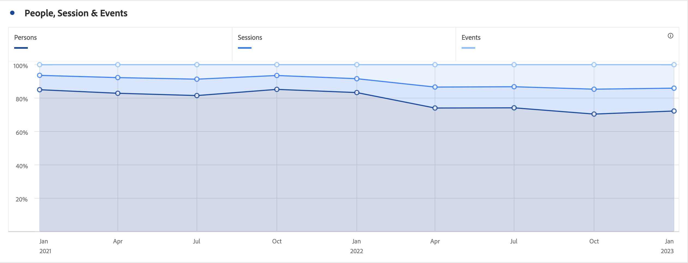

# Bereich (gestapelt)

>[!BEGINSHADEBOX]

_In diesem Artikel werden die Visualisierungen „Bereich“ und „Bereich gestapelt_ in  _**Customer Journey Analytics**._ _Siehe [Bereich und Bereich gestapelt](https://experienceleague.adobe.com/de/docs/analytics/analyze/analysis-workspace/visualizations/area)_ für die  _**Adobe Analytics** Version dieses Artikels._

>[!ENDSHADEBOX]

Die Visualisierung „Bereich“ bietet die Optionen „Standardmäßig“ und „Gestapelt“.

## Bereich {#area}

<!-- markdownlint-disable MD034 -->

>[!CONTEXTUALHELP]
>id="workspace_area_button"
>title="Flächendiagramm"
>abstract="Erstellen Sie eine Flächendiagrammvisualisierung, um die Schnittmenge mehrerer Metriken darzustellen."

<!-- markdownlint-enable MD034 -->

Die Visualisierung  **[!UICONTROL Bereich]** ist wie ein Liniendiagramm, aber mit einem farbigen Bereich unterhalb der Linie. Fügen Sie ein Flächendiagramm hinzu, wenn Sie mehrere Metriken darstellen und den Bereich visualisieren möchten, der durch die Schnittmenge von zwei oder mehr Metriken gebildet wird.

## Bereiche gestapelt {#area-stacked}

<!-- markdownlint-disable MD034 -->

>[!CONTEXTUALHELP]
>id="workspace_areastacked_button"
>title="Bereiche gestapelt"
>abstract="Erstellen Sie eine Flächendiagramm-Visualisierung, um die Stapelung mehrerer Metriken darzustellen."

<!-- markdownlint-enable MD034 -->

Die Visualisierung  **[!UICONTROL Bereiche gestapelt]** entspricht einem Flächendiagramm, aber hier beginnt jede Serie über der vorherigen Serie.

Verwenden Sie die Option **[!UICONTROL 100 % gestapelt]** in den  **[!UICONTROL Einstellungen]**, um das Diagramm in eine zu 100 % gestapelte Visualisierung umzuwandeln.

>[!BEGINSHADEBOX]

Siehe  [Bereichsvisualisierung](https://experienceleague.adobe.com/en/docs/customer-journey-analytics-learn/tutorials/analysis-workspace/visualizations/add-area-visualizations){target="_blank"} für ein Demovideo.

>[!ENDSHADEBOX]

>[!MORELIKETHIS]
>
>[Hinzufügen einer Visualisierung zu einem Bedienfeld](/help/analysis-workspace/visualizations/freeform-analysis-visualizations.md#add-visualizations-to-a-panel)
>[Einstellungen der Visualisierung](/help/analysis-workspace/visualizations/freeform-analysis-visualizations.md#settings)
>[Kontextmenü der Visualisierung](/help/analysis-workspace/visualizations/freeform-analysis-visualizations.md#context-menu)
>
