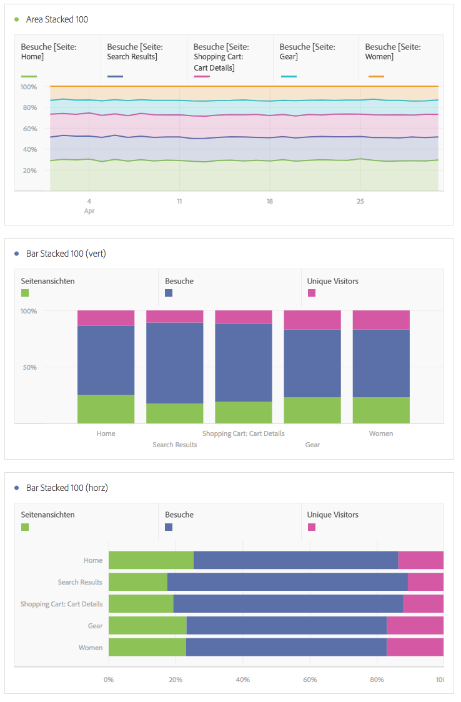

# Bereich und Bereich gestapelt

## Bereich {#Area}

Diese Visualisierung entspricht einem Kantengraph, bei dem der Bereich unter der Linie farbig dargestellt ist. Verwenden Sie ein Flächendiagramm, wenn Sie mehrere Metriken darstellen und den Bereich visualisieren möchten, der durch die Schnittmenge von zwei oder mehr Metriken gebildet wird.

## Bereich gestapelt {#stacked}

Diese Visualisierung entspricht einem Flächendiagramm, aber hier beginnt jede Serie über der vorherigen Serie.

Mit der neuen Einstellung für gestapelte Bereichsdiagramme erhalten Sie eine zu „100 % gestapelte“ Visualisierung.

