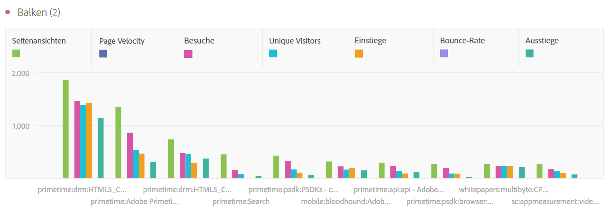

# Balken (gestapelt)

>[!BEGINSHADEBOX]

_In diesem Artikel werden die Visualisierungen mit Balken und gestapelten Balken in {_} _**Customer Journey Analytics** dokumentiert._ _Siehe [Balken und Balken gestapelt](https://experienceleague.adobe.com/en/docs/analytics/analyze/analysis-workspace/visualizations/bar) für die_ _**Adobe Analytics**-Version dieses Artikels._

>[!ENDSHADEBOX]

Die Balkenvisualisierung hat eine standardmäßige und eine gestapelte Option.

## Balken {#bar}

<!-- markdownlint-disable MD034 -->

>[!CONTEXTUALHELP]
>id="workspace_bar_button"
>title="Balken"
>abstract="Erstellen Sie eine Balkenvisualisierung, um verschiedene Werte aus einer oder mehreren Metriken darzustellen."

<!-- markdownlint-enable MD034 -->

Die Visualisierung  **[!UICONTROL Bar]** zeigt vertikale Balken, die verschiedene Werte aus einer oder mehreren Metriken darstellen.

Über eine Dropdown-Liste für die Granularität in den Visualisierungseinstellungen können Sie eine Trend-Visualisierung (z. B. Linie, Balken) von täglich über wöchentlich bis monatlich ändern.

## Balken gestapelt {#bar-stacked}

<!-- markdownlint-disable MD034 -->

>[!CONTEXTUALHELP]
>id="workspace_barstacked_button"
>title="Balken gestapelt"
>abstract="Erstellen Sie eine Balkenvisualisierung, um verschiedene Werte aus einer oder mehreren gestapelten Metriken darzustellen."

<!-- markdownlint-enable MD034 -->

Die **[!UICONTROL BarStacked]**-Visualisierung ist wie ein Balkendiagramm, aber mit den Serienbalken, die übereinander gestapelt sind.

Verwenden Sie die Option **[!UICONTROL 100 % gestapelt]** in  **[!UICONTROL Einstellungen]**, um das Diagramm in eine 100 % gestapelte Visualisierung umzuwandeln.

>[!MORELIKETHIS]
>
>[Hinzufügen einer Visualisierung zu einem Bedienfeld](/help/analysis-workspace/visualizations/freeform-analysis-visualizations.md#add-visualizations-to-a-panel)
>[Visualisierungseinstellungen](/help/analysis-workspace/visualizations/freeform-analysis-visualizations.md#settings)
>[Kontextmenü der Visualisierung](/help/analysis-workspace/visualizations/freeform-analysis-visualizations.md#context-menu)
>

