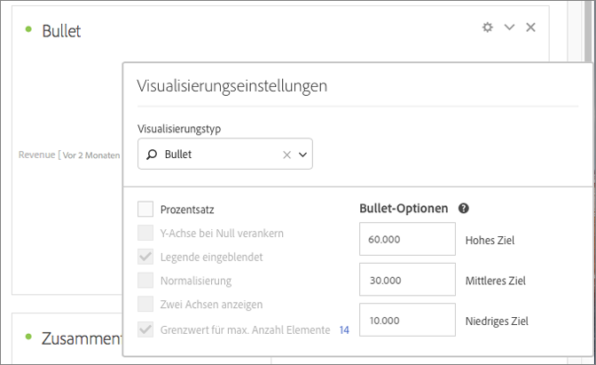

# Lineardiagramm

Schauen wir uns einmal an, wie ein Wert, der Sie interessiert, im Vergleich zu anderen Leistungsbereichen (Zielen) liegt oder ausfällt.

Das Lineardiagramm enthält einen einzigen primären Messwert (z. B. aktueller Umsatz im Jahr) und ermöglicht Ihnen die Eingabe qualitativer Bereiche und Leistungsbereiche (z. B. im Vergleich zu einem Zielumsatz). Sie können zwischen „Hoch“, „Mittel“ und „Niedrig“ wählen. In den [!UICONTROL Visualisierungseinstellungen] können Sie Zielbereiche festlegen.
