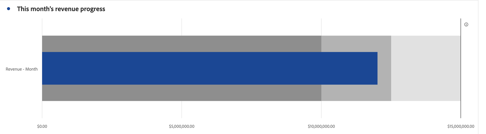

# Horizontales Säulendiagramm {#bullet}

<!-- markdownlint-disable MD034 -->

>[!CONTEXTUALHELP]
>id="cja_workspace_bullet_goalvalue"
>title="Zielwert"
>abstract="**[!UICONTROL Hohes Ziel]** entspricht dem angestrebten Hauptziel. Mit **[!UICONTROL Niedriges Ziel]** und **[!UICONTROL Mittleres Ziel]** werden Bereiche unterhalb des Zielwerts [!UICONTROL Hohes Ziel] erstellt. Hinweis: Wenn die Option **[!UICONTROL Prozentsatz]** aktiviert ist, geben Sie Ziele als Ganzzahlen ein, z. B. `20`, wenn Ihr Ziel zwanzig Prozent ist."

<!-- markdownlint-enable MD034 -->

<!-- markdownlint-disable MD034 -->

>[!CONTEXTUALHELP]
>id="cja_workspace_bullet_button"
>title="Horizontales Säulendiagramm"
>abstract="Erstellen Sie eine Visualisierung als horizontales Säulendiagramm, um anzuzeigen, wie eine Metrik gegenüber Leistungsbereichen (Zielen) abschneidet."

<!-- markdownlint-enable MD034 -->

Die Visualisierung  **[!UICONTROL Aufzählungszeichen]** zeigt, wie eine Metrik Leistungsbereiche (Ziele) vergleicht oder dagegen misst.

Das Lineardiagramm enthält einen einzigen primären Messwert (z. B. aktueller Umsatz im Jahr) und ermöglicht Ihnen die Eingabe qualitativer Bereiche und Leistungsbereiche (z. B. im Vergleich zu einem Zielumsatz). Sie können hohe, mittlere und niedrige Zielbereiche festlegen. Sie können Zielbereiche in  **[!UICONTROL Einstellungen]** festlegen.

## Einstellungen

Sie können bestimmte Einstellungen für eine [!UICONTROL Aufzählungszeichen] -Visualisierung definieren.

| Einstellung | Beschreibung |
|---|---|
| **[!UICONTROL Aufzählungsoptionen]** | Geben Sie in der Visualisierung [!UICONTROL Aufzählungszeichen] Werte für **[!UICONTROL High Ziel]**, **[!UICONTROL Mid Ziel]** und **[!UICONTROL Low Ziel]** an.  **[!UICONTROL Hohes Ziel ]**entspricht dem angestrebten Hauptziel.**[!UICONTROL  Niedriges Ziel ]**und**[!UICONTROL  mittleres Ziel ]**erstellen Bereiche unterhalb des Ziels &quot;Hoch&quot;. Hinweis: Wenn die Option**[!UICONTROL  Prozentsatz ]**aktiviert ist, geben Sie Ziele als Ganzzahlen ein, z. B. `20`, wenn Ihr Ziel zwanzig Prozent ist. |

>[!MORELIKETHIS]
>
>[Hinzufügen einer Visualisierung zu einem Bedienfeld](/help/analysis-workspace/visualizations/freeform-analysis-visualizations.md#add-visualizations-to-a-panel)
>[Visualisierungseinstellungen](/help/analysis-workspace/visualizations/freeform-analysis-visualizations.md#settings)
>[Kontextmenü &quot;Visualisierung&quot;](/help/analysis-workspace/visualizations/freeform-analysis-visualizations.md#context-menu)
>

