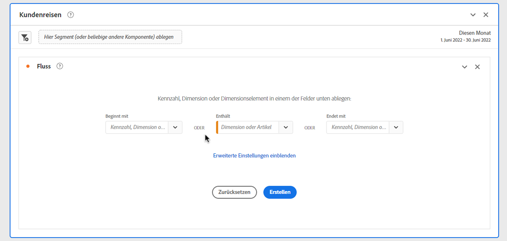
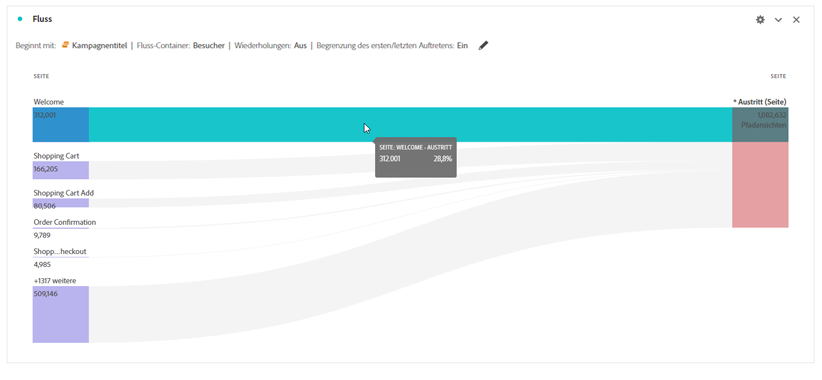
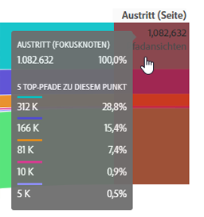
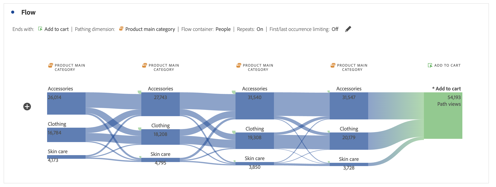

# Konfigurieren einer Flussvisualisierung {#configure-a-flow-visualization}

>[!CONTEXTUALHELP]
>id="workspace_flow_startswith"
>title="Beginnt mit"
>abstract="Dieses Feld kann nur bei der Ersterstellung festgelegt werden. Zum Aktualisieren dieses Felds wählen Sie **[!UICONTROL Zurücksetzen]** aus, um eine neue Flussvisualisierung zu erstellen."

>[!CONTEXTUALHELP]
>id="workspace_flow_contains"
>title="Enthält"
>abstract="Dieses Feld kann nur bei der Ersterstellung festgelegt werden. Zum Aktualisieren dieses Felds wählen Sie **[!UICONTROL Zurücksetzen]** aus, um eine neue Flussvisualisierung zu erstellen."

>[!CONTEXTUALHELP]
>id="workspace_flow_endswith"
>title="Endet mit"
>abstract="Dieses Feld kann nur bei der Ersterstellung festgelegt werden. Zum Aktualisieren dieses Felds wählen Sie **[!UICONTROL Zurücksetzen]** aus, um eine neue Flussvisualisierung zu erstellen."

>[!CONTEXTUALHELP]
>id="workspace_flow_pathingdimension"
>title="Pfaddimension"
>abstract="Wählen Sie eine Dimension aus, die als Pfad verwendet werden soll, der zu der ausgewählten Komponente führt oder von dieser weg führt."

>[!CONTEXTUALHELP]
>id="workspace_flow_container"
>title="Fluss-Container"
>abstract="Wählen Sie den Container aus, der für die Anzeige (der Zahlen) des Pfads verwendet werden soll."

>[!CONTEXTUALHELP]
>id="workspace_flow_include_repeats_disabled"
>title="Wiederholungen einschließen (deaktiviert)"
>abstract="Wiederholungen können nicht aus Flussvisualisierungen entfernt werden, die Dimensionen mit mehreren Werten enthalten."

>[!CONTEXTUALHELP]
>id="workspace_flow_include_repeats_default"
>title="Wiederholungen einschließen"
>abstract="Flussvisualisierungen basieren auf Instanzen einer Dimension. Diese Einstellung gibt Ihnen die Möglichkeit, wiederholte Instanzen ein- oder auszuschließen, z. B. Seitenneuladungen."

>[!CONTEXTUALHELP]
>id="workspace_flow_limit_occurrence"
>title="Begrenzung auf erstes/letztes Auftreten"
>abstract="Die Ergebnisse sind auf Pfade beschränkt, wenn der erste/letzte Touchpoint ein Ein-/Ausstieg ist."

>[!CONTEXTUALHELP]
>id="workspace_flow_numberofcolumns"
>title="Anzahl der Spalten"
>abstract="Dieses Feld kann nur bei der Ersterstellung festgelegt werden. Zum Aktualisieren dieses Felds wählen Sie **[!UICONTROL Zurücksetzen]** aus, um eine neue Flussvisualisierung zu erstellen."

>[!CONTEXTUALHELP]
>id="workspace_flow_itemsexpandedpercolumn"
>title="Erweiterte Elemente pro Spalte"
>abstract="Dieses Feld kann nur bei der Ersterstellung festgelegt werden. Zum Aktualisieren dieses Felds wählen Sie **[!UICONTROL Zurücksetzen]** aus, um eine neue Flussvisualisierung zu erstellen."

>[!CONTEXTUALHELP]
>id="workspace_flow_resettoupdate"
>title="Zum Aktualisieren zurücksetzen"
>abstract="Dieses Feld kann nur bei der Ersterstellung festgelegt werden. Zum Aktualisieren dieses Felds wählen Sie **[!UICONTROL Zurücksetzen]** aus, um eine neue Flussvisualisierung zu erstellen."

Flussvisualisierungen helfen Ihnen, die Journey zu verstehen, die von einem bestimmten Konversionsereignis auf Ihrer Website oder in Ihrer App stammt. Oder führen zu einem bestimmten Konversionsereignis. Die Visualisierung verfolgt einen Pfad durch Ihre Dimensionen (und Dimensionselemente) oder Metriken.

Sie können den Beginn oder das Ende des Pfads konfigurieren, an dem Sie interessiert sind. Oder analysieren Sie alle Pfade, die durch eine Dimension oder ein Dimensionselement fließen.

## Verwenden

1. Fügen Sie eine  **[!UICONTROL Flussvisualisierung]** hinzu. Weitere Informationen finden Sie unter [Hinzufügen einer Visualisierung in einem Bedienfeld](../freeform-analysis-visualizations.md#add-visualizations-to-a-panel)

1. Sie können Ihre Flussvisualisierung mithilfe einer der folgenden Optionen verankern:

   * [!UICONTROL **Beginnt mit**] (Metriken, Dimensionen oder Elemente) oder
   * [!UICONTROL **Enthält**] (Dimensionen oder Elemente) oder
   * [!UICONTROL **Endet mit**] (Metriken, Dimensionen oder Elemente)

   Jede dieser Kategorien wird auf dem Bildschirm als ein *Ablagebereich* angezeigt. Sie können den Ablagebereich auf drei Arten füllen:

   * Verwenden Sie das Dropdown-Menü, um Metriken oder Dimensionen auszuwählen.
   * Ziehen Sie Dimensionen oder Metriken per Drag-and-Drop aus dem linken Bedienfeld.
   * Beginnen Sie mit der Eingabe des Namens einer Dimension oder Metrik und wählen Sie ihn aus, wenn er im Dropdown-Menü angezeigt wird.

   >[!IMPORTANT]
   >
   >Berechnete Metriken können nicht in einem Feld **[!UICONTROL Beginnt mit]** oder **[!UICONTROL Endet mit]** verwendet werden.

1. Wenn Sie eine Metrik auswählen, müssen Sie auch eine [!UICONTROL **Pfaddimension**] angeben, die als Pfad verwendet wird, der zu Ihrer ausgewählten Komponente hin oder von dieser weg führt, wie hier dargestellt. Die Standardeinstellung ist [!UICONTROL **Seite**].

   

1. (Optional) Wählen Sie **[!UICONTROL Erweiterte Einstellungen anzeigen]** aus, um die folgenden Optionen zu konfigurieren:

   | Einstellung | Beschreibung |
   | --- | --- |
   | **[!UICONTROL Beschriftungen umbrechen]** | Die Bezeichnungen der Flusselemente werden üblicherweise aus Platzgründen auf dem Bildschirm abgeschnitten. Aktivieren Sie dieses Kontrollkästchen, um die gesamte Bezeichnung anzuzeigen.  Standard = deaktiviert. |
   | **[!UICONTROL Wiederholungsinstanzen einschließen]** | Flussvisualisierungen basieren auf Instanzen einer Dimension. Diese Einstellung gibt Ihnen die Möglichkeit, wiederholte Instanzen ein- oder auszuschließen, z. B. Seitenneuladungen. Wiederholungen können jedoch nicht aus Flussvisualisierungen entfernt werden, die Dimensionen mit mehreren Werten enthalten, wie listVars, listProps, s.product, Merchandising-eVars usw. 
Standardmäßig ist diese Option deaktiviert.
 |
   | **[!UICONTROL Begrenzung auf erstes/letztes Auftreten]** | Begrenzen Sie Pfade auf diejenigen, die mit dem ersten/letzten Auftreten einer Dimension, eines Elements oder einer Metrik beginnen oder enden. Eine ausführlichere Erläuterung finden Sie unter [Begrenzung auf erstes/letztes Auftreten](#example-scenario-for-limit-to-firstlast-occurrence). |
   | **[!UICONTROL Anzahl der Spalten]** | Die Anzahl der Spalten, die Ihr Flussdiagramm enthalten soll. Sie können maximal 5 Spalten angeben. |
   | **[!UICONTROL Erweiterte Elemente pro Spalte]** | Die Anzahl der Elemente, die jede Spalte enthalten soll. Sie können pro Spalte maximal 10 erweiterte Elemente angeben. |
   | **[!UICONTROL Fluss-Container]** | Zur Pfadanalyse können Sie zwischen **[!UICONTROL Globales Konto]** [!BADGE B2B edition]{type=Informative url="https://experienceleague.adobe.com/de/docs/analytics-platform/using/cja-overview/cja-b2b/cja-b2b-edition" newtab=true tooltip="Customer Journey Analytics B2B Edition"}, **[!UICONTROL Account]** [!BADGE B2B edition]{type=Informative url="https://experienceleague.adobe.com/de/docs/analytics-platform/using/cja-overview/cja-b2b/cja-b2b-edition" newtab=true tooltip="Customer Journey Analytics B2B Edition"}, **[!UICONTROL Opportunity]** [!BADGE B2B edition]{type=Informative url="https://experienceleague.adobe.com/de/docs/analytics-platform/using/cja-overview/cja-b2b/cja-b2b-edition" newtab=true tooltip="Customer Journey Analytics B2B Edition"}, **[!UICONTROL Buying Group]** [!BADGE B2B edition]{type=Informative url="https://experienceleague.adobe.com/de/docs/analytics-platform/using/cja-overview/cja-b2b/cja-b2b-edition" newtab=true tooltip="Customer Journey Analytics B2B Edition"}, **[!UICONTROL Sessions]** und **[!UICONTROL Person]** wechseln. Diese Einstellungen helfen Ihnen, die Interaktion auf einer bestimmten Container-Ebene (sitzungsübergreifend) zu verstehen oder die Analyse auf eine einzelne Sitzung einzuschränken. |

   >[!IMPORTANT]
   >
   >Die Kombination von **[!UICONTROL Anzahl der Spalten]** und **[!UICONTROL Erweiterte Elemente pro Spalte]** bestimmt die Anzahl der zugrunde liegenden Anfragen, die zum Erstellen der Flussvisualisierung erforderlich sind. Je höher diese Zahlen sind, desto länger dauert das Rendern einer Visualisierung.

1. Wählen Sie **[!UICONTROL Erstellen]** aus.

### Beispiel

Angenommen, Sie möchten den Pfad verfolgen, den Benutzende zu und von den beliebtesten Seiten Ihrer Site eingeschlagen haben.

1. Erstellen Sie eine Flussvisualisierung, wie oben beschrieben.
1. Ziehen Sie die Dimension [!UICONTROL **Seite**] in das Feld **[!UICONTROL Enthält]** und wählen Sie [!UICONTROL **Erstellen**] aus.
1. Die Flussvisualisierung wird mit der am häufigsten angezeigten Seite erstellt, die im Fokusknoten in der Mitte der Visualisierung angezeigt wird. Sie sehen auch die Top-Seiten, die zu dieser Seite führen (links neben dem Fokusknoten), sowie die Top-Seiten, die von dieser Seite weg führen (rechts neben dem Fokusknoten).
1. Analysieren Sie die Daten im Fluss, wie unter [Konfigurieren](#configure) beschrieben.

## Konfigurieren

Eine Zusammenfassung der Flusskonfiguration wird oben in den Visualisierungen angezeigt. Die Pfade in dem Diagramm sind proportional. Pfade mit mehr Aktivität werden dicker dargestellt.

Um die Daten weiter zu untersuchen, haben Sie mehrere Möglichkeiten:

* Das Flussdiagramm ist interaktiv. Wenn Sie den Mauszeiger über das Diagramm halten, werden jeweils andere Details angezeigt.

* Wenn Sie einen Knoten in dem Diagramm auswählen, werden die zugehörigen Details zu diesem Knoten angezeigt. Wählen Sie den Knoten erneut aus, um ihn wieder zu reduzieren.

  

* Sie können eine Spalte so filtern, dass nur bestimmte Ergebnisse angezeigt werden, z. B. das Ein- und Ausschließen, die Angabe von Kriterien usw.

* Wählen Sie  auf der linken oder rechten Seite aus, um eine Spalte zu erweitern.

* Verwenden Sie zum Anpassen der Ausgabe die [Kontextmenü](#context-menu)-Optionen.

* Um den Fluss zu bearbeiten oder ihn mit verschiedenen Optionen neu zu erstellen, wählen Sie  neben der Konfigurationszusammenfassung aus.

## Filter

Über jeder Spalte wird ein Filter  angezeigt, wenn Sie den Mauszeiger darüber bewegen. Wenn Sie den Filter auswählen, sehen Sie dasselbe Filterdialogfeld, das heute auch in der Freiformtabelle vorhanden ist. Siehe [Filtern und Sortieren](freeform-table/../../freeform-table/filter-and-sort.md).

* Verwenden Sie **[!UICONTROL Erweiterte Optionen anzeigen]** zum Konfigurieren der erweiterten Einstellungen, um bestimmte Kriterien in die Benutzerliste aufzunehmen oder auszuschließen. Weitere Informationen finden Sie unter [Filtern und sortieren](../freeform-table/filter-and-sort.md).
* Nachdem Sie eine Spalte gefiltert haben, spiegelt diese spezifische Spalte die Filterung wider. Ein blauer  bedeutet, dass die Spalte gefiltert wird.  Der Filter reduziert die Spalte entweder, um nur das im Filter zulässige Element anzuzeigen, oder er entfernt alle Elemente mit Ausnahme des Elements, das Sie im Filter verwenden möchten.
* Alle vor- und nachgelagerten Spalten werden beibehalten, solange Daten in die verbleibenden Knoten fließen.
* Um einen Filter zu entfernen, wählen Sie  aus. Daraufhin wird das Filtermenü geöffnet. Entfernen Sie alle angewendeten Filter und wählen Sie **[!UICONTROL Speichern]** aus. Der Fluss sollte zum vorherigen, ungefilterten Status zurückkehren.

## Kontextmenü

Verwenden Sie ein Kontextmenü auf einem beliebigen Knoten in der Flussvisualisierung mit den folgenden Optionen:

| Option | Beschreibung |
|--- |--- |
| **[!UICONTROL Auf diesen Knoten fokussieren]** | Wechselt den Fokus auf den ausgewählten Knoten. Der Fokusknoten wird in der Mitte des Flussdiagramms angezeigt. |
| **[!UICONTROL Neu starten]** | Bringt Sie wieder zurück in den Freiform-Diagramm-Builder, in dem Sie ein neues Flussdiagramm erstellen können. |
| **[!UICONTROL Erstellen Sie ein Segment für diesen Pfad]** | Erstellen eines Segments. Diese Auswahl führt Sie zum Segment Builder, in dem Sie das neue Segment konfigurieren können. |
| **[!UICONTROL Aufschlüsselung]** | Hiermit können Sie den Knoten nach verfügbaren Dimensionen, Metriken oder Zeiten aufschlüsseln. |
| **[!UICONTROL Spalte filtern]** | Es werden dieselben Filteroptionen angezeigt, die auch in der Freiformtabelle verfügbar sind. Weitere Informationen zu den verfügbaren Optionen finden Sie im Abschnitt „Anwenden eines einfachen oder erweiterten Filters auf eine Tabelle“ in [Filtern und Sortieren von Tabellen](/help/analysis-workspace/visualizations/freeform-table/filter-and-sort.md). |
| **[!UICONTROL Element ausschließen]** oder **[!UICONTROL Ausgeschlossene Elemente wiederherstellen]** | Entfernt einen bestimmten Knoten aus der Spalte und erstellt daraus automatisch einen Filter oben in der Spalte. Um das ausgeschlossene Element wiederherzustellen, wählen Sie im Kontextmenü **[!UICONTROL Ausgeschlossenes Element wiederherstellen]** aus. Sie können das Segment auch oben in der Spalte öffnen und die Box mit dem Element entfernen, das Sie gerade ausgeschlossen haben. |
| **[!UICONTROL Trend]** | Mit dieser Option erstellen Sie ein Trenddiagramm für den Knoten. |
| **[!UICONTROL Nächste Spalte anzeigen]** / **[!UICONTROL Vorherige Spalte anzeigen]** | Zeigt die nächste (rechte) oder vorherige (linke) Spalte der Visualisierung an. |
| **[!UICONTROL Spalte ausblenden]**n | Blendet die ausgewählte Spalte aus der Visualisierung aus. |
| **[!UICONTROL Gesamte Spalte erweitern]** | Hiermit erweitern Sie eine Spalte so, dass alle Knoten angezeigt werden. In der Standardeinstellung werden nur die obersten fünf Knoten angezeigt. |
| **[!UICONTROL Zielgruppe aus Auswahl erstellen]** | Erstellt eine Zielgruppe basierend auf der ausgewählten Spalte. |
| **[!UICONTROL Gesamte Spalte reduzieren]** | Diese Option blendet alle Knoten in einer Spalte aus. |

## Begrenzung auf erstes/letztes Auftreten

Beachten Sie bei Verwendung dieser Option Folgendes:

* **[!UICONTROL Auf das erste/letzte Vorkommen beschränken]** zählt nur das erste/letzte Vorkommen in der Reihe. Alle anderen Vorkommen der Kriterien **[!UICONTROL Beginnt mit]** oder **[!UICONTROL Endet mit]** werden verworfen.
* Bei Verwendung mit einem Fluss des Typs **[!UICONTROL Beginnt mit]** wird nur das erste Vorkommen einbezogen, das den enthaltenen Startkriterien entspricht.
Im folgenden Beispiel sind **alle** Vorkommen von *Zum Warenkorb hinzufügen* und *Produkthauptkategorie* in jedem Schritt des Flusses enthalten.
  

  Im folgenden Beispiel sind nur die **ersten** Vorkommen von *Zum Warenkorb hinzufügen* und *Produkthauptkategorie* in jedem Schritt des Flusses enthalten.
  
* Bei Verwendung mit einem Fluss des Typs **[!UICONTROL Endet mit]** wird nur das letzte Vorkommen einbezogen, das den Endkriterien entspricht.
Im folgenden Beispiel sind **alle** Vorkommen von *Produkthauptkategorie* und *Zum Warenkorb hinzufügen* in jedem Schritt des Flusses enthalten.
  

  Im folgenden Beispiel sind nur die **letzten** Vorkommen von *Produkthauptkategorie* und *Zum Warenkorb hinzufügen* in jedem Schritt des Flusses enthalten.
  
* Die verwendete Reihe unterscheidet sich je nach Container. Wenn Sie den **[!UICONTROL Sitzungs]**-Container verwenden, ist die Ereignisserie auf eine Sitzung beschränkt.  Wenn Sie einen der anderen Container verwenden (z. B. **[!UICONTROL Person]** oder **[!UICONTROL Account]** [!BADGE B2B edition]{type=Informative url="https://experienceleague.adobe.com/de/docs/analytics-platform/using/cja-overview/cja-b2b/cja-b2b-edition" newtab=true tooltip="Customer Journey Analytics B2B Edition"} oder **[!UICONTROL Opportunity]** [!BADGE B2B edition]{type=Informative url="https://experienceleague.adobe.com/de/docs/analytics-platform/using/cja-overview/cja-b2b/cja-b2b-edition" newtab=true tooltip="Customer Journey Analytics B2B Edition"}), basiert die Ereignisreihe auf dem angegebenen Container und umfasst möglicherweise mehrere Sitzungen.
* Die Option **[!UICONTROL Begrenzung auf erstes/letztes Auftreten]** kann in den erweiterten Einstellungen konfiguriert werden, wenn ein Metrik- oder Dimensionselement in den Feldern **[!UICONTROL Beginnt mit]** oder **[!UICONTROL Endet mit]** verwendet wird.

>[!MORELIKETHIS]
>
>[Hinzufügen einer Visualisierung zu einem Bedienfeld](/help/analysis-workspace/visualizations/freeform-analysis-visualizations.md#add-visualizations-to-a-panel)
>[Visualisierungseinstellungen](/help/analysis-workspace/visualizations/freeform-analysis-visualizations.md#settings)
>[Kontextmenü der Visualisierung](/help/analysis-workspace/visualizations/freeform-analysis-visualizations.md#context-menu)
>

