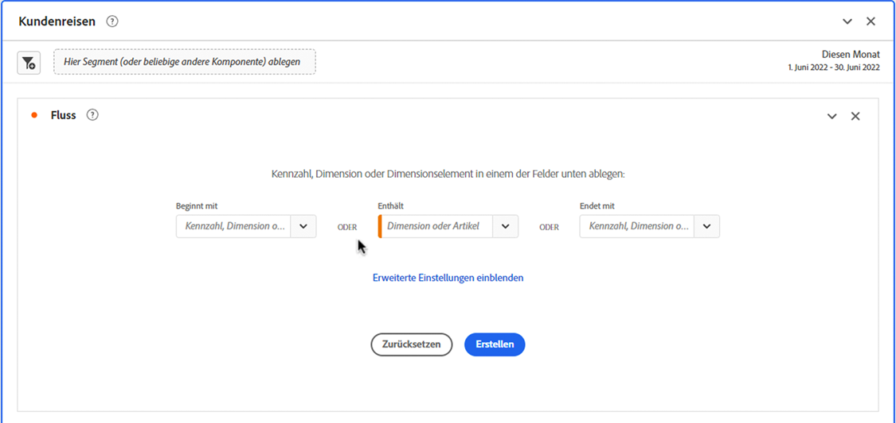

# Konfigurieren einer Flussvisualisierung

Flussvisualisierungen helfen Ihnen, die Journey zu verstehen, die von einem bestimmten Konversionsereignis auf Ihrer Website oder in Ihrer App stammt. Oder führen zu einem bestimmten Konversionsereignis. Die Visualisierung verfolgt einen Pfad durch Ihre Dimensionen (und Dimensionselemente) oder Metriken.

Sie können den Beginn oder das Ende des Pfads konfigurieren, an dem Sie interessiert sind. Oder analysieren Sie alle Pfade, die durch eine Dimension oder ein Dimensionselement fließen.

## Verwenden

1. Fügen Sie eine Visualisierung  **[!UICONTROL Flow]** hinzu. Siehe [Hinzufügen einer Visualisierung zu einem Bedienfeld](../freeform-analysis-visualizations.md#add-visualizations-to-a-panel).

1. Sie können Ihre Flussvisualisierung mithilfe einer der folgenden Optionen verankern:

   * [!UICONTROL **Beginnt mit**] (Metriken, Dimensionen oder Elemente) oder
   * [!UICONTROL **Enthält**] (Dimensionen oder Elemente) oder
   * [!UICONTROL **Endet mit**] (Metriken, Dimensionen oder Elemente)

   Jede dieser Kategorien wird auf dem Bildschirm als *Ablagebereich“*. Sie können den Ablagebereich auf drei Arten füllen:

   * Verwenden Sie das Dropdown-Menü, um Metriken oder Dimensionen auszuwählen.
   * Ziehen Sie Dimensionen oder Metriken aus dem linken Bedienfeld.
   * Beginnen Sie mit der Eingabe des Namens einer Dimension oder Metrik und wählen Sie sie dann aus, wenn sie in der Dropdown-Liste angezeigt wird.

   >[!IMPORTANT]
   >
   >Berechnete Metriken können nicht in den Feldern **[!UICONTROL Beginnt mit]** oder **[!UICONTROL Endet mit]** verwendet werden.

1. Wenn Sie eine Metrik auswählen, müssen Sie auch eine &quot;[!UICONTROL **&quot;-Dimension angeben**] die als Pfad verwendet werden soll, der zu der ausgewählten Komponente führt oder von ihr stammt, wie hier dargestellt. Die Standardeinstellung ist [!UICONTROL **Seite**].

   

1. (Optional) Wählen Sie **[!UICONTROL Erweiterte Einstellungen anzeigen]** aus, um eine der folgenden Optionen zu konfigurieren:

   | Einstellung | Beschreibung |
   | --- | --- |
   | **[!UICONTROL Beschriftungen umbrechen]** | Die Bezeichnungen der Flusselemente werden üblicherweise aus Platzgründen auf dem Bildschirm abgeschnitten. Aktivieren Sie dieses Kontrollkästchen, um die gesamte Bezeichnung anzuzeigen.  Standard = deaktiviert. |
   | **[!UICONTROL Wiederholungsinstanzen einschließen]** | Flussvisualisierungen basieren auf Instanzen einer Dimension. Mit dieser Einstellung haben Sie die Möglichkeit, wiederholte Instanzen, z. B. das Neuladen von Seiten, ein- oder auszuschließen. Wiederholungen können jedoch nicht aus Flussvisualisierungen entfernt werden, die Dimensionen mit mehreren Werten enthalten, wie listVars, listProps, s.product, Merchandising-eVars usw. 
Standardmäßig ist diese Option deaktiviert.
 |
   | **[!UICONTROL Begrenzung auf erstes/letztes Auftreten]** | Begrenzen Sie Pfade auf Pfade, die mit dem ersten oder letzten Vorkommen einer Dimension, eines Elements oder einer Metrik beginnen oder enden. Eine [ Erklärung finden Sie unter „Begrenzung auf erstes ](#example-scenario-for-limit-to-firstlast-occurrence) letztes Auftreten“. |
   | **[!UICONTROL Anzahl der Spalten]** | Die Anzahl der Spalten, die Ihr Flussdiagramm enthalten soll. Sie können maximal 5 Spalten angeben. |
   | **[!UICONTROL Erweiterte Elemente pro Spalte]** | Die Anzahl der Elemente, die jede Spalte enthalten soll. Sie können pro Spalte maximal 10 erweiterte Elemente angeben. |
   | **[!UICONTROL Fluss-Container]** | Sie können zwischen **[!UICONTROL Sitzungen]** und **[!UICONTROL Person) wechseln]** um die Pfade zu analysieren. Mit diesen Einstellungen können Sie die Interaktion einer Person auf Personenebene (sitzungsübergreifend) verstehen oder die Analyse auf eine einzelne Sitzung beschränken. |

   >[!IMPORTANT]
   >
   >Die Kombination von **[!UICONTROL Anzahl der Spalten]** und **[!UICONTROL Erweiterte Elemente pro Spalte]** bestimmt die Anzahl der zugrunde liegenden Anfragen, die zum Erstellen der Flussvisualisierung erforderlich sind. Je höher diese Zahlen sind, desto länger dauert das Rendern einer Visualisierung.

1. Wählen Sie **[!UICONTROL Erstellen]** aus.

### Beispiel

Angenommen, Sie möchten den Pfad nachverfolgen, den Benutzer von und zu den beliebtesten Seiten Ihrer Site gewählt haben.

1. Erstellen Sie eine Flussvisualisierung wie oben beschrieben.
1. Ziehen Sie die Dimension [!UICONTROL **Seite**] in das Feld **[!UICONTROL Enthält]** und wählen Sie [!UICONTROL **Erstellen**] aus.
1. Die Flussvisualisierung erstellt im Mittelpunkt der Visualisierung eine Seite, die im Fokusknoten am häufigsten angezeigt wird. Außerdem werden die obersten Seiten, die zu dieser Seite führen (links neben dem Fokusknoten), sowie die obersten Seiten, die von dieser Seite führen (rechts neben dem Fokusknoten) angezeigt.
1. Analysieren Sie die Daten im Fluss, wie unter [Konfigurieren](#configure) beschrieben.

## Konfigurieren

Eine Zusammenfassung der Flusskonfiguration wird oben in den Visualisierungen angezeigt. Die Pfade in dem Diagramm sind proportional. Pfade mit mehr Aktivität werden dicker dargestellt.

Um die Daten weiter zu untersuchen, haben Sie mehrere Möglichkeiten:

* Das Flussdiagramm ist interaktiv. Wenn Sie den Mauszeiger über das Diagramm halten, werden jeweils andere Details angezeigt.

* Wenn Sie einen Knoten in dem Diagramm auswählen, werden die zugehörigen Details zu diesem Knoten angezeigt. Wählen Sie den Knoten erneut aus, um ihn zu reduzieren.

  

* Sie können eine Spalte so filtern, dass nur bestimmte Ergebnisse angezeigt werden, z. B. das Ein- und Ausschließen, die Angabe von Kriterien usw.

* Wählen Sie  auf der linken oder rechten Seite aus, um eine Spalte zu erweitern.

* Um die Ausgabe anzupassen, verwenden Sie die Optionen [Kontextmenü](#context-menu) .

* Um den Fluss zu bearbeiten oder ihn mit verschiedenen Optionen neu zu erstellen, wählen  neben der Konfigurationsübersicht aus.

## Filter

Über jeder Spalte wird ein Filter  angezeigt, wenn Sie den Mauszeiger darüber bewegen. Durch Auswahl des Filters rufen Sie dasselbe Filterdialogfeld ab, das in der Freiformtabelle vorhanden ist. Siehe [Filtern und Sortieren](freeform-table/../../freeform-table/filter-and-sort.md).

* Verwenden Sie **[!UICONTROL Erweitert anzeigen]** um erweiterte Einstellungen so zu konfigurieren, dass bestimmte Kriterien mit einer Liste von Benutzern ein- oder ausgeschlossen werden. Weitere Informationen finden [ unter ](../freeform-table/filter-and-sort.md) und Sortieren .
* Nachdem Sie eine Spalte gefiltert haben, spiegelt diese Spalte die Filterung wider. Ein blauer  bedeutet, dass die Spalte gefiltert wird.  Der Filter reduziert entweder die Spalte, sodass nur das im Filter zulässige Element angezeigt wird. Oder es entfernt alle Elemente mit Ausnahme des Elements, das Sie in den Filter aufnehmen möchten.
* Alle nachgelagerten und vorgelagerten Spalten bleiben bestehen, solange Daten in die verbleibenden Knoten fließen.
* Um einen Filter zu entfernen, wählen Sie  aus, um das Filtermenü zu öffnen. Entfernen Sie alle angewendeten Filter und wählen Sie **[!UICONTROL Speichern]** aus. Der Fluss sollte zum vorherigen, ungefilterten Status zurückkehren.

## Kontextmenü

Verwenden Sie ein Kontextmenü auf einem beliebigen Knoten in der Flussvisualisierung mit den folgenden Optionen:

| Option | Beschreibung |
|--- |--- |
| **[!UICONTROL Auf diesen Knoten fokussieren]** | Wechselt den Fokus auf den ausgewählten Knoten. Der Fokusknoten wird in der Mitte des Flussdiagramms angezeigt. |
| **[!UICONTROL Neu starten]** | Kehren Sie zum Freiformdiagramm-Builder zurück, in dem Sie ein neues Flussdiagramm erstellen können. |
| **[!UICONTROL Erstellen Sie einen Filter für diesen Pfad]** | Erstellen Sie einen Filter. Diese Auswahl führt Sie zum Filter-Builder, in dem Sie den neuen Filter konfigurieren können. |
| **[!UICONTROL Aufschlüsselung]** | Hiermit können Sie den Knoten nach verfügbaren Dimensionen, Metriken oder Zeiten aufschlüsseln. |
| **[!UICONTROL Filterspalte]** | Es werden dieselben Filteroptionen angezeigt, die auch in der Freiformtabelle verfügbar sind. Weitere Informationen zu den verfügbaren Optionen finden Sie im Abschnitt „Anwenden eines einfachen oder erweiterten Filters auf eine Tabelle“ in &quot;[ und Sortieren von Tabellen](/help/analysis-workspace/visualizations/freeform-table/filter-and-sort.md). |
| **[!UICONTROL Element ausschließen]** oder **[!UICONTROL Ausgeschlossene Elemente wiederherstellen]** | Entfernt einen bestimmten Knoten aus der Spalte und erstellt daraus automatisch einen Filter oben in der Spalte. Um das ausgeschlossene Element wiederherzustellen, wählen Sie im Kontextmenü die Option **[!UICONTROL Ausgeschlossenes Element wiederherstellen]** aus. Sie können den Filter auch oben in der Spalte öffnen und die Box mit dem Element entfernen, das Sie gerade ausgeschlossen haben. |
| **[!UICONTROL Trend]** | Mit dieser Option erstellen Sie ein Trenddiagramm für den Knoten. |
| **[!UICONTROL Nächste Spalte anzeigen]** / **[!UICONTROL Vorherige Spalte anzeigen]** | Zeigt die nächste (rechte) oder vorherige (linke) Spalte der Visualisierung an. |
| **[!UICONTROL Spalte ausblenden]**n | Blendet die ausgewählte Spalte aus der Visualisierung aus. |
| **[!UICONTROL Gesamte Spalte erweitern]** | Hiermit erweitern Sie eine Spalte so, dass alle Knoten angezeigt werden. In der Standardeinstellung werden nur die obersten fünf Knoten angezeigt. |
| **[!UICONTROL Zielgruppe aus Auswahl erstellen]** | Erstellt eine Zielgruppe basierend auf der ausgewählten Spalte. |
| **[!UICONTROL Gesamte Spalte reduzieren]** | Diese Option blendet alle Knoten in einer Spalte aus. |

## Begrenzung auf erstes/letztes Auftreten

Beachten Sie bei Verwendung dieser Option Folgendes:

* **[!UICONTROL Auf das erste/letzte Vorkommen beschränken]** zählt nur das erste/letzte Vorkommen in der Reihe. Alle anderen Vorkommen der Kriterien **[!UICONTROL Beginnt mit]** oder **[!UICONTROL Endet mit]** werden verworfen.
* Bei Verwendung mit einem Fluss **[!UICONTROL Beginnt mit]** wird nur das erste Vorkommen einbezogen, das den Startkriterien entspricht.
Im folgenden Beispiel sind **alle** Vorkommen von *Zum Warenkorb hinzufügen* und *Hauptproduktkategorie* in jedem Schritt des Flusses enthalten.
  

  Im folgenden Beispiel sind nur die **ersten** Vorkommen von *Zum Warenkorb hinzufügen* und *Hauptproduktkategorie* in jedem Schritt des Flusses enthalten.
  
* Bei Verwendung mit einem Fluss **[!UICONTROL Endet mit]** wird nur das letzte Vorkommen einbezogen, das den Endkriterien entspricht.
Im folgenden Beispiel sind **alle** Vorkommen von *Produkthauptkategorie* und *Zum Warenkorb hinzufügen* in jedem Schritt des Flusses enthalten.
  

  Im folgenden Beispiel sind nur die **letzten** Vorkommen von *Produkthauptkategorie* und *Zum Warenkorb hinzufügen* in jedem Schritt des Flusses enthalten.
  
* Die verwendete Reihe unterscheidet sich je nach Container. Bei Verwendung des **[!UICONTROL Person]**-Containers ist die Ereignisreihe die Sitzung. Bei Verwendung des **[!UICONTROL Sitzungs]**-Containers sind die Ereignisreihen alle Ereignisse für eine bestimmte Benutzerin oder einen bestimmten Benutzer im bereitgestellten Datumsbereich.
* Die Option **[!UICONTROL Begrenzung auf erstes/letztes Auftreten]** kann in den erweiterten Einstellungen konfiguriert werden, wenn eine Metrik oder ein Element der Dimension in den Feldern **[!UICONTROL Beginnt mit]** oder **[!UICONTROL Endet mit]** verwendet wird.

>[!MORELIKETHIS]
>
>[Hinzufügen einer Visualisierung zu einem Bedienfeld](/help/analysis-workspace/visualizations/freeform-analysis-visualizations.md#add-visualizations-to-a-panel)
>[Visualisierungseinstellungen](/help/analysis-workspace/visualizations/freeform-analysis-visualizations.md#settings)
>[Kontextmenü der Visualisierung](/help/analysis-workspace/visualizations/freeform-analysis-visualizations.md#context-menu)
>

