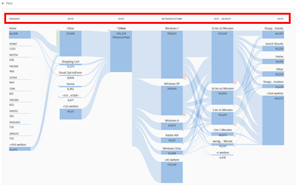
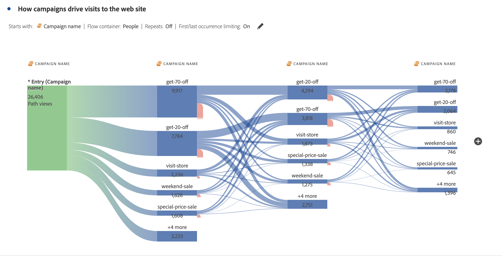

# Interdimensionale Flüsse

Mithilfe eines interdimensionalen Flusses können Sie Benutzerpfade über verschiedene Dimensionen hinweg untersuchen. In diesem Artikel wird gezeigt, wie dieser Fluss für zwei Anwendungsfälle verwendet werden kann: Interaktionen mit Mobile Apps und Ereignisse und wie Kampagnen Web-Besuche fördern

<!--
A dimension label at the top of each Flow column makes using multiple dimensions in a flow visualization more intuitive:

-->

## App-Interaktionen und -Ereignisse

Die Dimension [!UICONTROL Bildschirmname] wird in diesem Beispielfluss verwendet, um zu sehen, wie Benutzende die verschiedenen Bildschirme (Szenen) in der App verwenden. Der zurückgegebene Bildschirm der obersten Ebene, **[!UICONTROL luma: content: ios: en: home]**, ist die Startseite der App:

Um die Interaktion zwischen Bildschirmen und Ereignistypen (z. B. „Hinzufügen zum Warenkorb“, „Käufe“ usw.) in dieser App zu untersuchen, ziehen Sie die Dimension **[!UICONTROL Ereignistypen]** per Drag-and-Drop:

* So ersetzen Sie diese Dimension zusätzlich zu jedem verfügbaren Schritt im Fluss:

  

* So fügen Sie außerhalb der aktuellen Flussvisualisierung die Dimension hinzu:

  

Die folgende Flussvisualisierung zeigt das Ergebnis nach dem Hinzufügen der Dimension **[!UICONTROL Ereignistypen]**. Die Visualisierung bietet Erkenntnisse dazu, wie sich App-Benutzende durch verschiedene Bildschirme in der App bewegen, bevor sie Produkte zu einem Warenkorb hinzufügen, die App schließen, ein Angebot erhalten und vieles mehr.

## Fördern von Web-Besuchen durch Kampagnen

Sie möchten analysieren, welche Kampagnen Besuche auf der Website fördern. Erstellen Sie dazu eine Flussvisualisierung mit dem **[!UICONTROL Kampagnennamen]** als Dimension.

Ersetzen Sie die letzte Dimension **[!UICONTROL Kampagnenname]** durch die Dimension **[!UICONTROL Formatierter Seitenname]** und fügen Sie am Ende der Flussvisualisierung eine weitere Dimension **[!UICONTROL Formatierter Seitenname]** hinzu.

Sie können den Mauszeiger über einen der Flüsse bewegen, um weitere Details anzuzeigen, z. B. welche Kampagnen zu einem Warenkorb-Checkout geführt haben.

