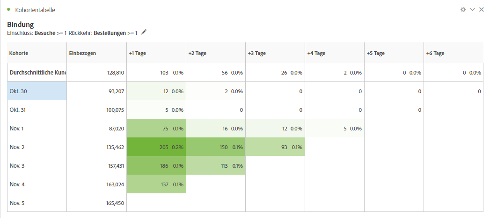
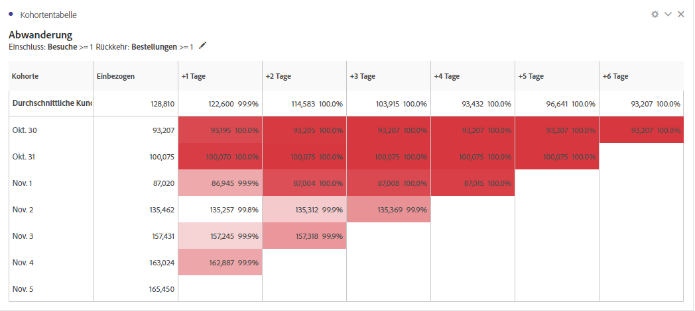

# Überblick über Kohortentabellen {#cohort-table-overview}

<!-- markdownlint-disable MD034 -->

>[!CONTEXTUALHELP]
>id="workspace_cohorttable_button"
>title="Kohortentabelle"
>abstract="Erstellen Sie eine Kohortenvisualisierung, um Benutzende bei Abschluss eines Ereignisses zu gruppieren und die anhaltende Interaktion und Abwanderung im Zeitverlauf zu analysieren."

<!-- markdownlint-enable MD034 -->

<!-- markdownlint-disable MD034 -->

>[!CONTEXTUALHELP]
>id="workspace_cohorttable_panel"
>title="Kohortentabelle"
>abstract="Gruppieren Sie Benutzer nach Abschluss eines Ereignisses und analysieren Sie dann deren fortlaufende Interaktion und Abwanderung im Laufe der Zeit. Geben Sie zusätzliche Einstellungen wie Granularität, Typ der Kohortenanalyse und die Verwendung rollierender Berechnungen an. Sie können erweiterte Optionen festlegen, um eine Latenztabelle oder eine benutzerdefinierte Dimensionskohorte basierend auf einer ausgewählten Dimension zu erstellen."

<!-- markdownlint-enable MD034 -->

>[!BEGINSHADEBOX]

_In diesem Artikel wird die Kohortentabelle in {_} _**Customer Journey Analytics**._ _Siehe [Kohortentabelle](https://experienceleague.adobe.com/en/docs/analytics/analyze/analysis-workspace/visualizations/cohort-table/cohort-analysis) für die_ _**Adobe Analytics**-Version dieses Artikels._

>[!ENDSHADEBOX]

Eine *Kohorte* ist eine Personengruppe mit gemeinsamen Merkmalen innerhalb eines bestimmten Zeitraums. Eine **[!UICONTROL Kohortentabelle]** Visualisierung ist beispielsweise nützlich, wenn Sie erfahren möchten, wie eine Kohorte mit einer Marke interagiert. Sie können problemlos Trend-Änderungen offenlegen und entsprechend reagieren. (Erläuterungen zur [!UICONTROL Kohortenanalyse] sind im Internet verfügbar, z. B. unter [Cohort Analysis 101](https://de.wikipedia.org/wiki/Cohort_analysis).)

Nachdem Sie einen Kohortenbericht erstellt haben, können Sie dessen Komponenten (bestimmte Dimensionen, Metriken und Filter) kuratieren und den Kohortenbericht dann für andere freigeben. Weitere Informationen finden Sie unter [Kuratieren und freigeben](/help/analysis-workspace/curate-share/curate.md).

Beispiele für Möglichkeiten einer „Kohortentabelle:

* Starten Sie Kampagnen, die dafür ausgelegt sind, eine erwünschte Aktion anzuregen.
* Erhöhen Sie das Marketingbudget genau zum richtigen Zeitpunkt im Kundenlebenszyklus.
* Erkennen Sie, wann Sie eine Testversion oder ein Angebot beenden müssen, um den Wert zu maximieren.
* Gewinnen Sie Ideen für A/B-Tests in Bereichen wie Preisstruktur, Upgrade-Pfad usw.

[!UICONTROL Kohortentabelle] steht allen Customer Journey Analytics-Kunden mit Zugriffsrechten auf [!UICONTROL Analysis Workspace] zur Verfügung.

>[!BEGINSHADEBOX]

Siehe  [Kohortenanalyse in Analysis Workspace](https://video.tv.adobe.com/v/23990/?quality=12&learn=on){target="_blank"} für ein Demovideo.

{{videoaa}}

>[!ENDSHADEBOX]

>[!IMPORTANT]
>
>[!UICONTROL Kohortenanalyse] unterstützt keine nicht filterbaren Metriken (einschließlich berechneter Metriken), Nicht-Ganzzahlmetriken (z. B. Umsatz) oder Vorfälle. In der Kohortenanalyse können nur Metriken verwendet werden[!UICONTROL  die in Filtern verwendet werden können] und sie können jeweils nur 1 inkrementiert werden.

Kohortentabellen in Customer Journey Analytics unterstützen doppelbasierte (oder beliebige numerische) Metriken. Beispielsweise kann „Purchase.Value“ (ein doppelter Wert) als Einschluss-/Rückgabe-Metrik verwendet werden. Darüber hinaus sind alle Metriken, die über den Analytics Source Connector an Adobe Experience Platform übergeben werden, ebenfalls doppelt vorhanden.

## Kohortentabellen-Funktionen

In den folgenden Abschnitten werden Funktionen zur Kohortenanalyse beschrieben, die eine Feinabstimmung der Kontrolle über die Kohorten ermöglichen, die Sie erstellen.

Weitere Informationen zum Erstellen einer Kohorte und zum Ausführen eines Berichts [!UICONTROL Kohortenanalyse] finden Sie unter [Konfigurieren einer Kohortentabelle](/help/analysis-workspace/visualizations/cohort-table/t-cohort.md).

### [!UICONTROL Beibehaltung] Tabelle

Eine [!UICONTROL Bindung] Kohortentabelle gibt Personen zurück: Jede Datenzelle zeigt die Rohanzahl und den Prozentsatz der Personen in der Kohorte an, die die Aktion während dieses Zeitraums ausgeführt haben. Sie können bis zu 3 Metriken und bis zu 10 Filter einschließen.

### [!UICONTROL Abwanderung] Tabelle

Eine [!UICONTROL Abwanderungs]-Kohortentabelle ist das Gegenteil einer Bindungstabelle und zeigt die Personen, die im Laufe der Zeit ausgefallen sind oder die Rückkehrkriterien für Ihre Kohorte nie erfüllt haben. Sie können bis zu 3 Metriken und bis zu 10 Filter einschließen.

### [!UICONTROL Rollierende Berechnung]

Sie können die Beibehaltung oder Abwanderung basierend auf der vorherigen Spalte berechnen, nicht basierend auf der eingeschlossenen Spalte, die als rollierende Berechnung bezeichnet wird.

### [!UICONTROL Latenz]-Tabelle

Eine Latenztabelle misst die Zeit, die vor und nach dem Einschlussereignis verstrichen ist. Die Latenzmessung ist ein hervorragendes Tool für Vor- und Nachanalysen. Die Spalte **[!UICONTROL Aufnahme]** befindet sich in der Mitte der Tabelle und die Zeiträume vor und nach dem Aufnahmeereignis werden auf beiden Seiten angezeigt.

### [!UICONTROL Benutzerdefinierte Dimension] Kohorte

Sie können Kohorten basierend auf einer ausgewählten Dimension und nicht auf zeitbasierten Kohorten erstellen (die der Standard sind). Verwenden Sie Dimensionen wie [!UICONTROL Stadt], [!UICONTROL Marketing-Kanal], [!UICONTROL Kampagne], [!UICONTROL Produkt], [!UICONTROL Seite], [!UICONTROL Region] oder jede andere Dimension, um Änderungen der Kundenbindung anzuzeigen. Basierend auf den verschiedenen Werten dieser Dimensionen.

>[!MORELIKETHIS]
>
>[Konfigurieren einer Kohortentabelle](/help/analysis-workspace/visualizations/cohort-table/t-cohort.md).
>

