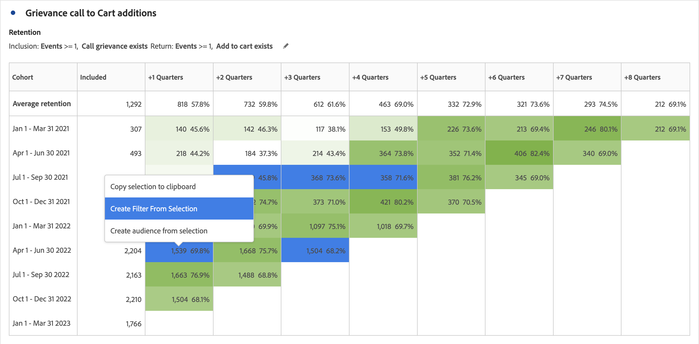

# Konfigurieren einer Kohortentabelle

So erstellen und konfigurieren Sie eine [!UICONTROL Kohortentabelle]:

1. Fügen Sie eine Visualisierung für die Kohortentabelle  **[!UICONTROL 3} hinzu.]** Siehe [Hinzufügen einer Visualisierung zu einem Bedienfeld](../freeform-analysis-visualizations.md#add-visualizations-to-a-panel).

1. Bestimmen Sie die **[!UICONTROL Aufnahmekriterien]**, die **[!UICONTROL Rückkehrkriterien]**, den **[!UICONTROL Kohortentyp]** und die **[!UICONTROL Einstellungen]** wie in der Tabelle unten definiert.

   

   | Element | Beschreibung |
   |--- |--- |
   | **[!UICONTROL Aufnahmekriterien]** | Sie können bis zu 10 Einschlussfilter und bis zu 3 Einschlussmetriken anwenden. Die Metrik gibt an, zu welcher Kohorte ein Benutzer gehört. Wenn die Einschlussmetrik beispielsweise Bestellungen ist, werden nur Benutzer, die innerhalb des Zeitraums der Kohortenanalyse eine Bestellung aufgegeben haben, in die anfängliche Kohorte aufgenommen. Der Standardoperator zwischen den Kennzahlen ist AND, kann aber in OR geändert werden. Außerdem können Sie diesen Metriken numerische Filter hinzufügen. Beispiel: `Sessions >= 1`.  |
   | **[!UICONTROL Rückgabekriterien]** | Sie können bis zu 10 Rückgabefilter und bis zu 3 Rückgabemetriken anwenden. Die Kennzahl gibt an, ob ein Benutzer gewonnen wurde (Bindung) oder nicht (Abwanderung). Wenn die Rückkehrmetrik beispielsweise &quot;Videoansichten&quot;lautet, werden nur Benutzer, die in nachfolgenden Zeiträumen (nach dem Zeitraum, in dem sie zu einer Kohorte hinzugefügt wurden) Videos angezeigt haben, als beibehalten dargestellt. Eine weitere Metrik, die die Beibehaltung quantifiziert, sind Sitzungen. |
   | **[!UICONTROL Granularität]** | Die Zeitgranularität: Tag, Woche, Monat, Quartal oder Jahr. |
   | **[!UICONTROL Typ]** | **[!UICONTROL Bindung]** (Standard): Eine **[!UICONTROL Bindungskohorte]** misst, wie gut Ihre Personenkohorte im Laufe der Zeit zu Ihnen zurückkehrt. Eine Bindungskohorte ist die Standardkohorte und zeigt das Verhalten von zurückkehrenden und wiederholten Benutzern an. Eine grüne Farbe zeigt eine [!UICONTROL Bindungskohorte] in der Tabelle an. **[!UICONTROL Abwanderung ]**: Die Kohorte**[!UICONTROL  Abwanderung ]**(auch als Abbruch oder Fallout bezeichnet) misst, wie Ihre Personenkohorten im Laufe der Zeit aus Ihrem Besitz herausfallen. Die Abwanderung ist das Gegenteil der Bindung: `Churn = 1 - Retention`. Die [!UICONTROL Abwanderung] ist ein guter Messwert für die Treue und Chancen, da Ihnen gezeigt wird, wie häufig Kunden nicht zurückkehren. Sie können die Abwanderung nutzen, um Fokusbereiche zu analysieren und zu identifizieren, um herauszufinden, welche Kohortenfilter etwas Aufmerksamkeit erfordern könnten. Eine rote Farbe weist auf eine [!UICONTROL Abwanderungskohorte] in der Tabelle hin (ähnlich wie Fallout in der Visualisierung**[!UICONTROL  Fluss ]**).  |
   | **[!UICONTROL Einstellungen]** | **[!UICONTROL Rollierende Berechnung]**: Berechnen Sie die Bindung oder die Abwanderung auf der Grundlage der vorherigen Spalte und nicht der Aufnahmespalte (Standard). Durch [!UICONTROL Rollierende Berechnung] wird die Berechnungsmethode für Ihre „Rückkehr“-Zeiten verändert. Die normale Berechnung ermittelt Benutzer, die die Rückkehrkriterien erfüllen und Teil des Aufnahmezeitraums waren. Unabhängig davon, ob sie für den vorherigen Zeitraum in der Kohorte waren oder nicht. Im Gegensatz dazu findet [!UICONTROL Rollierende Berechnung] Benutzer, die die „Rückkehr“-Kriterien erfüllen und Teil des vorherigen Zeitraums waren. Daher filtert [!UICONTROL Rollierende Berechnung] Benutzer, die die „Rückkehr“-Kriterien kontinuierlich in jedem Zeitraum erfüllen, und trichtert sie. [!UICONTROL Rückkehrkriterien] werden auf jeden Zeitraum bis zum ausgewählten Zeitraum angewendet.   **[!UICONTROL Latenztabelle ]**: Eine [!UICONTROL Latenztabelle] misst die Zeit, die vor und nach dem Aufnahmeereignis verstrichen ist. [!UICONTROL Latenztabelle] eignet sich hervorragend für die Vor-/Nachanalyse. Sie haben beispielsweise einen anstehenden Produkt- oder Kampagnenstart und möchten das Verhalten vor und nach dem Start verfolgen. Die Tabelle [!UICONTROL Latenz] zeigt das Verhalten vor und nach dem Beitrag nebeneinander an, um die direkten Auswirkungen zu sehen. Die Zellen vor der Aufnahme in der [!UICONTROL Latenztabelle] berechnen Benutzer, die die [!UICONTROL Aufnahme] -Kriterien für den Aufnahmezeitraum erfüllen und dann die [!UICONTROL Rückgabe] -Kriterien in den Zeiträumen vor dem Aufnahmezeitraum erfüllen. Beachten Sie, dass die Kohorte [!UICONTROL Latenztabelle] und [!UICONTROL Benutzerdefinierte Dimension] nicht zusammen verwendet werden kann.  **[!UICONTROL Angepasste Dimensionskohorte]**: Erstellen Sie Kohorten auf Grundlage der ausgewählten Dimension und nicht auf Grundlage zeitbasierter Kohorten (Standard). Viele Kunden möchten ihre Kohorten nach etwas anderem als der Zeit analysieren, und die neue Funktion für benutzerdefinierte Dimensionskohorten bietet Ihnen genau diese Flexibilität, Kohorten basierend auf Dimensionen ihrer Wahl zu erstellen. Verwenden Sie Dimensionen wie Marketing-Kanal, Kampagne, Produkt, Seite, Region oder jede andere Dimension, um anzuzeigen, wie sich die Bindung basierend auf den verschiedenen Werten dieser Dimensionen ändert. Die Definition eines Kohortenfilters mit [!UICONTROL benutzerspezifischer Dimension] wendet das Dimensionselement nur als Teil des Einschlusszeitraums an, nicht als Teil der Rückgabedefinition.  Nach Auswahl der Option [!UICONTROL Benutzerdefinierte Dimensionskohorte] können Sie jede beliebige Dimension in die Dropzone ziehen. Durch Hinzufügen von Dimensionen können Sie ähnliche Dimensionselemente über denselben Zeitraum hinweg vergleichen. Sie können beispielsweise die Leistung von Städten, Produkten, Kampagnen usw. nebeneinander vergleichen. Die Kohortentabelle gibt Ihre 14 wichtigsten Dimensionselemente zurück. Sie können jedoch einen Filter  verwenden, um nur die gewünschten Dimensionselemente anzuzeigen. Eine [!UICONTROL benutzerdefinierte Dimensionskohorte] kann nicht mit der Funktion [!UICONTROL Latenztabelle] verwendet werden.  |

1. Klicken Sie auf **[!UICONTROL Erstellen]**.
1. Um die [!UICONTROL Kohortentabelle] neu zu konfigurieren, wählen Sie  aus.

1. (Optional) Erstellen Sie einen Filter oder eine Audience aus einer Auswahl.

   Wählen Sie Zellen aus (fortlaufende oder nicht fortlaufende) und klicken Sie mit der rechten Maustaste auf **[!UICONTROL Filter aus Auswahl erstellen]**.

   

1. Bearbeiten Sie den Filter im [Filter-Builder](/help/components/filters/filter-builder.md) weiter und klicken Sie dann auf **[!UICONTROL Speichern]**.

   Der gespeicherte Filter ist im Bedienfeld [!UICONTROL Filter] in [!UICONTROL Analysis Workspace] für die Verwendung verfügbar.

## Einstellungen

Sie können bestimmte Einstellungen für eine [!UICONTROL Kohortentabelle] definieren.

1. Wählen Sie  aus, um die Einstellungen für die [!UICONTROL Kohortentabelle] anzupassen.

   | Einstellung | Beschreibung |
   |---|---|
   | **Nur Prozentwert anzeigen** | Entfernt den Zahlenwert und zeigt nur den Prozentsatz an. |
   | **Prozentwert auf nächste Ganzzahl runden** | Rundet den Prozentwert auf den nächsten ganzzahligen Wert, anstatt den Dezimalwert anzuzeigen. |
   | **Durchschnittliche Prozentzeile anzeigen** | Fügt oben in der Tabelle eine neue Zeile ein und fügt dann den Spaltendurchschnitt der Werte hinzu. |

>[!MORELIKETHIS]
>
>[Hinzufügen einer Visualisierung zu einem Bedienfeld](/help/analysis-workspace/visualizations/freeform-analysis-visualizations.md#add-visualizations-to-a-panel)
>[Visualisierungseinstellungen](/help/analysis-workspace/visualizations/freeform-analysis-visualizations.md#settings)
>[Kontextmenü &quot;Visualisierung&quot;](/help/analysis-workspace/visualizations/freeform-analysis-visualizations.md#context-menu)
>

