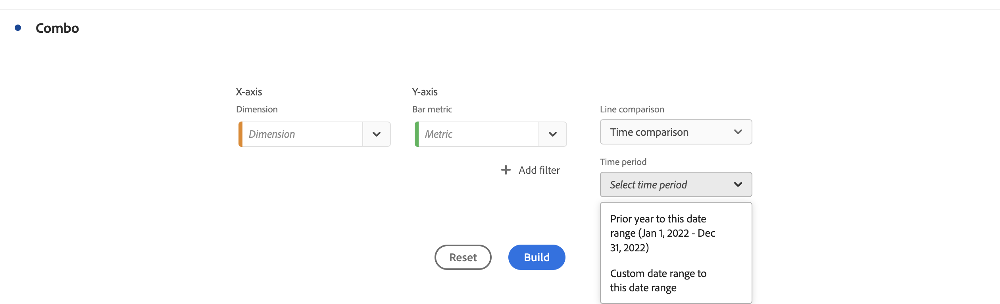

# Kombination {#combo}

<!-- markdownlint-disable MD034 -->

>[!CONTEXTUALHELP]
>id="cja_workspace_combo_button"
>title="Kombination"
>abstract="Erstellen Sie schnell eine Visualisierung eines Kombinationsdiagramms, ohne dass Sie zuerst eine Freiformtabelle erstellen müssen."

<!-- markdownlint-enable MD034 -->

Mit der Visualisierung  **[!UICONTROL Kombo]** können Sie schnell eine Vergleichs-Visualisierung erstellen, ohne zuerst eine Tabelle erstellen zu müssen. Sie können Trends in Ihren Daten einfach in einer Zeilen-/Balkenkombination anzeigen.

Verwenden Sie einen [!UICONTROL Kombo] für Folgendes:

* Vergleichen Sie die Bestellungen dieser Woche zur gleichen Zeit im letzten Monat (und im letzten Jahr).
* Schnelles Analysieren und Vergleichen mehrerer Metriken (z. B. [!UICONTROL Personen] und [!UICONTROL Umsatz]) miteinander im selben Diagramm.
* Analysieren einer Metrik anhand einer Funktion (z. B. [!UICONTROL Kumulativer Durchschnitt]) in einem bestimmten Zeitrahmen.

Bedenken Sie Folgendes:

* Sie können einem einzigen [!UICONTROL Kombinationsdiagramm] mehrere Vergleiche hinzufügen.
* Wenn Sie einen oder mehrere Vergleiche hinzufügen, müssen diese vom gleichen Typ sein, z. B. [!UICONTROL ein Zeitvergleich].
* Sie können bis zu 5 Vergleiche hinzufügen.
* Sie können bis zu 3 Filter auf eine Metrik anwenden.
* Berechnete Metriken werden in Kombinationsdiagrammen nicht unterstützt.

## Verwenden Sie stattdessen 

1. Fügen Sie eine Visualisierung für  [!UICONTROL Kombo] hinzu. Siehe [Hinzufügen einer Visualisierung zu einem Bedienfeld](freeform-analysis-visualizations.md#add-visualizations-to-a-panel)

1. Wählen Sie aus den Dropdown-Listen eine Dimension für die X-Achse und eine Metrik für die Y-Achse aus.

1. Wählen Sie den Typ von [!UICONTROL Linienvergleich] aus, den Sie verwenden möchten.

   | Linienvergleichstyp | Definition |
   | --- | --- |
   | **[!UICONTROL Zeitvergleich]** | Der häufigste Vergleichstyp, z. B. Vergleich dieses Zeitraums mit dem vor 4 Wochen. Wenn Sie [!UICONTROL Zeitvergleich] auswählen, führen Sie eine zweite Auswahl durch, um anzugeben, mit welchem Zeitraum der Vergleich durchgeführt werden soll.
 |
   | **[!UICONTROL Funktion]** | Sie können zum Vergleich eine Funktion wie [!UICONTROL Durchschnitt] hinzufügen. Siehe Liste der [unterstützten Funktionen](#supported-functions).
 |
   | **[!UICONTROL Sekundäre Metrik]** | Sie können beispielsweise den [!UICONTROL Umsatz] mit einer anderen Metrik vergleichen.
 |

   {style="table-layout:auto"}

1. Wählen Sie **[!UICONTROL Erstellen]** aus.

   Die Ausgabe sieht in etwa wie folgt aus:

   

   Der aktuelle Zeitraum wird im Balkendiagramm angezeigt. Das Liniendiagramm stellt den Vergleichszeitraum dar. Die Punkte im Liniendiagramm werden als *Balken* bezeichnet.

## Unterstützte Funktionen

Wenn Sie **[!UICONTROL Funktion]** als [!UICONTROL Kantenvergleichstyp] auswählen, wird eine Funktion der gewählten Metrik zurückgegeben.

| Funktion | Definition |
| --- | --- |
| **[!UICONTROL Spaltensumme]** | Fügt alle numerischen Werte für eine Metrik innerhalb einer Spalte hinzu (über die Elemente einer Dimension hinweg) |
| **[!UICONTROL Kumulativer Durchschnitt]** | Gibt den Durchschnitt der letzten N Zeilen zurück. |
| **[!UICONTROL Median]** | Gibt den Medianwert für eine Metrik in einer Spalte zurück. Der Median ist die Zahl in der Mitte eines Zahlensatzes. Die Hälfte der Zahlen weist Werte auf, die größer oder gleich dem Median sind, und die Hälfte der Zahlen hat Werte, die kleiner oder gleich dem Median sind. |
| **[!UICONTROL Kumulativ]** | Die kumulative Summe von N Zeilen. |
| **[!UICONTROL Spaltenmaximum]** | Gibt den größten Wert in einem Satz aus Dimensionselementen für eine Metrikspalte zurück. |
| **[!UICONTROL Mittel]** | Gibt das arithmetische Mittel (bzw. den Durchschnitt) einer Metrik zurück. |
| **[!UICONTROL Spaltenminimum]** | Gibt den kleinsten Wert in einem Satz aus Dimensionselementen für eine Metrikspalte zurück. |

{style="table-layout:auto"}

Im Folgenden finden Sie ein Beispiel für den kumulativen Durchschnitt der Umsatzmetrik:

Im Folgenden finden Sie ein Beispiel für ein Kombinationsdiagramm mit den Funktionen „Kumulativer Durchschnitt“ und „Mittel“:

>[!MORELIKETHIS]
>
>[Hinzufügen einer Visualisierung zu einem Bedienfeld](/help/analysis-workspace/visualizations/freeform-analysis-visualizations.md#add-visualizations-to-a-panel)
>[Visualisierungseinstellungen](/help/analysis-workspace/visualizations/freeform-analysis-visualizations.md#settings)
>[Kontextmenü &quot;Visualisierung&quot;](/help/analysis-workspace/visualizations/freeform-analysis-visualizations.md#context-menu)
>