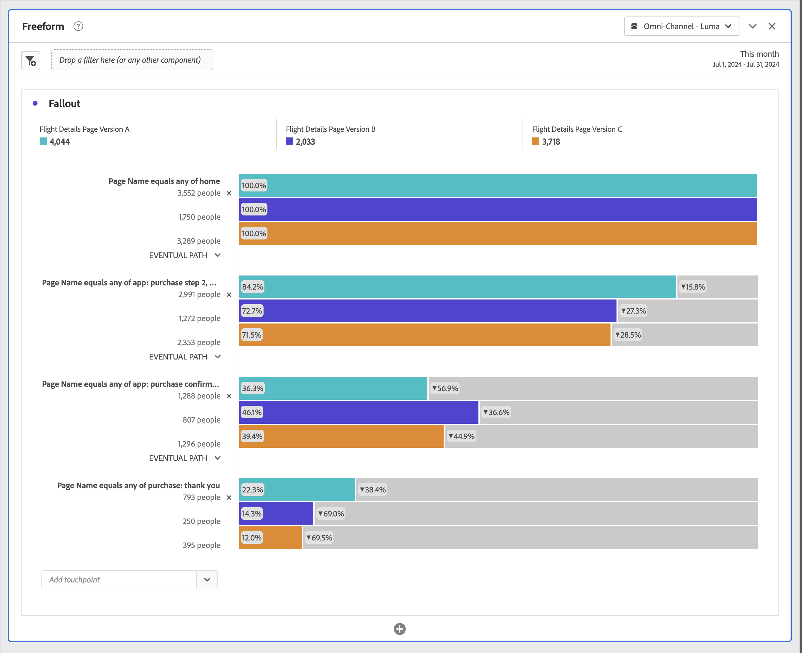

# Segmente in der Fallout-Analyse anwenden

In Analysis Workspace können Sie Segmente aus einem Touchpoint erstellen, Filter als Touchpoint hinzufügen und wichtige Workflows über verschiedene Filter hinweg vergleichen.

>[!IMPORTANT]
>
>Filter, die als Checkpoints in Fallout verwendet werden, müssen einen Container verwenden, der auf einer niedrigeren Ebene als der Gesamtkontext der Fallout-Visualisierung liegt. Bei einem personenbezogenen Kontext-Fallout müssen als Checkpoints verwendete Filter sitzungs- oder ereignisbasierte Filter sein. Bei einem sitzungskontextbezogenen Fallout müssen Filter, die als Checkpoint verwendet werden, ereignisbasierte Filter sein. Wenn Sie eine ungültige Kombination verwenden, beträgt der Fallout 100 %. Wenn Sie einen inkompatiblen Filter als Touchpoint hinzufügen, wird eine Warnung an die Fallout-Visualisierung angezeigt. Bestimmte ungültige Filter-Container-Kombinationen führen zu ungültigen Fallout-Diagrammen, z. B.:
>
>* Verwenden eines personenbasierten Filters als Touchpoint innerhalb einer Fallout-Visualisierung des Personenkontexts
>* Verwenden eines personenbasierten Filters als Touchpoint innerhalb einer Fallout-Visualisierung mit Sitzungskontext
>* Verwenden eines sitzungsbasierten Filters als Touchpoint innerhalb einer Sitzungskontext-Fallout-Visualisierung

## Erstellen eines Filters aus einem Touchpoint

1. Erstellen Sie einen Filter aus einem bestimmten Touchpoint, an dem Sie interessiert sind und den Sie eventuell auch in andere Berichte übernehmen möchten. Klicken Sie mit der rechten Maustaste auf den Touchpoint und wählen Sie **[!UICONTROL Filter aus Touchpoint erstellen]**.

   

   Der [!UICONTROL Filter Builder] wird geöffnet und enthält bereits den vordefinierten sequenziellen Filter, der zu dem von Ihnen ausgewählten Touchpoint passt:

   

1. Geben Sie einen Titel und eine Beschreibung für den Filter ein und speichern Sie ihn.

   Nun können Sie diesen Filter in jedem gewünschten Projekt verwenden.

## Hinzufügen eines Filters als Touchpoint

Wenn Sie zum Beispiel wissen möchten, wie der Trend bei Ihren Benutzern aus den USA aussieht und wie sich dies in der Fallout-Analyse auswirkt, ziehen Sie einfach den Filter „USA-Benutzer“ in den Fallout:

Oder Sie erstellen einen AND-Touchpoint, indem Sie den Filter „USA-Benutzer“ auf einen anderen Checkpoint ziehen.

## Vergleichen von Filtern im Fallout

In der Fallout-Visualisierung können Sie eine unbegrenzte Anzahl von Filtern miteinander vergleichen.

1. Wählen Sie die zu vergleichenden Filter im Bedienfeld &quot;[!UICONTROL &quot; ] der linken Seite aus. Im Beispiel sind drei Filter ausgewählt: *Flugdetails: Seitenversion A*, *Flugdetails: Seitenversion B* und *Flugdetails: Seitenversion C*.
1. Sie ziehen die drei Filter auf den Ablegebereich für Filter oben in der Visualisierung.

1. Optional: Sie können *Alle Besuche* als Standard-Container beibehalten oder den Container löschen.

   

1. Sie können jetzt den Fallout über die drei Filter hinweg vergleichen, z. B. wo ein Filter eine bessere Leistung als der andere hat, oder andere Einblicke erhalten.
