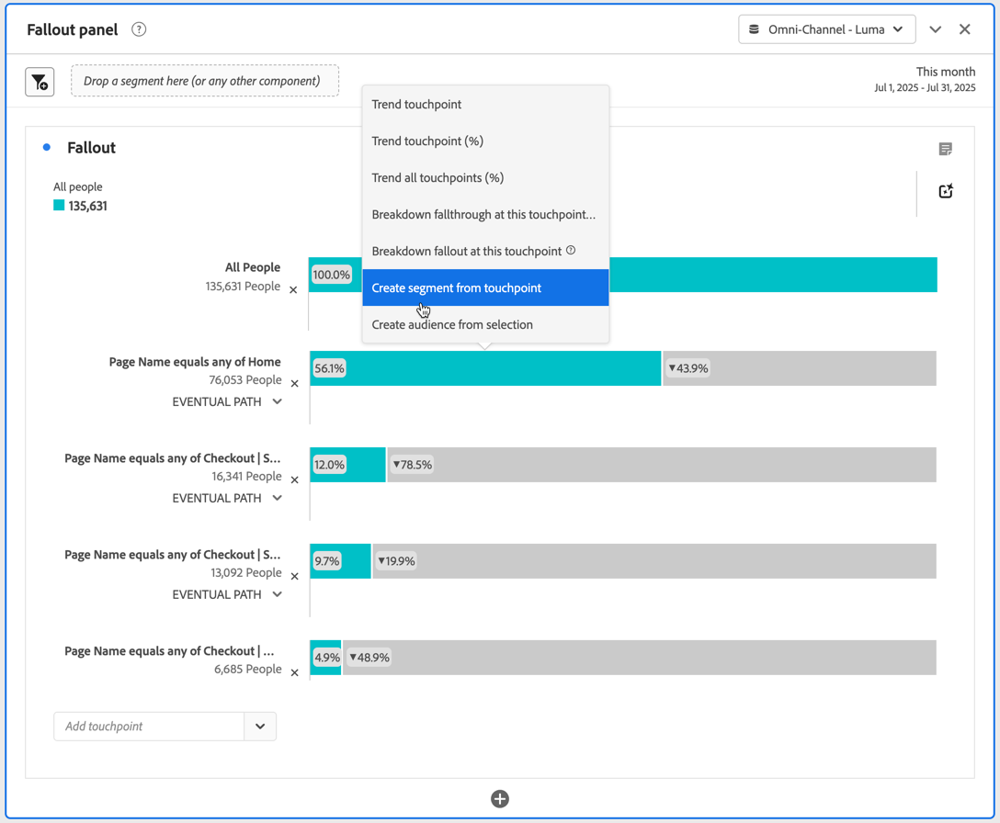
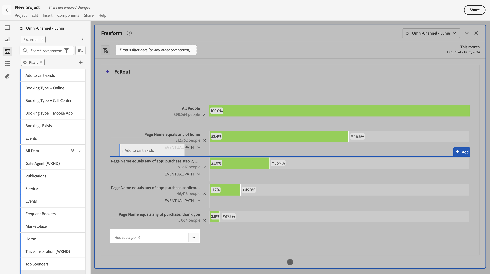

# Segmente in der Fallout-Analyse anwenden

Sie können in Analysis Workspace Segmente aus einem Touchpoint erstellen, Segmente als Touchpoints hinzufügen und wichtige Workflows über verschiedene Segmente hinweg vergleichen.

>[!IMPORTANT]
>
>Segmente, die als Checkpoints in Fallout verwendet werden, müssen einen Container verwenden, der auf einer niedrigeren Ebene liegt als der Gesamtkontext der Fallout-Visualisierung. Bei einem personenbezogenen Kontext-Fallout müssen Segmente, die als Checkpoints verwendet werden, sitzungs- oder ereignisbasierte Segmente sein. Bei einem Sitzungskontext-Fallout müssen Segmente, die als Checkpoint verwendet werden, ereignisbasierte Segmente sein. Wenn Sie eine ungültige Kombination verwenden, beträgt der Fallout 100 %. In der Fallout-Visualisierung wird eine Warnung angezeigt, wenn Sie ein inkompatibles Segment als Touchpoint hinzufügen. Bestimmte ungültige Segment-Container-Kombinationen führen zu ungültigen Fallout-Diagrammen, z. B.:
>
>* Verwenden eines personenbasierten Segments als Touchpoint innerhalb einer Fallout-Visualisierung des Personenkontexts.
>* Verwenden eines personenbasierten Segments als Touchpoint innerhalb einer Fallout-Visualisierung mit Sitzungskontext.
>* Verwenden eines sitzungsbasierten Segments als Touchpoint innerhalb einer Sitzungskontext-Fallout-Visualisierung.

<!-- 
Should we add B2B context here?
* [!BADGE B2B Edition]{type=Informative url="https://experienceleague.adobe.com/de/docs/analytics-platform/using/cja-overview/cja-b2b/cja-b2b-edition" newtab=true tooltip="Customer Journey Analytics B2B Edition"} Usimg a B2B container based segment as a touchpoint inside a non-container based context Fallout visualization.
* 
-->

## Erstellen eines Segments aus einem Touchpoint

1. Als Erstes erstellen Sie ein Segment aus einem bestimmten Touchpoint, an dem Sie interessiert sind und der sich möglicherweise lohnt, auch in andere Berichte übernommen zu werden. Klicken Sie mit der rechten Maustaste auf den Touchpoint und wählen Sie **[!UICONTROL Segment aus Touchpoint erstellen]**.

   

   Der [!UICONTROL Segment Builder] wird geöffnet und enthält vorab das vordefinierte sequenzielle Segment, das dem von Ihnen ausgewählten Touchpoint entspricht:

   

1. Geben Sie dem Segment einen Titel und eine Beschreibung und speichern Sie es.

   Dieses Segment kann jetzt in jedem gewünschten Projekt verwendet werden.

## Hinzufügen eines Segments als Touchpoint

Wenn Sie z. B. wissen möchten, wie der Trend bei Ihren US-Benutzern aussieht und wie sich dies auf den Fallout auswirkt, ziehen Sie einfach das Segment „US-Benutzer“ in den Fallout:

Oder Sie können einen UND-Touchpoint erstellen, indem Sie das Segment „US-Benutzer“ auf einen anderen Checkpoint ziehen.

## Vergleichen von Segmenten im Fallout

In der Fallout-Visualisierung können Sie eine unbegrenzte Anzahl von Segmenten miteinander vergleichen.

1. Wählen Sie die zu vergleichenden Segmente aus dem Bedienfeld [!UICONTROL Segment] auf der linken Seite aus. Im Beispiel werden drei Segmente ausgewählt: *Flugdetails: Seitenversion A*, *Flugdetails: Seitenversion B* und *Flugdetails: Seitenversion C*.
1. Ziehen Sie die drei Segmente in den Ablegebereich für Segmente am oberen Rand der Visualisierung.

1. Optional: Sie können *Alle Personen* als Standard-Container beibehalten oder den Container löschen.

   

1. Sie können jetzt den Fallout über die drei Segmente hinweg vergleichen, z. B. wo ein Segment eine bessere Leistung als das andere erzielt, oder andere Einblicke erhalten.
