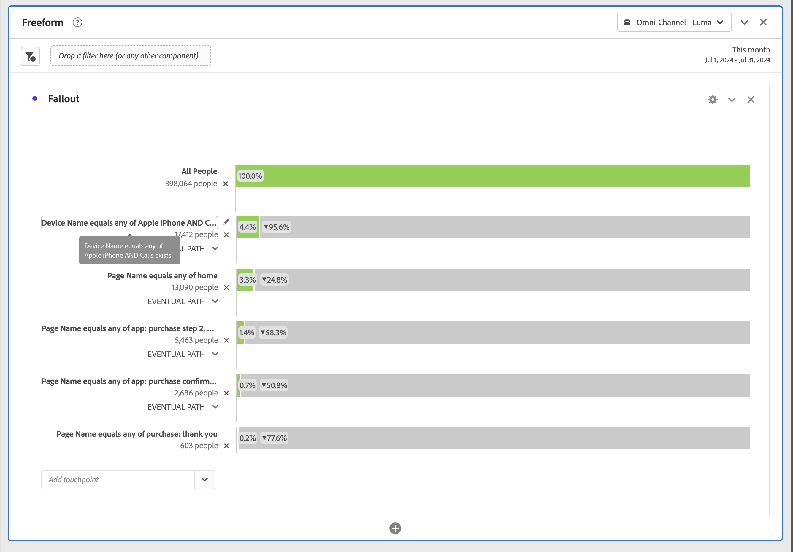

# Interdimensionaler Fallout

Mit Fallout in Analysis Workspace können Sie Dimensionen und Metriken als Touchpoints in Trichtern und Workflows kombinieren. Fallouts bieten Ihnen mehr Flexibilität bei der Definition der Benutzerschritte, die Sie untersuchen möchten.

Beispielsweise können Sie zusätzlich zu einer Seitendimension weitere Dimensionselemente (wie einen bestimmten Gerätenamen aus der Dimension Gerätename) zu einer Fallout-Visualisierung hinzufügen. Durch Kombinieren von Dimensionen können Sie visualisieren, wie Seiten und bestimmte Aktionen in den Pfaden der Kunden interagieren.

Der Fallout wird dynamisch aktualisiert und ermöglicht die Anzeige von Fallout über mehrere Dimensionen hinweg.

Sie können auch Metriken hinzufügen. Sie können beispielsweise die Metrik Aufruf hinzufügen, um nur Pfade für Benutzer anzuzeigen, für die Anrufe vorhanden sind und die sich an das Callcenter gewandt haben:

Sie können Dimensionen und Metriken kombinieren. Ziehen Sie eine andere Dimension oder Metrik auf eine vorhandene. Um beispielsweise die Auswirkungen auf Personen zu verstehen, die einen iPhone haben und das Callcenter kontaktiert haben.

