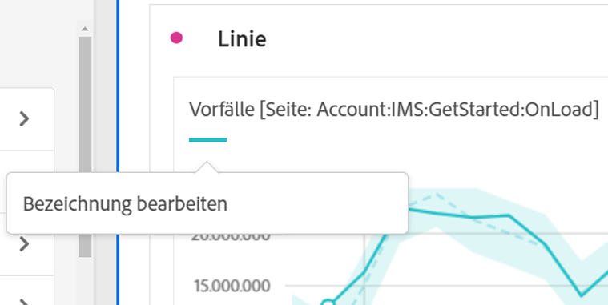

# Visualisierungsübersicht

Workspace bietet eine Reihe von Visualisierungen, um visuelle Darstellungen Ihrer Daten zu erstellen. Zum Beispiel Balkendiagramme, Ringdiagramme, Histogramme, Liniendiagramme, Karten, Streudiagramme und andere.

## Typen

Die folgenden Visualisierungstypen sind in Analysis Workspace verfügbar:

| Symbol | Name | Beschreibung |
| :---: | --- | ---| 
|  | [Bereich](/help/analysis-workspace/visualizations/area.md) | Eine Flächendiagramm-Visualisierung. Wie ein Liniendiagramm, aber mit einem farbigen Bereich unterhalb der Linie. Verwenden Sie ein Flächendiagramm, wenn Sie mehrere Metriken darstellen und den Bereich visualisieren möchten, der durch die Schnittmenge von zwei oder mehr Metriken gebildet wird. |
|  | [Balken](/help/analysis-workspace/visualizations/bar.md) | Eine Visualisierung „Balkendiagramm“ mit vertikalen Balken, die verschiedene Werte aus einer oder mehreren Metriken darstellen. |
|  | [Balken gestapelt](/help/analysis-workspace/visualizations/bar.md) | Eine Diagrammvisualisierung vom Typ „Balken gestapelt“ mit vertikalen Balken, die verschiedene Werte aus einer oder mehreren Metriken darstellen. |
| 
 | [Bullet](/help/analysis-workspace/visualizations/bullet-graph.md) | Eine Visualisierung „Bullet-Diagramm“, die zeigt, wie ein Wert, der Sie interessiert, im Vergleich zu anderen Leistungsbereichen (Zielen) liegt oder ausfällt. |
|  | [Kohortentabelle](/help/analysis-workspace/visualizations/cohort-table/cohort-analysis.md) | Eine Visualisierung „Kohorte“ ist eine Personengruppe mit gemeinsamen Merkmalen innerhalb eines vorgegebenen Zeitraums. Eine Kohortentabelle ist nützlich für die Analyse von Verweildauer, Abwanderung oder Latenz. |
|  | [Kombination](combo-charts.md) | Mit einem Kombinationsdiagramm können Sie schnell und einfach eine Visualisierung vom Typ „Vergleich“ erstellen, ohne zuerst eine Tabelle erstellen zu müssen. |
|  | [Ringdiagramm](/help/analysis-workspace/visualizations/donut.md) | Ähnlich einem Tortendiagramm zeigt eine Visualisierung „Ringdiagramm“ die Daten als Teile oder Filter eines Ganzen. |
|  | [Fallout](/help/analysis-workspace/visualizations/fallout/fallout-flow.md) | Eine Visualisierung „Fallout“ zeigt, wo Personen eine Site verlassen haben und wo sie eine vorab definierte Folge von Seiten passiert haben (d. h., wo sie verblieben sind). |
|  | [Fluss](/help/analysis-workspace/visualizations/c-flow/flow.md) | Eine Visualisierung vom Typ „Fluss“ zeigt genaue Kundenpfade durch Ihre Websites und Apps an. |
| 
 | [Freiformtabelle](/help/analysis-workspace/visualizations/freeform-table/freeform-table.md) | Eine Visualisierung „Freiformtabelle“ ist eine interaktive Visualisierung. Die Visualisierung „Freiformtabelle“ bildet die Grundlage für die Datenanalyse in Workspace. |
|  | [Histogramm](/help/analysis-workspace/visualizations/histogram.md) | Eine Visualisierung vom Typ „Histogramm“ fasst Personen, Besuche oder Ereignisse basierend auf einem Metrikvolumen in Buckets zusammen. |
|  | [Horizontalbalken](/help/analysis-workspace/visualizations/horizontal-bar.md) | Eine Visualisierung vom Typ „Horizontalbalken“ zeigt Horizontalbalken, die verschiedene Werte aus einer oder mehreren Metriken darstellen. |
|  | [Horizontalbalken gestapelt](/help/analysis-workspace/visualizations/horizontal-bar.md) | Eine Visualisierung vom Typ „Horizontalbalken gestapelt“ zeigt Horizontalbalken, die verschiedene Werte aus einer oder mehreren Metriken darstellen. |
|  | [Journey-Arbeitsfläche](/help/analysis-workspace/visualizations/journey-canvas/journey-canvas.md) | Eine Visualisierung vom Typ „Journey-Arbeitsfläche“ hilft Ihnen, die Journey zu analysieren und Erkenntnisse zu gewinnen, die Sie Ihren Benutzenden sowie Kundinnen und Kunden bereitstellen können. |
|  | [Zusammenfassung einer Schlüsselmetrik](/help/analysis-workspace/visualizations/key-metric.md) | Eine Visualisierung vom Typ „Zusammenfassung einer Schlüsselmetrik“ kombiniert die Linien-, Zusammenfassungsänderungs- und Zusammenfassungszahl-Visualisierungen. |
|  | [Linie](/help/analysis-workspace/visualizations/line.md) | Eine Visualisierung vom Typ „Linie“ stellt Metriken anhand einer Linie dar, die den Wertverlauf über einen bestimmten Zeitraum hinweg zeigt. Ein Liniendiagramm verwendet die Zeit entlang der X-Achse. |
|  | [Streuung](/help/analysis-workspace/visualizations/scatterplot.md) | Eine Visualisierung vom Typ „Streudiagramm“ zeigt die Beziehung zwischen Dimensionselementen und bis zu drei Metriken an. |
|  | [Abschnittskopfzeile](section-header.md) | Zum Identifizieren und Gliedern von Abschnitten in einem Panel. |
|  | [Zusammenfassungsänderung](/help/analysis-workspace/visualizations/summary-number-change.md) | Eine Visualisierung vom Typ „Zusammenfassungsänderung“ zeigt die Änderung zwischen den ausgewählten Zellen als eine große Zahl oder einen großen Prozentsatz an. |
| 
 | [Zusammenfassungszahl](/help/analysis-workspace/visualizations/summary-number-change.md) | Eine Visualisierung vom Typ „Zusammenfassungszahl“ zeigt die ausgewählte Zelle als eine große Zahl an. |
|  | [Text](/help/analysis-workspace/visualizations/text.md) | Eine Visualisierung vom Typ „Text“ ermöglicht es Ihnen, benutzerdefinierten Text zu Ihrem Arbeitsbereich hinzuzufügen. Hilfreich zum Hinzufügen zusätzlicher Kontexte zu Ihrer Analyse und zu Einblicken, zusätzlich zum Nutzen der Beschreibungen im Bedienfeld oder in Visualisierungen |
|  | [Treemap](/help/analysis-workspace/visualizations/treemap.md)
 | Eine Visualisierung „Baumkarte“ zeigt hierarchische (baumstrukturierte) Daten als Satz verschachtelter Rechtecke an. |
|  | [Venn](/help/analysis-workspace/visualizations/venn.md) | Eine Visualisierung vom Typ „Venn“ verwendet Kreise zur Darstellung der Metriküberschneidung von bis zu drei Filtern. |

<!-- Add beneath Horizontal bar in the table above: | [Journey canvas](/help/analysis-workspace/visualizations/journey-canvas/journey-canvas.md) | Similar to Fallout, Journey canvas shows where persons left (fell out) and continued through (fell through) a predefined sequence of pages. 
Unlike Fallout, Journey canvas supports not only linear journeys, but any number of entry points and paths. Furthermore, journeys can be created in Adobe Journey Optimizer and then analyzed in Journey canvas.
 | -->

## Hinzufügen von Visualisierungen zu einem Panel

1. Öffnen Sie das Workspace-Projekt, dem eine Visualisierung hinzugefügt werden soll.

1. Verwenden Sie eine der folgenden Methoden, um die Visualisierung hinzuzufügen:

   

   * Wählen Sie im linken Panel  **Visualisierungen** aus und ziehen Sie dann eine Visualisierung in das Panel, dem Sie die Visualisierung hinzufügen möchten.

   * Wählen Sie in dem, in dem die Visualisierung hinzugefügt werden soll,  und dann das Symbol für die Visualisierung aus, die Sie hinzufügen möchten. Bewegen Sie den Mauszeiger über das Symbol für jede Visualisierung, um den Namen anzuzeigen.

   * Fügen Sie ein [leeres Panel](/help/analysis-workspace/c-panels/blank-panel.md) hinzu und wählen Sie dann die Visualisierung aus, die hinzugefügt werden soll.

   * Wählen Sie im Kontextmenü einer vorhandenen Visualisierung in Ihrem Analysis Workspace-Projekt die Option **[!UICONTROL Visualisierung duplizieren]** oder **[!UICONTROL Visualisierung kopieren]** aus.

   * Verwenden Sie das Workspace-Menü **[!UICONTROL Einfügen]**, um eine Visualisierung einzufügen.

   * Wählen Sie im Kontextmenü in einer Freiformtabelle die Option **[!UICONTROL Visualisieren]** aus. Wählen Sie dann die Visualisierung aus dem Untermenü aus. Basierend auf der aktuellen Auswahl in der Tabelle bestimmt Workspace, welche Visualisierung angeboten werden soll, und interpretiert die Daten, um die angeforderte Visualisierung zu erstellen.

## Legende

Eine Visualisierungslegende hilft Ihnen, das Datum in einer Ausgangstabelle mit der dargestellten Serie in der Visualisierung zu verknüpfen. Die Legende ist interaktiv: Sie können ein Legendenelement auswählen, um eine Reihe in der Visualisierung ein- oder auszublenden. Dies ist hilfreich, wenn Sie die visualisierten Daten vereinfachen möchten.

Darüber hinaus können Sie Legendenbeschriftungen umbenennen, um Visualisierungen benutzerfreundlicher zu gestalten. Hinweis: Die Bearbeitung der Legenden ist für die folgenden Visualisierungen **nicht** möglich: Treemap, Aufzählung, Zusammenfassungsänderung oder -nummer, Text, Freiform, Histogramm, Kohorten- oder Flussvisualisierung.

So bearbeiten Sie eine Legendenbezeichnung:

1. klicken Sie mit der rechten Maustaste auf die Legendenbeschriftungen.
1. Klicken Sie auf **[!UICONTROL Bezeichnung bearbeiten]**.

   

1. Geben Sie den neuen Beschriftungstext ein.
1. Drücken Sie zum Speichern die **[!UICONTROL Eingabetaste]**.

## Einstellungen

Jede Visualisierung verfügt über eigene Einstellungen. Um auf Visualisierungseinstellungen zuzugreifen, wählen Sie  **[!UICONTROL Einstellungen]** im Header „Visualisierung“ aus, um ein Popup anzuzeigen.

Je nach Visualisierung können Sie Folgendes konfigurieren

* Details zur Datenquelle der Visualisierung über die Registerkarte [**[!UICONTROL Datenquelle]**](#data-source) und
* Einstellungen für die Visualisierung auf der Registerkarte [**[!UICONTROL Einstellungen]**](#settings-1).

### Datenquelle

Sie können steuern, welche Datenquelle und welche Elemente oder Positionen innerhalb dieser Datenquelle einer Visualisierung entsprechen. Weitere Informationen finden Sie unter [Verwalten von Datenquellen](t-sync-visualization.md).

### Einstellungen

Welche Visualisierungseinstellungen verfügbar sind, ist von der jeweiligen Visualisierung abhängig. In der folgenden Tabelle sind die am häufigsten verwendeten Einstellungen zusammengefasst. Einige Visualisierungen verfügen über bestimmte Einstellungen. Weitere Informationen finden Sie in der Dokumentation zu den einzelnen Visualisierungen.

| Option | Beschreibung |
| --- | --- |
| **[!UICONTROL Visualisierungstyp]** | Ändern Sie den Visualisierungstyp, der zum Visualisieren der Daten verwendet wird. |
| **[!UICONTROL Granularität]** | Ändern Sie die Zeitgranularität für Trend-Visualisierungen. Diese Änderung gilt auch für die Datenquellentabelle. |
| **[!UICONTROL Prozentsätze]** | Zeigen Sie Werte als Prozentzahlen an. |
| **[!UICONTROL 100 % gestapelt]** | Wandeln Sie das Diagramm in eine 100 % gestapelte Visualisierung um.  Gilt nur für eine gestapelte Visualisierung „Bereich“, „Balken“ und „Horizontalbalken“. |
| **[!UICONTROL Legende eingeblendet]** | Zeigen Sie den Legendentext an. |
| **[!UICONTROL Grenzwert für max. Anzahl von Elementen]** | Begrenzen Sie die Anzahl der Elemente, die in einer Visualisierung angezeigt werden. Wenn diese Option ausgewählt ist, definieren Sie die Anzahl der maximalen Elemente. |
| **[!UICONTROL Anmerkungen anzeigen]** | Zeigen Sie die Anmerkungen an, die für diese Visualisierung erstellt wurden. |
| **[!UICONTROL Titel ausblenden]** | Blenden Sie den Titel der Visualisierung aus. |
| **[!UICONTROL Y-Achse bei null verankern]** | Setzen Sie durch, dass der untere Teil der Y-Achse bei null liegt. Wenn alle im Diagramm dargestellten Werte deutlich größer als null sind, wird der untere Teil der Y-Achse standardmäßig zu nicht-null gemacht. Wenn Sie diese Option aktivieren, wird die Y-Achse auf null gesetzt (und das Diagramm wird neu gezeichnet). |
| **[!UICONTROL Zwei Achsen anzeigen]** | Zeigen Sie die linke und rechte Y-Achse für zwei verschiedene Metriken an. Diese Option gilt nur, wenn zwei Metriken vorliegen. Zwei Achsen sind hilfreich, wenn grafisch dargestellte Metriken unterschiedliche Größenordnungen aufweisen. |
| **[!UICONTROL X-Achse anzeigen]** | Zeigen Sie die X-Achse in der Visualisierung an. |
| **[!UICONTROL y-Achse anzeigen]** | Zeigen Sie die Y-Achse in der Visualisierung an. |
| **[!UICONTROL Balken auf Linien anzeigen]** | Zeigen Sie Balken in der Visualisierung „Linie“ in einer Visualisierung „Kombinationsdiagramm“ an. |
| **[!UICONTROL Normalisierung]** | Erzwingen Sie Metriken gleicher Proportion. Gleiche Proportionen sind hilfreich, wenn grafisch dargestellte Metriken unterschiedliche Größenordnungen aufweisen. |
| **[!UICONTROL Anomalien zeigen]** | Verbessern Sie Liniendiagramme und Freiformtabellen durch Anzeige der Anomalieerkennung. Die Anomalieerkennung in Linienvisualisierungen umfasst einen erwarteten Wert (gestrichelte Linie) und einen erwarteten Bereich (schattiertes Band). |
| **[!UICONTROL Prognose anzeigen]** | Verbessern Sie Liniendiagramme und Freiformtabellen durch Anzeige von Prognosewerten. |
| **[!UICONTROL Min. zeigen]** | Zeigen Sie den Minimalwert in der Visualisierung an. |
| **[!UICONTROL Max. zeigen]** | Zeigen Sie den Maximalwert in der Visualisierung an. |
| **[!UICONTROL Trend-Linie anzeigen]** | Zeigen Sie eine Trend-Linie in der Visualisierung. Wenn diese Option ausgewählt ist, können Sie den Typ der Trend-Linie aus dem Dropdown-Menü auswählen. |

Sie können die Einstellungen für alle von Ihnen erstellten Visualisierungen anpassen. Weitere Informationen finden Sie unter [Benutzervoreinstellungen](/help/analysis-workspace/user-preferences.md).

## Kontextmenü {#right-click}

Verwenden Sie das Kontextmenü (verfügbar über eine alternative Auswahl, z. B. Rechtsklick mit der Maus) für einen Header „Visualisierung“, um auf zusätzliche Funktionen für eine Visualisierung zuzugreifen. Nicht alle Optionen stehen für alle Visualisierungen zur Verfügung.

| Option | Beschreibung |
| --- | --- |
| **[!UICONTROL Kopierte Visualisierung einfügen]** | Fügen Sie eine kopierte Visualisierung an einer anderen Stelle innerhalb des Projekts oder in ein ganz anderes Projekt ein. |
| **[!UICONTROL Daten in die Zwischenablage kopieren]** | Kopieren Sie Daten aus der Visualisierung in die Zwischenablage. |
| **[!UICONTROL Auswahl in die Zwischenablage kopieren]** | Zum Kopieren der Auswahl aus der Visualisierung in die Zwischenablage. |
| **[!UICONTROL Objekte als CSV herunterladen (*Dimensionsname*)]** | Laden Sie die Dimensionselemente (bis maximal 50.000) der Visualisierung auf Ihr lokales Gerät herunter. Maximal 50.000 Dimensionselemente für die ausgewählte Dimension. |
| **[!UICONTROL Visualisierung kopieren]** | Kopieren Sie die Visualisierung, sodass Sie sie an einer anderen Stelle innerhalb des Projekts oder in ein ganz anderes Projekt einfügen können. |
| **[!UICONTROL Daten als CSV herunterladen]** | Laden Sie die angezeigten Daten der Visualisierung auf Ihr lokales Gerät herunter. |
| **[!UICONTROL Vollständige Tabelle exportieren]** | Exportieren Sie die vollständige Tabelle an bestimmte Cloud-Speicherorte. Weitere Informationen finden Sie unter [Exportieren von Customer Journey Analytics-Berichten in die Cloud](../export/export-cloud.md) |
| **[!UICONTROL Visualisierung duplizieren]** | Erstellen Sie ein exaktes Duplikat der Visualisierung. |
| **[!UICONTROL Beschreibung bearbeiten]** | Fügen Sie Text zur Beschreibung der Visualisierung hinzu (oder bearbeiten Sie ihn). Siehe [Text](text.md). |
| **[!UICONTROL Visualisierungs-Link abrufen]** | Kopieren Sie einen Link und teilen Sie ihn direkt in der Visualisierung. Der Link wird im Dialogfeld „Link freigeben“ angezeigt. Wählen Sie „Kopieren“ aus, um den Link in die Zwischenablage zu kopieren. |
| **[!UICONTROL Neu starten]** | Löschen Sie die Konfiguration für die aktuelle Visualisierung, damit Sie sie von Grund auf neu konfigurieren können. |

## Konfiguration

Einige Visualisierungen (z. B. „Kohortentabelle“, „Fallout“, „Fluss“ usw.) verfügen über ein Konfigurationsdialogfeld, das Sie beim Erstellen der Visualisierung unterstützt. Verwenden Sie  oben in der Visualisierung, um auf die Konfiguration zuzugreifen und diese zu ändern.

## Visualisieren

Wenn Sie sich nicht sicher sind, welche Visualisierung Sie auswählen sollen, bewegen Sie den Mauszeiger über eine beliebige Freiformtabellenzeile und klicken Sie auf das dann erscheinende Symbol  **[!UICONTROL Visualisieren]**. Dies ist die schnellste Möglichkeit, eine Visualisierung hinzuzufügen. Analysis Workspace sucht nach der Visualisierung, die aufgrund der vorhandenen Fakten am besten zu Ihren Daten passt. Wenn Sie beispielsweise eine einzelne Zeile ausgewählt haben, wird ein Trend-[Liniendiagramm](line.md) erstellt. Wenn Sie drei Filterzeilen ausgewählt haben, wird ein [Venn](venn.md)-Diagramm erstellt.

