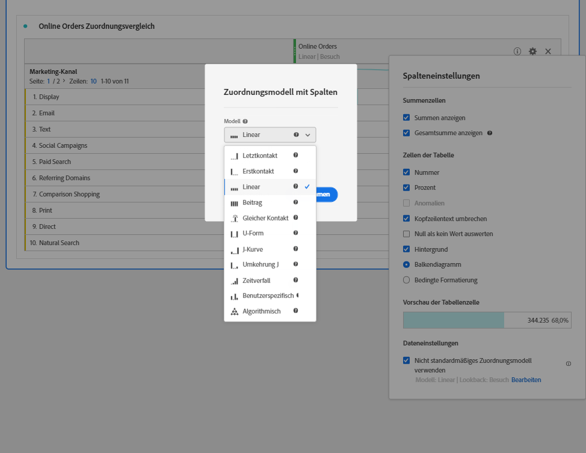

# [!UICONTROL Spalteneinstellungen]

Mit den [!UICONTROL Spalteneinstellungen] können Sie die Spaltenformatierung konfigurieren. Einige davon sind bedingt.

+++ Sehen Sie sich ein Video an, um diese Funktion zu demonstrieren.

>[!VIDEO](https://video.tv.adobe.com/v/40382/?quality=12)

{{videoaa}}

+++

Um auf die [!UICONTROL Spalteneinstellungen] zuzugreifen, wählen Sie  in der Spaltenüberschrift aus.

Sie können Einstellungen für mehrere Spalten gleichzeitig bearbeiten. Wählen Sie mehrere Spalten aus und wählen Sie in einer der ausgewählten Spalten die Option  aus. Jede Änderung, die Sie vornehmen, gilt für alle Spalten mit ausgewählten Zellen.

| Option | Beschreibung |
| --- | --- |
| **[!UICONTROL Gesamtsumme anzeigen]** | Zeigt eine clientseitige Summe der Spalte an. Diese Gesamtsumme dedupliziert Metriken wie Sitzungen oder Personen **nicht**. |
| **[!UICONTROL Gesamtsumme anzeigen]** | Zeigt eine Server-seitige Summe der Spalte an. Die Gesamtsumme dedupliziert Metriken wie Sitzungen oder Personen. |
| **[!UICONTROL Sparkline anzeigen]** | Zeigen Sie ein Liniendiagramm an der Spaltenüberschrift. |
| **[!UICONTROL Nummer]** | Bestimmen Sie, ob in einer Zelle der numerische Wert für die Metrik angezeigt/ausgeblendet wird. Ist die Metrik beispielsweise „Seitenansichten“, ist der numerische Wert die Anzahl an Seitenansichten für dieses Zeilenelement. |
| **[!UICONTROL Prozent]** | Bestimmen Sie, ob in einer Zelle der Prozentwert für die Metrik angezeigt/ausgeblendet wird. Wenn die Metrik beispielsweise &quot;Seitenansichten&quot;ist, ist der Prozentwert die Anzahl der Seitenansichten für das Zeilenelement dividiert durch die Gesamtanzahl der Seitenansichten für die Spalte.  Hinweis: Prozentsätze über 100 % sind möglich, um Genauigkeit zu gewährleisten. Die obere Grenze kann auf 1.000 % verschoben werden, um zu verhindern, dass die Spaltenbreite zu groß wird. |
| **[!UICONTROL Anomalien anzeigen]** | Bestimmen Sie, ob die Anomalieerkennung für die Werte in dieser Spalte ausgeführt wird. |
| **[!UICONTROL Vorschau anzeigen]** | Bestimmen Sie, ob die Prognosewerte in dieser Spalte angezeigt werden. |
| **[!UICONTROL Umbruch Kopfzeilentext]** | Schließen Sie den Kopfzeilentext in Freiformtabellen ein, damit Kopfzeilen besser lesbar und Tabellen einfacher freizugeben sind. Wrapping ist für das PDF-Rendering und für Metriken mit langen Namen nützlich. Standardmäßig aktiviert. |
| **[!UICONTROL Null nicht als Wert interpretieren]** | Stellen Sie bei Zellen mit einem 0-Wert fest, ob eine 0 oder eine leere Zelle angezeigt werden soll. Diese Interpretation ist nützlich, wenn Sie Daten für jeden Tag eines Monats betrachten und einige Tage in der Zukunft liegen.  Statt für zukünftige Daten 0 anzuzeigen, werden stattdessen leere Zellen angezeigt. Diagramme berücksichtigen diese Einstellung ebenfalls (d. h. die Diagramme zeigen keine Linie oder Balken mit 0 Werten an). |
| **[!UICONTROL Hintergrund]** | Bestimmen Sie, ob in einer Zelle die gesamte Zellformatierung, einschließlich Balkendiagramm und bedingter Formatierung, ein-/ausgeblendet wird. |
| **[!UICONTROL Balkendiagramm]** | Zeigt ein horizontales Balkendiagramm an, das den Zellenwert im Verhältnis zum Gesamtwert der Spalte darstellt. |
| **[!UICONTROL Bedingte Formatierung]** | Bedingte Formatierung verwenden. Siehe den Abschnitt [Abschnitt](#conditional-formatting) unten. |
| **[!UICONTROL Vorschau der Tabellenzelle]** | Eine Vorschau der Darstellung jeder Zelle mit den aktuell ausgewählten Formatierungsoptionen. |
| **[!UICONTROL Nicht standardmäßiges Attributionsmodell verwenden]** | Verwenden Sie ein nicht standardmäßiges Attributionsmodell. Siehe den Abschnitt [Abschnitt](#use-non-default-attribution-model) unten. |

## Bedingte Formatierung {#conditional-formatting}

Die bedingte Formatierung gilt für Obergrenzen, Mittelwerte und Untergrenzen, die Sie definieren können. Das Anwenden bedingter Formatierung in Freiformtabellen ist auch bei Aufschlüsselungen automatisch aktiviert, es sei denn, die Beschränkungen für [!UICONTROL Benutzerdefiniert] sind aktiviert.

| Optionen für die bedingte Formatierung | Beschreibung |
| --- | --- |
| **[!UICONTROL Prozentbeschränkungen verwenden]** | Ändern Sie das Limit, das auf Prozentsätzen basieren soll anstatt auf absoluten Werten. Der Prozentbegrenzungsbereich funktioniert für Metriken, die ausschließlich prozentbasiert sind (wie Absprungrate), sowie für Metriken mit einer Anzahl und einem Prozentsatz (wie Seitenansichten). |
| **[!UICONTROL Automatisch generiert]** | Obere/mittlere/untere Limits automatisch auf Basis der Daten berechnen. Die Obergrenze entspricht dem höchsten Wert in dieser Spalte. Die Untergrenze entspricht dem niedrigsten Wert und der Mittelpunkt ist der Durchschnittswert der Ober- und der Untergrenze. |
| **[!UICONTROL Benutzerspezifisch]** | Weisen Sie **[!UICONTROL Obergrenze]**, **[!UICONTROL Mittelpunkt]** und **[!UICONTROL Untergrenze]** manuell zu. Durch Einschränkungen kann flexibel bestimmt werden, wann ein Spaltenwert gut, durchschnittlich oder schlecht wird. |
| **[!UICONTROL Palette &quot;Bedingte Formatierung&quot;]** | Wenden Sie einen vorkonfigurierten Farbsatz auf Zellen an. Je nachdem, welches der vier ausgewählten Farbschemas verwendet wird, werden den hohen Werten, Mittelwerten und niedrigen Werten unterschiedliche Farben zugewiesen.   Wenn Sie eine Dimension in der Tabelle ersetzen, werden die Grenzwerte für die bedingte Formatierung zurückgesetzt. Wenn Sie eine Metrik ersetzen, werden die Grenzwerte für diese Spalte zurückgesetzt (dabei wird eine Metrik auf der X-Achse und eine Dimension auf der Y-Achse dargestellt). |

## Nicht standardmäßiges Attributionsmodell verwenden {#use-non-default-attribution-model}

<!-- markdownlint-disable MD034 -->

>[!CONTEXTUALHELP]
>id="cja_workspace_freeformtable_column_usenondefaultattributionmodel"
>title="Nicht standardmäßiges Attributionsmodell verwenden"
>abstract="Nicht standardmäßiges Attributionsmodell für die ausgewählten Spalten aktivieren"

<!-- markdownlint-enable MD034 -->

Sie können das standardmäßige Attributionsmodell überschreiben, das in [Datenansichten](/help/data-views/component-settings/attribution.md) konfiguriert ist.

>[!NOTE]
>
>Beachten Sie beim Aktualisieren der Attribution einer Komponente auf ein nicht standardmäßiges Attributionsmodell Folgendes:
>
>* **Bei Verwendung der Komponente in einem Bericht mit *einer einzelnen Dimension*:** Die Attribution der Komponente ignoriert das Zuordnungsmodell, wenn ein nicht standardmäßiges Attributionsmodell verwendet wird.
>
>* **Bei Verwendung der Komponente in einem Bericht mit *mehreren Dimensionen*:** Die Attribution der Komponente behält das Zuordnungsmodell bei, wenn ein nicht standardmäßiges Attributionsmodell verwendet wird.
>
>   Mehrere Dimensionen sind nur verfügbar, wenn [Daten in die Cloud exportieren](/help/analysis-workspace/export/export-cloud.md).
>
> Weitere Informationen zur Zuordnung finden Sie unter [Einstellungen der Persistenz-Komponente](/help/data-views/component-settings/persistence.md).

So verwenden Sie ein nicht standardmäßiges Attributionsmodell für eine Metrik in einer Analysis Workspace:

1. Wählen Sie **[!UICONTROL Nicht standardmäßiges Attributionsmodell verwenden]** aus. Wenn Sie das Attributionsmodell bereits ausgewählt haben, verwenden Sie **[!UICONTROL Bearbeiten]** , um es zu bearbeiten. Oder heben Sie die Auswahl auf, um zum standardmäßigen Attributionsmodell zurückzukehren.

   

2. Wählen Sie im Spaltenattributionsmodell ]**ein**[!UICONTROL  Modell ]**und ein**[!UICONTROL  Lookback-Fenster ]**aus.**[!UICONTROL  Das Lookback-Fenster bestimmt das Fenster der Datenzuordnung, das für jede Konversion angewendet wird.

   

### Attributionsmodelle

{{attribution-models-details}}

### Lookback-Fenster

{{attribution-lookback-window}}

>[!MORELIKETHIS]
>
>* [Datenquellen verwalten](/help/analysis-workspace/visualizations/t-sync-visualization.md)
