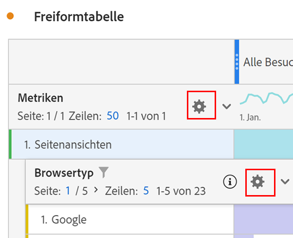

# Zeileneinstellungen

+++ Sehen Sie sich ein Video an, um diese Funktion zu demonstrieren.

>[!VIDEO](https://video.tv.adobe.com/v/40382/?quality=12)

{{videoaa}}

+++

Die Zeileneinstellungen variieren je nachdem, welche Komponente Sie in die Tabelle gezogen haben. Um auf die Tabellenzeileneinstellungen zuzugreifen, wählen Sie &quot; **[!UICONTROL Einstellungen]**&quot;neben einer Dimension, einem Filter, einer Metrik, einem Zeitraum oder einer Aufschlüsselung innerhalb jedes dieser Objekte aus.

| Einstellung | Beschreibung |
| --- | --- |
| **[!UICONTROL Aufschlüsselung nach Position]** | Standardmäßig ist diese Einstellung deaktiviert und die Aufschlüsselungen sind auf statische Zeilenelemente festgelegt. Angenommen, Sie unterteilen die drei wichtigsten Dimensionselemente der Seite (Startseite, Suchergebnisse, Checkout) nach Marketing-Kanal. Dann verlassen Sie das Projekt und kehren zwei Wochen später zurück. Beim erneuten Öffnen des Projekts haben sich die drei oberen Seiten geändert, und jetzt sind Startseite, Suchergebnisse und Checkout stattdessen die oberen Seiten vier bis sechs. Standardmäßig werden Ihre Marketing-Kanal-Aufschlüsselungen weiterhin unter Startseite, Suchergebnisse und Checkout angezeigt, auch wenn sie sich jetzt in den Zeilen 4 bis 6 befinden.   Im Gegensatz dazu werden bei einer **Aufschlüsselung nach Position** immer die drei obersten Elemente aufgeschlüsselt, unabhängig davon, worum es sich bei ihnen handelt. Wenn Sie zum Beispiel zurückkehren und Ihr Projekt erneut öffnen, sind die Aufschlüsselungen des Marketing-Kanals an die drei oberen Seiten in der Tabelle gebunden. Und nicht zu Homepage, Suchergebnissen und Checkout, die jetzt in den Zeilen 4-6 sind. |
| **[!UICONTROL Prozentsätze]** | **Prozentsätze nach Spalte berechnen** (Standard): Die in Zellen sichtbaren Prozentsätze werden auf der Grundlage der Spaltensumme berechnet.  **Prozentsätze pro Zeile berechnen**: Die Prozentsätze in Zellen werden über die Zeile anstatt in der Spalte berechnet, wobei Gesamtsumme der Nenner ist. Diese Berechnung ist für die Trenddarstellung von Prozentsätzen nützlich. |
| **[!UICONTROL Spaltensummen]** | Diese Einstellungen sind nur für [statische Zeilen](/help/analysis-workspace/visualizations/freeform-table/column-row-settings/manual-vs-dynamic-rows.md) verfügbar.   **Als Summe der aktuellen Zeilen anzeigen** zeigt eine clientseitige Summe der Zeilen in der Tabelle, was bedeutet, dass die Gesamtsumme die Duplizierung von Metriken wie Besuche oder Personen *nicht* dedupliziert.   **Gesamtsumme anzeigen** zeigt eine Server-seitige Summe an, d. h. die Summe der deduplizierten Metriken. |

## Ändern der Zeilenanzahl

So ändern Sie die Anzahl der angezeigten Zeilen:

1. Klicken Sie oben in der ersten Spalte der Tabelle auf die Zahl neben **[!UICONTROL Zeilen]**.

   

1. Wählen Sie aus der Dropdown-Liste die Anzahl der Zeilen aus, die die Tabelle anzeigen soll.

## Kontextmenü

Die folgenden Kontextmenüoptionen sind verfügbar, wenn Sie die Dimensionskopfzeile auswählen.

| Option | Beschreibung |
| --- | --- |
| **[!UICONTROL Auswahl in Zwischenablage kopieren]** | Kopieren Sie die Auswahl aus der Visualisierung in die Zwischenablage. |
| **[!UICONTROL Elemente als CSV-Datei herunterladen (*Dimensionsname*)]** | Laden Sie die Dimensionselemente (bis zu maximal 50.000) der Visualisierung sofort auf Ihr lokales Gerät herunter. Maximal 50.000 Dimensionselemente für die ausgewählte Dimension. |
| **[!UICONTROL Auswahl als CSV herunterladen]** | Laden Sie die Dimensionselemente der Visualisierung sofort auf Ihr lokales Gerät herunter. |
| **[!UICONTROL Erstellen Sie einen Hyperlink für alle Dimensionselemente]** | Erstellen Sie Hyperlinks für alle Dimensionselemente. Siehe [Hyperlinks für Dimensionen in einer Freiformtabelle](../freeform-table-hyperlinks.md) |
| **[!UICONTROL Hyperlink für alle Dimensionselemente bearbeiten]** | Bearbeiten Sie Hyperlinks für alle Dimensionselemente. Siehe [Hyperlinks für Dimensionen in einer Freiformtabelle](../freeform-table-hyperlinks.md) |
| **[!UICONTROL Hyperlink für alle Dimensionselemente entfernen]** | Entfernen Sie Hyperlinks für alle Dimensionselemente. Siehe [Hyperlinks für Dimensionen in einer Freiformtabelle](../freeform-table-hyperlinks.md) |
| **[!UICONTROL Löschen]** | Löscht die Dimension aus der Tabelle. |
| **[!UICONTROL Visualisieren]** | Visualisieren Sie die Dimension mit einer der verfügbaren Visualisierungen. |
| **[!UICONTROL Nur ausgewählte Zeilen anzeigen]** | Zeigt nur die ausgewählten Elemente in der Visualisierung an. |
| **[!UICONTROL Anmerkung aus Auswahl erstellen]** | Öffnen Sie die **[!UICONTROL Anmerkungsdetails]** , um eine Anmerkung hinzuzufügen. |

Die folgenden zusätzlichen Kontextmenüoptionen sind verfügbar, wenn Sie ein oder mehrere Dimensionselemente (erste Spalte) oder eine oder mehrere einzelne Zellen in der Freiformtabelle auswählen.

| Option | Beschreibung |
| --- | --- |
| **[!UICONTROL Hyperlink erstellen]** | Erstellen Sie einen Hyperlink für das Element. Siehe [Hyperlinks für Dimensionen in einer Freiformtabelle](../freeform-table-hyperlinks.md) |
| **[!UICONTROL Hyperlink bearbeiten]** | Bearbeiten Sie einen Hyperlink für das Element. Siehe [Hyperlinks für Dimensionen in einer Freiformtabelle](../freeform-table-hyperlinks.md) |
| **[!UICONTROL Hyperlink entfernen]** | Entfernen Sie einen Hyperlink für das Element. Siehe [Hyperlinks für Dimensionen in einer Freiformtabelle](../freeform-table-hyperlinks.md) |
| **[!UICONTROL Aufschlüsselung]** | Schlüsseln Sie das Dimensionselement auf. Wählen Sie aus der Liste der **[!UICONTROL Dimensionen]**, **[!UICONTROL Metriken]**, **[!UICONTROL Filter]** oder **[!UICONTROL Datumsbereiche]** aus. Alternative Suche nach einer Komponente mit *Suche*. |
| **[!UICONTROL Ausgewählte löschen]** | Löschen Sie die ausgewählten Zeilen (Elemente). |
| **[!UICONTROL Trendauswahl]** | Erstellen Sie eine Trend-Liniendiagrammvisualisierung für die Auswahl. |
| **[!UICONTROL Nur ausgewählte Zeilen anzeigen]** | Zeigt nur die ausgewählten Zeilen in der Visualisierung an. |
| **[!UICONTROL Alle Zeilen anzeigen]** | Zeigen Sie alle Zeilen in der Visualisierung an. |
| **[!UICONTROL Filter aus Auswahl erstellen]** | Öffnen Sie den **[!UICONTROL Filter-Builder]** , um einen Filter aus der Auswahl zu erstellen. |
| **[!UICONTROL Erstellen einer Zielgruppe aus Auswahl]** | Öffnen Sie das Dialogfeld **[!UICONTROL Audience erstellen]** , um eine Audience aus der Auswahl zu erstellen. |

Die folgenden zusätzlichen Kontextmenüoptionen sind verfügbar, wenn Sie eine Metrik-Spaltenüberschrift auswählen.

| Option | Beschreibung |
|---|---|
| **[!UICONTROL Metrik aus Auswahl erstellen]** | Erstellen Sie eine neue Metrik aus der ausgewählten Metrik. Die Metrik kann &quot;Mittel&quot;, &quot;Medien&quot;, &quot;Spaltenmax&quot;, &quot;Spaltenmin&quot;, &quot;Spaltensumme&quot;sein. Sie können auch im Generator für berechnete Metriken die Option Öffnen auswählen, um eine berechnete Metrik zu erstellen. |
| **[!UICONTROL Spalte mit Zeitraum hinzufügen]** | Fügen Sie eine Zeitraumspalte hinzu. Ihnen stehen verschiedene Optionen zur Verfügung, bei denen der Kalenderbereich des Bedienfelds den *Datumsbereich* bestimmt: <li>**[!UICONTROL Vorheriger *Datumsbereich* für diesen Datenbereich]**</li><li>**[!UICONTROL Diese *Datumsbereiche* bis zu diesem Datumsbereich]**.</li><li>**[!UICONTROL Benutzerdefinierter Datenbereich bis zu diesem Datumsbereich]**. Öffnet den **[!UICONTROL Generator für Datumsbereiche]** , um den Datumsbereich anzugeben.</li>Weitere Informationen finden Sie unter [Datumsvergleich](/help/components/date-ranges/time-comparison.md) . |
| **[!UICONTROL Zeiträume vergleichen]** | Fügt die Spalten für den Zeitraum vergleichen hinzu. Nur verfügbar, wenn die Dimension nicht zeitbasiert ist. Ihnen stehen mehrere Optionen zur Verfügung, die den *Datumsbereich* bestimmen: <li>**[!UICONTROL Vorheriger *Datumsbereich* für diesen Datenbereich]**</li><li>**[!UICONTROL Benutzerdefinierter Datenbereich bis zu diesem Datumsbereich]**. Öffnet den **[!UICONTROL Generator für Datumsbereiche]** , um den Datumsbereich anzugeben.</li>Weitere Informationen finden Sie unter [Datumsvergleich](/help/components/date-ranges/time-comparison.md) . |
| **[!UICONTROL Ändern von Attributionsmodellen]** | Ändern Sie das Attributionsmodell für die Spalte. |
| **[!UICONTROL Attributionsmodell vergleichen]** | Geben Sie ein neues Attributionsmodell an und vergleichen Sie es mit dem Attributionsmodell für die ausgewählte Spalte. Eine neue Spalte mit den neuen Attributionsmodellmetriken wird hinzugefügt. Außerdem wird eine Spalte zur prozentualen Änderung zum Vergleich hinzugefügt. |
| **[!UICONTROL Spaltenbreiten zurücksetzen]** | Setzen Sie die Spaltenbreiten auf die Standardbreite zurück. |
| **[!UICONTROL Anmerkung aus Auswahl erstellen]** | Öffnen Sie die **[!UICONTROL Anmerkungsdetails]** , um eine Anmerkung hinzuzufügen. |
| **[!UICONTROL Filter aus Auswahl erstellen]** | Öffnen Sie den **[!UICONTROL Filter-Builder]** , um einen Filter aus der Auswahl zu erstellen. |
| **[!UICONTROL Erstellen einer Zielgruppe aus Auswahl]** | Öffnen Sie das Dialogfeld **[!UICONTROL Audience erstellen]** , um eine Audience aus der Auswahl zu erstellen. |
