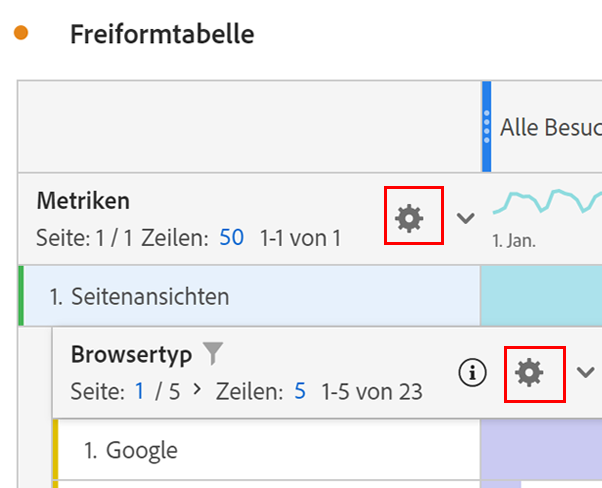

# Zeileneinstellungen

Die Zeileneinstellungen variieren je nachdem, welche Komponente Sie in die Tabelle gezogen haben. Um auf die Einstellungen der Tabellenzeilen zuzugreifenEinstellung **[!UICONTROL Einstellungen]** neben einer Dimension, einem Segment, einer Metrik, einem Zeitraum oder einer Aufschlüsselung in jedem dieser Objekte aus.

| Einstellung | Beschreibung |
| --- | --- |
| **[!UICONTROL Aufschlüsselung nach Position:]** | Standardmäßig ist diese Einstellung deaktiviert und die Aufschlüsselungen sind auf statische Zeilenelemente festgelegt. Angenommen, Sie schlüsseln die drei oberen Elemente der Dimension „Seite“ (Startseite, Suchergebnisse, Checkout) nach Marketing-Kanälen auf. Dann verlassen Sie das Projekt und kehren zwei Wochen später zurück. Beim erneuten Öffnen des Projekts haben sich die drei oberen Seiten geändert, und jetzt sind Startseite, Suchergebnisse und Checkout stattdessen die oberen Seiten vier bis sechs. Standardmäßig werden Ihre Aufschlüsselungen des Marketing-Kanals weiterhin unter Startseite, Suchergebnisse und Checkout angezeigt, obwohl sie sich jetzt in den Zeilen 4 bis 6 befinden.   Im Gegensatz dazu werden **Aufschlüsselung nach Position** immer die drei obersten Elemente aufgeschlüsselt, unabhängig davon, was sie sind. Wenn Sie auf das Beispiel zurückgreifen, werden die Aufschlüsselungen des Marketing-Kanals beim erneuten Öffnen des Projekts an die drei obersten Seiten der Tabelle gebunden. Und nicht an „Startseite“, „Suchergebnisse“ und „Checkout“, die sich jetzt in den Zeilen 4–6 befinden. |
| **[!UICONTROL Prozentsätze]** | **Prozentsätze nach Spalte berechnen** (Standard): Die in einer Spalte sichtbaren Prozentsätze werden auf der Grundlage der Spaltensumme berechnet.  **Prozentsätze nach Zeile berechnen**: Die Prozentsätze in Zellen werden über die Zeile anstatt für die Spalte berechnet. Dabei ist die Gesamtsumme der Nenner. Diese Berechnung ist nützlich für die Trend-Darstellung von Prozentsätzen. |
| **[!UICONTROL Spaltensummen]** | Diese Einstellungen sind nur für [statische Zeilen](/help/analysis-workspace/visualizations/freeform-table/column-row-settings/manual-vs-dynamic-rows.md) verfügbar.   **Als Summe der aktuellen Zeilen anzeigen**: Zeigt eine Client-seitige Summe der Zeilen in der Tabelle, was bedeutet, dass bei der Gesamtsumme die Metriken wie „Besuche“ oder „Personen“ *nicht* dedupliziert werden.   **Gesamtsumme anzeigen**: Zeigt eine Server-seitige Summe an, d. h. die Gesamtsumme der deduplizierten Metriken. |

>[!BEGINSHADEBOX]

Unter  [Zeilen- und Spalteneinstellungen in einer Freiformtabelle](https://experienceleague.adobe.com/en/docs/analytics-learn/tutorials/analysis-workspace/building-freeform-tables/row-and-column-settings-in-freeform-tables){target="_blank"} finden Sie ein Demovideo.

{{videoaa}}

>[!ENDSHADEBOX]

## Ändern der Zeilenanzahl

So ändern Sie die Anzahl der angezeigten Zeilen:

1. Klicken Sie auf die Zahl neben **[!UICONTROL Zeilen]** oberhalb der ersten Spalte der Tabelle.

   

1. Wählen Sie aus dem Dropdown-Menü die Anzahl der Zeilen aus, die die Tabelle anzeigen soll.

## Kontextmenü

Die folgenden Kontextmenüoptionen sind bei der Auswahl der Dimensionskopfzeile verfügbar.

| Option | Beschreibung |
| --- | --- |
| **[!UICONTROL Auswahl in Zwischenablage kopieren]** | Zum Kopieren der Auswahl aus der Visualisierung in die Zwischenablage. |
| **[!UICONTROL Objekte als CSV herunterladen (*Dimensionsname*)]** | Zum sofortigen Herunterladen der Dimensionselemente (bis zu maximal 50.000) der Visualisierung auf Ihr lokales Gerät. Maximal 50.000 Dimensionselemente für die ausgewählte Dimension. |
| **[!UICONTROL Auswahl als CSV herunterladen]** | Zum sofortigen Herunterladen der Dimensionselemente der Visualisierung auf Ihr lokales Gerät. |
| **[!UICONTROL Hyperlink für alle Dimensionselemente erstellen]** | Zum Erstellen von Hyperlinks für alle Dimensionselemente. Siehe [Hyperlinks für Dimensionen in einer Freiformtabelle](../freeform-table-hyperlinks.md) |
| **[!UICONTROL Hyperlink für alle Dimensionselemente bearbeiten]** | Zum Bearbeiten von Hyperlinks für alle Dimensionselemente. Siehe [Hyperlinks für Dimensionen in einer Freiformtabelle](../freeform-table-hyperlinks.md) |
| **[!UICONTROL Hyperlink für alle Dimensionselemente entfernen]** | Zum Entfernen von Hyperlinks für alle Dimensionselemente. Siehe [Hyperlinks für Dimensionen in einer Freiformtabelle](../freeform-table-hyperlinks.md) |
| **[!UICONTROL Löschen]** | Löscht die Dimension aus der Tabelle. |
| **[!UICONTROL Visualisieren]** | Zum Visualisieren der Dimension mithilfe einer der verfügbaren Visualisierungen. |
| **[!UICONTROL Nur ausgewählte Zeilen anzeigen]** | Zum Anzeigen von nur den ausgewählten Elementen in der Visualisierung. |
| **[!UICONTROL Anmerkung aus Auswahl erstellen]** | Zum Öffnen der **[!UICONTROL Anmerkungsdetails]**, um eine Anmerkung hinzuzufügen. |

Die folgenden zusätzlichen Optionen im Kontextmenü sind verfügbar, wenn ein oder mehrere Dimensionselemente (erste Spalte) oder eine oder mehrere einzelne Zellen in der Freiformtabelle ausgewählt werden.

| Option | Beschreibung |
| --- | --- |
| **[!UICONTROL Hyperlink erstellen]** | Zum Erstellen eines Hyperlinks für das Element. Siehe [Hyperlinks für Dimensionen in einer Freiformtabelle](../freeform-table-hyperlinks.md) |
| **[!UICONTROL Hyperlink bearbeiten]** | Zum Bearbeiten eines Hyperlinks für das Element. Siehe [Hyperlinks für Dimensionen in einer Freiformtabelle](../freeform-table-hyperlinks.md) |
| **[!UICONTROL Hyperlink entfernen]** | Zum Entfernen eines Hyperlinks für das Element. Siehe [Hyperlinks für Dimensionen in einer Freiformtabelle](../freeform-table-hyperlinks.md) |
| **[!UICONTROL Aufschlüsselung]** | Zum Aufschlüsseln des Dimensionselements. Wählen Sie aus der Liste **[!UICONTROL Dimensionen]**, **[!UICONTROL Metriken]**, **[!UICONTROL Segmente]** oder **[!UICONTROL Datumsbereiche]**. Suchen Sie alternativ mit *Suchen* nach einer Komponente. |
| **[!UICONTROL Auswahl löschen]** | Zum Löschen der ausgewählten Zeilen (Elemente). |
| **[!UICONTROL Trend-Auswahl]** | Zum Erstellen einer Trend-Liniendiagramm-Visualisierung für die Auswahl. |
| **[!UICONTROL Nur ausgewählte Zeilen anzeigen]** | Zum Anzeigen von nur den ausgewählten Zeilen in der Visualisierung. |
| **[!UICONTROL Alle Zeilen anzeigen]** | Zum Anzeigen aller Zeilen in der Visualisierung. |
| **[!UICONTROL Segment aus Auswahl erstellen]** | Öffnen Sie den **[!UICONTROL Segment Builder]**, um ein Segment aus der Auswahl zu erstellen. |
| **[!UICONTROL Zielgruppe aus Auswahl erstellen]** | Öffnen Sie das Dialogfeld **[!UICONTROL Zielgruppe erstellen]**, um eine Zielgruppe aus der Auswahl zu erstellen. |

Die folgenden Kontextmenüoptionen sind bei Auswahl der Kopfzeile einer Metrikspalte verfügbar.

| Option | Beschreibung |
|---|---|
| **[!UICONTROL Metrik aus Auswahl erstellen]** | Zum Erstellen einer neuen Metrik aus der ausgewählten Metrik. Die Metrik kann „Arithmetisches Mittel“, „Medien“, „Spaltenmaximum“, „Spaltenminimum“ oder „Spaltensumme“ sein. Sie können auch „Öffnen“ im Generator für berechnete Metriken auswählen, um eine berechnete Metrik zu erstellen. |
| **[!UICONTROL Spalte mit Zeitraum hinzufügen]** | Zum Hinzufügen einer Zeitraumspalte. Es werden mehrere Optionen angeboten, wobei der Kalenderbereich des Bedienfelds den *Datumsbereich* festlegt: <li>**[!UICONTROL Früherer *Datumsbereich* vor diesem Datumsbereich]**</li><li>**[!UICONTROL Dieser *Datumsbereich* vor diesem Datumsbereich]**.</li><li>**[!UICONTROL Benutzerdefinierter Datumsbereich vor diesem Datumsbereich]**. Öffnet den **[!UICONTROL Datumsbereichsgenerator]**, um den Datumsbereich anzugeben.</li>Weitere Informationen finden Sie unter [Datumsvergleich](/help/components/date-ranges/time-comparison.md). |
| **[!UICONTROL Zeiträume vergleichen]** | Zum Hinzufügen von Zeitraumspalten. Nur verfügbar, wenn die Dimension nicht auf der Zeit basiert. Es werden mehrere Optionen angeboten, die den *Datumsbereich* festlegen: <li>**[!UICONTROL Früherer *Datumsbereich* vor diesem Datumsbereich]**</li><li>**[!UICONTROL Benutzerdefinierter Datumsbereich vor diesem Datumsbereich]**. Öffnet den **[!UICONTROL Datumsbereichsgenerator]**, um den Datumsbereich anzugeben.</li>Weitere Informationen finden Sie unter [Datumsvergleich](/help/components/date-ranges/time-comparison.md). |
| **[!UICONTROL Attributionsmodelle ändern]** | Zum Ändern des Attributionsmodells für die Spalte. |
| **[!UICONTROL Attributionsmodell vergleichen]** | Geben Sie ein neues Attributionsmodell an und vergleichen Sie es mit dem Attributionsmodell für die ausgewählte Spalte. Es wird eine neue Spalte mit den neuen Attributionsmodell-Metriken hinzugefügt. Außerdem wird eine Spalte „Prozentänderung“ zum Vergleich hinzugefügt. |
| **[!UICONTROL Spaltenbreiten zurücksetzen]** | Zum Zurücksetzen der Spaltenbreiten auf die Standardbreite. |
| **[!UICONTROL Anmerkung aus Auswahl erstellen]** | Zum Öffnen der **[!UICONTROL Anmerkungsdetails]**, um eine Anmerkung hinzuzufügen. |
| **[!UICONTROL Segment aus Auswahl erstellen]** | Öffnen Sie den **[!UICONTROL Segment Builder]**, um ein Segment aus der Auswahl zu erstellen. |
| **[!UICONTROL Zielgruppe aus Auswahl erstellen]** | Öffnen Sie das Dialogfeld **[!UICONTROL Zielgruppe erstellen]**, um eine Zielgruppe aus der Auswahl zu erstellen. |

## Ändern der Zeilenhöhe

Sie können die [Anzeigedichte](https://experienceleague.adobe.com/en/docs/analytics-platform/using/cja-workspace/build-workspace-project/view-density) eines Projekts auf **[!UICONTROL Kompakt]**, **[!UICONTROL Komfortabel]** und **[!UICONTROL Erweitert]**.
