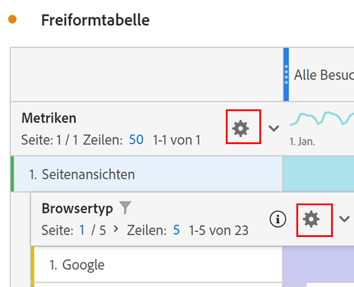
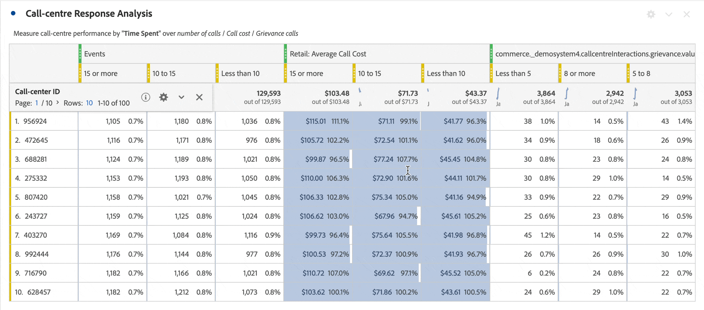
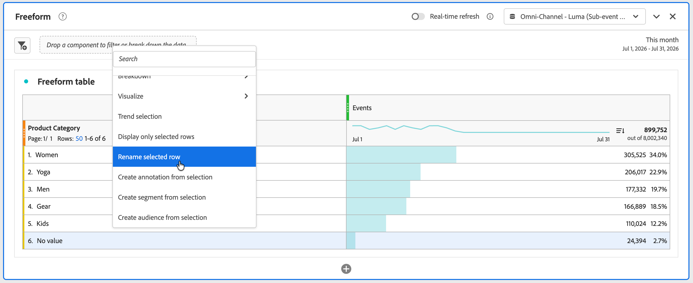
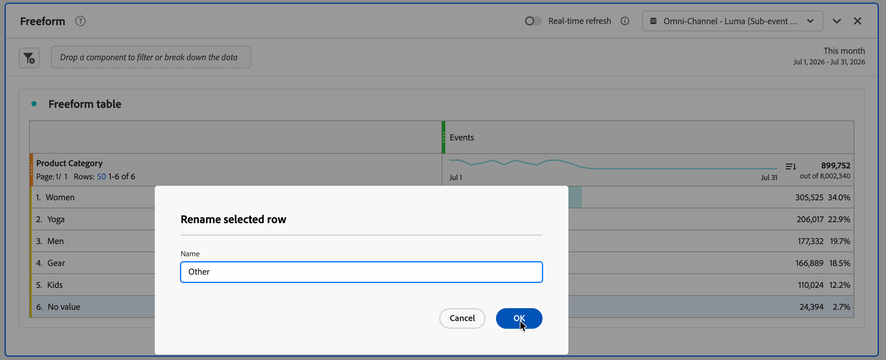
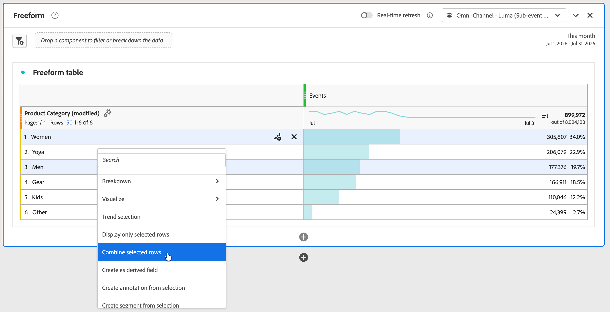
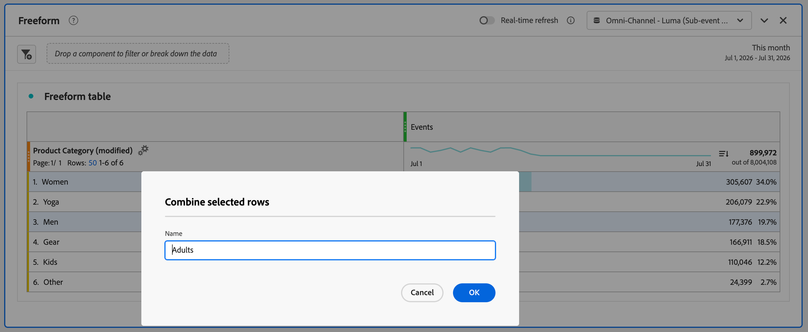
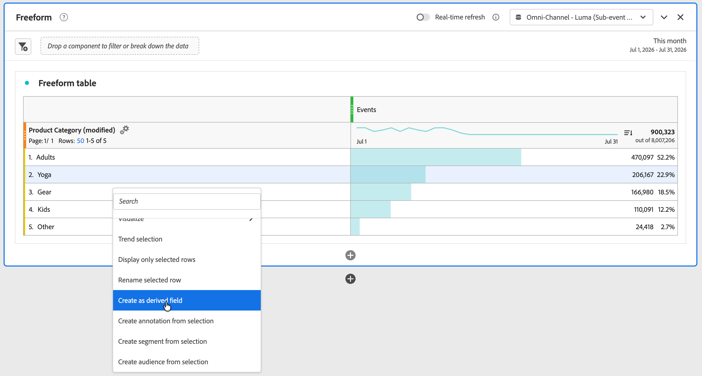
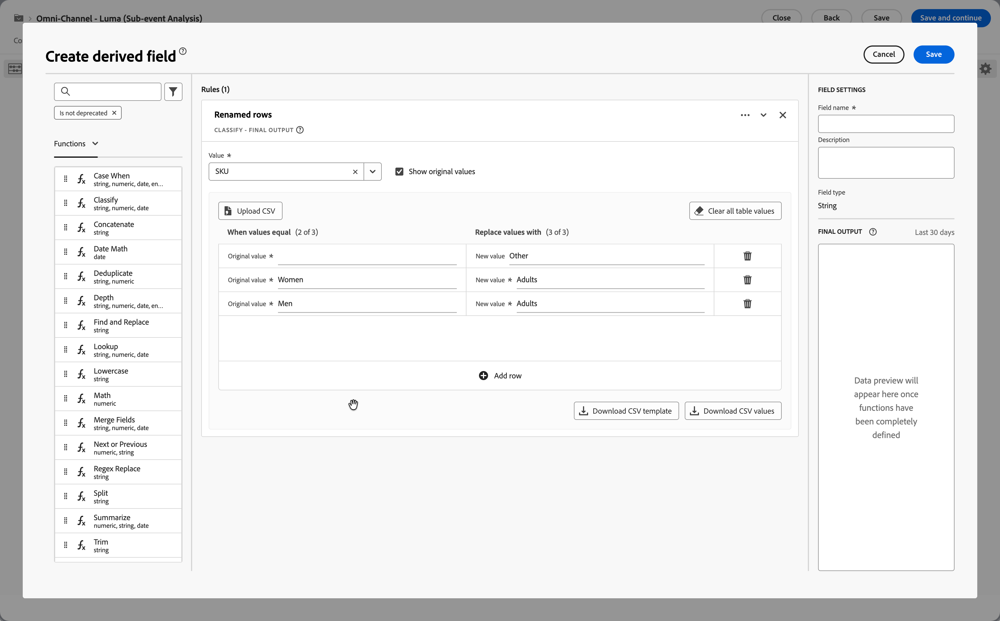
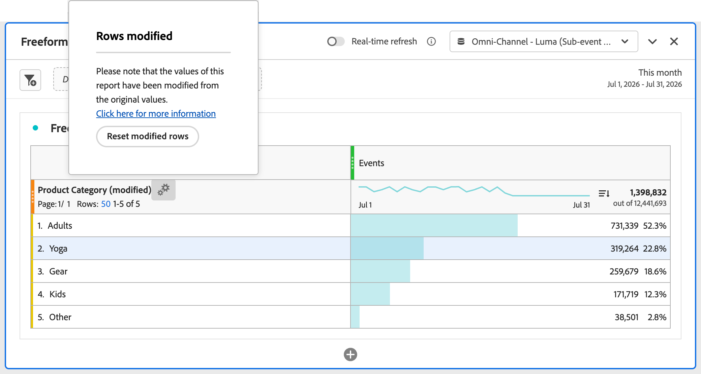

# Zeileneinstellungen

Die Zeileneinstellungen variieren je nachdem, welche Komponente Sie in die Tabelle gezogen haben. Um auf die Einstellungen der Tabellenzeilen zuzugreifenEinstellung **[!UICONTROL Einstellungen]** neben einer Dimension, einem Segment, einer Metrik, einem Zeitraum oder einer Aufschlüsselung in jedem dieser Objekte aus.

| Einstellung | Beschreibung |
| --- | --- |
| **[!UICONTROL Aufschlüsselung nach Position:]** | Standardmäßig ist diese Einstellung deaktiviert und die Aufschlüsselungen sind auf statische Zeilenelemente festgelegt. Angenommen, Sie schlüsseln die drei oberen Elemente der Dimension „Seite“ (Startseite, Suchergebnisse, Checkout) nach Marketing-Kanälen auf. Dann verlassen Sie das Projekt und kehren zwei Wochen später zurück. Beim erneuten Öffnen des Projekts haben sich die drei oberen Seiten geändert, und jetzt sind Startseite, Suchergebnisse und Checkout stattdessen die oberen Seiten vier bis sechs. Standardmäßig werden Ihre Aufschlüsselungen des Marketing-Kanals weiterhin unter Startseite, Suchergebnisse und Checkout angezeigt, obwohl sie sich jetzt in den Zeilen 4 bis 6 befinden.   Im Gegensatz dazu werden **Aufschlüsselung nach Position** immer die drei obersten Elemente aufgeschlüsselt, unabhängig davon, was sie sind. Wie im Beispiel beschrieben, werden beim erneuten Öffnen des Projekts die Aufschlüsselungen des Marketing-Kanals an die drei Top-Seiten in der Tabelle gebunden. Und nicht an „Startseite“, „Suchergebnisse“ und „Checkout“, die sich jetzt in den Zeilen 4–6 befinden. |
| **[!UICONTROL Prozentsätze]** | **Prozentsätze nach Spalte berechnen** (Standard): Die in einer Spalte sichtbaren Prozentsätze werden auf der Grundlage der Spaltensumme berechnet.  **Prozentsätze nach Zeile berechnen**: Die Prozentsätze in Zellen werden über die Zeile anstatt für die Spalte berechnet. Dabei ist die Gesamtsumme der Nenner. Diese Berechnung ist nützlich für die Trend-Darstellung von Prozentsätzen. |
| **[!UICONTROL Spaltensummen]** | Diese Einstellungen sind nur für [statische Zeilen](/help/analysis-workspace/visualizations/freeform-table/column-row-settings/manual-vs-dynamic-rows.md) verfügbar.   **Als Summe der aktuellen Zeilen anzeigen**: Zeigt eine Client-seitige Summe der Zeilen in der Tabelle, was bedeutet, dass bei der Gesamtsumme die Metriken wie „Besuche“ oder „Personen“ *nicht* dedupliziert werden.   **Gesamtsumme anzeigen**: Zeigt eine Server-seitige Summe an, d. h. die Gesamtsumme der deduplizierten Metriken. |

>[!BEGINSHADEBOX]

Unter  [Zeilen- und Spalteneinstellungen in einer Freiformtabelle](https://experienceleague.adobe.com/en/docs/analytics-learn/tutorials/analysis-workspace/building-freeform-tables/row-and-column-settings-in-freeform-tables){target="_blank"} finden Sie ein Demovideo.

{{videoaa}}

>[!ENDSHADEBOX]

## Ändern der Zeilenanzahl

So ändern Sie die Anzahl der angezeigten Zeilen:

1. Klicken Sie auf die Zahl neben **[!UICONTROL Zeilen]** oberhalb der ersten Spalte der Tabelle.

   

1. Wählen Sie aus dem Dropdown-Menü die Anzahl der Zeilen für die anzuzeigende Tabelle aus.

## Kontextmenü

Die folgenden Kontextmenüoptionen sind bei Auswahl der Kopfzeile der Dimension verfügbar.

| Option | Beschreibung |
| --- | --- |
| **[!UICONTROL Auswahl in Zwischenablage kopieren]** | Kopieren Sie die Auswahl aus der Visualisierung in die Zwischenablage. |
| **[!UICONTROL Objekte als CSV herunterladen (*Dimensionsname*)]** | Laden Sie die Dimensionselemente der Visualisierung (bis zu maximal 50.000) sofort auf Ihr lokales Gerät herunter. Maximal 50.000 Dimensionselemente für die ausgewählte Dimension. |
| **[!UICONTROL Auswahl als CSV herunterladen]** | Zum sofortigen Herunterladen der Dimensionselemente der Visualisierung auf Ihr lokales Gerät. |
| **[!UICONTROL Hyperlink für alle Dimensionselemente erstellen]** | Erstellen Sie Hyperlinks für alle Dimensionselemente. Siehe [Hyperlinks für Dimensionen in einer Freiformtabelle](../freeform-table-hyperlinks.md) |
| **[!UICONTROL Hyperlink für alle Dimensionselemente bearbeiten]** | Bearbeiten Sie Hyperlinks für alle Dimensionselemente. Siehe [Hyperlinks für Dimensionen in einer Freiformtabelle](../freeform-table-hyperlinks.md) |
| **[!UICONTROL Hyperlink für alle Dimensionselemente entfernen]** | Zum Entfernen von Hyperlinks für alle Dimensionselemente. Siehe [Hyperlinks für Dimensionen in einer Freiformtabelle](../freeform-table-hyperlinks.md) |
| **[!UICONTROL Löschen]** | Löscht die Dimension aus der Tabelle. |
| **[!UICONTROL Visualisieren]** | Visualisieren Sie die Dimension mithilfe einer der verfügbaren Visualisierungen. |
| **[!UICONTROL Nur ausgewählte Zeilen anzeigen]** | Zeigen Sie nur die ausgewählten Elemente in der Visualisierung an. |
| **[!UICONTROL Anmerkung aus Auswahl erstellen]** | Zum Öffnen der **[!UICONTROL Anmerkungsdetails]**, um eine Anmerkung hinzuzufügen. |

Die folgenden zusätzlichen Optionen im Kontextmenü sind verfügbar, wenn ein oder mehrere Dimensionselemente (erste Spalte) oder eine oder mehrere einzelne Zellen in der Freiformtabelle ausgewählt werden.

| Option | Beschreibung |
| --- | --- |
| **[!UICONTROL Auswahl in Zwischenablage kopieren]** | Kopieren Sie die Informationen in die ausgewählten Zellen der Freiformtabelle. |
| **[!UICONTROL Objekte als CSV herunterladen (*Dimensionsname*)]** | Laden Sie die Dimensionselemente der Visualisierung (bis zu maximal 50.000) sofort auf Ihr lokales Gerät herunter. Maximal 50.000 Dimensionselemente für die ausgewählte Dimension. |
| **[!UICONTROL Hyperlink erstellen]** | Zum Erstellen eines Hyperlinks für das Element. Siehe [Hyperlinks für Dimensionen in einer Freiformtabelle](../freeform-table-hyperlinks.md) |
| **[!UICONTROL Hyperlink bearbeiten]** | Zum Bearbeiten eines Hyperlinks für das Element. Siehe [Hyperlinks für Dimensionen in einer Freiformtabelle](../freeform-table-hyperlinks.md) |
| **[!UICONTROL Hyperlink entfernen]** | Zum Entfernen eines Hyperlinks für das Element. Siehe [Hyperlinks für Dimensionen in einer Freiformtabelle](../freeform-table-hyperlinks.md) |
| **[!UICONTROL Auswahl als CSV herunterladen]** | Zum sofortigen Herunterladen der Dimensionselemente der Visualisierung auf Ihr lokales Gerät. |
| **[!UICONTROL Auswahl löschen]** | Ausgewählte Zeilen löschen. |
| **[!UICONTROL Warnhinweis aus Auswahl erstellen]** | Öffnen Sie die [Warnhinweiserstellung](/help/components/c-intelligent-alerts/alert-builder.md), um einen Warnhinweis aus der Auswahl zu erstellen. |
| **[!UICONTROL Aufschlüsselung]** | Zum Aufschlüsseln des Dimensionselements. Wählen Sie aus der Liste **[!UICONTROL Dimensionen]**, **[!UICONTROL Metriken]**, **[!UICONTROL Segmente]** oder **[!UICONTROL Datumsbereiche]**. Suchen Sie alternativ mit *Suchen* nach einer Komponente. |
| **[!UICONTROL Visualisieren]** | Visualisieren Sie die Auswahl mithilfe einer der verfügbaren Visualisierungen. |
| **[!UICONTROL Trend-Auswahl]** | Erstellen Sie eine Liniendiagramm-Visualisierung mit Trend für die Auswahl. |
| **[!UICONTROL Nur ausgewählte Zeilen anzeigen]** | Zeigen Sie nur die ausgewählten Zeilen in der Visualisierung an. |
| **[!UICONTROL Alle Zeilen anzeigen]** | Zum Anzeigen aller Zeilen in der Visualisierung. |
| **[!UICONTROL Ausgewählte Zeile umbenennen]** | Benennen Sie die ausgewählte Zeile um. Geben Sie **[!UICONTROL Dialogfeld]** Ausgewählte Zeile **[!UICONTROL umbenennen]** einen Namen ein. Wählen Sie **[!UICONTROL OK]**, um zu bestätigen, oder **[!UICONTROL Abbrechen]**, um abzubrechen. Nachdem eine Zeile in einer Freiformtabelle umbenannt wurde, wird der Dimensionsname in der Kopfzeile mit **[!UICONTROL (geändert)]** angehängt und ein  ist verfügbar, um geänderte Zeilen in der Kopfzeile der Dimension zurückzusetzen. Siehe [Inline-Klassifizierungen](#inline-classifications-example). |
| **[!UICONTROL Ausgewählte Zeilen kombinieren]** | Die ausgewählten Zeilen kombinieren. Geben Sie **[!UICONTROL Dialogfeld]** Ausgewählte Zeilen **[!UICONTROL kombinieren]** einen Namen ein. Wählen Sie **[!UICONTROL OK]**, um zu bestätigen, oder **[!UICONTROL Abbrechen]**, um abzubrechen. Sobald Zeilen in einer Freiformtabelle kombiniert wurden, wird der Dimensionsname in der Kopfzeile mit **[!UICONTROL (geändert) angehängt]** und es steht ein  zur Verfügung, um geänderte Zeilen in der Kopfzeile der Dimension zurückzusetzen. Siehe [Inline-Klassifizierungen](#inline-classifications-example). |
| **[!UICONTROL Geänderte Zeilen als abgeleitetes Feld erstellen]** | *Sie müssen Customer Journey Analytics-Produktadministrator sein, um diese Option im Kontextmenü anzuzeigen.*  Verfügbar in jeder ausgewählten Zeile einer Freiformtabelle, die durch das Umbenennen oder Kombinieren von Zeilen geändert wird. Wenn diese Option ausgewählt ist[&#x200B; wird die &#x200B;](/help/data-views/derived-fields/derived-fields.md#create-a-derived-field) „Abgeleitetes Feld“ mit den Änderungen geöffnet, die Sie an der bereits vorausgefüllten Freiformtabelle vorgenommen haben. Siehe [Inline-Klassifizierungen](#inline-classifications-example). |
| **[!UICONTROL Anmerkung aus Auswahl erstellen]** | Öffnen Sie den [Anmerkungsgenerator](/help/components/annotations/create-annotations.md#annotation-builder), um eine Anmerkung für die Auswahl zu erstellen. |
| **[!UICONTROL Segment aus Auswahl erstellen]** | Öffnen Sie den [Segment Builder](/help/components/segments/seg-builder.md), um ein Segment aus der Auswahl zu erstellen. |
| **[!UICONTROL Zielgruppe aus Auswahl erstellen]** | Öffnen Sie den [Audience Builder](/help/components/audiences/publish.md#audience-builder), um eine Audience aus der Auswahl zu erstellen. |

Die folgenden Kontextmenüoptionen sind bei Auswahl der Kopfzeile einer Metrikspalte verfügbar.

| Option | Beschreibung |
|---|---|
| **[!UICONTROL Metrik aus Auswahl erstellen]** | Erstellen Sie eine neue Metrik aus der ausgewählten Metrik. Die Metrik kann „Mittelwert“, „Median“, „Spaltenmaximum“, „Spaltenminimum“ oder „Spaltensumme“ sein. Sie können auch „Öffnen“ im Generator für berechnete Metriken auswählen, um eine berechnete Metrik zu erstellen. |
| **[!UICONTROL Spalte mit Zeitraum hinzufügen]** | Fügen Sie eine Zeitraumspalte hinzu. Es werden mehrere Optionen angeboten, wobei der Kalenderbereich des Bedienfelds den *Datumsbereich* festlegt: <ul><li>**[!UICONTROL Früherer *Datumsbereich* vor diesem Datumsbereich]**</li><li>**[!UICONTROL Dieser *Datumsbereich* vor diesem Datumsbereich]**.</li><li>**[!UICONTROL Benutzerdefinierter Datumsbereich vor diesem Datumsbereich]**. Öffnet den **[!UICONTROL Datumsbereichsgenerator]**, um den Datumsbereich anzugeben.</li></ul>Weitere Informationen finden Sie unter [Datumsvergleich](/help/components/date-ranges/time-comparison.md). |
| **[!UICONTROL Zeiträume vergleichen]** | Fügt Vergleichszeitraumspalten hinzu. Nur verfügbar, wenn die Dimension nicht auf der Zeit basiert. Es werden mehrere Optionen angeboten, die den *Datumsbereich* festlegen: <ul><li>**[!UICONTROL Früherer *Datumsbereich* vor diesem Datumsbereich]**</li><li>**[!UICONTROL Benutzerdefinierter Datumsbereich vor diesem Datumsbereich]**. Öffnet den **[!UICONTROL Datumsbereichsgenerator]**, um den Datumsbereich anzugeben.</li></ul>Weitere Informationen finden Sie unter [Datumsvergleich](/help/components/date-ranges/time-comparison.md). |
| **[!UICONTROL Attributionsmodelle ändern]** | Zum Ändern des Attributionsmodells für die Spalte. |
| **[!UICONTROL Attributionsmodell vergleichen]** | Geben Sie ein neues Attributionsmodell an und vergleichen Sie es mit dem Attributionsmodell für die ausgewählte Spalte. Es wird eine neue Spalte mit den neuen Attributionsmodell-Metriken hinzugefügt. Außerdem wird eine Spalte „Prozentänderung“ zum Vergleich hinzugefügt. |
| **[!UICONTROL Spaltenbreiten zurücksetzen]** | Setzt die Spaltenbreiten auf die Standardbreite zurück. |
| **[!UICONTROL Anmerkung aus Auswahl erstellen]** | Öffnen Sie den [Anmerkungsgenerator](/help/components/annotations/create-annotations.md#annotation-builder), um eine Anmerkung für die Auswahl zu erstellen. |
| **[!UICONTROL Segment aus Auswahl erstellen]** | Öffnen Sie den [Segment Builder](/help/components/segments/seg-builder.md), um ein Segment aus der Auswahl zu erstellen. |
| **[!UICONTROL Zielgruppe aus Auswahl erstellen]** | Öffnen Sie den [Audience Builder](/help/components/audiences/publish.md#audience-builder), um eine Audience aus der Auswahl zu erstellen. |

## Ändern der Zeilenhöhe

Sie können die [Anzeigedichte](https://experienceleague.adobe.com/en/docs/analytics-platform/using/cja-workspace/build-workspace-project/view-density) eines Projekts auf **[!UICONTROL Kompakt]**, **[!UICONTROL Komfortabel]** und **[!UICONTROL Erweitert]**.

## Inline-Klassifizierungen {#inline-classifications-example}

Inline-Klassifizierungen ermöglichen das Umbenennen oder Kombinieren von Zeilen in einer Freiformtabelle. Und um ein abgeleitetes Feld aus den geänderten Zeilen in einer Tabelle zu erstellen.

Das folgende Beispiel zeigt, wie die Kontextmenüoptionen **[!UICONTROL Ausgewählte Zeile umbenennen]**, **[!UICONTROL Ausgewählte Zeilen]** und **[!UICONTROL Geänderte Zeilen als abgeleitetes Feld erstellen]** verwendet werden. und wie die geänderte Freiformtabelle zurückgesetzt wird.

* Benennen **[!UICONTROL Kein Wert]** Zeile in **[!UICONTROL Andere]** um.

  1. Wählen Sie **[!UICONTROL Ausgewählte Zeile umbenennen]** aus dem Kontextmenü in der ausgewählten Zeile **[!UICONTROL Kein Wert]** aus.

     

  1. Im Dialogfeld **[!UICONTROL Ausgewählte Zeile umbenennen]**:

     

     1. Enter <code>other</code> für **[!UICONTROL Name]**.
     1. Klicken Sie **[!UICONTROL OK]**.

* Kombinieren Sie **[!UICONTROL Männer]** und **[!UICONTROL Frauen]** Zeilen zu einer **[!UICONTROL Erwachsene]** Zeile.

  1. Wählen Sie **[!UICONTROL Männer]** und **[!UICONTROL Frauen]** Zeilen aus.
  1. Wählen Sie **[!UICONTROL Ausgewählte Zeilen kombinieren]** aus dem Kontextmenü aus einer der ausgewählten Zeilen aus.

     

  1. Im Dialogfeld **[!UICONTROL Ausgewählte Zeilen kombinieren]**:

     

     1. Eintreten <code>Erwachsene</code> für **[!UICONTROL Name]**.
     1. Klicken Sie **[!UICONTROL OK]**.

* Erstellen Sie ein abgeleitetes Feld aus den Änderungen in der Freiformtabelle.

  >[!NOTE]
  >
  >  Ein abgeleitetes Feld kann nur aus Änderungen in der Freiformtabelle erstellt werden, wenn Sie Customer Journey Analytics-Produktadministrator sind.

  1. Wählen Sie **[!UICONTROL Geänderte Zeilen als abgeleitetes Feld erstellen]** aus dem Kontextmenü für jede ausgewählte Zeile in der geänderten Tabelle aus.

     

  1. Überprüfen Sie die Definition des abgeleiteten Felds, ändern Sie sie optional und speichern Sie sie basierend auf allen Änderungen in der Tabelle.

     

* Setzen Sie die Freiformtabelle auf den Status vor den Änderungen zurück.

  1. Klicken Sie  neben **[!UICONTROL _Dimensionsname _(geändert)]**.
  1. Wählen **[!UICONTROL Geänderte Zeilen zurücksetzen]** aus dem **[!UICONTROL Geänderte Zeilen]**-Popup.

     
