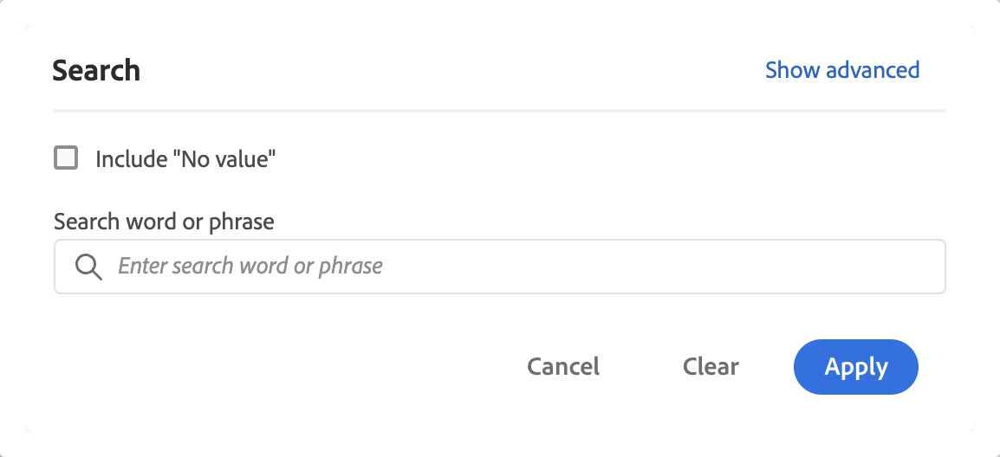

# Filtern und Sortieren von Freiformtabellen

Freiformtabellen in Analysis Workspace bilden die Grundlage für die interaktive Datenanalyse. Daher können sie Tausende von Informationszeilen enthalten. Das Filtern und Sortieren der Daten kann ein wichtiger Teil der effizienten Aufdeckung der wichtigsten Informationen sein.

<!--The following video covers filter and sort options in Analysis Workspace, in addition to pagination options:

>[!VIDEO](https://video.tv.adobe.com/v/23968)-->

## Filtern von Tabellen

Mit Filtern in Analysis Workspace können Sie die wichtigsten Informationen aufdecken.

>[!NOTE]
>
> Nur dynamische Dimensionselemente können wie in diesem Abschnitt beschrieben gefiltert werden. Statische Dimensionselemente können nicht gefiltert werden. Weitere Informationen finden Sie unter [Dynamische und statische Dimensionselemente in Freiformtabellen](/help/analysis-workspace/visualizations/freeform-table/column-row-settings/manual-vs-dynamic-rows.md).

Sie können mehrere Methoden verwenden, um Zeilen aus einer Freiformtabelle zu filtern.

- Ausschließen bestimmter Zeilen aus einer Tabelle
- Anwenden von Filtern auf Tabellen
- Verwenden von Zielgruppenfiltern

Lesen Sie unbedingt, wie sich jede Methode auf die Gesamtwerte der Freiformtabelle [1} auswirkt.](/help/analysis-workspace/visualizations/freeform-table/workspace-totals.md)

### Ausschließen bestimmter Zeilen aus einer Tabelle

Sie können bestimmte Zeilen schnell aus der Tabelle ausschließen, ohne  **[!UICONTROL Filter]** verwenden zu müssen.

>[!NOTE]
>
>Wenn Sie Zeilen wie in diesem Abschnitt beschrieben ausschließen, wird im Filterdialogfeld [!UICONTROL Erweitert] automatisch eine Regel zum [!UICONTROL Immer Elemente ausschließen] hinzugefügt. Sie können die angewendete Regel anzeigen, indem Sie auf das Symbol  Filter und dann auf [**[!UICONTROL Erweitert anzeigen]**](#apply-a-simple-or-advanced-filter-to-a-table) klicken.

So schließen Sie bestimmte Zeilen aus einer Freiformtabelle aus:

1. Bewegen Sie den Mauszeiger über die Zeile, die Sie ausschließen möchten, und wählen Sie dann  aus.

   Halten Sie die Umschalttaste gedrückt, um einen Zeilenbereich auszuwählen, oder halten Sie die Befehlstaste (Mac) oder die Strg-Taste (Windows) gedrückt, um mehrere Zeilen auszuwählen.

<!--### Right-click > Delete selected rows

Note: this option does not seem to work. AN-338422

1. Select 1 or more rows. 
1. Right-click and select **[!UICONTROL Delete Selected Rows]**. 

   This action will remove the rows from the table and apply a table filter.-->

### Einfache oder erweiterte Filter auf Tabellen anwenden

So filtern Sie Daten in Freiformtabellen:

1. Bewegen Sie den Mauszeiger über die Spalte, die die zu filternden Daten enthält. <!--only some types of columns show the filter... Which? Just Dimensions?-->

1. Wählen Sie  **Filter** aus, wenn er angezeigt wird.

   

   Die folgenden Optionen sind im Dialogfeld **[!UICONTROL Suchen]** verfügbar:

   {width="500"}

   | Option | Funktion |
   |---------|----------|
   | [!UICONTROL **Include &quot;No value&quot;**] | Wählen Sie diese Option aus, um eine Zeile **[!UICONTROL Kein Wert]** in der Tabelle für Daten anzuzeigen, die keinen Wert für die ausgewählte Dimension haben. Heben Sie die Auswahl dieser Option auf, um die Zeile **[!UICONTROL Kein Wert]** auszublenden. |
   | [!UICONTROL **Suchbegriff oder -satz**] | Geben Sie ein Wort oder eine Wortgruppe an, nach dem/der Sie filtern möchten. Es werden nur Zeilen angezeigt, die das Wort oder die exakte Phrase enthalten. |

1. (Optional) Um nach verschiedenen Kriterien oder nach mehreren Kriterien zu filtern, wählen Sie [!UICONTROL **Erweiterte Einstellungen anzeigen**] aus.

   Die folgenden erweiterten Filteroptionen sind verfügbar:

   {width=500}

   | Option | Funktion |
   |---------|----------|
   | [!UICONTROL **Include &quot;No value&quot;**] | Wählen Sie diese Option aus, um eine Zeile **[!UICONTROL Kein Wert]** in der Tabelle für Daten anzuzeigen, die keinen Wert für die ausgewählte Dimension haben. Heben Sie die Auswahl dieser Option auf, um die Zeile **[!UICONTROL Kein Wert]** auszublenden. |
   | [!UICONTROL **Übereinstimmung**] | Wählen Sie [!UICONTROL **Wenn alle Kriterien erfüllt sind**] aus, um nur Daten anzuzeigen, die alle angegebenen Kriterien erfüllen. Diese Option führt normalerweise zu verfeinerten Daten.  Wählen Sie [!UICONTROL **Wenn ein Kriterium erfüllt ist**] aus, um Daten anzuzeigen, die eines der von Ihnen angegebenen Filterkriterien erfüllen. Diese Option führt normalerweise zu weniger verfeinerten Daten. |
   | [!UICONTROL **Kriterien**] | Wählen Sie aus den folgenden Filteroptionen aus: <ul><li>[!UICONTROL **Enthält die Phrase**] (Standard): Nur Daten, die den von Ihnen angegebenen genauen Wortlaut enthalten, werden in die gefilterten Ergebnisse aufgenommen. Die Wörter müssen in der Reihenfolge vorliegen, die im Feld [!UICONTROL **Nach Wort oder Phrase suchen**] angegeben ist.</li><li>[!UICONTROL **Enthält einen der Begriffe**]: Nur Daten, die ein oder mehrere Wörter aus der angegebenen Phrase enthalten, werden in die gefilterten Ergebnisse aufgenommen. </li><li>[!UICONTROL **Enthält alle Begriffe**]: Nur Daten, die alle Wörter aus der angegebenen Phrase enthalten, werden in die gefilterten Ergebnisse aufgenommen. Die Wörter müssen nicht in der gleichen Reihenfolge wie im Feld [!UICONTROL **Nach Wort oder Phrase suchen**] vorliegen.</li><li>[!UICONTROL **Enthält keinen der Begriffe**]: Nur Daten, die keines der Wörter aus der angegebenen Phrase enthalten, werden in die gefilterten Ergebnisse aufgenommen. </li><li>[!UICONTROL **Enthält nicht die Phrase**]: Nur Daten, die nicht genau die angegebene Phrase enthalten, werden in die gefilterten Ergebnisse aufgenommen. Die Wörter müssen in der Reihenfolge vorliegen, die im Feld [!UICONTROL **Nach Wort oder Phrase suchen**] angegeben ist.</li><li>[!UICONTROL **Entspricht**]: Nur Daten, die genau mit der von Ihnen angegebenen Wortgruppe übereinstimmen, werden in die gefilterten Ergebnisse aufgenommen. </li><li>[!UICONTROL **Ist nicht gleich**]: Nur Daten, die nicht genau mit der angegebenen Phrase übereinstimmen, werden in die gefilterten Ergebnisse aufgenommen. </li><li>[!UICONTROL **Beginnt mit**]: Nur Daten, die mit dem angegebenen Wort oder der angegebenen Phrase beginnen, werden in die gefilterten Ergebnisse aufgenommen. </li><li>[!UICONTROL **Endet mit**]: Nur Daten, die mit dem angegebenen Wort oder der angegebenen Phrase enden, werden in die gefilterten Ergebnisse aufgenommen. </li></ul>Wählen Sie  [!UICONTROL **Zeile hinzufügen**] aus, um mehrere Filterkriterien hinzuzufügen. Die Option, die Sie für [!UICONTROL **Übereinstimmung**] auswählen, bestimmt **[!UICONTROL ob alle Kriterien erfüllt sind]** oder **[!UICONTROL ob ein Kriterium erfüllt ist]**. |
   | [!UICONTROL **Elemente immer ausschließen**] | Geben Sie den Namen aller Elemente an, die Sie aus den gefilterten Daten ausschließen möchten. |

1. Wählen Sie **[!UICONTROL Anwenden]** aus, um die Daten zu filtern. Wählen Sie **[!UICONTROL Löschen]** aus, um alle Eingaben zu löschen. Wählen Sie **[!UICONTROL Abbrechen]** aus, um das Dialogfeld abzubrechen und zu schließen.  Ein farbiges Symbol  **Filter** zeigt Details an, wenn ein Filter auf die Tabelle angewendet wird.

### Verwenden von Zielgruppenfiltern

Weitere Informationen finden Sie unter [Filterübersicht](/help/components/filters/filters-overview.md) .

## Sortieren von Tabellen

Sie können die Daten einer Freiformtabelle nach jeder Spalte in Analysis Workspace sortieren, die entweder eine Dimension oder eine Metrik ist. Ein Pfeil zeigt an, wie die Daten sortiert werden (**↓** für absteigende Werte oder **↑** für aufsteigende Werte).

