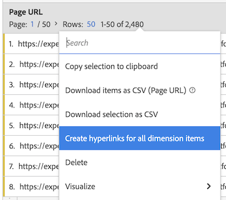

# Erstellen von Hyperlinks in einer Freiformtabelle

Sie können Hyperlinks für Dimensionselemente erstellen, damit sie in einer Freiformtabelle in Analysis Workspace angeklickt werden können.

Diese Funktion ist besonders beim Erstellen von Hyperlinks für die folgenden Arten von Dimensionselementen nützlich:

* Dimensionen mit URL-Werten (z. B. Dimension &quot;Seiten-URL&quot;)

* Dimension von Elementen, die Aufschlüsselungen mit URL-Werten enthalten (z. B. eine Dimension &quot;Seitenname&quot;, die eine Aufschlüsselung der Dimension &quot;Seiten-URL&quot;aufweist)

* Dimension von Elementen oder Aufschlüsselungen mit Werten, die Teil einer URL sind (z. B. Dimension &quot;Seitenname&quot;, die Teil einer URL ist)

+++ Sehen Sie sich ein Video an, um diese Funktion zu demonstrieren.

>[!VIDEO](https://video.tv.adobe.com/v/3430411/?learn=on)

{{videoaa}}

+++

## Erstellen von Hyperlinks

Beachten Sie Folgendes, wenn Sie Hyperlinks für ein oder mehrere Dimensionselemente erstellen:

* Die von Ihnen erstellten Hyperlinks werden in der Freiformtabelle im Analysis Workspace-Projekt gespeichert. Hyperlinks bleiben nicht bestehen, wenn Sie dieselbe Dimension oder dieselben Dimensionselemente in einer anderen Tabelle oder in einem anderen Projekt verwenden.

* Wenn Sie die Datenansicht der Freiformtabelle ändern, sind alle Hyperlinks, die für Dimensionen oder Dimensionselemente in der Tabelle erstellt wurden, weiterhin verfügbar. Bei dieser Funktion wird davon ausgegangen, dass die Dimension weiterhin in der Datenansicht vorhanden ist.

* URLs werden beim Erstellen des Hyperlinks nicht auf ihre Gültigkeit überprüft. Wenn Sie

   * einen Hyperlink mit einer ungültigen URL erstellen oder
   * einen Hyperlink erstellen, der auf ein Dimensionselement verweist, das keinen URL-Wert hat (indem entweder direkt auf das Dimensionselement verwiesen wird oder die Variablen `$value` oder `$breakdown` verwendet werden),

  dann wird Benutzern, die auf den Hyperlink klicken, eine Fehlermeldung angezeigt, dass die URL ungültig ist.

* Hyperlinks, die für ein einzelnes Dimensionselement erstellt werden, überschreiben Hyperlinks, die für die Dimension erstellt werden.

* Hyperlinks funktionieren nicht in [heruntergeladenen PDF-Dateien](/help/analysis-workspace/export/download-send.md).

So erstellen Sie Hyperlinks für ein oder mehrere Dimensionselemente:

1. Führen Sie in einer Freiformtabelle in Analysis Workspace einen der folgenden Schritte aus:

   * **Erstellen Sie einen Hyperlink für ein einzelnes Dimensionselement:** Klicken Sie mit der rechten Maustaste auf das Dimensionselement in der Tabelle, für die Sie den Hyperlink erstellen möchten, und wählen Sie dann [!UICONTROL **Hyperlink erstellen**] aus.

      1. Öffnen Sie das Kontextmenü für das Dimensionselement.
      1. Wählen Sie [!UICONTROL **Hyperlink erstellen**] aus dem Kontextmenü.

         Das Dialogfeld [!UICONTROL **Hyperlink erstellen**] wird angezeigt. Der Name des Dimensionselements, für das Sie einen Hyperlink erstellen, wird im Dialogfeld angezeigt.

         

   * **Erstellen Sie Hyperlinks für alle Dimensionselemente in einer Dimensionsspalte:** Klicken Sie mit der rechten Maustaste auf den Dimensionsnamen in der Spaltenüberschrift der Dimension und wählen Sie dann [!UICONTROL **Hyperlinks für alle Dimensionselemente erstellen**] aus.

      1. Öffnen Sie das Kontextmenü in der Dimensionsspaltenüberschrift.
      1. Wählen Sie [!UICONTROL **Hyperlink für alle Dimensionselemente erstellen**] aus dem Kontextmenü.

         <!-- Do we really need a screenshot  -->

         Das Dialogfeld [!UICONTROL **Hyperlinks für alle Dimensionselemente erstellen**] wird angezeigt. Der Name der Dimension, für die Sie Hyperlinks erstellen, wird im Dialogfeld angezeigt.

         

1. Wählen Sie aus den folgenden Optionen:

   * [!UICONTROL **Verwenden Sie den Wert des Dimensionselements als URL**]: Wählen Sie diese Option für Dimensionselemente mit URL-Werten, wie z. B. die Dimension Seiten-URL .

     Wenn Sie beispielsweise die Dimension &quot;Seiten-URL&quot;verwenden, bei der der Wert jedes Dimensionselements eine URL ist, wird bei Auswahl dieser Option ein Hyperlink zur URL erstellt.

   * [!UICONTROL **Erstellen einer benutzerdefinierten URL**]: Geben Sie entweder eine statische oder eine dynamische benutzerdefinierte URL an. Wählen Sie diese Option, um Hyperlinks für Dimensionselemente zu erstellen, die keine URL-Werte haben.

     Beispiel: Sie verwenden eine Dimension &quot;Seitenname&quot;, bei der der Wert jedes Dimensionselements der Name einer Seite (und nicht eine vollständige URL) ist. Wählen Sie dann diese Option aus, um einen Hyperlink anzugeben, der als Link für das Dimensionselement verwendet werden soll.

     Wenn Sie dynamische URLs für mehrere Dimensionselemente erstellen möchten, können Sie die Variablen `$value` und `$breakdown` in Ihrer benutzerdefinierten URL verwenden. Weitere Informationen finden Sie in der unten stehenden Tabelle.

     Geben Sie die folgenden Informationen an, um eine benutzerdefinierte URL zu erstellen:

     | Feld | Beschreibung |
     |---------|----------|
     | [!UICONTROL **Benutzerdefinierte URL**] | Geben Sie eine benutzerdefinierte URL an, die Sie für den Hyperlink verwenden möchten. URLs müssen als vollständig qualifizierte URLs eingegeben werden. Beispiel: <https://www.example.com>
Die von Ihnen erstellte benutzerdefinierte URL kann statisch oder dynamisch sein:
 <ul><li>**Statische URLs:** Sie können eine statische URL für ein einzelnes Dimensionselement oder für alle Dimensionselemente angeben, wenn die Elemente mit derselben URL verknüpft werden sollen. Beispiel: `https://wiki.internal.company_name/page_name#item_definition`
</li><li>**Dynamische URLs:** Sie können eine dynamische URL erstellen, wenn Sie eindeutige Hyperlinks für mehrere Dimensionselemente oder für alle Dimensionselemente in einer Dimensionsspalte erstellen möchten.
Damit benutzerdefinierte URLs dynamisch sind, fügen Sie eine Variable in die URL ein, um die URL basierend auf dem Wert der Dimension oder dem Wert der Aufschlüsselungsdimension zu ändern.

Bei Verwendung von Variablen werden alle Dimensionselemente, die Zeichen enthalten, die in URLs nicht gültig sind (z. B. Leerzeichen), URL-kodiert.

Die folgenden Variablen sind verfügbar: (**Hinweis**: Sie können diese Variablen zwar in derselben URL verwenden, es ist jedoch üblicher, sie getrennt zu verwenden.)
 <ul><li>**`$value`:** Ermöglicht das Einfügen des Werts des Dimensionselements in die von Ihnen angegebene URL. 
Angenommen, Sie möchten Hyperlinks für alle Dimensionselemente &quot;Seitenname&quot;in einer Freiformtabelle erstellen, wobei der Wert jedes Dimensionselements Teil der URL einer Webseite ist. In diesem Fall können Sie eine einzelne benutzerdefinierte URL erstellen, die sich dynamisch für jedes Dimensionselement anpasst.  Beispiel: `https://company-name.com/browse/product#\$value`

Wenn diese benutzerdefinierte URL auf die Dimensionselemente für den Seitennamen angewendet wird, deren Werte &quot;ProductY&quot;und &quot;ProductZ&quot;sind, würden die generierten Hyperlinks ungefähr so aussehen:  `https://company-name.com/browse/product#ProductY` und  `https://company-name.com/browse/product#ProductZ` 

**Tipp**: Wenn Sie nur die Variable `$value` in das Feld &quot;Benutzerdefinierte URL&quot;einfügen, entspricht dies der Auswahl der Option [!UICONTROL **Wert des Dimensionselements verwenden**] beim Erstellen der URL.
</li><li>**`$breakdown`:** Ermöglicht das Einfügen des Werts des Aufschlüsselungsdimensionselements in die von Ihnen angegebene URL. Mit `$breakdown` können Sie eine Dimension mit einem benutzerfreundlichen Namen in Ihrem Bericht verwenden (z. B. eine Dimension &quot;Produktname&quot;). Erstellen Sie einen Hyperlink basierend auf einer Aufschlüsselungsdimension, die möglicherweise weniger benutzerfreundlich ist (z. B. eine Produkt-ID oder Seiten-URL-Dimension).
Beim Referenzieren einer Aufschlüsselungsdimension ist es am häufigsten, nur ein Aufschlüsselungselement für ein bestimmtes Dimensionselement zu verwenden. Wenn für ein bestimmtes Dimensionselement mehrere Aufschlüsselungselemente vorhanden sind, wird der Wert des ersten Aufschlüsselungselements in der URL verwendet. Wenn keine Aufschlüsselungselemente aufgelistet sind, ist die URL ungültig. Dieselbe Sortierreihenfolge wird auf die Aufschlüsselungselemente angewendet, die auf die Tabelle angewendet werden.

Sie geben die Aufschlüsselungsdimension im unten stehenden Feld [!UICONTROL **Aufschlüsselungsdimension**] an.
 
Betrachten Sie das unten beschriebene Beispielszenario für das Feld [!UICONTROL **Aufschlüsselungsdimension**] .
</li></ul> |
     | [!UICONTROL **Aufschlüsselungsdimension (optional)**] | Beginnen Sie mit der Eingabe des Namens der Aufschlüsselungsdimension, die Sie verwenden möchten, und wählen Sie sie dann aus der Dropdownliste aus. 
Wenn Sie in diesem Feld eine Aufschlüsselungsdimension auswählen, müssen Sie darauf verweisen, indem Sie die Variable &quot;`$breakdown`&quot; in der URL verwenden, die Sie im Feld [!UICONTROL **Benutzerdefinierte URL**] angegeben haben.

Angenommen, Sie möchten Hyperlinks für alle Dimensionselemente &quot;Produktname&quot;in einer Freiformtabelle erstellen. Jedes Dimensionselement &quot;Produktname&quot;enthält eine Aufschlüsselung der Dimension Produkt-ID .

In diesem Fall können Sie Hyperlinks für jede Dimension &quot;Produktname&quot;erstellen, die Benutzer mithilfe des Wertes der Aufschlüsselungsdimension &quot;Produkt-ID&quot;zur Produktseite weiterleitet. 

Fügen Sie die Variable `$breakdown` am Ende der benutzerdefinierten URL hinzu, die Sie im Feld [!UICONTROL **Benutzerdefinierte URL**] angeben. Zum Beispiel:

`https://company-name.com/browse/product/$breakdown`
Wenn diese benutzerdefinierte URL auf Ihre Dimensionselemente für Produktnamen angewendet wird (die Aufschlüsselungsdimensionselemente mit den Werten &quot;ProductY&quot;und &quot;ProductZ&quot;aufweisen), sehen die generierten Hyperlinks wie folgt aus: `https://company-name.com/browse/product/ProductY` und `https://company-name.com/browse/product/ProductZ`

Wählen Sie dann die Dimension Produkt-ID im Feld [!UICONTROL **Aufschlüsselungsdimension**] aus. 

 |

1. Wählen Sie [!UICONTROL **Erstellen**] aus.

   Benutzer, die die Freiformtabelle anzeigen, sehen die per Hyperlink verbundenen Dimensionselemente. Beim Klicken auf ein Dimensionselement werden die Benutzer in einer separaten Browser-Registerkarte zu den per Hyperlink verbundenen Seiten geleitet.

   <!-- add screenshot of a table with hyperlinks.-->

1. [Speichern Sie das Projekt](/help/analysis-workspace/build-workspace-project/save-projects.md), um Ihre Änderungen zu speichern.

## Hyperlinks bearbeiten

Sie können Hyperlinks bearbeiten, die für Dimensionen oder Dimensionselemente in einer Freiformtabelle erstellt wurden.

1. Führen Sie in einer Freiformtabelle in Analysis Workspace einen der folgenden Schritte aus:

   * **Bearbeiten eines Hyperlinks für ein einzelnes Dimensionselement:**

      1. Öffnen Sie das Kontextmenü für das Dimensionselement.
      1. Wählen Sie [!UICONTROL **Hyperlink bearbeiten**] aus dem Kontextmenü.

     <!-- Do we really need a screenshot? -->

   * **Bearbeiten von Hyperlinks für alle Dimensionselemente in einer Dimensionsspalte:**

      1. Öffnen Sie das Kontextmenü in der Dimensionsspaltenüberschrift.
      1. Wählen Sie **[!UICONTROL Hyperlink für alle Dimensionselemente bearbeiten]** aus dem Kontextmenü.

     <!-- Do we really need a screenshot? -->

1. Wählen Sie [!UICONTROL **Hyperlinks für alle Dimensionselemente bearbeiten**] aus dem Kontextmenü aus.

   Das Dialogfeld [!UICONTROL **Hyperlinks für Dimensionselemente bearbeiten**] wird angezeigt.

1. Informationen zu den Konfigurationsoptionen zum Bearbeiten des Hyperlinks finden Sie in Schritt 3 im Abschnitt [Erstellen von Hyperlinks für ein oder mehrere Dimensionselemente](#create-hyperlinks-for-one-or-more-dimension-items) oben und wählen Sie dann [!UICONTROL **Anwenden**] aus, wenn Sie mit Ihren Aktualisierungen fertig sind.

1. [Speichern Sie das Projekt](/help/analysis-workspace/build-workspace-project/save-projects.md), um Ihre Änderungen zu speichern.

## Hyperlinks entfernen

Sie können Hyperlinks entfernen, die für Dimensionselemente in einer Freiformtabelle erstellt wurden.

>[!NOTE]
>
>Wenn Sie in einer Freiformtabelle eine Dimension löschen, die Hyperlinks enthält, bleiben die Hyperlinks nicht erhalten, wenn Sie dieselbe Dimension wieder zur Freiformtabelle hinzufügen.

So entfernen Sie Hyperlinks aus Dimensionselementen:

1. Führen Sie in einer Freiformtabelle in Analysis Workspace einen der folgenden Schritte aus:

   * **Entfernen Sie einen Hyperlink aus einem einzelnen Dimensionselement:**

      1. Öffnen Sie das Kontextmenü für das Dimensionselement.
      1. Wählen Sie [!UICONTROL **Hyperlink entfernen**] aus dem Kontextmenü.
         <!-- Do we really need a screenshot? -->

   * **Entfernen Sie Hyperlinks aus allen Dimensionselementen in einer Dimensionsspalte:**

      1. Öffnen Sie das Kontextmenü in der Dimensionsspaltenüberschrift.
      1. Wählen Sie **[!UICONTROL Hyperlink für alle Dimensionselemente entfernen]** aus dem Kontextmenü.

     <!-- Do we really need a screenshot? [Remove hyperlink from a dimension](assets/hyperlink-dimension-remove.png)-->

   Der Hyperlink wird aus dem einzelnen Dimensionselement entfernt, wenn Sie ein einzelnes Dimensionselement ausgewählt haben. Oder aus allen Dimensionselementen, wenn Sie den Dimensionsnamen in der Dimensionsspaltenüberschrift ausgewählt haben.

1. [Speichern Sie das Projekt](/help/analysis-workspace/build-workspace-project/save-projects.md), um Ihre Änderungen zu speichern.
